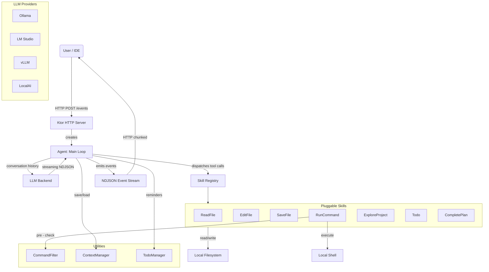

# Gradum

A lightweight Kotlin Agent Framework for building LLM-powered tools with function calling.

## What is Gradum?

Gradum provides a pluggable skill system, streaming NDJSON events, and encrypted context
persistence — everything you need to build agents that interact with the local filesystem and shell.

```kotlin
// Add a skill in minutes
class MySkill : Skill() {
    override val skillName = "my_tool"
    override val description = "Does something useful"
    override val alias = "MyTool"

    override fun execute(arguments: Map<String, Any>, context: SkillContext): SkillResult {
        return makeSuccess(mapOf("result" to "done"))
    }
}
```

## Features

- **Skill system**: Pluggable tool architecture — add capabilities by implementing a `Skill` class
- **Multi-provider LLM**: Ollama, LM Studio, vLLM, LocalAI, and any OpenAI-compatible endpoint
- **Streaming events**: NDJSON event stream for real-time UI integration
- **Context persistence**: Encrypted conversation history (HMAC-CTR + HMAC-SHA256), resumes across runs
- **Command safety filter**: Structural shell command classification before execution
- **Edit modes**: Sequential (apply one-by-one) and atomic (all-or-nothing rollback)
- **Detached processes**: Background execution for GUIs or long-running servers
- **HTTP API**: RESTful endpoints for IDE and web UI integration

## Quick Start

```bash
# Build
./gradlew build

# Run server (default port 8765)
java -jar build/libs/gradum@0.9.0.jar

# Or with custom options
java -jar build/libs/gradum@0.9.0.jar --port 9000 --model qwen2.5-coder:7b --think
```

### Command-Line Options

| Argument         | Description                               | Default Value            |
|------------------|-------------------------------------------|--------------------------|
| `--host`         | Bind address                              | `localhost`              |
| `--port`         | Port number                               | `8765`                   |
| `--auto-port`    | Automatically find an available port      | off                      |
| `--model`        | Default model name                        | no                       |
| `--think`        | Enable thinking mode                      | off                      |
| `--provider`     | LLM provider (`ollama` or `openai`)       | `ollama`                 |
| `--base-url`     | LLM provider base URL                     | `http://localhost:11434` |
| `--project-root` | Default project root for /events requests | no                       |

## HTTP API

| Endpoint  | Method | Description                   |
|-----------|--------|-------------------------------|
| `/events` | POST   | Execute agent, returns NDJSON |
| `/health` | GET    | Health check                  |
| `/models` | GET    | List available models         |
| `/skills` | GET    | List available skills         |
| `/stop`   | POST   | Stop current agent task       |

```bash
# Example: Execute an agent task
curl -X POST http://localhost:8765/events \
  -H "Content-Type: application/json" \
  -d '{
    "message": "Read and analyze src/main.kt",
    "model": "qwen3.5:9b",
    "projectRoot": "/path/to/your/project"
  }'
```

## Built-in Skills

| Skill               | Description                                                 |
|---------------------|-------------------------------------------------------------|
| `read_file`         | Read file content (whole file or line range)                |
| `edit_file`         | Search-replace editing (sequential or atomic mode)          |
| `save_file`         | Write a new file                                            |
| `run_cmd`           | Execute shell commands (blocking or detached)               |
| `explore_project`   | Explore project structure with depth control and file stats |
| `to_do`             | Initialize a task list                                      |
| `finish_to_do_item` | Mark tasks complete                                         |

## LLM Backend Setup

### Ollama

```bash
ollama pull qwen2.5-coder:7b
ollama serve  # default http://localhost:11434
```

### LM Studio / vLLM / LocalAI

Any server supporting the OpenAI-compatible `chat/completions` endpoint works.

```bash
java -jar build/libs/gradum@0.9.0.jar --provider openai --base-url http://localhost:1234
```

Model auto-discovery scans ports: 11434 (Ollama), 1234 (LM Studio), 8000 (vLLM), 8080 (LocalAI).

---

## Project Architecture

### Technology Stack

| Layer         | Technology                                        |
|---------------|---------------------------------------------------|
| Language      | Kotlin 2.3.0 (JVM 21)                             |
| HTTP Server   | Ktor 3.0.3 + Netty                                |
| Serialization | kotlinx-serialization-json 1.7.3                  |
| Coroutines    | kotlinx-coroutines 1.9.0                          |
| Encryption    | Java Security API + HMAC-SHA256 (custom HMAC-CTR) |

### System Overview



### NDJSON Event Stream

Each line is one JSON event:

```jsonl
{"type": "session_start", "timestamp": "...", "data": {"model": "qwen2.5-coder:7b"}}
{"type": "thinking", "timestamp": "...", "data": {"content": "Analyzing..."}}
{"type": "tool_call", "timestamp": "...", "data": {"tool": "read_file", "success": true}}
{"type": "llm_response", "timestamp": "...", "data": {"content": "Done."}}
{"type": "session_end", "timestamp": "...", "data": {"elapsedSeconds": 15}}
```

### Security

Command safety filter blocks dangerous operations:

- Executables: `sudo`, `su`, `mkfs`, `dd`, `reboot`, `shutdown`
- Protected paths: `/etc`, `/usr`, `~/.ssh`, `~/.kube`, etc.
- Safe path: `/tmp` always allowed

---

## IntelliJ IDEA Plugin

A full-featured IntelliJ IDEA plugin built with Gradum. This isn't just a demo — it's a production-quality integration
that showcases the framework's capabilities.

### Plugin Features

- **Chat panel**: Send messages and watch the agent think, search, and edit in real-time
- **Model selector**: Auto-discovers local LLM providers (Ollama, LM Studio, vLLM, LocalAI) — switch between them
  instantly
- **Tool call indicators**: Visual status for every tool invocation — see what the agent is doing as it happens
- **Error handling**: Click failed tool calls to see friendly error messages, copy details for debugging
- **Context toggle**: Eye icon sends your current editor file to the agent automatically
- **File & image attachments**: Attach multiple files or images from the project, with a unified limit of 10 items
- **Streaming responses**: Real-time rendering of thinking blocks, tool calls, and the final response
- **Dark/Light themes**: Fully integrated with IntelliJ's theme system using Jewel components

The plugin is built with Kotlin and the Jetpack Compose-based Jewel UI toolkit. It runs entirely locally — no cloud
dependencies.

### Build Plugin

```bash
./gradlew :plugin:buildPlugin
```

Output: `plugin/build/distributions/gradum-*.zip`

Install via `Settings > Plugins > Install Plugin from Disk`.

---

## Documentation

- [Architecture](docs/ARCHITECTURE.md) — system design, data flow, modules
- [Coding Standards](docs/CODING_STANDARDS_KOTLIN.md) — Kotlin conventions
- [Skill Development](docs/PLUGIN_DEVELOPMENT.md) — creating custom skills
- [UI Conventions](docs/CONVENTIONS.md) — IntelliJ plugin patterns

## Contributing

1. Fork the repository
2. Create a feature branch: `feature/@your-name-add-thing`
3. Commit with descriptive messages
4. Open a pull request

## License

MIT License - see [LICENSE](LICENSE)

## Gradum Version

0.9.0
