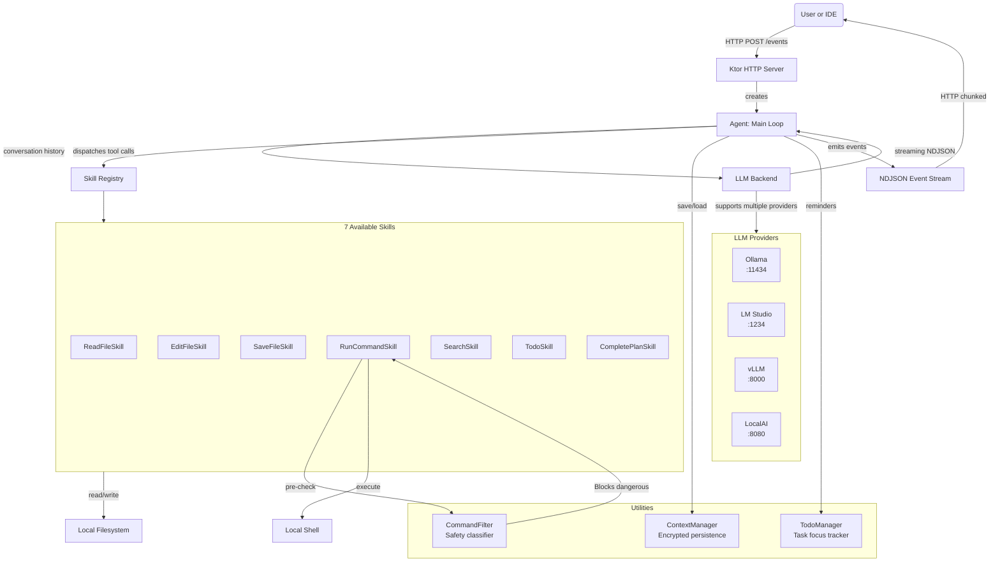

# Gradum

A local-first AI code assistant built on LLM Function Calling. Supports Ollama and any OpenAI-compatible inference server.

Implemented in **Kotlin 2.0.21** + **Ktor 3.0.3**. Zero cloud dependencies, runs entirely on your machine.

## Features

- **Local-first**: No cloud dependencies. All inference and execution happens on your machine
- **Multi-provider support**: Ollama, LM Studio, vLLM, LocalAI, and any OpenAI-compatible endpoint
- **Function calling**: The LLM is given file system and shell tools; it decides when to invoke them
- **Command safety filter**: Blocks destructive operations like `rm -rf /`, `sudo`, `mkfs`, `dd of=/dev/...`
- **Streaming responses**: NDJSON event stream for low-latency UI rendering
- **Context persistence**: Encrypted conversation history (HMAC-CTR + HMAC-SHA256), resumes across runs
- **HTTP API**: RESTful endpoints for IDE and web UI integration
- **Edit modes**: Sequential (apply edits one-by-one, stop on failure) and atomic (all-or-nothing, roll back on any failure)
- **Detached process**: `run_cmd` supports detached mode for GUIs or long-running servers

## System Overview



## Technology Stack

| Layer         | Technology                                        |
|---------------|---------------------------------------------------|
| Language      | Kotlin 2.0.21 (JVM 21)                            |
| HTTP Server   | Ktor 3.0.3 + Netty                                |
| HTTP Client   | Ktor HttpClient                                   |
| Serialization | kotlinx-serialization-json 1.7.3                  |
| Coroutines    | kotlinx-coroutines 1.9.0                          |
| Logging       | Logback Classic 1.5.15                            |
| Encryption    | Java Security API + HMAC-SHA256 (custom HMAC-CTR) |

## Quick Start

### Build and Run

```bash
# Build the executable JAR
./gradlew build

# Or run directly in development mode
./gradlew run
```

### HTTP Server Mode

```bash
# Default port 8765
java -jar build/libs/gradum.jar

# Custom port
java -jar build/libs/gradum.jar --port 9000

# Auto-select an available port
java -jar build/libs/gradum.jar --auto-port

# Default model
java -jar build/libs/gradum.jar --model qwen2.5-coder:7b

# Enable thinking mode (for models that support it)
java -jar build/libs/gradum.jar --think

# Specify LLM provider and base URL
java -jar build/libs/gradum.jar --provider ollama --base-url http://localhost:11434

# Help
java -jar build/libs/gradum.jar --help
```

### Command-Line Arguments

| Argument       | Description                          | Default                  |
|----------------|--------------------------------------|--------------------------|
| `--host`       | Bind address                         | `localhost`              |
| `--port`       | Port number                          | `8765`                   |
| `--auto-port`  | Automatically find an available port | off                      |
| `--port-range` | Auto port range                      | `8765-8775`              |
| `--debug`      | Enable debug mode                    | off                      |
| `--model`      | Default model name                   | -                        |
| `--think`      | Enable thinking mode                 | off                      |
| `--provider`   | LLM provider (`ollama` or `openai`)  | `ollama`                 |
| `--base-url`   | LLM server URL                       | `http://localhost:11434` |

## HTTP API

After starting the server, the following endpoints are available:

### Endpoints

| Path      | Method | Description                              |
|-----------|--------|------------------------------------------|
| `/events` | POST   | Execute the agent, returns NDJSON stream |
| `/health` | GET    | Health check                             |
| `/models` | GET    | List available models                    |
| `/skills` | GET    | List available skills                    |

### Example calls

```bash
# Execute an agent task
curl -X POST http://localhost:8765/events \
  -H "Content-Type: application/json" \
  -d '{"message": "Refactor src/main/kotlin/gradum/agent/Agent.kt", "model": "qwen2.5-coder:7b"}'

# Health check
curl http://localhost:8765/health

# List discovered models
curl http://localhost:8765/models

# List skills
curl http://localhost:8765/skills
```

### Request body

```json
{
  "message": "Refactor utils.kt",
  "model": "qwen2.5-coder:7b",
  "config": {
    "think": true,
    "temperature": 0.7,
    "provider": "ollama",
    "baseUrl": "http://localhost:11434"
  }
}
```

### Response format (NDJSON event stream)

Each line is one JSON event:

```jsonl
{"type": "session_start", "timestamp": "...", "data": {"version": "0.8.2", "model": "qwen2.5-coder:7b", "think": false, "contextLoaded": false}}
{"type": "thinking", "timestamp": "...", "data": {"content": "Analyzing file structure..."}}
{"type": "tool_call", "timestamp": "...", "data": {"tool": "read_file", "arguments": {"path": "utils.kt"}, "toolCallId": "call_1", "success": true, "result": {"path": "...", "totalLines": 42, "content": "..."}}}
{"type": "tool_call", "timestamp": "...", "data": {"tool": "run_cmd", "arguments": {"command": "gradle build"}, "toolCallId": "call_2", "success": false, "result": {"error": {"code": "COMMAND_BLOCKED", "message": "..."}}}}
{"type": "llm_response", "timestamp": "...", "data": {"content": "Refactoring complete. Changed N items..."}}
{"type": "session_end", "timestamp": "...", "data": {"version": "0.8.2", "elapsedSeconds": 15, "model": "qwen2.5-coder:7b", "tokenUsage": {"promptTokens": 2800, "completionTokens": 900}}}
```

## Skills Reference

| Skill               | Alias     | Description                                        |
|---------------------|-----------|----------------------------------------------------|
| `read_file`         | Read      | Read file content (whole file or line range)       |
| `edit_file`         | Edited    | Search-replace editing (sequential or atomic mode) |
| `save_file`         | Saved     | Write a new file                                   |
| `run_cmd`           | Ran       | Execute shell commands (blocking or detached)      |
| `search`            | Explored  | Search code content / file names / directories     |
| `to_do`             | Planned   | Initialize a task list                             |
| `finish_to_do_item` | Completed | Mark tasks complete                                |

### Skill parameter details

#### read_file
```json
{"path": "src/main/kotlin/gradum/agent/Agent.kt", "lineRange": "10-50"}
```
- `path` (required): file path
- `lineRange` (optional): line range in format `start-end`

#### edit_file
```json
{"path": "app.kt", "edits": [{"search": "old code", "replace": "new code"}], "mode": "sequential"}
```
- `path` (required): file path
- `edits` (required): array of search/replace objects
- `mode` (optional): `"sequential"` (apply as many as possible, stop on failure) or `"atomic"` (all succeed or roll back), default `"sequential"`

#### save_file
```json
{"path": "new_file.kt", "content": "// new file content"}
```
- Parent directories are automatically created

#### run_cmd
```json
{"command": "gradle build", "reason": "verify compilation", "detached": false}
```
- `command` (required): shell command
- `detached` (optional): background execution, returns PID and log path immediately
- **Safety filter**: All commands pass through `CommandFilter`; dangerous commands are rejected with error code `COMMAND_BLOCKED`

#### search
```json
{"query": "fun execute", "path": "src", "type": "content"}
```
- `type`: `"content"` (code content search, regex), `"filename"` (filename match), `"directory"` (directory name match)
- Timeout 120s, max 600 files, max depth 6, up to 20 results

#### to_do / finish_to_do_item
```json
{"tasks": ["Read files", "Analyze problems", "Write fixes", "Verify compilation"]}
```
- `TodoManager` is a shared singleton; state persists across tool calls
- Reminder text is injected automatically after each tool call to keep the model on track

## LLM Backend Setup

### Ollama

```bash
# Install Ollama (see https://ollama.ai)

# Pull a model
ollama pull qwen2.5-coder:7b

# Start the Ollama server
ollama serve  # default http://localhost:11434
```

### LM Studio / vLLM / LocalAI

Any server supporting the OpenAI-compatible `chat/completions` endpoint works. Specify via `--provider openai --base-url http://localhost:1234`.

Model auto-discovery: At startup the agent scans 4 well-known local server ports (11434/Ollama, 1234/LM Studio, 8000/vLLM, 8080/LocalAI) and lists any available models.

## Security

Gradum structurally classifies shell commands before execution:

1. **Executable blocklist**: `sudo`, `su`, `doas`, `pkexec`, `mkfs`, `reboot`, `shutdown`, `halt`, `poweroff`, `init`, `fdisk`, `parted`, `gdisk`, `sfdisk`, `mkswap`, `dd` writes to device - all blocked immediately
2. **Path protection**: `rm` or `chmod -R` targeting `/etc`, `/usr`, `/var`, `/boot`, `/System`, `/Library`, `/Applications`, `/private`, `~/.ssh`, `~/.gnupg`, `~/.aws`, `~/.kube`, `/`, `/dev`, `/proc`, `/sys` - blocked
3. **Safe path exclusion**: `/tmp` always allowed

Note: Gradum runs on your local machine with shell access. Exercise caution when using it on sensitive codebases.

## Architecture Documentation

See [docs/ARCHITECTURE.md](docs/ARCHITECTURE.md) for:
- System architecture overview and module dependencies
- Agent main loop and message handling
- LLM client streaming and multi-provider support
- Skill auto-discovery and registration
- NDJSON event stream format
- File editing state machine (sequential/atomic)
- Command safety filter design
- Context persistence and encryption
- HTTP API layer design
- End-to-end data flow

## Developer Documentation

- Coding standards: [docs/CODING_STANDARDS_KOTLIN.md](docs/CODING_STANDARDS_KOTLIN.md)
- Skill development: [docs/PLUGIN_DEVELOPMENT.md](docs/PLUGIN_DEVELOPMENT.md)

## Contributing

1. Fork the repository
2. Create a feature branch: `feature/@your-name-add-thing`
3. Commit with descriptive messages
4. Open a pull request

Coding standards: see [docs/CODING_STANDARDS_KOTLIN.md](docs/CODING_STANDARDS_KOTLIN.md)

## Limitations

- Single user / single session (no multi-tenancy)
- No sandboxed execution environment
- Text-only input (no multimodal)
- Requires local JDK 21+

## License

MIT License - see [LICENSE](LICENSE)

## Version

0.8.2
