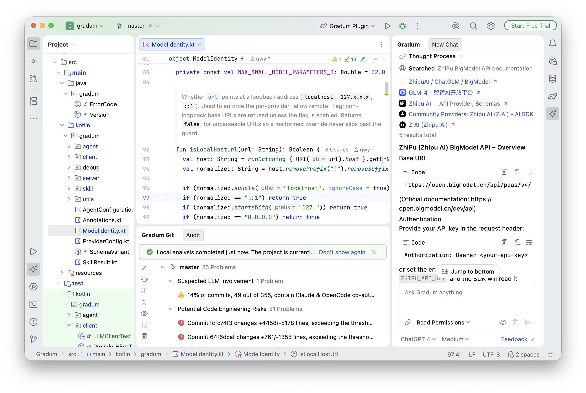
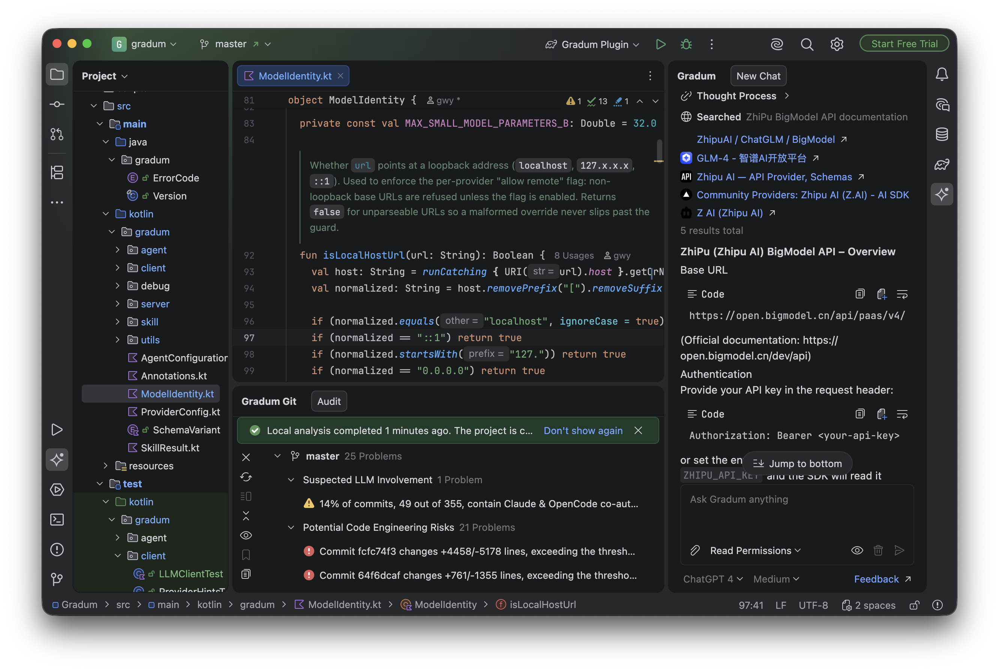

<h2 align="center">Gradum</h2>

> [!WARNING]
> **Gradum is currently experimental.** This project is evolving rapidly, and while we do test it along the way, there
> will be rough edges. You may run into bugs that don't yet have an obvious explanation, behavior or configuration that
> changes without prior notice, or features that are still incomplete. Treat it as a work in progress. If something
> surprises you, please open an issue and tell us what you saw; every report helps us smooth things out. For now only
> macOS (Apple Silicon) is packaged as a ready-to-run app; the cross-platform jar runs anywhere Java 21 is available.

<p align="center">
  
  
  
  
</p>

<p align="center">
  <b>Gradum</b> is a lightweight Kotlin agent framework for building LLM-powered tools with function calling. Hook up
  Ollama, Zhipu BigModel (GLM), DeepSeek, MiniMax, or any OpenAI-compatible endpoint, and get streaming, tool-calling
  agents that read and edit files, explore your project, and run shell commands. It ships with a full-featured
  <b>IntelliJ IDEA plugin</b>.
</p>

## Screenshots

<div align="center">
  
  
</div>

## Getting Started

To build from source you need a JDK 21 or newer. Gradum does not pin a JDK path in the repo; Gradle simply uses the
JDK from your `JAVA_HOME` or the Gradle JVM you select in your IDE. CI provisions the JDK itself via `setup-java`.

### Option A: run the server

Grab the latest server build from the
[Releases](https://github.com/lg841226/Gradum/releases/latest) page:

- `gradum@1.0.1-experimental.jar`: cross-platform fat jar (requires Java 21)
- `gradum-server-macos-arm64-experimental.zip`: self-contained macOS app (Apple Silicon; includes its own JRE, so no
  Java installation needed). Double-clicking it opens a Terminal window that streams the server logs.

```bash
./gradlew build
java -jar gradum@1.0.1-experimental.jar
```

On first start the server writes a user-editable config to `~/.gradum/settings.json` (and its companion
`~/.gradum/settings.schema.json` for editor autocompletion). All startup parameters are read from that file: bind
host/port, auto-detected port, default API-key file, and the LLM defaults. The old
`--host/--port/--auto-port/--api-key` flags were removed. `java -jar gradum@1.0.1-experimental.jar --help` still prints
the configuration overview and HTTP endpoint list.

### Option B: install the IntelliJ IDEA plugin

```bash
./gradlew :plugin:buildPlugin
```

Install the output `plugin/build/distributions/gradum-*.zip` via
`Settings > Plugins > Install Plugin from Disk`, then point the plugin at a running Gradum server.

## Features

- **Skill system**: pluggable tool architecture, add capabilities by implementing a `Skill`
- **Multi-provider LLM**: Ollama, LM Studio, vLLM, LocalAI, Zhipu BigModel, DeepSeek, MiniMax, and any
  OpenAI-compatible endpoint
- **Streaming events**: NDJSON event stream for real-time UI integration
- **Encrypted context**: conversation history persisted with HMAC-CTR + HMAC-SHA256, resumes across runs
- **Command safety filter**: structural shell command classification before execution
- **Edit modes**: sequential (apply one-by-one) and atomic (all-or-nothing rollback)
- **Detached processes**: background execution for GUIs or long-running servers
- **HTTP API**: RESTful endpoints for IDE and web UI integration

## IntelliJ IDEA Plugin

A production-quality IntelliJ plugin built with Gradum: not just a demo, but a showcase of the framework's
capabilities. It's built with Kotlin and the Jetpack Compose-based Jewel UI toolkit, and runs entirely locally, with no
cloud dependencies.

- **Chat panel**: watch the agent think, search, and edit in real time
- **Model selector**: auto-discovers local and cloud providers and switches between them instantly
- **Tool call indicators**: see every tool invocation as it happens; click failures for friendly errors and copyable
  details
- **Context toggle**: send your current editor file to the agent with one click
- **File & image attachments**: up to 10 items in a unified attachment area
- **Streaming responses**: thinking blocks, tool calls, and final answers render as they stream
- **Rich Markdown**: tables, code blocks (copy / soft-wrap / line numbers / collapse), task lists, footnotes, LaTeX
- **Dark/Light themes**: integrated with IntelliJ's theme system via Jewel
- **Git analysis**: a bottom tool window audits local Git history, surfaces risk findings by theme or severity, and
  computes a project quality band

## Built-in Skills

| Skill               | Description                                                 |
|---------------------|-------------------------------------------------------------|
| `read_file`         | Read file content (whole file or line range)                |
| `edit_file`         | Search-replace editing (sequential or atomic mode)          |
| `save_file`         | Write a new file                                            |
| `run_cmd`           | Execute shell commands (blocking or detached)               |
| `explore_project`   | Explore project structure with depth control and file stats |
| `grep`              | Content regex search across project files                   |
| `glob`              | Glob path matcher for file discovery                        |
| `to_do`             | Initialize a task list                                      |
| `finish_to_do_item` | Mark tasks complete                                         |
| `search_web`        | Web search via Tavily API (requires API key, see below)     |

## LLM Backend Setup

The `search_web` skill uses the [Tavily Search API](https://tavily.com); set `TAVILY_API_KEY` to enable it (the free
tier includes 1,000 calls/month). Every other skill works without any key.

```bash
# Ollama (local)
export OLLAMA_HOST=http://localhost:11434

# Zhipu BigModel (GLM)
export ZHIPU_API_KEY="your-key-here"

# DeepSeek
export DEEPSEEK_API_KEY="your-key-here"

# MiniMax
export MINIMAX_API_KEY="your-key-here"
```

## Security

A command safety filter blocks dangerous executables (`sudo`, `su`, `dd`, `reboot`, …) and protected paths (`/etc`,
`/usr`, `~/.ssh`, …) before anything runs; `/tmp` is always allowed.

## Documentation

- [Architecture](docs/ARCHITECTURE.md): system design, data flow, modules
- [Plugin Features](docs/PLUGIN_FEATURES.md): detailed feature index: chat, Markdown pipeline, git analysis, i18n, icons
- [Coding Standards](docs/CODING_STANDARDS_KOTLIN.md): Kotlin conventions
- [Skill Development](docs/PLUGIN_DEVELOPMENT.md): creating custom skills
- [Infrastructure Pitfalls](docs/INFRASTRUCTURE_PITFALLS_EN.md): Jewel / Compose / Classloader integration traps

## Contributing

1. Fork the repository
2. Create a feature branch: `feature/@your-name-add-thing`
3. Commit with descriptive messages
4. Open a pull request

## License

MIT License - see [LICENSE](LICENSE)

## Gradum Version

1.0.1-experimental
