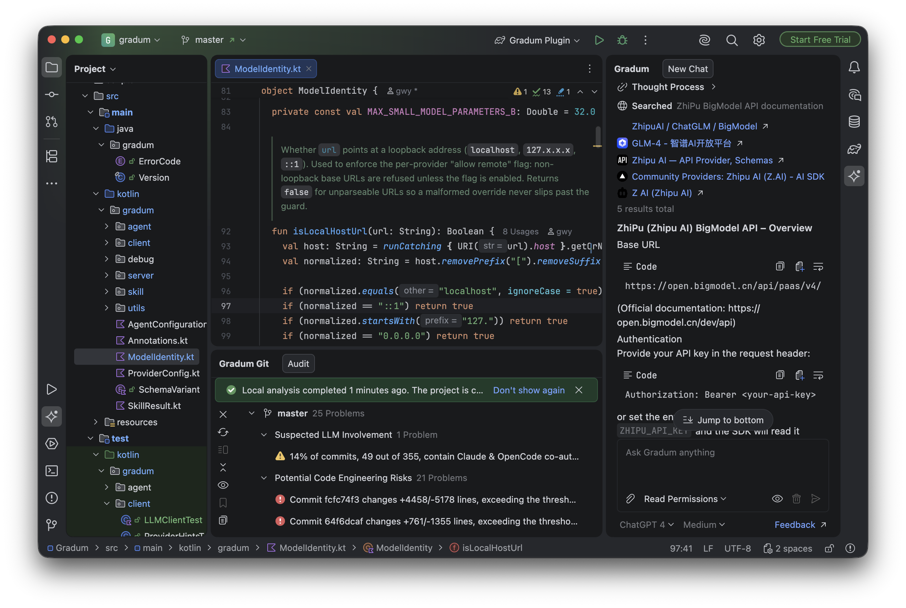

<h2 align="center">Gradum</h2>

<p align="center">
  
  
  
  
</p>

<p align="center">
  <b>Gradum</b> is a lightweight Kotlin agent framework for building LLM-powered tools with function calling. Hook up
  Ollama, Zhipu BigModel (GLM), DeepSeek, MiniMax, or any OpenAI-compatible endpoint, and get streaming, tool-calling
  agents that read and edit files, explore your project, and run shell commands. It ships with a full-featured
  <b>IntelliJ IDEA plugin</b> and an <b>ACP stdio server</b> for IDE agents over the Agent Client Protocol.
</p>

## Screenshots

<div align="center">
  
  
</div>

## Getting Started

To build from source you need a JDK 21 or newer. Gradum does not pin a JDK path in the repo; Gradle simply uses the
JDK from your `JAVA_HOME` or the Gradle JVM you select in your IDE. CI provisions the JDK itself via `setup-java`.

### Option A: run the server

Grab the latest server build from the
[Releases](https://github.com/lg841226/Gradum/releases/latest) page. Each release ships five self-contained archives
(no Java installation needed), one per platform:

- `gradum-darwin-arm64.zip` / `gradum-darwin-x64.zip` (macOS; double-clicking opens a Terminal window that streams the
  server logs)
- `gradum-linux-x64.zip` / `gradum-linux-arm64.zip`
- `gradum-windows-x64.zip` (runs with a console window and UTF-8 stdio)

Or build locally:

```bash
./gradlew buildFatJar            # cross-platform fat jar at build/libs/gradum@1.0.2.jar
java -jar build/libs/gradum@1.0.2.jar
```

The server has three entry points, selected by the first argument:

| Command         | What it does                                                              |
|-----------------|---------------------------------------------------------------------------|
| *(none)*        | Start the HTTP server (NDJSON `/events` streaming API)                    |
| `setup`         | Interactive provider configuration wizard (full-screen TUI in a terminal) |
| `acp`           | Start the ACP stdio server for IDE agent clients                          |

```bash
java -jar gradum@1.0.2.jar --help   # usage + configuration overview + endpoint list
java -jar gradum@1.0.2.jar setup    # first run: pick provider, key, base URL
java -jar gradum@1.0.2.jar acp      # Agent Client Protocol over stdin/stdout
```

**Run `setup` first.** On first start the server writes a user-editable config to `~/.gradum/settings.json` (plus
`~/.gradum/settings.schema.json` for editor autocompletion), and the wizard fills in the provider you choose. All
startup parameters are read from that file — bind host/port, auto-detected port, default API-key file, and the LLM
defaults. The old `--host/--port/--auto-port/--api-key` flags were removed.

### Option B: install the IntelliJ IDEA plugin

```bash
./gradlew :plugin:buildPlugin
```

Install the output `plugin/build/distributions/gradum-*.zip` via
`Settings > Plugins > Install Plugin from Disk`, then point the plugin at a running Gradum server.

### Option C: ACP-capable IDE clients

`gradum acp` speaks the Agent Client Protocol over stdin/stdout. The ACP agent card lives at
[`registry/gradum/agent.json`](registry/gradum/agent.json) (version, per-platform download digests, `args: ["acp"]`),
so registry-aware clients can install and launch Gradum directly. When no provider is configured yet, the initialize
response advertises a `terminal` auth method that runs `gradum setup` in the user's terminal.

## Settings File

`~/.gradum/settings.json` is the single source of truth (JSON Schema shipped alongside for autocomplete):

```jsonc
{
  "server": { "host": "localhost", "port": 8765, "autoDetectPort": false, "apiKeyFile": null },
  "llm":    { "baseUrl": "http://localhost:11434", "model": "", "think": false },
  "commandFilter": { "blockedExecutables": ["reboot", "shutdown", ...], "protectedPaths": { ... } },
  "mcpServers": [ { "name": "idea", "command": "...", "workingDir": "...", "env": {} } ],
  "plugins": { },
  "ollama.baseUrl": "http://localhost:11434",
  "ollama.apiKey": "",           // flat <provider>.baseUrl / .apiKey / .allowRemote per provider
  "zhipu.apiKey": "", "deepseek.apiKey": "", "minimax.apiKey": "", "lmstudio.baseUrl": ""
}
```

Unknown keys are reported at startup rather than silently ignored, and the file is validated as a compact issue tree
(`Invalid gradum.settings (fix ~/.gradum/settings.json)`). Server logs go to stdout plus rotating files under
`~/.gradum/logs/` (the ACP transport additionally writes `~/.gradum/logs/acp.log`).

## Building from Source Pitfalls

Gradum is not a single-JDK single-command build. It targets two JDKs at once, leans on IDE-copied jars, and packages a
fat jar, so a plain `./gradlew build` on a fresh machine hits several traps. If a build fails, work through this list
first.

### 1. Two JDKs are required

- The root **server** module declares `jvmToolchain(21)` (see `build.gradle.kts`).
- The **IntelliJ plugin** module requires `jvmToolchain(25)` (`plugin/build.gradle.kts`).

On Windows/ARM64 you need matching **ARM64** builds of **both** JDK 21 and JDK 25 (or let Gradle toolchains
auto-provision
them). A missing JDK 21 surfaces as:

```
Cannot find a Java installation ... {languageVersion=21}
```

CI builds the server alone with `./gradlew :test -Pgradum.skipPlugin` for exactly this reason; use the same flag if
your machine cannot satisfy the plugin's JDK 25.

### 2. The server fat-jar task conflicts with Gradle 9.5.1

The `io.ktor.plugin` fat-jar task (`:shadowDistTar`) uses a `mainClassName` property that Gradle 9.5.1 removed, so a
full `./gradlew build` can fail at the packaging step. The tasks you usually want (`compileKotlin`, `test`, `run`,
`buildFatJar`) never touch the shadow jar and work fine.

### 3. Do not enable Gradle configuration-cache

Setting `org.gradle.configuration-cache=true` breaks the `:plugin:generateBuildConfig` task, which closes over
non-serializable Gradle script objects. Leave it disabled.

### 4. Missing `plugin/libs/` jars are warnings, not errors

`plugin/build.gradle.kts` resolves Compose for Desktop from Maven (`composeUI()`) and loads the matching Jewel jars
from `plugin/libs/*.jar` (copied from the IDE's `Contents/lib/`). On non-macOS those files may not exist, so you'll see
a list like:

```
w: Specified Dependency Does Not Exist ... intellij.libraries.compose.foundation.desktop.jar
```

These are **warnings**; the plugin still compiles. Jewel and Compose are shipped *inside* the plugin so that the theme
bridge, markdown modules, and Compose resources all resolve on the plugin classloader (see the comments in
`plugin/build.gradle.kts`); the IDE only supplies the platform APIs.

## Features

- **Skill system**: pluggable tool architecture — built-in skills, MCP-backed tools, and hot-loaded external skills
- **Multi-provider LLM**: Ollama, LM Studio, vLLM, LocalAI, Zhipu BigModel, DeepSeek, MiniMax, and any
  OpenAI-compatible endpoint
- **Streaming events**: NDJSON event stream for real-time UI integration
- **ACP server**: stdio Agent Client Protocol transport for IDE agent clients, with permission bridging
- **Encrypted context**: conversation history persisted with HMAC-CTR + HMAC-SHA256, resumes across runs
- **Command safety filter**: structural shell command classification (blocked / needs-approval / allowed),
  user-overridable via `settings.json`
- **Sequential editing**: search-replace edits applied one by one, reporting how many landed
- **Detached processes**: background execution for GUIs or long-running servers
- **HTTP API**: endpoints for the plugin and other local integrations
- **Skill editor**: a bundled web IDE at `GET /skills/editor` — tabbed Kotlin editing with syntax highlighting,
  a problems panel, and a minimap; Run deploys the source to `~/.gradum/skills` for the hot-reload watcher

## IntelliJ IDEA Plugin

A production-quality IntelliJ plugin built with Gradum: not just a demo, but a showcase of the framework's
capabilities. It's built with Kotlin and the Jetpack Compose-based Jewel UI toolkit, and runs entirely locally, with no
cloud dependencies. Plugin version 1.0.3.

- **Chat panel**: watch the agent think, search, and edit in real time
- **Message minimap**: a navigation rail beside the conversation jumps to any user turn
- **Model selector**: auto-discovers local and cloud providers and switches between them instantly
- **Runtime status banner**: an error banner with copyable diagnostics appears when the local runtime is unreachable
- **Tool call indicators**: see every tool invocation as it happens; click failures for friendly errors and copyable
  details
- **Thinking preview**: expanded reasoning is capped with a fade and scrollbar so it never buries the conversation
- **Context toggle**: send your current editor file to the agent with one click
- **File & image attachments**: up to 10 items in a unified attachment area
- **Streaming responses**: thinking blocks, tool calls, and final answers render as they stream
- **Rich Markdown**: tables, code blocks (copy / soft-wrap / line numbers / collapse), task lists, footnotes, LaTeX
- **Dark/Light themes**: integrated with IntelliJ's theme system via Jewel
- **Git analysis**: a bottom tool window audits local Git history, surfaces risk findings by theme or severity, and
  computes a project quality band

## Built-in Skills

| Skill               | Description                                                                         |
|---------------------|-------------------------------------------------------------------------------------|
| `read_file`         | Read file content (whole file or line range)                                        |
| `write_file`        | Search-replace editing, or create/overwrite a whole file (parent dirs auto-created) |
| `run_cmd`           | Execute shell commands (blocking or detached)                                       |
| `explore_project`   | Explore project structure with depth control and file stats                         |
| `grep`              | Content regex search across project files                                           |
| `glob`              | Glob path matcher for file discovery                                                |
| `to_do`             | Initialize a task list                                                              |
| `finish_to_do_item` | Mark tasks complete                                                                 |
| `search_web`        | Web search via Tavily API (requires API key, see below)                             |
| `delegate_task`     | Spawn a sub-agent for a focused task (its events stream under `sub_agent:*`)        |
| `mcp_tools`         | Materialized tools from the MCP servers declared in `settings.json`                 |

External skills can also be dropped into `~/.gradum/skills/*.kt` — they are compiled at runtime and hot-reloaded when
the directory changes, no rebuild required.

## LLM Backend Setup

The `search_web` skill uses the [Tavily Search API](https://tavily.com); set `TAVILY_API_KEY` to enable it (the free
tier includes 1,000 calls/month). Every other skill works without any key.

Provider base URLs and API keys live in `~/.gradum/settings.json` — the easiest way to write them is
`java -jar gradum@1.0.2.jar setup`, or the plugin's settings page. Environment variables work as a fallback for cloud
keys:

```bash
export ZHIPU_API_KEY="your-key-here"       # Zhipu BigModel (GLM)
export DEEPSEEK_API_KEY="your-key-here"    # DeepSeek
export MiniMax_API_KEY="your-key-here"     # MiniMax (exact spelling)
export TAVILY_API_KEY="your-key-here"      # web search skill
```

Local providers (Ollama, LM Studio) need no key; their base URL is read from `ollama.baseUrl` / `lmstudio.baseUrl`.

## Security

A command safety filter classifies shell commands before anything runs:

- **Blocked**: destructive system tools (`mkfs*`, `mkswap`, `fdisk`, `sfdisk`, `parted`, `gdisk`, `shutdown`,
  `reboot`, `poweroff`)
- **Needs approval**: risky-but-legitimate commands (`dd`, destructive `rm`, permission changes…) — the agent asks
  before executing
- Privilege escalators (`sudo`, `su`, `doas`, `pkexec`) are recognized structurally so the filter can see through them
- Protected paths (`/etc`, `/usr`, `~/.ssh`, …) are guarded separately; `/tmp` is always allowed

Blocked executables and protected paths are user-overridable through the `commandFilter` section of
`settings.json`.

The local HTTP API itself is guarded in depth: a `Host` whitelist rejects DNS-rebinding attempts, every route
except `/health` requires the bearer token stored in `~/.gradum/server.token` (0600; the plugin reads the same
file), the skill editor exchanges a `?token=` for an `HttpOnly` cookie, and the server refuses to start when
`server.host` is not a loopback address.

## Documentation

- [Architecture](docs/ARCHITECTURE.md): system design, data flow, modules, ACP transport, packaging
- [Plugin Features](docs/PLUGIN_FEATURES.md): detailed feature index: chat, Markdown pipeline, git analysis, i18n, icons
- [Coding Standards](docs/CODING_STANDARDS_KOTLIN.md): Kotlin conventions
- [Skill Development](docs/PLUGIN_DEVELOPMENT.md): creating custom skills
- [Infrastructure Pitfalls](docs/INFRASTRUCTURE_PITFALLS_EN.md): Jewel / Compose / Classloader integration traps
- [Logging Guide](docs/LOGGING_GUIDE.md): logger naming and levels
- [Versioning](docs/VERSIONING.md): bump rules and release naming
- [Changelog](CHANGELOG.md) · [Privacy Policy](PRIVACY.md) · [Contributing](CONTRIBUTING.md)

## Contributing

1. Fork the repository
2. Create a feature branch: `feature/@your-name-add-thing`
3. Commit with descriptive messages
4. Open a pull request

## License

MIT License - see [LICENSE](LICENSE)

## Gradum Version

Server 1.0.2 · Plugin 1.0.3
