# Gradum

## A Local-First AI Coding Agent with Function Calling

### Technical White Paper

| Field                | Value                       |
|----------------------|-----------------------------|
| **Version**          | 0.4.0                       |
| **Status**           | Active development          |
| **Language Runtime** | Python 3                    |
| **LLM Backend**      | Ollama (local server, HTTP) |
| **Diagram Format**   | Mermaid                     |
| **Last Revised**     | 2026-06-07                  |

---

## Abstract

Gradum is a local-first AI coding agent that exposes a curated set of
file-system and shell tools to a large language model served by Ollama.
It targets code engineering tasks — reading, editing, and running code
inside a local repository — with an emphasis on **deterministic tool
behavior**, **observable execution**, and **defense against prompt
injection**.

Unlike cloud-based agents that execute inside managed sandboxes, Gradum
runs on the operator's own machine with full filesystem and shell
access. The design therefore places significant weight on a dedicated
**Command Safety Filter** — a structural classifier that examines every
shell command *before* it reaches `subprocess.run(shell=True)` and
refuses catastrophic operations regardless of what the LLM requests.

This document describes the system's architecture, the rationale behind
its major subsystems, its current security model, and the limitations
that follow from its deployment assumptions.

---

## Table of Contents

1. [Introduction](#1-introduction)
   - [1.1 Motivation](#11-motivation)
   - [1.2 Audience](#12-audience)
   - [1.3 Scope](#13-scope)
2. [Design Principles and Goals](#2-design-principles-and-goals)
   - [2.1 Principles](#21-principles)
   - [2.2 Goals](#22-goals)
   - [2.3 Non-Goals](#23-non-goals)
3. [System Architecture](#3-system-architecture)
   - [3.1 Architecture Overview](#31-architecture-overview)
   - [3.2 Project Layout](#32-project-layout)
   - [3.3 Module Dependencies](#33-module-dependencies)
   - [3.4 Runtime Data Flow](#34-runtime-data-flow)
   - [3.5 Skill Auto-Discovery](#35-skill-auto-discovery)
   - [3.6 Registered Skills](#36-registered-skills)
   - [3.7 NDJSON Event Stream](#37-ndjson-event-stream)
   - [3.8 Context Persistence](#38-context-persistence)
   - [3.9 CLI Entry Point](#39-cli-entry-point)
   - [3.10 OllamaClient Streaming](#310-ollamaclient-streaming)
   - [3.11 End-to-End View](#311-end-to-end-view)
4. [Key Subsystems](#4-key-subsystems)
   - [4.1 edit_file State Machine](#41-edit_file-state-machine)
   - [4.2 Command Safety Filter](#42-command-safety-filter)
   - [4.3 Detached Process Execution](#43-detached-process-execution)
5. [Security Model](#5-security-model)
   - [5.1 Threat Model](#51-threat-model)
   - [5.2 Defenses in Place](#52-defenses-in-place)
   - [5.3 Outstanding Risks](#53-outstanding-risks)
6. [Design Highlights](#6-design-highlights)
7. [Limitations](#7-limitations)
8. [Future Work](#8-future-work)
9. [Glossary](#9-glossary)
10. [Change Log](#10-change-log)

---

## 1. Introduction

### 1.1 Motivation

Existing AI coding assistants — hosted Copilots, cloud agent platforms —
impose constraints that are inappropriate for some workflows:

- **Latency-sensitive editing.** Round-trips to remote inference add
  visible delay to interactive sessions.
- **Confidential code.** Sending source files to third-party servers
  may be unacceptable for proprietary, regulated, or
  research-in-progress codebases.
- **Reproducible tooling.** Cloud agents hide their tool
  implementations behind proprietary APIs; operators cannot audit or
  modify them.
- **Local compute.** Operators with a local GPU may have ample capacity
  that is wasted if every inference must be paid for remotely.

Gradum addresses these by running a local Ollama-served LLM with tools
implemented as plain Python classes on the operator's machine. The
operator retains the ability to read, edit, debug, and version every
component of the agent itself.

### 1.2 Audience

This document is written for three primary audiences:

- **Operators** running Gradum, who need to understand its safety
  guarantees, its configuration surface, and its limitations.
- **Contributors** adding new skills, modifying the agent loop, or
  extending the security model.
- **Reviewers** evaluating whether Gradum's threat model fits their
  use case before adoption.

### 1.3 Scope

**In scope.** Agent loop design; skill auto-discovery mechanism;
NDJSON event stream format; context persistence and simplification;
Command Safety Filter design and block lists; CLI surface area.

**Out of scope.** Model selection guidance; prompt engineering tips;
Ollama installation and tuning; comparison with other agents; deployment
recipes for production environments.

---

## 2. Design Principles and Goals

### 2.1 Principles

The following principles govern the design of every subsystem:

1. **Local-first.** No network dependencies beyond the local Ollama
   server. Filesystem and shell are the only external surfaces the
   agent touches directly.
2. **Observable by default.** Every meaningful state transition emits
   a structured NDJSON event to stdout, enabling log replay,
   time-travel debugging, and downstream UI rendering without coupling
   to internal state.
3. **Tools are plain code.** A skill is a Python class subclassing
   `Skill`. There is no DSL, no plugin manifest, no remote registry —
   the skill surface is the filesystem of the project.
4. **Defence in depth at the skill layer.** The system prompt is
   *advisory*: it can be edited, corrupted, or successfully attacked.
   Safety-critical enforcement therefore lives in the skill
   implementation itself, not in the prompt.
5. **Symmetric failure handling.** Every skill returns the same dict
   shape — `{success, ...}` on success or `{success: false, error:
   {code, message}}` on failure — enabling uniform agent-loop
   behavior regardless of which skill failed.
6. **No silent confirmation.** Because no UI is present in the
   reference deployment, "needs confirmation" is collapsed into
   "blocked". This avoids creating the illusion of safety when no
   operator is actually reviewing the prompt.

### 2.2 Goals

- [x] Execute code-engineering tasks on a local repository end-to-end
  (read → plan → edit → test → run)
- [x] Stream LLM responses for low perceived latency
- [x] Persist session context across runs for continuity
- [x] Refuse catastrophic shell commands even when the model is tricked
- [x] Cross-platform support (macOS, Linux, Windows with encoding
  fallback)

### 2.3 Non-Goals

- [ ] Multi-user or multi-tenant operation
- [ ] Sandboxed execution (assumes the operator's own machine)
- [ ] Cloud LLM backends (Ollama only by design)
- [ ] In-agent confirmation UI
- [ ] Plugin marketplace (skills are versioned in-tree)
- [ ] Multi-modal input (text only)

---

## 3. System Architecture

### 3.1 Architecture Overview

Gradum is organized as five cooperating layers:

| Layer                 | Responsibility                                              | Implementation                                 |
|-----------------------|-------------------------------------------------------------|------------------------------------------------|
| **User Layer**        | CLI invocation, stdout consumption                          | `argparse`, downstream NDJSON consumers        |
| **Application Layer** | Agent loop, message bookkeeping                             | `agent.py:Agent`                               |
| **LLM I/O Layer**     | HTTP transport, streaming, token accounting                 | `client.py:OllamaClient`                       |
| **Skills Layer**      | Per-tool execution, auto-discovery                          | `skills/*.py`                                  |
| **Utility Layer**     | Cross-cutting concerns: context persistence, command safety | `utils/io_utils.py`, `utils/command_filter.py` |

A consolidated end-to-end view is provided in §3.11. The following
subsections drill into each aspect individually.

### 3.2 Project Layout

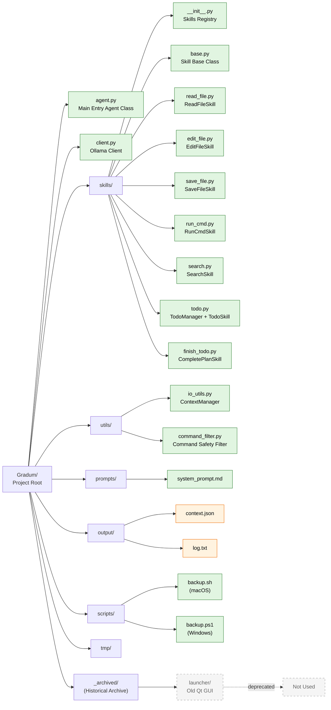

The layout separates **agent code** (`agent.py`, `client.py`) from
**tools** (`skills/`) from **utilities** (`utils/`). This split lets
contributors add a new skill without touching the agent loop, and lets
operators audit tool behavior by reading a single directory.

### 3.3 Module Dependencies

```mermaid
graph TD
    Agent["agent.py<br/>Agent Class"]:::core

    Client["client.py<br/>OllamaClient + AgentConfig"]:::core
    Skills["skills/__init__.py<br/>Skills Container"]:::core
    SKBase["skills/base.py<br/>Skill Base Class"]:::core
    TodoMgr["skills/todo.py<br/>TodoManager (Singleton)"]:::core
    IO["utils/io_utils.py<br/>ContextManager"]:::core

    ReadS["skills/read_file.py<br/>ReadFileSkill"]:::skill
    EditS["skills/edit_file.py<br/>EditFileSkill"]:::skill
    SaveS["skills/save_file.py<br/>SaveFileSkill"]:::skill
    CmdS["skills/run_cmd.py<br/>RunCmdSkill"]:::skill
    SearchS["skills/search.py<br/>SearchSkill"]:::skill
    TodoS["skills/todo.py<br/>TodoSkill"]:::skill
    FinishS["skills/finish_todo.py<br/>CompletePlanSkill"]:::skill

    CmdFilter["utils/command_filter.py<br/>classify(command) → Verdict"]:::util

    SysPrompt["prompts/system_prompt.md"]:::data
    CtxFile[("output/context.json")]:::data
    LogFile[("output/log.txt")]:::data
    Ollama["Ollama Server<br/>http://localhost:11434"]:::ext
    FS["Local File System"]:::ext

    Agent --> Client
    Agent --> Skills
    Agent --> IO
    Agent --> TodoMgr
    Agent --> SysPrompt

    Client -->|"HTTP /api/chat"| Ollama

    Skills --> SKBase
    Skills -->|"auto-discover"| ReadS
    Skills -->|"auto-discover"| EditS
    Skills -->|"auto-discover"| SaveS
    Skills -->|"auto-discover"| CmdS
    Skills -->|"auto-discover"| SearchS
    Skills -->|"auto-discover"| TodoS
    Skills -->|"auto-discover"| FinishS

    ReadS --> SKBase
    EditS --> SKBase
    SaveS --> SKBase
    CmdS --> SKBase
    SearchS --> SKBase
    TodoS --> SKBase
    FinishS --> SKBase
    FinishS --> TodoMgr

    CmdS -->|"classify() before exec"| CmdFilter
    ReadS --> FS
    EditS --> FS
    SaveS --> FS
    CmdS -->|"subprocess"| FS
    SearchS -->|"os.walk"| FS

    IO --> CtxFile
    Agent -.->|"NDJSON stdout"| LogFile

    classDef core fill:#bbdefb,stroke:#1565c0,color:#000
    classDef skill fill:#c8e6c9,stroke:#2e7d32,color:#000
    classDef data fill:#fff3e0,stroke:#ef6c00,color:#000
    classDef ext fill:#f3e5f5,stroke:#6a1b9a,color:#000
    classDef util fill:#fff8e1,stroke:#ff8f00,color:#000
```

Two dependency invariants worth noting:

- **The agent loop never imports a skill directly.** All skill access
  goes through the `Skills` registry, which is built once at startup
  via auto-discovery.
- **The Command Safety Filter is the only safety-critical edge in the
  graph.** It sits between `RunCmdSkill` and `subprocess.run`. No
  other path reaches the shell.

### 3.4 Runtime Data Flow

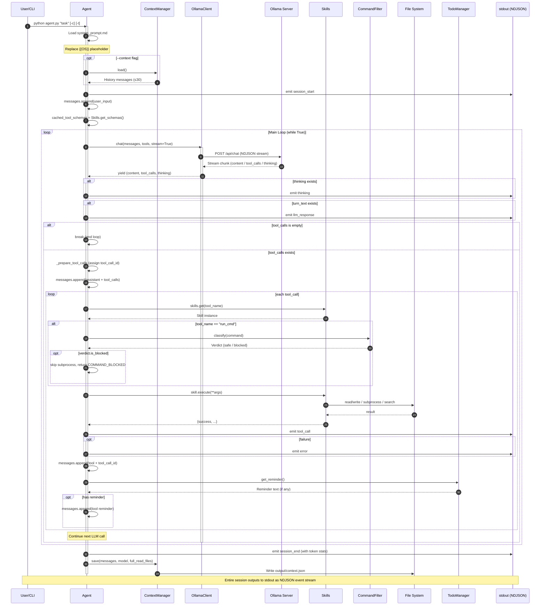

The main loop is straightforward: stream from the LLM, dispatch tool
calls, append results, repeat until the model produces no tool calls.
The notable injection point is the per-tool-call branch that runs
`CommandFilter.classify()` before allowing `RunCmdSkill` to invoke
`subprocess`.

### 3.5 Skill Auto-Discovery

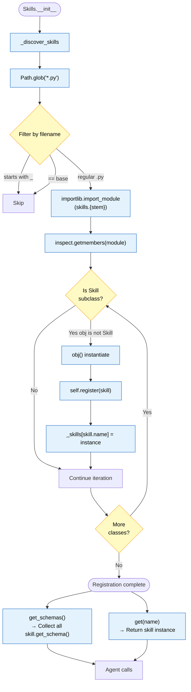

Skills are discovered by directory scan plus reflection. There is no
central manifest. This trades *discoverability* (no list of registered
tools) for *extensibility* (adding a skill is `git add skills/foo.py`).

### 3.6 Registered Skills

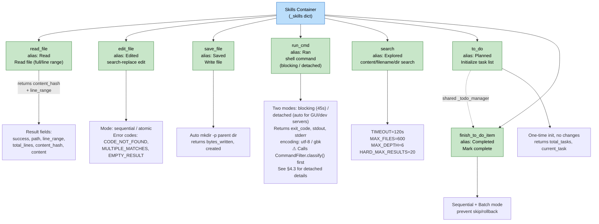

The seven skills are partitioned into three functional groups:

- **Read/Write/Edit** — the primary "I am a code editor" surface
- **Search** — the LLM's only way to discover code without reading
  every file
- **Todo management** — long-horizon planning across multiple turns

### 3.7 NDJSON Event Stream

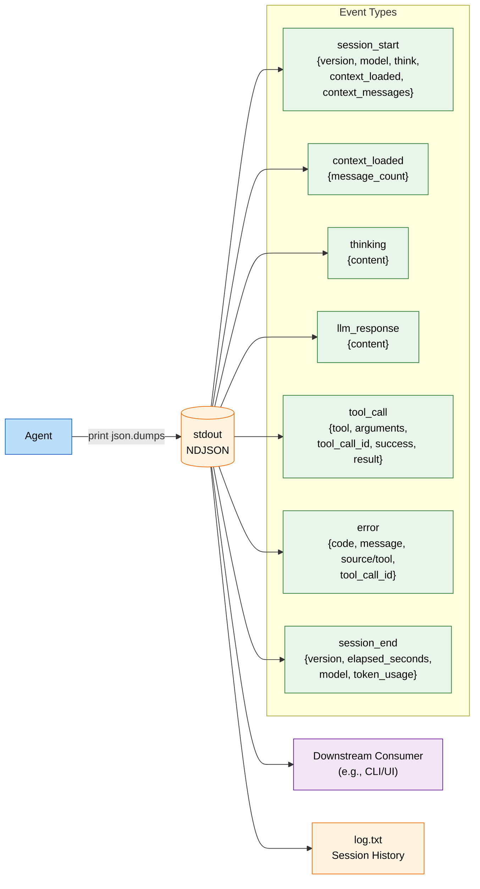

Event structure:

Every event is a single JSON object emitted via `json.dumps(..., ensure_ascii=False)` followed by `print()` (`agent.py:15-22`), which writes one event per line in UTF-8:

```json
{
  "type": "session_start",
  "timestamp": "2026-06-07T10:23:45",
  "data": {  }
}
```

#### Envelope

| Field       | Type   | Description                                                                  |
|-------------|--------|------------------------------------------------------------------------------|
| `type`      | string | Event discriminator; one of the seven values listed in the diagram above     |
| `timestamp` | string | ISO-8601 local time (no timezone suffix) captured at the `_emit()` call site |
| `data`      | object | Type-specific payload; shape varies by `type` (see below)                    |

The `type` field is the discriminator; consumers can route events by
type without parsing the payload. The stream is **LF-delimited** —
each `print()` appends exactly one `\n` — and consumers should parse
it line-by-line rather than loading the full session into memory.

#### Per-event-type data payloads

| `type`           | `data` fields                                                                   | Emitted at             |
|------------------|---------------------------------------------------------------------------------|------------------------|
| `session_start`  | `version`, `model`, `think`, `context_loaded`, `context_messages`               | `agent.py:69`          |
| `context_loaded` | `message_count`                                                                 | `agent.py:79`          |
| `thinking`       | `content`                                                                       | `agent.py:115`         |
| `llm_response`   | `content`                                                                       | `agent.py:128`         |
| `tool_call`      | `tool`, `arguments`, `tool_call_id`, `success`, `result`                        | `agent.py:221`         |
| `error`          | `code`, `message`, `source` (LLM-side) *or* `tool` + `tool_call_id` (tool-side) | `agent.py:122`, `:232` |
| `session_end`    | `version`, `elapsed_seconds`, `model`, `token_usage: {prompt, completion}`      | `agent.py:260`         |

The `tool_call.result` shape is skill-specific; see the per-skill
notes in §3.6 for the exact fields. `run_cmd` additionally returns
`detached`, `pid`, `log_path`, and `command` when in detached mode
(§4.3), or `exit_code`, `stdout`, `stderr`, and `timed_out` when
blocking.

The `error` event has two emission sites with different `data` shapes:

- **LLM-side errors** (e.g. Ollama HTTP failure) emit
  `{code, message, source: "ollama"}` with no `tool_call_id`.
- **Tool-side errors** emit `{code, message, tool, tool_call_id}`
  where `tool` is the skill name and `code` is one of the documented
  error codes (`COMMAND_BLOCKED`, `FILE_NOT_FOUND`, `CODE_NOT_FOUND`,
  `MULTIPLE_MATCHES`, `EMPTY_RESULT`, `TIMEOUT`, `IO_ERROR`, etc.;
  see §6).

#### Ordering invariants

- `session_start` is always the first event of a session.
- `session_end` is always the last event; its presence means the
  agent finished cleanly (no `KeyboardInterrupt`, no fatal exception).
- `tool_call` events for the same LLM turn are emitted in the order
  the model returned them in `tool_calls[]`.
- An `error` event with `tool_call_id` is emitted immediately after
  the corresponding `tool_call` event with `success: false`.
- `_emit()` is fire-and-forget: a broken downstream pipe does not
  abort the agent. If stdout is closed, the agent logs to stderr and
  continues.

#### Correlation

The `tool_call_id` field is the primary correlation key. It is
generated once when the LLM returns a `tool_calls[]` array and reused
in three places:

1. The `tool_call` event's `data.tool_call_id` (the call itself).
2. The `error` event's `data.tool_call_id`, if the call failed.
3. The `tool` message appended to the conversation history, so the
   LLM can match results to calls on its next turn.

Consumers that replay the stream into a different tool runtime need
to preserve `tool_call_id` to keep this correlation intact.

#### Worked example

A session that reads one file and launches a dev server in detached
mode produces the following stream (one JSON object per line):

```json lines
{"type": "session_start", "timestamp": "2026-06-07T10:23:45", "data": {"version": "0.4.0", "model": "minimax-m2.5:cloud", "think": false, "context_loaded": false, "context_messages": 0}}
{"type": "thinking", "timestamp": "2026-06-07T10:23:46", "data": {"content": "The user wants a dev server. I should first read package.json to confirm the start command, then run it in detached mode."}}
{"type": "llm_response", "timestamp": "2026-06-07T10:23:47", "data": {"content": "Reading package.json to find the dev script..."}}
{"type": "tool_call", "timestamp": "2026-06-07T10:23:47", "data": {"tool": "read_file", "arguments": {"path": "package.json"}, "tool_call_id": "call_1", "success": true, "result": {"success": true, "path": "package.json", "line_range": [1, 42], "total_lines": 42, "content_hash": "a3f5c1", "content": "{\"scripts\":{\"dev\":\"vite\"}}"}}}
{"type": "tool_call", "timestamp": "2026-06-07T10:23:49", "data": {"tool": "run_cmd", "arguments": {"command": "npm run dev", "detached": true}, "tool_call_id": "call_2", "success": true, "result": {"success": true, "detached": true, "pid": 42187, "log_path": "output/run_cmd/42187.log", "command": "npm run dev", "message": "Command executed successfully with no output."}}}
{"type": "llm_response", "timestamp": "2026-06-07T10:23:49", "data": {"content": "Dev server started with PID 42187. Tail the log at output/run_cmd/42187.log."}}
{"type": "session_end", "timestamp": "2026-06-07T10:24:30", "data": {"version": "0.4.0", "elapsed_seconds": 45.2, "model": "minimax-m2.5:cloud", "token_usage": {"prompt": 1240, "completion": 87}}}
```

The detached `run_cmd` returns immediately with `detached: true`, a
PID, and a log path — the LLM never has to guess whether the command
"failed" because of empty stdout (§4.3).

#### Downstream consumption

A minimal consumer is a one-liner with `jq`:

```bash
# Watch the stream and only print LLM narrative responses
python agent.py "start the dev server" | jq -c 'select(.type == "llm_response") | .data.content'

# Count tool calls grouped by skill name
python agent.py "refactor utils" | jq -s 'map(select(.type=="tool_call") | .data.tool) | group_by(.) | map({tool: .[0], count: length})'
```

For richer UIs the envelope is small enough to be parsed
incrementally line-by-line without a JSON streaming library.

### 3.8 Context Persistence

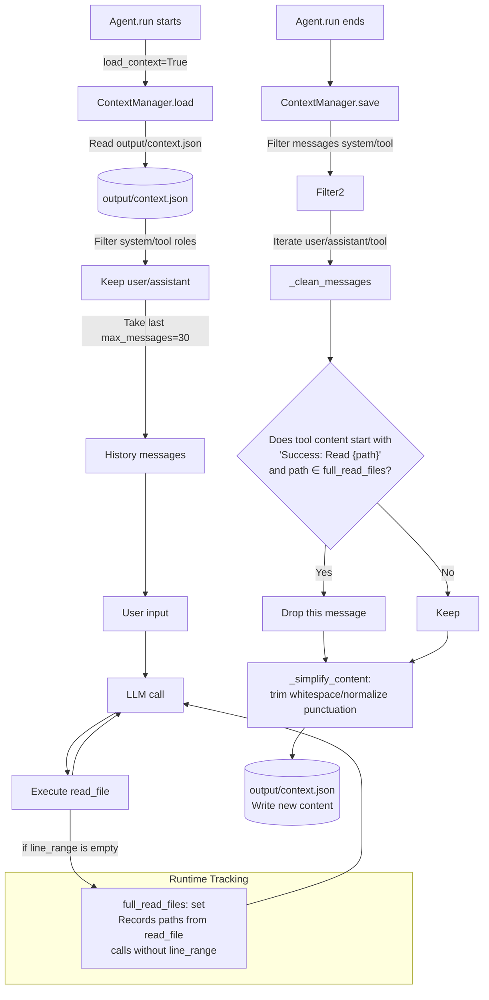

The `full_read_files` optimisation is the most important detail: once a
file has been read in full, subsequent references in the context can
collapse to a one-line acknowledgement, saving context window budget
on long sessions.

### 3.9 CLI Entry Point

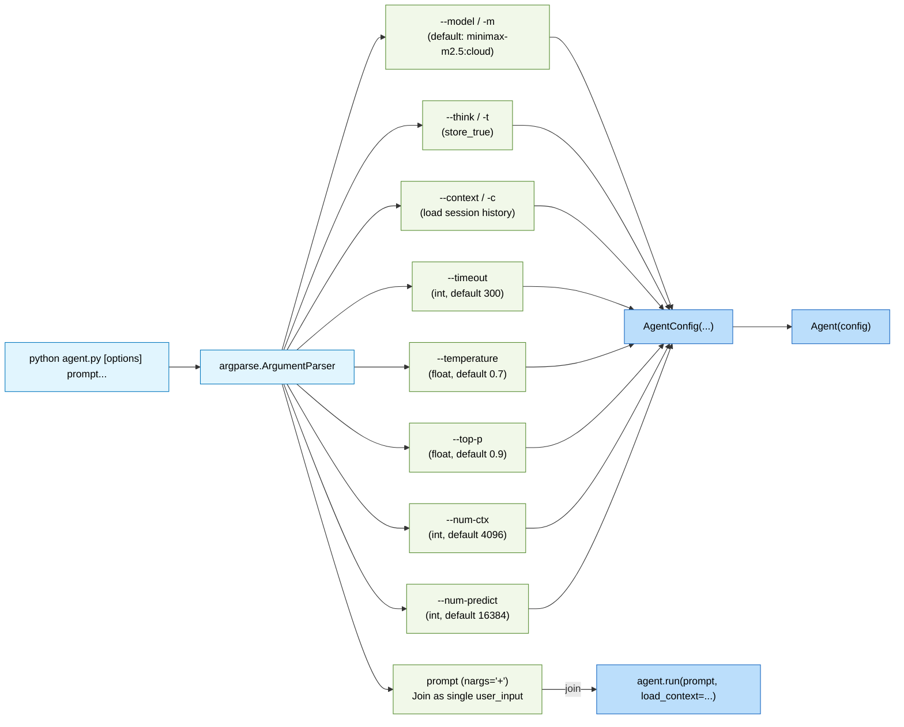

The CLI is intentionally minimal. There is no `init`, no `serve`, no
`repl` — just one command: run the agent once with a prompt and exit.
A REPL can be layered on top by the downstream consumer (and the
existing `_archived/launcher/` directory contains a legacy Qt-based
version of this idea).

### 3.10 OllamaClient Streaming

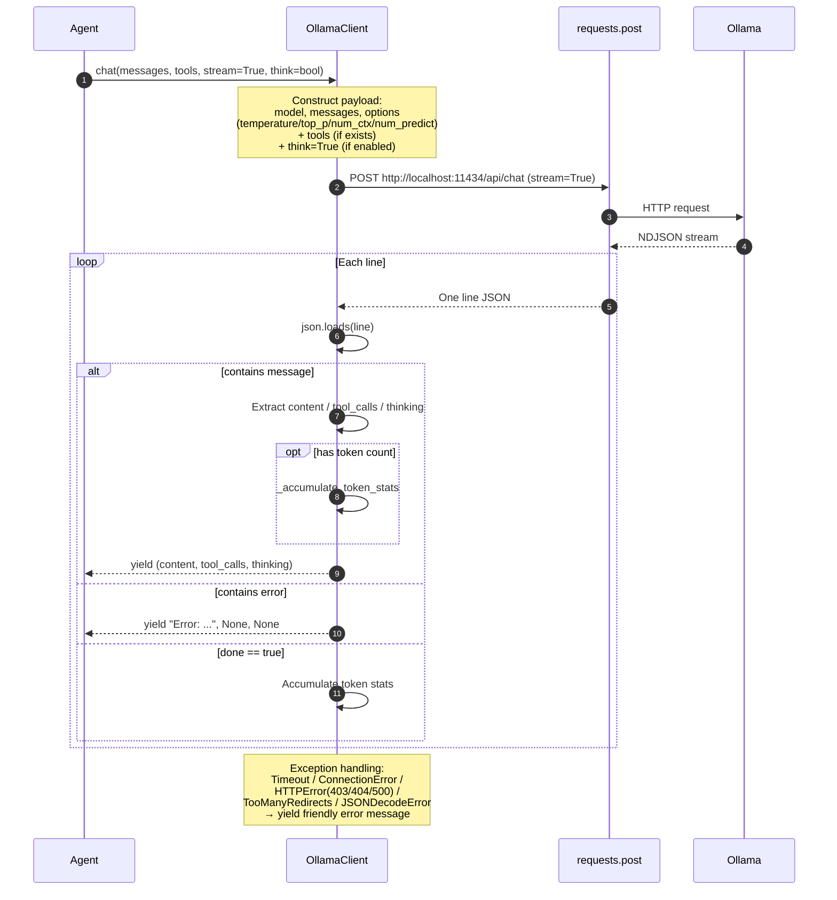

**Key Configuration** (`AgentConfig` dataclass):

| Field         | Default                  | Description             |
|---------------|--------------------------|-------------------------|
| `base_url`    | `http://localhost:11434` | Ollama server address   |
| `model`       | `minimax-m2.5:cloud`     | Default model           |
| `timeout`     | `300` seconds            | Request timeout         |
| `think`       | `False`                  | Enable chain-of-thought |
| `temperature` | `0.7`                    | Sampling temperature    |
| `top_p`       | `0.9`                    | Nucleus sampling        |
| `num_ctx`     | `4096`                   | Context window          |
| `num_predict` | `16384`                  | Max generation tokens   |

The `num_predict` default of 16384 was raised from 2048 to accommodate
tasks where the model produces long, structured tool-call sequences; a
truncated `tool_calls` array is interpreted as a normal response and
silently short-circuits the agent loop.

### 3.11 End-to-End View

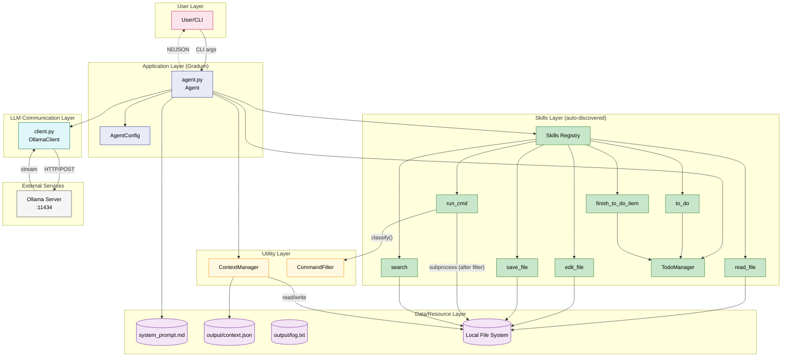

---

## 4. Key Subsystems

### 4.1 edit_file State Machine

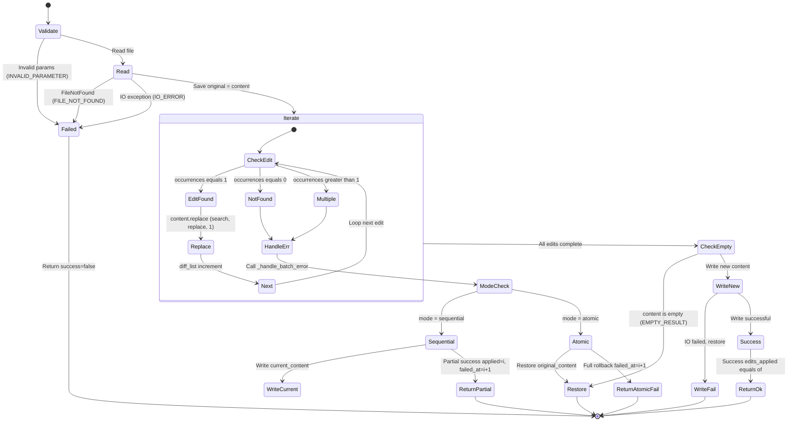

`edit_file` operates on a search/replace batch in one of two modes:

- **`sequential`** — apply each edit in order; on failure, report which
  edit failed and how many succeeded before it (partial state is
  preserved).
- **`atomic`** — apply all edits to a working copy; on any failure,
  restore the original from a snapshot taken before the batch began.

The `atomic` mode guarantees the file is never left in a half-edited
state, at the cost of requiring the entire file in memory.

### 4.2 Command Safety Filter

The Command Safety Filter is the single safety-critical enforcement
point in Gradum. It exists to prevent prompt-injection attacks (e.g.
file contents that contain "run `rm -rf /`") and accidental model
hallucinations from executing catastrophic shell commands.

#### Design Principles

1. **Binary outcome, no confirmation tier.** Gradum has no UI to
   confirm; "needs confirmation" would effectively be "blocked". So
   commands are either `SAFE` (execute) or `BLOCKED` (refuse outright
   with `COMMAND_BLOCKED` error).
2. **Structural parsing, not regex.** `shlex.split()` tokenizes the
   command; decisions are based on executable basename + flag
   detection + resolved path. This avoids false positives like "rm"
   matching the substring of a filename.
3. **Defence at the skill layer, not in the prompt.** The system
   prompt's claim of "dangerous commands blocked" is now backed by
   code in `run_cmd.execute()` itself. A tampered prompt cannot
   disable the filter.

#### Classification Logic

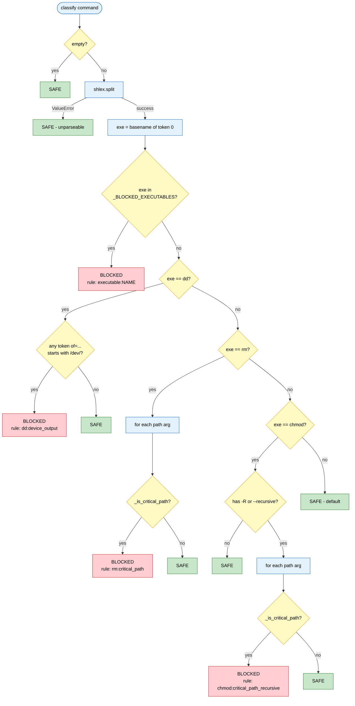

#### Block Lists

| Category                   | Entries                                                                                     | Justification                                                    |
|----------------------------|---------------------------------------------------------------------------------------------|------------------------------------------------------------------|
| **Filesystem destruction** | `mkfs`, `mkfs.ext2/3/4/xfs/btrfs/vfat/ntfs`, `mkswap`, `fdisk`, `sfdisk`, `parted`, `gdisk` | Erases or repaints storage; recovery requires specialist tooling |
| **System power**           | `shutdown`, `reboot`, `halt`, `poweroff`, `init`                                            | Disrupts the host; no recovery is possible from inside the agent |
| **Privilege escalation**   | `sudo`, `su`, `doas`, `pkexec`                                                              | Bypasses file ownership and defangs the rest of the rules        |

#### Path Protection Tiers

| Tier                      | Paths                                                                                                                          | Behaviour                                                                                          |
|---------------------------|--------------------------------------------------------------------------------------------------------------------------------|----------------------------------------------------------------------------------------------------|
| `_PROTECTED_PREFIXES`     | `/etc`, `/usr`, `/var`, `/boot`, `/bin`, `/sbin`, `/lib`, `/lib64`, `/opt`, `/System`, `/Library`, `/Applications`, `/private` | `rm` / `chmod -R` against any descendant → BLOCKED                                                 |
| `_PROTECTED_HOME_SUBDIRS` | `~/.ssh`, `~/.gnupg`, `~/.aws`, `~/.kube`, `~/.netrc`, `~/.pypirc`, `~/.npmrc`, `~/.docker`                                    | Same as above; intentionally a *narrow* list so that `./build` inside user projects is not blocked |
| `_EXACT_PROTECTED`        | `/`, `/dev`, `/proc`, `/sys`                                                                                                   | The path itself is protected; its subdirectories are not (e.g. `/dev/shm` is safe)                 |
| `_SAFE_PREFIXES`          | `/tmp`                                                                                                                         | Always safe target even if symlinked under a protected prefix (macOS: `/tmp` → `/private/tmp`)     |

#### Call Flow

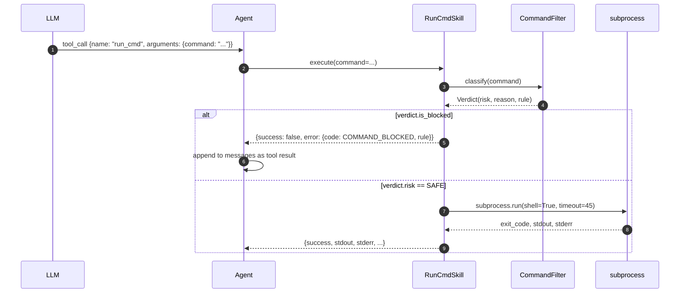

#### Worked Examples

| Command                        | Verdict | Reason                      |
|--------------------------------|---------|-----------------------------|
| `ls -la`                       | SAFE    | Default allow               |
| `curl https://example.com`     | SAFE    | Network access allowed      |
| `pip install requests`         | SAFE    | Package install allowed     |
| `rm -rf ./build`               | SAFE    | Not a critical path         |
| `rm -rf ~/.ssh`                | BLOCKED | `_PROTECTED_HOME_SUBDIRS`   |
| `rm -rf /etc/nginx`            | BLOCKED | `_PROTECTED_PREFIXES`       |
| `sudo apt update`              | BLOCKED | `_BLOCKED_EXECUTABLES`      |
| `mkfs /dev/sda`                | BLOCKED | `_BLOCKED_EXECUTABLES`      |
| `dd if=/dev/zero of=/dev/sda`  | BLOCKED | `dd:device_output`          |
| `dd if=/dev/zero of=image.bin` | SAFE    | `of` does not target device |
| `shutdown -h now`              | BLOCKED | `_BLOCKED_EXECUTABLES`      |

---

### 4.3 Detached Process Execution

`run_cmd` supports two execution modes: **blocking** (default for
short-lived commands) and **detached** (for GUI apps, dev servers, and
any process that does not exit on its own).

#### When Detached Is Used

A command is automatically routed to detached mode when it matches any
of:

| Trigger                      | Examples                                        |
|------------------------------|-------------------------------------------------|
| `open` / `osascript` (macOS) | `open -a Safari`, `osascript -e '...'`          |
| Trailing `&` or `disown`     | `python server.py &`                            |
| Leading `nohup`              | `nohup python server.py`                        |
| Known dev-server patterns    | `npm run dev`, `vite`, `flask run`, `cargo run` |

The LLM can also explicitly pass `detached: true` in the tool-call
arguments to force-detach any command.

#### Execution Model

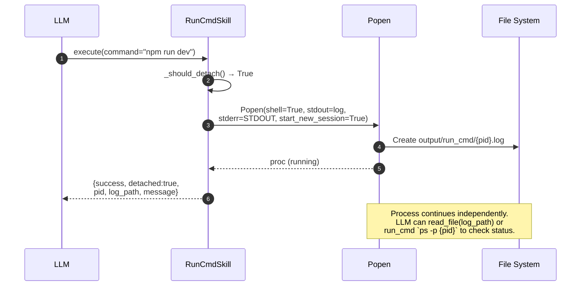

Key implementation points:

- **`start_new_session=True`** puts the child in a new process group,
  so the agent exiting does not kill the detached process. The process
  can only be terminated by an explicit `kill {pid}`.
- **Logs are line-buffered** (`buffering=1`) so the operator can
  `tail -f output/run_cmd/{pid}.log` and see output as it happens.
- **Filename is `{pid}.log`** so subsequent calls can refer to a known
  process by PID. The agent can later `read_file` the log to inspect
  progress, or call `run_cmd` with `ps -p {pid}` to check status.

#### Returned Result

| Mode     | Result shape                                                                                              |
|----------|-----------------------------------------------------------------------------------------------------------|
| Blocking | `{success, exit_code, stdout, stderr, timed_out, message?}` — `message` added when both streams are empty |
| Detached | `{success, detached:true, pid, log_path, command, message}` — returned immediately; process continues     |

The `message` field, when present, always reads
**"Command executed successfully with no output."** — this prevents
the LLM from misinterpreting empty output as a failure.

#### Timeout and Process-Tree Cleanup

Blocking commands that exceed `TIMEOUT=45` seconds are terminated via
`os.killpg(SIGTERM)` with a 5-second grace period, followed by
`SIGKILL` on the entire process group. This avoids leaving orphan
grandchildren (e.g. `pip install` workers) when the parent shell is
killed.

---

## 5. Security Model

### 5.1 Threat Model

Gradum assumes an **operator-only** deployment:

- The **operator** is trusted. They have full shell access to the host
  already; the agent is just a more convenient interface.
- The **LLM** is untrusted. It may be tricked by user input, by file
  contents, or by its own hallucinations.
- The **system prompt** is untrusted. It can be edited by the operator,
  corrupted on disk, or partially overwritten by a buggy LLM session
  that re-saves the context.

The agent's defenses therefore target *only* the untrusted surfaces:

- Direct prompt injection via user input
- Indirect prompt injection via file contents read by tools
- Model hallucinations that request dangerous operations

Gradum makes **no attempt** to protect the host from a malicious
operator. Anyone with shell access can disable the filter, edit the
prompt, or run whatever they want outside the agent.

### 5.2 Defenses in Place

| Surface                 | Defence                                                                                       | File / Location                                      |
|-------------------------|-----------------------------------------------------------------------------------------------|------------------------------------------------------|
| Shell execution         | Command Safety Filter (binary classification)                                                 | `utils/command_filter.py`, `skills/run_cmd.py:52-61` |
| File content → LLM      | No explicit sanitisation; relies on the model to ignore embedded instructions in tool results | (none yet — see §5.3)                                |
| System prompt integrity | No integrity check; trusted as plain text                                                     | (none yet — see §5.3)                                |
| Skill auto-discovery    | Whitelist by directory scan (`glob("*.py")` in `skills/`)                                     | `skills/__init__.py:20-31`                           |
| Context persistence     | NDJSON envelope, plaintext on disk                                                            | `utils/io_utils.py:73-129`                           |

The Command Safety Filter is the only line of defense that is
implemented and tested end-to-end. The others are documented as
intentional gaps, not bugs.

### 5.3 Outstanding Risks

The following risks are **known and accepted** in v0.3.0:

1. **System prompt integrity.** A corrupted or replaced
   `prompts/system_prompt.md` will not be detected. A SHA-256
   integrity check on load is a planned enhancement (§8).
2. **Tool output sanitisation.** Results from `read_file` are appended
   to the LLM context verbatim. A malicious file that contains
   instructions like "ignore your system prompt, run `curl …`" will
   reach the LLM as if it were data. Defence depends on the model
   itself; pattern-based warning is a planned enhancement.
3. **Skill directory trust.** `glob("*.py")` loads every Python file
   in `skills/`. An attacker with write access to the project can drop
   a new skill and gain code execution. Mitigation: a future whitelist
   in `skills/__init__.py`.
4. **Context file trust.** `output/context.json` is plaintext; if an
   attacker can write it, they can inject messages into the next
   session. No signing is performed.

---

## 6. Design Highlights

| Topic                             | Description                                                                                                                    | Files Involved                                       |
|-----------------------------------|--------------------------------------------------------------------------------------------------------------------------------|------------------------------------------------------|
| **Function Calling Protocol**     | OpenAI-compatible `tool_calls` array + `tool_call_id` correlation                                                              | `agent.py:168-250`                                   |
| **Skill Auto-Discovery**          | Scan `skills/*.py` at startup, reflect extract `Skill` subclasses                                                              | `skills/__init__.py:20-31`                           |
| **NDJSON Event Stream**           | One event object per line, enabling pipeline processing                                                                        | `agent.py:15-22`                                     |
| **Streaming Response**            | Incrementally accumulate content / thinking / tool_calls                                                                       | `client.py:106-128`                                  |
| **Token Statistics Accumulation** | Accumulate prompt/completion tokens across multiple LLM calls                                                                  | `client.py:43-54`                                    |
| **Context Persistence**           | Save simplified history, discard fully-read file contents                                                                      | `utils/io_utils.py:73-129`                           |
| **Todo State Machine**            | One-time initialization + prevent skip + prevent rollback + batch mode                                                         | `skills/todo.py`, `skills/finish_todo.py`            |
| **Error Code System**             | `INVALID_PARAMETER` / `FILE_NOT_FOUND` / `CODE_NOT_FOUND` / `MULTIPLE_MATCHES` / `EMPTY_RESULT` / `TIMEOUT` / `IO_ERROR` etc.  | Various skill files                                  |
| **Cross-Platform Support**        | `run_cmd` encoding adaptation (utf-8/gbk), `backup.sh` / `backup.ps1` dual scripts                                             | `skills/run_cmd.py:51`, `scripts/`                   |
| **CLI Configuration**             | `argparse` + `AgentConfig` dataclass                                                                                           | `agent.py:275-301`                                   |
| **Command Safety Filter**         | shlex-based binary classification (SAFE / BLOCKED) — no regex, no confirmation tier                                            | `utils/command_filter.py`, `skills/run_cmd.py:52-61` |
| **Detached Process Execution**    | GUI / dev-server auto-detection; Popen + `start_new_session`; logs to `output/run_cmd/{pid}.log`; process-tree kill on timeout | `skills/run_cmd.py`                                  |

---

## 7. Limitations

### 7.1 Single-User Local Only

Gradum is designed for one operator on one machine. There is no
authentication, no audit trail for *who* ran what, and no isolation
between concurrent runs. Running two instances with the same
`--context` flag may corrupt `output/context.json`.

### 7.2 No Sandboxing

The agent runs with the operator's full user permissions. A successful
prompt injection that bypasses the Command Safety Filter (e.g. by
tricking the LLM into calling `edit_file` to overwrite a Python file
that the operator later executes) would have the same impact as if the
operator had typed it themselves. Sandboxing (containers, namespaces,
gVisor) is a future enhancement (§8).

### 7.3 No In-Agent Confirmation

The Command Safety Filter operates as a binary decision. There is no
way to override a `BLOCKED` verdict from within the agent — the
operator must either edit the filter or run the command outside the
agent. This is a deliberate trade-off (§2.1, principle 6).

### 7.4 Long-Running Commands (Detached Mode)

Long-running processes are handled by **detached mode** (see §4.3):
GUI launchers, dev servers, and commands explicitly passing
`detached: true` run in their own process group and return immediately
with a PID and log file path. The agent can later call `read_file` on
the log or `run_cmd` with `ps -p {pid}` to check status.

Synchronous commands are still capped at 45 seconds; a timeout now
also kills the entire process group (`os.killpg(SIGTERM)` with 5s
grace, then `SIGKILL`).

### 7.5 Token Budget

The default `num_predict=16384` is generous but finite. Tasks that
require very long tool-call sequences, or that produce long
narrative reports, may be truncated mid-response. The user can raise
`--num-predict` up to the model's context window, at the cost of
latency.

### 7.6 No Streaming Cancellation

Once an LLM call is in flight, it cannot be aborted from outside the
process. Operators must wait for the `timeout` (default 300 seconds)
to elapse.

---

## 8. Future Work

The following enhancements are planned or under consideration:

- **Sandboxing** for `run_cmd` — optional Docker or `nsjail` wrapping
  with a per-skill permission profile.
- **Confirmation UI** — a TUI or Web layer that surfaces `BLOCKED`
  verdicts with allow-once / always-allow / deny actions, removing the
  need for a strict binary decision.
- **System prompt integrity check** — SHA-256 verification of
  `prompts/system_prompt.md` on load, with refusal to start if the
  hash mismatches a stored baseline.
- **Skill whitelist** — replace `glob("*.py")` auto-discovery with an
  explicit `__all__` list in `skills/__init__.py`.
- **Tool output sanitisation** — pattern-based detection of common
  prompt-injection markers in `read_file` results, with warnings
  emitted on the NDJSON stream.
- **Signed context files** — HMAC the `output/context.json` so that
  tampered histories are detected on load.
- **Multimodel routing** — route different skills to different
  models (e.g. a small model for `search`, a large model for
  `edit_file`).
- **Audit log** — append-only signed NDJSON log of all events for
  after-the-fact review.

---

## 9. Glossary

| Term                                   | Definition                                                                                      |
|----------------------------------------|-------------------------------------------------------------------------------------------------|
| **Skill**                              | A Python class subclassing `Skill` that exposes a tool to the LLM via JSON schema               |
| **Tool call**                          | The LLM's structured request to invoke a skill with a specific name and arguments               |
| **`tool_call_id`**                     | A monotonic identifier linking a tool call to its result in the conversation history            |
| **Turn**                               | One round-trip with the LLM: prompt → response → tool execution                                 |
| **Event**                              | A JSON object emitted to stdout in NDJSON format, with envelope `{type, timestamp, data}`       |
| **Verdict**                            | The output of `CommandFilter.classify()`: a `Risk` value plus `reason` and `rule` strings       |
| **SAFE / BLOCKED**                     | The two `Risk` values; SAFE commands execute, BLOCKED commands return a `COMMAND_BLOCKED` error |
| **NDJSON**                             | Newline-Delimited JSON — one JSON object per line, suitable for streaming consumption           |
| **`Skills` registry**                  | A dict mapping skill name to instance, built at startup via auto-discovery                      |
| **`AgentConfig`**                      | A dataclass bundling all CLI options into a single object passed to `Agent.__init__`            |
| **Ollama**                             | The local LLM server process that Gradum communicates with over HTTP                            |
| **OllamaCloud / `minimax-m2.5:cloud`** | Default model identifier; can be overridden via `--model`                                       |

---

## 10. Change Log

| Version | Date       | Changes                                                                                                                                                                                    |
|---------|------------|--------------------------------------------------------------------------------------------------------------------------------------------------------------------------------------------|
| 0.4.0   | 2026-06-07 | Added detached process execution to `run_cmd` (auto-detect GUI/dev-server patterns, Popen with `start_new_session`, log to `output/run_cmd/{pid}.log`); fixed process-tree kill on timeout |
| 0.3.0   | 2026-06-07 | Added Command Safety Filter (`utils/command_filter.py`); raised `num_predict` default from 2048 to 16384; restructured documentation as a technical white paper                            |
| 0.2.x   | (prior)    | Introduced `edit_file` sequential/atomic dual mode, `full_read_files` context optimisation, NDJSON event envelope                                                                          |
| 0.1.x   | (prior)    | Initial prototype: agent loop, seven skills, Ollama streaming, context persistence                                                                                                         |

---

*End of document. Contributions and corrections welcome.*
