# Gradum

## Local-First AI Coding Agent (Kotlin Edition)

### Technical Architecture White Paper

| Field              | Value                                                                        |
|--------------------|------------------------------------------------------------------------------|
| **Version**        | 0.9.2                                                                        |
| **Status**         | Active Development                                                           |
| **Language**       | Kotlin 2.3.0 (JVM 21)                                                        |
| **HTTP Framework** | Ktor 3.0.3 + Netty                                                           |
| **Serialization**  | kotlinx-serialization-json 1.7.3                                             |
| **Coroutines**     | kotlinx-coroutines 1.9.0                                                     |
| **Logging**        | Logback Classic 1.5.25                                                       |
| **LLM Backend**    | Ollama + OpenAI-compatible (LM Studio, vLLM, LocalAI) + Zhipu BigModel (GLM) |
| **Encryption**     | Java Security API (custom HMAC-CTR + HMAC-SHA256)                            |
| **Last Updated**   | 2026-08-27                                                                   |

---

## Abstract

Gradum is a local-first AI code assistant that exposes carefully designed filesystem tools and shell execution
interfaces to a local language model through LLM Function Calling. Its goal is to complete the full engineering task
loop—"Read → Plan → Edit → Test → Run"—within the local code repository.

Unlike cloud-hosted AI assistants, Gradum's design is centered on **deterministic tool behavior**, **observable
execution**, and **defensive prompt injection protection**. Because the agent runs on the developer's local machine with
full shell privileges, the system has a structured command safety filter (`CommandFilter`) built into the skill
implementation layer. This filter examines every shell command (parsing executable file names, parameters, and paths)
and rejects dangerous operations before they reach `ProcessBuilder`.

Gradum is implemented using Kotlin 2.3.0, provides an HTTP API based on Ktor 3.0.3, and manages streaming responses
through kotlinx-coroutines. Conversation context is encrypted and persisted to `<projectRoot>/.gradum/context.json`
using a custom HMAC-CTR scheme on the local filesystem, ensuring cross-run continuity while preventing context
injection.

---

## Table of Contents

1. [Design Principles and Goals](#1-design-principles-and-goals)
2. [System Architecture](#2-system-architecture)
3. [Core Subsystems](#3-core-subsystems)
4. [Skill Reference](#4-skill-reference)
5. [Error Codes and Events](#5-error-codes-and-events)
6. [Security Model](#6-security-model)
7. [Limitations and Future Work](#7-limitations-and-future-work)
8. [IntelliJ IDEA Plugin](#8-intellij-idea-plugin)
9. [Three-Tier Permission Model and SkillContext](#9-three-tier-permission-model-and-skillcontext)
10. [Glossary](#10-glossary)

---

## 1. Design Principles and Goals

### 1.1 Principles

1. **Local-first**: No external network dependencies (except the LLM server). The file system and shell are the only
   external surfaces the agent directly touches.
2. **Observable by default**: Every state transition emits a structured NDJSON event, enabling log replay, debug
   tracing, and downstream UI rendering without internal state coupling.
3. **Tools as code**: Each skill is a Kotlin implementation of the `Skill` abstract class, centrally registered by
   `SkillRegistry`. No DSLs, no plugin manifests, no remote registries—the skill surface is simply the project source
   directory.
4. **Security at the skill layer**: The system prompt only provides guidance and must not be trusted as a security
   boundary. Security-critical enforcement behaviors are implemented inside skills (especially the `classifyCommand`
   pre-check in `RunCommandSkill`), not in the prompt.
5. **Symmetric result handling**: Each skill returns a uniformly shaped `SkillResult` — `Success(Map)` or
   `Failure(code, message, context?)`. The agent main loop doesn't need branch-by-skill type handling.
6. **No silent confirmation**: In environments without a UI confirmation, "requires confirmation" is equivalent to "
   directly block."

### 1.2 Goals

- [x] Execute a full code engineering task on the local code repository (Read → Plan → Edit → Test → Run)
- [x] Stream LLM responses to reduce perceived latency
- [x] Persist conversation context across runs (encrypted persistence)
- [x] Reject dangerous shell commands, even if the model is misled by prompt injection
- [x] Cross-platform support (macOS, Linux, Windows)

### 1.3 Non-Goals

- [ ] Multi-user / multi-tenant operations
- [ ] Sandboxed execution environment (depends on the developer's local security policy)
- [ ] Interactive UI confirmation dialogs
- [ ] Plugin marketplace (skills are built directly into the codebase)

---

## 2. System Architecture

### 2.1 Module Layer Architecture

Gradum has six collaborating layers. The diagram shows the dependency direction (top layers
depend on bottom layers):

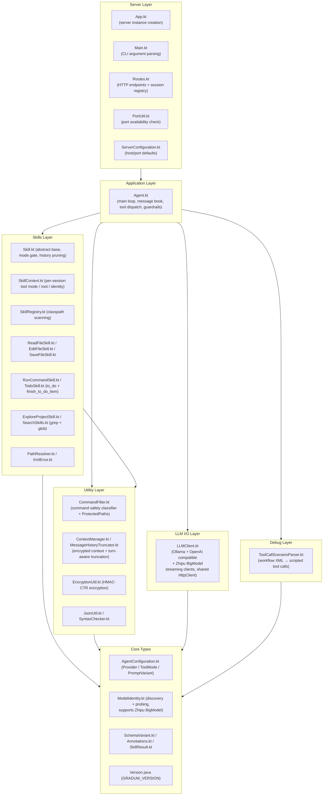
```mermaid
flowchart TB
    subgraph SERVER["Server Layer"]
        direction LR
        S1["App.kt<br/>(server instance creation)"]
        S2["Main.kt<br/>(CLI argument parsing)"]
        S3["Routes.kt<br/>(HTTP endpoints + session registry)"]
        S4["PortUtil.kt<br/>(port availability check)"]
        S5["ServerConfiguration.kt<br/>(host/port defaults)"]
    end

    subgraph APP["Application Layer"]
        A1["Agent.kt<br/>(main loop, message book, tool dispatch, guardrails)"]
    end

    subgraph LLM["LLM I/O Layer"]
        L1["LLMClient.kt<br/>(Ollama + OpenAI compatible<br/>+ Zhipu BigModel<br/>streaming clients, shared HttpClient)"]
    end

    subgraph DEBUG["Debug Layer"]
        D1["ToolCallScenarioParser.kt<br/>(workflow XML → scripted tool calls)"]
    end

    subgraph SKILLS["Skills Layer"]
        SK1["Skill.kt (abstract base, mode gate, history pruning)"]
        SK2["SkillContext.kt (per-session tool mode / root / identity)"]
        SK3["SkillRegistry.kt (classpath scanning)"]
        SK4["ReadFileSkill.kt / EditFileSkill.kt / SaveFileSkill.kt"]
        SK5["RunCommandSkill.kt / TodoSkill.kt (to_do + finish_to_do_item)"]
        SK6["ExploreProjectSkill.kt / SearchSkills.kt (grep + glob)"]
        SK7["PathResolver.kt / XmlError.kt"]
    end

    subgraph UTIL["Utility Layer"]
        U1["CommandFilter.kt<br/>(command safety classifier + ProtectedPaths)"]
        U2["ContextManager.kt / MessageHistoryTruncator.kt<br/>(encrypted context + turn-aware truncation)"]
        U3["EncryptionUtil.kt (HMAC-CTR encryption)"]
        U4["JsonUtil.kt / SyntaxChecker.kt"]
    end

    subgraph CORE["Core Types"]
        C1["AgentConfiguration.kt (Provider / ToolMode / PromptVariant)"]
        C2["ModelIdentity.kt (discovery + probing,<br/>supports Zhipu BigModel)"]
        C3["SchemaVariant.kt / Annotations.kt / SkillResult.kt"]
        C4["Version.java (GRADUM_VERSION)"]
    end

    SERVER --> APP
    APP --> LLM
    APP --> DEBUG
    APP --> SKILLS
    APP --> UTIL
    SKILLS --> UTIL
    SKILLS --> CORE
    UTIL --> CORE
    LLM --> CORE
    DEBUG --> CORE
```

### 2.2 Module Dependency Invariants

These invariants are core architectural constraints:

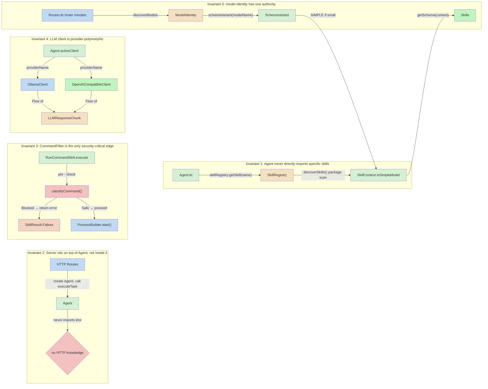
```mermaid
flowchart LR
    subgraph INV1["Invariant 1: Agent never directly imports specific skills"]
        direction TB
        A[Agent.kt] -->|" skillRegistry.getSkill(name) "| SR[SkillRegistry]
        SR -->|" discoverSkills() package scan "| SK[Skills]
        style A fill: #d4f1d4
        style SR fill: #f4e1c1
        style SK fill: #c1daf4
    end

    subgraph INV2["Invariant 2: Server sits on top of Agent, not inside it"]
        direction TB
        HTTP[HTTP Routes] -->|create Agent, call executeTask| AG[Agent]
        AG -->|never imports ktor| X{no HTTP knowledge}
        style HTTP fill: #c1daf4
        style AG fill: #d4f1d4
        style X fill: #f4c1c1
    end

    subgraph INV3["Invariant 3: CommandFilter is the only security-critical edge"]
        direction TB
        RC["RunCommandSkill.execute"] -->|pre - check| CF["classifyCommand()"]
        CF -->|Blocked → return error| E["SkillResult.Failure"]
        CF -->|Safe → proceed| PB["ProcessBuilder.start()"]
        style RC fill: #d4f1d4
        style CF fill: #f4c1c1
        style E fill: #f4d4c1
        style PB fill: #c1daf4
    end

    subgraph INV4["Invariant 4: LLM client is provider-polymorphic"]
        direction TB
        AG2[Agent.activeClient] -->|providerName| OL[OllamaClient]
        AG2 -->|providerName| OA[OpenAICompatibleClient]
        OL -->|Flow of| CH[LLMResponseChunk]
        OA -->|Flow of| CH
        style AG2 fill: #d4f1d4
        style OL fill: #c1daf4
        style OA fill: #c1f4c1
        style CH fill: #f4e1c1
    end

    subgraph INV5["Invariant 5: model identity has one authority"]
        direction TB
        R["Routes.kt /main /models"] -->|"discoverModels"| MI[ModelIdentity]
        MI -->|"schemaVariant(modelName)"| SC[SchemaVariant]
        SC -->|"SIMPLE if small"| SK[SkillContext.isSimpleModel]
        SK -->|"getSchema(context)"| S[Skills]
        style R fill: #c1daf4
        style MI fill: #f4e1c1
        style SC fill: #d4f1d4
        style SK fill: #d4f1d4
        style S fill: #c1f4c1
    end
```

### 2.3 Project Layout

```
src/main/kotlin/gradum/
├── AgentConfiguration.kt       # Provider / ToolMode / PromptVariant enums + AgentConfiguration data class
├── Annotations.kt              # @ExperimentalApi, @DangerousOperation compile-time annotations
├── ModelIdentity.kt            # Single model-lifecycle authority: Discovery + capability + probe
├── SchemaVariant.kt            # FULL / SIMPLE schema variant (delegates to ModelIdentity.schemaVariant)
├── SkillResult.kt              # SkillResult sealed class + makeSuccess/makeFailure factories
│
├── agent/
│   └── Agent.kt                # Agent main class: main loop, guardrails, tool dispatch, debug playback, emitEvent
│
├── client/
│   └── LLMClient.kt            # OllamaClient + OpenAICompatibleClient + shared HttpClient + ToolCallEntry
│
├── debug/
│   └── ToolCallScenarioParser.kt # Tool-call debug playback: parse <tls> XML into scripted tool calls
│
├── server/
│   ├── App.kt                  # createServerInstance() + Application.module() assembly
│   ├── Main.kt                 # main() + CLI argument parsing + printUsage()
│   ├── Routes.kt               # /events, /stop, /health, /models, /skills, /provider/probe + ConfigOverrides
│   ├── PortUtil.kt             # isPortAvailable() + findAvailablePort()
│   ├── ServerConfiguration.kt  # Server configuration data class (host/port defaults)
│
├── skill/
│   ├── Skill.kt                # Skill abstract base: allows(toolMode), schema builder, history pruning hooks
│   ├── SkillContext.kt         # Per-session context: (toolMode, projectRoot, provider, modelName) + isSimpleModel
│   ├── SkillRegistry.kt        # Classpath scanning registry (discoverSkills, getSchemas, getSkill)
│   ├── XmlError.kt             # Shared XML error format (buildXmlError)
│   ├── PathResolver.kt         # resolveProjectPath: LLM path → on-disk path with basename autocorrection
│   ├── ReadFileSkill.kt        # read_file (line range / MD5 / size limits, SIMPLE vs FULL output)
│   ├── EditFileSkill.kt        # edit_file (local: single edit, cloud: batch edits, syntax check, concurrent lock)
│   ├── SaveFileSkill.kt        # save_file (overwrite / append, encoding, protected-path guard)
│   ├── RunCommandSkill.kt      # run_cmd (blocking/detached + CommandFilter + project cwd)
│   ├── ExploreProjectSkill.kt  # explore_project (tree scan → categorized file lists, depth 5..14)
│   ├── SearchSkills.kt         # grep + glob (content regex search, glob path matcher)
│   ├── TodoSkill.kt            # TodoManager singleton + to_do + finish_to_do_item
│   └── WebSearchSkill.kt       # search_web (Tavily API, requires TAVILY_API_KEY env var)
│
└── util/
    ├── CommandFilter.kt        # classifyCommand() + read-only whitelist + ProtectedPaths
    ├── ContextManager.kt       # Encrypted context read/write (project-root .gradum) + history cleanup
    ├── EncryptionUtil.kt       # encryptMessageContent() + decryptMessageContent() + HMAC-CTR
    ├── JsonUtil.kt             # Any↔JsonElement codecs (encodeMap / decodeMap / toJsonElement / fromJsonElement)
    ├── MessageHistoryTruncator.kt # MAX_HISTORY_MESSAGES + turn-aware takeLastTurns()
    └── SyntaxChecker.kt        # Compiler-output → SyntaxIssue parsing (per-language parsers)

src/main/java/gradum/Version.java     # GRADUM_VERSION constant

src/main/resources/
├── logback.xml                    # Logback logging configuration (Console + per-module levels)
├── red_line_keywords.txt          # Red line keywords (user-local, gitignored)
├── META-INF/services/             # Reserved (empty); skills are discovered by classpath scan
└── prompts/                       # System and mode prompts, loaded from classpath at runtime
    ├── system/
    │   ├── local.xml              # System prompt for local models ({{OS}} / {{MODE}} / {{SCHEMA_VARIANT}})
    │   └── cloud.xml              # System prompt for cloud models
    └── modes/
        ├── agent.xml              # Agent mode (full capabilities)
        ├── edit.xml               # Edit mode (focused editing, no task planning)
        └── read_only.xml          # Read-only mode (inspection only)

<projectRoot>/.gradum/             # Generated at runtime inside the user's project
├── context.json                   # Legacy/default-session context (blank sessionId fallback)
├── run_cmd/{timestamp}.log        # Detached-mode command logs
├── recordings/{scenario}.json     # Debug tool-call playback recordings
└── sessions/{sessionId}/          # One conversation = one directory
    ├── conversation.md            # Plugin · structured Markdown transcript (read/write)
    └── context.json               # Server · this session's model context
```

**Session path rule (server and plugin MUST agree — see `docs/CHAT_HISTORY_PLAN.md §1`):**

```
sessionDir(projectRoot, sessionId) = <projectRoot>/.gradum/sessions/<sessionId>
```

- `sessionId` is a client-generated `yyyyMMdd-HHmmss-xxxxxx` id sent in every
  `POST /events` request of the same chat thread. The `ContextManager`
  (`contextOutputDirectory` in `Agent.kt`) writes that session's context to
  `.gradum/sessions/<sessionId>/context.json`, so switching conversation switches model memory and "New Chat" (a fresh
  id) genuinely forgets.
- A blank/`null` `sessionId` falls back to the legacy
  `<projectRoot>/.gradum/context.json` for old-clients compatibility.
- The plugin persists a full-detail transcript per session (`ChatSessionStore` + `ChatTranscript`) that restores the
  exact bubble UI (thinking, tool calls + results, errors, token usage).
- `POST /session/delete` removes a whole session directory on the server (path-traversal guarded); the plugin cascades
  locally first.

### 2.4 Runtime Data Flow (End-to-End)

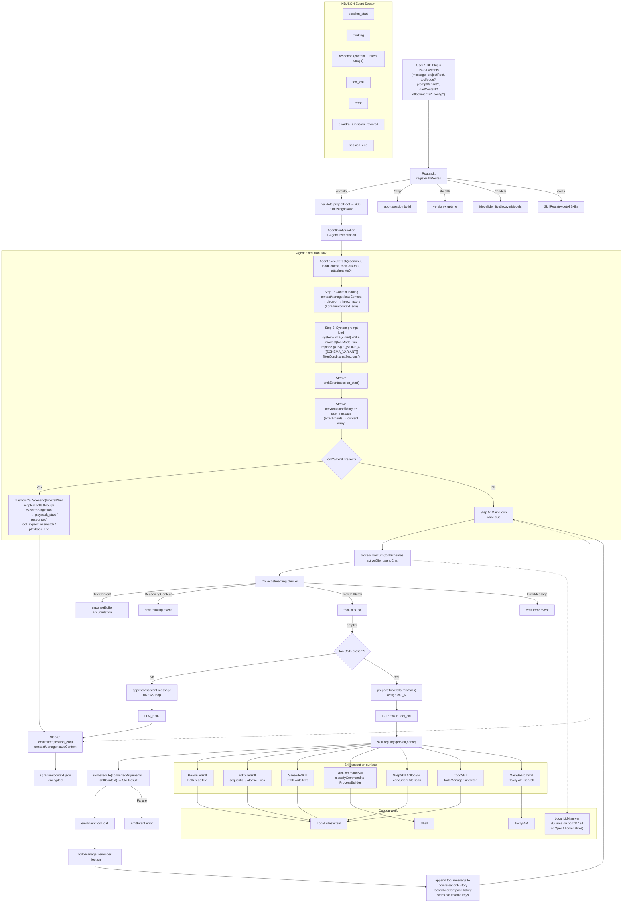
```mermaid
flowchart TD
    U["User / IDE Plugin<br/>POST /events<br/>{message, projectRoot, toolMode?,<br/>promptVariant?, loadContext?,<br/>attachments?, config?}"] --> R[Routes.kt<br/>registerAllRoutes]
    R -->|"/events"| REQ[validate projectRoot → 400 if missing/invalid]
    REQ --> R1["AgentConfiguration<br/>+ Agent instantiation"]
    R -->|"/stop"| STOPS[abort session by id]
    R -->|"/health"| H2[version + uptime]
    R -->|"/models"| M2[ModelIdentity.discoverModels]
    R -->|"/skills"| S2[SkillRegistry.getAllSkills]
    R1 --> A["Agent.executeTask(userInput, loadContext, toolCallXml?, attachments?)"]

    subgraph AGENT_FLOW["Agent execution flow"]
        A --> C1["Step 1: Context loading<br/>contextManager.loadContext → decrypt → inject history<br/>(<projectRoot>/.gradum/context.json)"]
        C1 --> C2["Step 2: System prompt<br/>load system/{local,cloud}.xml + modes/{toolMode}.xml<br/>replace {{OS}} / {{MODE}} / {{SCHEMA_VARIANT}}<br/>filterConditionalSections()"]
        C2 --> C3["Step 3: emitEvent(session_start)"]
        C3 --> C4["Step 4: conversationHistory += user message<br/>(attachments → content array)"]
        C4 --> SCENARIO{"toolCallXml present?"}
        SCENARIO -->|Yes| PLAY["playToolCallScenario(toolCallXml)<br/>scripted calls through executeSingleTool"
            → playback_start / response / tool_expect_mismatch / playback_end]
        SCENARIO -->|No| LOOP[Step 5: Main Loop<br/>while true]
    end

    LOOP --> LLM["processLlmTurn(toolSchemas)<br/>activeClient.sendChat"]
    LLM --> CHUNK[Collect streaming chunks]
    CHUNK -->|TextContent| RESP[responseBuffer accumulation]
    CHUNK -->|ReasoningContent| THINK[emit thinking event]
    CHUNK -->|ToolCallBatch| TCBATCH[toolCalls list]
    CHUNK -->|ErrorMessage| ERREV[emit error event]
    TCBATCH -->|empty?| BRANCH{"toolCalls present?"}
    BRANCH -->|No| NO_TOOL[append assistant message<br/>BREAK loop]
    BRANCH -->|Yes| PREP["prepareToolCalls(rawCalls)<br/>assign call_N"]
    PREP --> FOR[FOR EACH tool_call]
    FOR --> GS["skillRegistry.getSkill(name)"]
    GS --> EX["skill.execute(convertedArguments, skillContext) → SkillResult"]
    EX --> EMIT[emitEvent tool_call]
    EX -->|Failure| EMITERR[emitEvent error]
    EMIT --> REM[TodoManager reminder injection]
    REM --> APPENDA[append tool message to conversationHistory<br/>recordAndCompactHistory strips old volatile keys]
    APPENDA --> LOOP
    PLAY --> END["Step 6: emitEvent(session_end)<br/>contextManager.saveContext"]
    NO_TOOL -.-> LLM_END
    LLM_END --> END
    LOOP -.-> END
    LLM -.-> LLM_SRV["Local LLM server<br/>(Ollama on port 11434<br/>or OpenAI compatible)"]

    subgraph EVENT_STREAM["NDJSON Event Stream"]
        direction LR
        EV1[session_start]
        EV2[thinking]
        EV3["response (content + token usage)"]
        EV4[tool_call]
        EV5[error]
        EV6[guardrail / mission_revoked]
        EV7[session_end]
    end

    subgraph SKILL_EXEC["Skill execution surface"]
        SK_RD[ReadFileSkill<br/>Path.readText]
        SK_ED[EditFileSkill<br/>sequential / atomic / lock]
        SK_SV[SaveFileSkill<br/>Path.writeText]
        SK_RC[RunCommandSkill<br/>classifyCommand to ProcessBuilder]
        SK_GP[GrepSkill / GlobSkill<br/>concurrent file scan]
        SK_TD[TodoSkill<br/>TodoManager singleton]
        SK_WS[WebSearchSkill<br/>Tavily API search]
    end

    GS --> SK_RD
    GS --> SK_ED
    GS --> SK_SV
    GS --> SK_RC
    GS --> SK_GP
    GS --> SK_TD
    GS --> SK_WS

    subgraph OUTSIDE["Outside world"]
        FS[Local Filesystem]
        SH[Shell]
        LLM_SRV
        TAVILY[Tavily API]
    end

    SK_RD --> FS
    SK_ED --> FS
    SK_SV --> FS
    SK_RC --> SH
    SK_GP --> FS
    SK_TD --> FS
    SK_WS --> TAVILY
    END --> OUT["<projectRoot>/.gradum/context.json<br/>encrypted"]
```

### 2.5 Agent Main Loop Details

The precise flow of `Agent.executeTask(userInput, loadPreviousContext)`:


```mermaid
flowchart TD
    START([executeTask called]) --> INIT
    INIT[Initialize] --> CTX{loadPreviousContext?}
    CTX -- Yes --> LOAD_CTX["contextManager.loadContext()<br/>decrypt → inject conversationHistory"]
    CTX -- No --> PROMPT
    LOAD_CTX --> PROMPT["Build system prompt:<br/>system/{local,cloud}.xml (by promptVariant)<br/>+ modes/{agent,edit,read_only}.xml (by toolMode)<br/>replace {{OS}} / {{MODE}} / {{SCHEMA_VARIANT}}<br/>filterConditionalSections()"]
    PROMPT --> SCENARIO{"toolCallXml present?"}
    SCENARIO -- Yes --> PLAY["playToolCallScenario()<br/>scripted calls through the real pipeline"]
    PLAY --> END_PLAY["finishSession()"]
    SCENARIO -- No --> EMIT_START["emitEvent(session_start)<br/>{version, model, think, contextLoaded, contextMessages}"]
    EMIT_START --> ADD_USER["conversationHistory += user message<br/>(attachments → content array)"]
    ADD_USER --> LLM_CALL["processLlmTurn(toolSchemas)"]
    LLM_CALL --> CHUNK_STREAM["Collect Flow of LLMResponseChunk:"]
    CHUNK_STREAM --> TEXT["TextContent → accumulate in responseBuffer"]
    CHUNK_STREAM --> THINK["ReasoningContent → emit thinking event"]
    CHUNK_STREAM --> TOOL["ToolCallBatch → save as toolCalls List"]
    CHUNK_STREAM --> ERR_MSG["ErrorMessage → emit error event"]
    CHUNK_STREAM --> RESP["emit response event<br/>{content + token usage}"]
    TOOL --> GUARDRAIL["Guardrail Checks<br/>redLineKeywords?<br/>repetitive_loop?<br/>tool_runaway?"]
    GUARDRAIL --> REDLINE{Red line keyword hit?}
    REDLINE -- No --> REPLOOP{Repetitive response?}
    REDLINE -- Yes --> REDLINE_COUNT["increment redLineHitCounter<br/>emit guardrail event"]
    REDLINE_COUNT --> REDLINE_CHECK{"hits >= maxRedLineHits?"}
    REDLINE_CHECK -- No --> REPLOOP
    REDLINE_CHECK -- Yes --> REDLINE_REVOKE["append assistant message<br/>emitEvent mission_revoked (red_line_violation)<br/>emitEvent session_end (aborted)<br/>BREAK loop"]
    REPLOOP -- No --> DECISION{"toolCalls present and non-empty?"}
    REPLOOP -- Yes --> REP_COUNT["add to repeatedResponseTracker<br/>emit guardrail event"]
    REP_COUNT --> REP_CHECK{"count >= maxRepeatedResponses?"}
    REP_CHECK -- No --> DECISION
    REP_CHECK -- Yes --> REP_REVOKE["append assistant message<br/>emitEvent mission_revoked (repetitive_loop)<br/>emitEvent session_end (aborted)<br/>BREAK loop"]
    DECISION -- No --> HAS_RESPONSE{responseText non-empty?}
    HAS_RESPONSE -- Yes --> APPEND_ASSISTANT_NO_TOOL["append assistant message<br/>BREAK loop"]
    HAS_RESPONSE -- No --> LLM_CALL
    DECISION -- Yes --> PREP["prepareToolCalls(rawCalls)<br/>assign call_N sequence IDs"]
    PREP --> APPEND_ASSISTANT["append assistant message<br/>(including tool_calls[])"]
    APPEND_ASSISTANT --> FOR_EACH["FOR EACH processedCall"]
    FOR_EACH --> RUNAWAY{checkToolRunaway?<br/>same signature >= maxRepeatedToolCalls}
    RUNAWAY -- Yes --> RUN_REVOKE["emitEvent mission_revoked (tool_runaway)<br/>abortSession()"]
    RUNAWAY -- No --> GUARD_RC["READ_ONLY run_cmd?<br/>re-classify with read-only whitelist"]
    GUARD_RC -- Blocked --> RC_BLOCK["emit tool_call + error (COMMAND_BLOCKED)"]
    GUARD_RC -- Pass --> GET_SKILL["skillRegistry.getSkill(name)"]
    GET_SKILL --> MODE_GATE{"skill.allows(toolMode)?"}
    MODE_GATE -- No --> PERM_DENIED["return TOOL_NOT_PERMITTED"]
    MODE_GATE -- Yes --> CONVERT_ARGS["functionArguments Map<JsonElement><br/>→ Map<String, Any> + inject projectRoot"]
    CONVERT_ARGS --> EXECUTE["skill.execute(convertedArguments, skillContext)"]
    EXECUTE --> MAP_RESULT["SkillResult → Map<br/>{success, ...result/error}"]
    MAP_RESULT --> EMIT_TOOL["emitEvent tool_call<br/>{tool, alias, arguments, toolCallId, success, result}"]
    EMIT_TOOL --> ERR_CHECK{success == false?}
    ERR_CHECK -- Yes --> EMIT_ERR["emitEvent error<br/>{code, message, tool, toolCallId}"]
    ERR_CHECK -- No --> TODO_REM
    EMIT_ERR --> TODO_REM["recordAndCompactHistory(result) → strips old volatile keys<br/>TodoManager.getTaskReminder() appended to tail"]
    TODO_REM --> PROV_FORMAT["provider format<br/>OpenAI: tool_call_id + role=tool<br/>Ollama: role=tool + content"]
    PROV_FORMAT --> APPEND_TOOL["append tool message to conversationHistory"]
    APPEND_TOOL --> FOR_EACH
    FOR_EACH --> MORE{More tool calls?}
    MORE -- Yes --> FOR_EACH
    MORE -- No --> LLM_CALL
    APPEND_ASSISTANT_NO_TOOL --> END_SESSION["emitEvent session_end<br/>{version, elapsedSeconds, model, tokenUsage}"]
    RUN_REVOKE --> END_SESSION
    END_PLAY --> END_SESSION
    END_SESSION --> SAVE_CTX["contextManager.saveContext(history, model)<br/>(skipped when aborted)"]
    SAVE_CTX --> WRITE_FILE["filter system/tool messages<br/>encrypt user/assistant content<br/>write to <projectRoot>/.gradum/context.json<br/>turn-aware truncation to most recent 30 messages"]
    WRITE_FILE --> DONE([Agent finished])
    style START fill: #d4f1d4
    style DONE fill: #f4c1c1
```

1. **Initialization**:
    - If `loadPreviousContext=true`, call `contextManager.loadContext()`, decrypt, and inject into `conversationHistory`
    - Build the system prompt by joining two classpath resources, then substituting placeholders:
        - The system variant (`/prompts/system/local.xml` or `/prompts/system/cloud.xml`, chosen by `PromptVariant`)
        - The mode section (`/prompts/modes/agent.xml` / `edit.xml` / `read_only.xml`, chosen by `ToolMode`)
        - Replace `{{OS}}` with `os.name + " " + os.version`, `{{MODE}}` with the mode section, and
          `{{SCHEMA_VARIANT}}` with `FULL` / `SIMPLE`
        - `filterConditionalSections()` keeps only the `<!-- if FULL -->` / `<!-- if SIMPLE -->` blocks that match the
          active variant
    - Insert the system prompt as a `role="system"` message into the conversation history
    - Emit a `session_start` event: `{version, model, think, contextLoaded, contextMessages}`
    - If `toolCallXml` was provided, parse the `<tls>` scenario and replay its tool calls through the real
      `executeSingleTool` pipeline (`playToolCallScenario`); the LLM is never contacted.

2. **Main Loop** (`while true`):
    - Call `processLlmTurn(toolSchemas)`, which returns `AgentTurnResult(responseText, toolCalls, errorMessage)`
    - Collect streaming chunks from activeClient (determined by `providerName` — Ollama or OpenAI):
        - `TextContent` → accumulate into responseBuffer
        - `ReasoningContent` → accumulate as thinking, **immediately emit a `thinking` event** (if there is content)
        - `ToolCallBatch` → save as `toolCalls: List<ToolCallEntry>`
        - `ErrorMessage` → emit an `error` event
        - On flush, emit a `response` event `{content, promptTokens, completionTokens, totalTokens}`
    - **Guardrail checks** are evaluated against `responseText` before processing tool calls:
        - **Red line keyword check**: If the response contains any configured `redLineKeywords`, increment
          `redLineHitCounter`. When the counter reaches `maxRedLineHits` (default 3), append the assistant message, emit
          `mission_revoked` (reason: `red_line_violation`), emit `session_end` with `aborted: true`, and **BREAK**.
        - **Repetitive response check**: If the response is an exact duplicate of the previous turn or contains
          repetitious sentences (same sentence ≥3 times), it is added to `repeatedResponseTracker`. When the tracker
          reaches `maxRepeatedResponses` (default 3), append the assistant message, emit `mission_revoked` (reason:
          `repetitive_loop`), emit `session_end` with `aborted: true`, and **BREAK**.
        - Non-anomalous responses clear the repetitive tracker.
    - If `toolCalls == null or empty` and has responseText: append the assistant message, **BREAK the loop**.
    - Otherwise, there are tool calls:
    - `prepareToolCalls(rawCalls)`: allocate `call_N` sequences for items without call_id
    - Append the assistant message (including `tool_calls[]` or function list)
    - **FOR each processedCall**:
        - **Tool-runaway guard**: `checkToolRunaway(name, args)` — if the same call signature repeats ≥
          `maxRepeatedToolCalls` (default 5), emit `mission_revoked` (`tool_runaway`) and abort the session.
        - **Read-only re-check**: under `READ_ONLY`, `run_cmd` commands are re-classified against the read-only
          executable whitelist; blocked commands emit a `COMMAND_BLOCKED` tool error.
        - Get the skill via `skillRegistry.getSkill(name)`, then enforce the mode gate: `skill.allows(toolMode)` fails
          with `TOOL_NOT_PERMITTED`.
        - Convert raw `functionArguments: Map<String, JsonElement>` to `MutableMap<String, Any>`
          (strings/booleans/numbers)
        - Remove any `projectRoot` keys the LLM injected, then inject the session's validated project root
        - Call `skill.execute(convertedArguments, skillContext)` → `SkillResult`
        - Map to `Map { success, ...result fields or error }`
        - Emit a `tool_call` event: `{tool, alias, arguments, toolCallId, success, result}`
        - If `success=false`: emit an `error` event: `{code, message, tool, toolCallId}`
        - **History pruning**: `recordAndCompactHistory(result)` strips the skill's `historyVolatileKeys` from its older
          tool messages in-place and returns the current result to store
        - **Todo Reminder Injection**: Call `getTodoManagerInstance().getTaskReminder()`, and if not null, append the
          reminder text to the tool result tail (only after the last tool call of the turn)
        - Determine the tool message format based on provider (OpenAI: `tool_call_id` + `role="tool"`; Ollama: direct
          content)
        - Append the tool message to conversationHistory

3. **Session End**:
    - Emit `session_end`: `{version, elapsedSeconds, model, tokenUsage}` (with `aborted: true` when terminated by
      guardrail or the `/stop` route)
    - `contextManager.saveContext(history, model)` — **skipped** when `aborted: true` (revoked sessions leave no trace)
        - Filter system/empty-assistant messages and collapse tool messages (keeping only `read_file` /
          `explore_project`
          tool calls and their results)
        - Encrypt the content field of each user/assistant message (set `_encrypted=true`)
        - Write to `<projectRoot>/.gradum/context.json`, truncated turn-aware to the most recent 30 messages
          (`takeLastTurns`)

### 2.6 NDJSON Event Stream

Each event is one line of JSON. The sequence diagram below shows the complete event lifecycle:

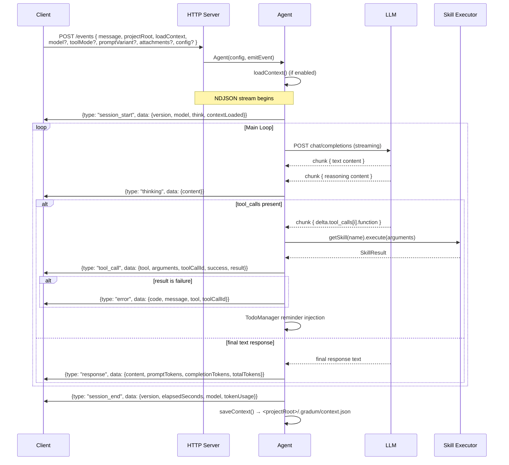
```mermaid
sequenceDiagram
    participant Client
    participant Server as HTTP Server
    participant Agent
    participant LLM
    participant Skill as Skill Executor
    Client ->> Server: POST /events { message, projectRoot, loadContext,<br/>model?, toolMode?, promptVariant?, attachments?, config? }
    Server ->> Agent: Agent(config, emitEvent)
    Agent ->> Agent: loadContext() (if enabled)
    Note over Agent, Server: NDJSON stream begins
    Agent ->> Client: {type: "session_start", data: {version, model, think, contextLoaded}}

    loop Main Loop
        Agent ->> LLM: POST chat/completions (streaming)
        LLM -->> Agent: chunk { text content }
        LLM -->> Agent: chunk { reasoning content }
        Agent ->> Client: {type: "thinking", data: {content}}

        alt tool_calls present
            LLM -->> Agent: chunk { delta.tool_calls[i].function }
            Agent ->> Skill: getSkill(name).execute(arguments)
            Skill -->> Agent: SkillResult
            Agent ->> Client: {type: "tool_call", data: {tool, arguments, toolCallId, success, result}}
            alt result is failure
                Agent ->> Client: {type: "error", data: {code, message, tool, toolCallId}}
            end
            Agent ->> Agent: TodoManager reminder injection
        else final text response
            LLM -->> Agent: final response text
            Agent ->> Client: {type: "response", data: {content, promptTokens, completionTokens, totalTokens}}
        end
    end

    Agent ->> Client: {type: "session_end", data: {version, elapsedSeconds, model, tokenUsage}}
    Agent ->> Agent: saveContext() → <projectRoot>/.gradum/context.json
```

#### Event Type Summary

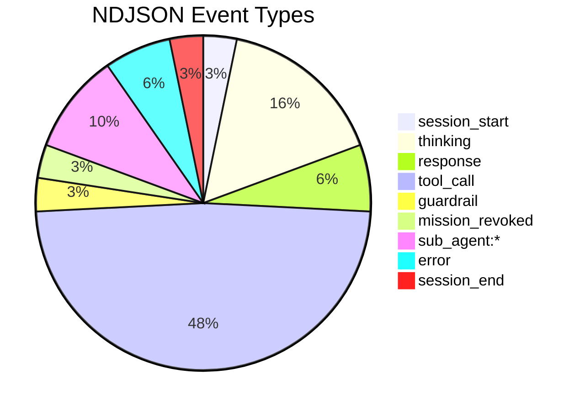
```mermaid
pie
    title NDJSON Event Types
    "session_start": 1
    "thinking": 5
    "response": 2
    "tool_call": 15
    "guardrail": 1
    "mission_revoked": 1
    "sub_agent:*": 3
    "error": 2
    "session_end": 1
```

| `type`                 | Description                                   | Typical `data` fields                                                                     |
|------------------------|-----------------------------------------------|-------------------------------------------------------------------------------------------|
| `session_start`        | Session started                               | `version`, `model`, `think`, `contextLoaded`, `contextMessages`                           |
| `thinking`             | LLM thinking content (if thinking is enabled) | `content`                                                                                 |
| `response`             | LLM text output with token usage              | `content`, `promptTokens`, `completionTokens`, `totalTokens`                              |
| `guardrail`            | Guardrail warning (non-fatal anomaly)         | `type` (repeated_response / red_line_hit), `hitCount`, `maxAllowed` + per-type details    |
| `mission_revoked`      | Session revoked (conversation must be erased) | `reason` (red_line_violation / repetitive_loop / tool_runaway), `details`                 |
| `tool_call_start`     | A tool call started (before execution)            | `tool`, `alias`, `arguments`, `toolCallId`                                                |
| `tool_call`            | A single tool call and its result             | `tool`, `alias`, `arguments`, `toolCallId`, `success`, `result`                           |
| `sub_agent:start`      | Sub-agent session started                     | `task`, `toolMode`, `sessionId`                                                           |
| `sub_agent:response`   | Sub-agent LLM response chunk                  | `content`                                                                                 |
| `sub_agent:tool_call`  | Sub-agent tool call and result                | `tool`, `alias`, `arguments`, `toolCallId`, `success`, `result`                           |
| `sub_agent:error`      | Sub-agent error                               | `code`, `message`, `sessionId`                                                            |
| `sub_agent:session_end`| Sub-agent session ended                       | `sessionId`, `elapsedSeconds`, `result`, `error`                                          |
| `error`                | Error (LLM or tool)                           | `code`, `message`, `source` (LLM) or `tool`+`toolCallId` (tool)                           |
| `playback_start`       | Debug scenario started                        | `mode`, `scenario`, `steps`, `toolCalls`                                                  |
| `tool_expect_mismatch` | Debug scenario assertion failure              | `tool`, `index`, `expectSuccess`, `actualSuccess`, `result`, `errorCode`, `errorMessage`  |
| `playback_end`         | Debug scenario finished                       | `scenario`, `executedCalls`, `mismatchCount`                                              |
| `session_end`          | Session ended                                 | `version`, `elapsedSeconds`, `model`, `tokenUsage: {promptTokens, completionTokens, ...}` |

#### Event Order Invariants

- `session_start` is always the first event after `conversationHistory`
- `tool_call_start` is emitted before the blocking skill runs; its matching `tool_call` (same `toolCallId`) follows after execution
- `tool_call` events are emitted in the order of the `tool_calls[]` returned by the LLM
- `sub_agent:*` events are emitted by `DelegateSkill` during sub-agent execution, interleaved with the parent agent's `tool_call`/`response`/`error` events
- `sub_agent:start` is always the first sub-agent event for a given session; `sub_agent:session_end` is always the last
- `sub_agent:session_end` carries the `result` (on success) or `error` (on failure) from the sub-agent
- `response` events (with token usage) are flushed as text accumulates during streaming
- `session_end` is always the final event (with `aborted: true` when terminated by guardrail or `/stop`)
- `mission_revoked` is always immediately followed by `session_end` (aborted), then stream end
- `guardrail` events are emitted **per violation** before the final `mission_revoked` (if multiple violations)
- `playback_start` → `tool_call` / `response` / `tool_expect_mismatch` → `playback_end` is the debug scenario lifecycle
- `emitEvent` is fire-and-forget: an HTTP client disconnect doesn't affect Agent execution

#### `tool_call.result` Fields by Skill

| Skill                  | Result Fields                                                                                                                                |
|------------------------|----------------------------------------------------------------------------------------------------------------------------------------------|
| **read_file**          | `{path, lineRange, totalLines, contentHashShort, content}` (FULL); `{path, content: {lineNumber: lineText}}` (SIMPLE)                        |
| **edit_file**          | `{path, editsApplied, totalEdits, linesAdded, linesRemoved}` (+ `syntaxErrors`); diff payloads stripped from history                         |
| **save_file**          | `{path, bytesWritten, totalLines, created, mode, encoding}` (+ `previousSize` on append)                                                     |
| **run_cmd** (blocking) | `{command, exitCode, output, timedOut}` (SIMPLE truncates output to 2000 chars; output stripped from old history)                            |
| **run_cmd** (detached) | `{command, detached, processId, logPath, message}`                                                                                           |
| **explore_project**    | `{project_root, depth, total_size, config_files, code_files, other_files}` (lists collapse to counts in old history)                         |
| **grep**               | `{pattern, search_path, total_matches, matches: [{file, line, content}], files_searched, limit_applied}` (matches stripped from old history) |
| **glob**               | `{pattern, search_path, total_files, files: [relative paths], limit_applied}` (files stripped from old history)                              |
| **to_do**              | `{totalTasks, currentTask, currentIndex}`                                                                                                    |
| **finish_to_do_item**  | `{completed, totalTasks, currentTask?}`                                                                                                      |

### 2.7 LLM Client Protocol Comparison

The Agent handles provider branching at two key points:

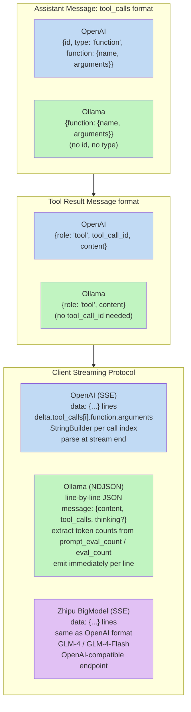
```mermaid
flowchart TB
    subgraph ASSISTANT["Assistant Message: tool_calls format"]
        OAI1["OpenAI<br/>{id, type: 'function', function: {name, arguments}}"]
        OLL1["Ollama<br/>{function: {name, arguments}}<br/>(no id, no type)"]
    end

    subgraph TOOL_MSG["Tool Result Message format"]
        OAI2["OpenAI<br/>{role: 'tool', tool_call_id, content}"]
        OLL2["Ollama<br/>{role: 'tool', content}<br/>(no tool_call_id needed)"]
    end

    subgraph STREAM["Client Streaming Protocol"]
        OAI3["OpenAI (SSE)<br/>data: {...} lines<br/>delta.tool_calls[i].function.arguments<br/>StringBuilder per call index<br/>parse at stream end"]
        OLL3["Ollama (NDJSON)<br/>line-by-line JSON<br/>message: {content, tool_calls, thinking?}<br/>extract token counts from prompt_eval_count / eval_count<br/>emit immediately per line"]
        ZP3["Zhipu BigModel (SSE)<br/>data: {...} lines<br/>same as OpenAI format<br/>GLM-4 / GLM-4-Flash<br/>OpenAI-compatible endpoint"]
    end

    ASSISTANT --> TOOL_MSG
    TOOL_MSG --> STREAM
    style OAI1 fill: #c1daf4
    style OAI2 fill: #c1daf4
    style OAI3 fill: #c1daf4
    style OLL1 fill: #c1f4c1
    style OLL2 fill: #c1f4c1
    style OLL3 fill: #c1f4c1
    style ZP3 fill: #e1c1f4
```

### 2.8 Context Persistence and Encryption

`ContextManager(outputDirectory)` maintains an encrypted conversation history file in
`<projectRoot>/.gradum/context.json`. The output directory is constructed per `Agent` from the validated
`configuration.projectRoot` — never the server's CWD, so a server launched from a developer workspace writes into the
user's open project.

#### Context Save and Load Flow

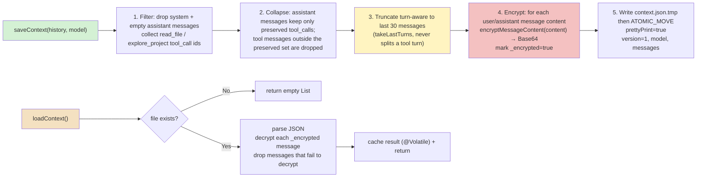
```mermaid
flowchart LR
    SAVE["saveContext(history, model)"] --> FILTER["1. Filter: drop system + empty assistant messages<br/>collect read_file / explore_project tool_call ids"]
    FILTER --> OPTIMIZE["2. Collapse: assistant messages keep only preserved tool_calls;<br/>tool messages outside the preserved set are dropped"]
    OPTIMIZE --> TRUNCATE["3. Truncate turn-aware to last 30 messages<br/>(takeLastTurns, never splits a tool turn)"]
    TRUNCATE --> ENCRYPT["4. Encrypt: for each user/assistant message content<br/>encryptMessageContent(content) → Base64<br/>mark _encrypted=true"]
    ENCRYPT --> WRITE["5. Write context.json.tmp then ATOMIC_MOVE<br/>prettyPrint=true<br/>version=1, model, messages"]
    LOAD["loadContext()"] --> FILE_EXISTS{file exists?}
    FILE_EXISTS -- No --> EMPTY[return empty List]
    FILE_EXISTS -- Yes --> PARSE["parse JSON<br/>decrypt each _encrypted message<br/>drop messages that fail to decrypt"]
    PARSE --> CACHE["cache result (@Volatile) + return"]
    style SAVE fill: #d4f1d4
    style LOAD fill: #f4e1c1
    style ENCRYPT fill: #f4c1c1
    style TRUNCATE fill: #fff4c1
```

#### Encryption Scheme Details

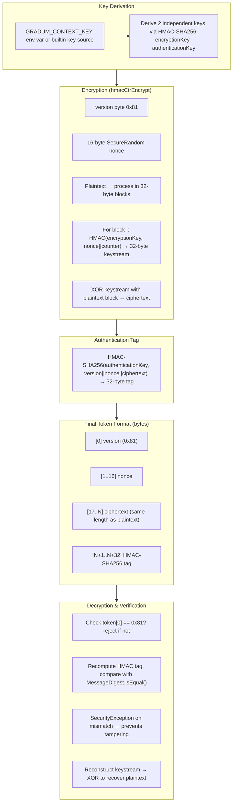
```mermaid
flowchart TD
    subgraph KEY["Key Derivation"]
        K1["GRADUM_CONTEXT_KEY env var or builtin key source"]
        K2["Derive 2 independent keys via HMAC-SHA256:<br/>encryptionKey, authenticationKey"]
        K1 --> K2
    end

    subgraph ENCRYPT["Encryption (hmacCtrEncrypt)"]
        V["version byte 0x81"]
        N["16-byte SecureRandom nonce"]
        P["Plaintext → process in 32-byte blocks"]
        H["For block i: HMAC(encryptionKey, nonce||counter) → 32-byte keystream"]
        X["XOR keystream with plaintext block → ciphertext"]
    end

    subgraph TAG["Authentication Tag"]
        T["HMAC-SHA256(authenticationKey, version||nonce||ciphertext) → 32-byte tag"]
    end

    subgraph FORMAT["Final Token Format (bytes)"]
        B0["[0] version (0x81)"]
        B1["[1..16] nonce"]
        B2["[17..N] ciphertext (same length as plaintext)"]
        B3["[N+1..N+32] HMAC-SHA256 tag"]
    end

    subgraph DECRYPT["Decryption & Verification"]
        D1["Check token[0] == 0x81? reject if not"]
        D2["Recompute HMAC tag, compare with MessageDigest.isEqual()"]
        D3["SecurityException on mismatch → prevents tampering"]
        D4["Reconstruct keystream → XOR to recover plaintext"]
    end

    KEY --> ENCRYPT
    ENCRYPT --> TAG
    TAG --> FORMAT
    FORMAT --> DECRYPT
```

- **Algorithm**: Custom **HMAC-CTR** stream encryption + **HMAC-SHA256** authentication tag
- **Key derivation**: Based on the `GRADUM_CONTEXT_KEY` environment variable or built-in key source; derive two
  independent keys for the two different purposes "encrypt" and "authenticate" using HMAC-SHA256
- **Encrypted token format** (by byte):
    - `[0]` — version byte (0x81, for future algorithm upgrade detection)
    - `[1..16]` — random nonce (generated by `SecureRandom`)
    - `[17..N]` — ciphertext (same length as plaintext)
    - `[N+1..N+32]` — HMAC-SHA256 authentication tag (covers version+nonce+ciphertext)
- **CTR mode implementation** (`hmacCtrEncrypt`):
    - Process plaintext in 32-byte blocks
    - For each block i, compute `HMAC(encryptionKey, nonce || counter_bytes)` → 32-byte keystream block
    - XOR byte-by-byte to mix with plaintext
- **Integrity check during decryption**: Recompute the tag first, compare against stored tag with
  `MessageDigest.isEqual()`, throw `SecurityException` on mismatch
- **Version byte check**: If `token[0] != 0x81`, reject decryption

The scheme guarantees:

1. Context files cannot be tampered with offline (HMAC tag verification)
2. Context content cannot be read offline (XOR encryption stream)
3. Algorithm can be upgraded (version byte)
4. Zero external encryption library dependencies — entirely based on the Java standard library `javax.crypto.Mac`

### 2.9 Model Identity: Discovery, Probing, and Capability

All model lifecycle concerns live in a single authority — `ModelIdentity.kt` — split into the private `Discovery` inner
object plus the capability inference used for schema variant resolution.

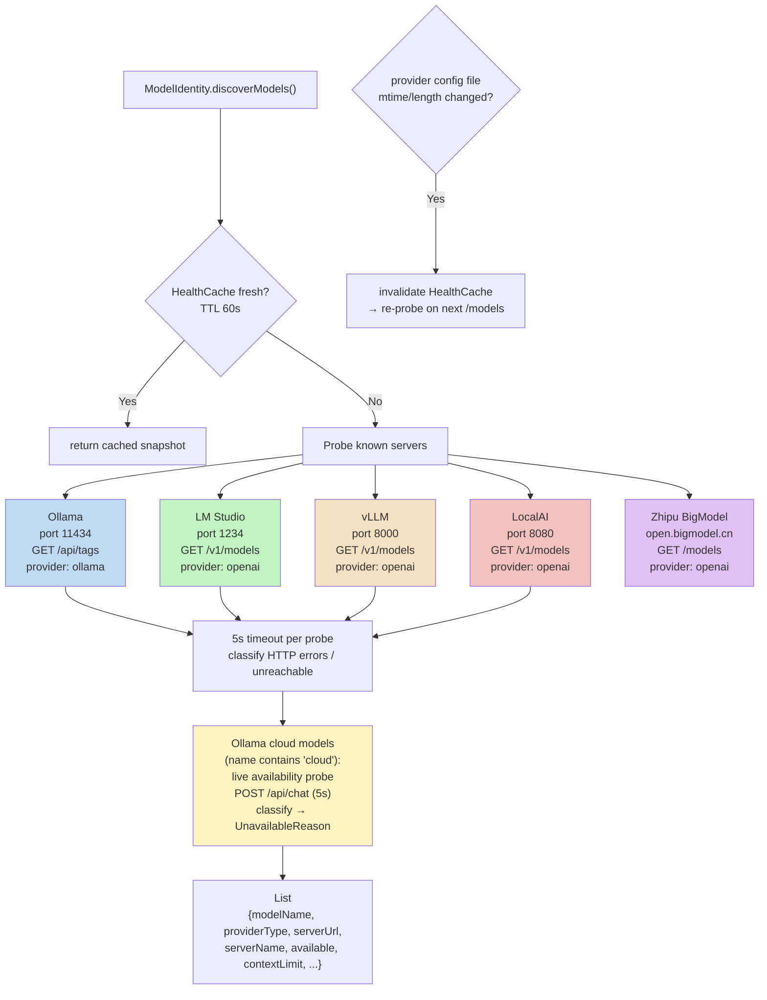
```mermaid
flowchart TD
    START["ModelIdentity.discoverModels()"] --> CACHE{HealthCache fresh?<br/>TTL 60s}
    CACHE -- Yes --> CACHED["return cached snapshot"]
    CACHE -- No --> PROBE[Probe known servers]
    PROBE --> P1[Ollama<br/>port 11434<br/>GET /api/tags<br/>provider: ollama]
    PROBE --> P2[LM Studio<br/>port 1234<br/>GET /v1/models<br/>provider: openai]
    PROBE --> P3[vLLM<br/>port 8000<br/>GET /v1/models<br/>provider: openai]
    PROBE --> P4[LocalAI<br/>port 8080<br/>GET /v1/models<br/>provider: openai]
    PROBE --> P5["Zhipu BigModel<br/>open.bigmodel.cn<br/>GET /models<br/>provider: openai"]
    P1 --> R1["5s timeout per probe<br/>classify HTTP errors / unreachable"]
    P2 --> R1
    P3 --> R1
    P4 --> R1

    R1 --> CLOUD["Ollama cloud models<br/>(name contains 'cloud'):<br/>live availability probe<br/>POST /api/chat (5s)<br/>classify → UnavailableReason"]
    CLOUD --> RESULT["List<ModelEntry><br/>{modelName, providerType, serverUrl,<br/>serverName, available, contextLimit, ...}"]

    PROBE_CONFIG{"provider config file<br/>mtime/length changed?"}
    PROBE_CONFIG -- Yes --> CACHE_IVAL["invalidate HealthCache<br/>→ re-probe on next /models"]
    style P1 fill: #c1daf4
    style P2 fill: #c1f4c1
    style P3 fill: #f4e1c1
    style P4 fill: #f4c1c1
    style P5 fill: #e1c1f4
    style CLOUD fill: #fff4c1
```

- **Discovery** (`Discovery.probe()`): probes the five well-known servers (four local + Zhipu BigModel cloud) with a 5s
  timeout, classifies failures as `HttpError` (skipped, `debug` log) or `Unreachable`, and returns reachable models.
  Results are cached by `HealthCache` with a 60-second TTL (a single snapshot for concurrent `/models` requests).
- **Cache invalidation**: `ProviderConfigStore.fingerprint()` derives `"mtime:length"` from the provider settings file.
  `HealthCache` compares it on every request; when the file changes (URL / API key edited on the settings page), the
  cache is dropped and the next `/models` call re-probes the providers — so a URL edit surfaces in the model list within
  one poll cycle instead of waiting out the 60s TTL.
- **Ollama cloud availability**: models whose name contains `"cloud"` (case-insensitive) get a live
  `POST /api/chat` probe (`num_predict=1`) and are marked `available=false` with an `UnavailableReason`
  (`AUTH / QUOTA_EXCEEDED / RATE_LIMIT / NETWORK / OTHER`).
- **Settings probe** (`probeProvider`, wired to `POST /provider/probe`): a real-time, uncached one-shot check the plugin
  issues on the settings page "检测" button. The server (not the plugin) dials the provider so settings checks share the
  server's network stack and auth handling; returns `{status: ok|unreachable|auth|failed, latencyMs, error}`. Local
  (Ollama) endpoints are probed without a token; cloud endpoints get a bearer token when an API key is present.
- **Shared HTTP dial** (`httpProbe`): one GET helper with a 5s timeout, optional bearer token, and latency measurement
  used by both `probeProvider` and `Discovery.probeServer`.
- **Capability inference** (used by `SchemaVariant.resolve`): `parameterCountInBillions(modelName)` parses
  `7b`/`14b`/…; `isSmallModel` returns true when the name has no cloud/API keyword and the parameter count ≤ 32B. Falls
  back to "large" for unknown names.

### 2.10 HTTP Server Layer

#### App.kt + Main.kt

- `createServerInstance(config)`: Call `embeddedServer(Netty, host, port) { module(config) }` to create a Ktor
  application
- `Application.module(config)`: Call `registerAllRoutes()`
- `main(args)`: Parse CLI arguments, optionally call `findAvailablePort()` to probe available ports when `--auto-port`
  is specified
- Add JVM shutdown hook to call `server.stop(grace = 3000)`

#### Routes.kt

`registerAllRoutes()` registers six routes:

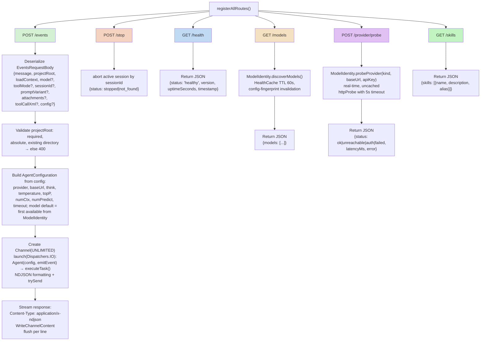
```mermaid
flowchart TD
    R["registerAllRoutes()"] --> POST[POST /events]
    R --> PS[POST /stop]
    R --> GH[GET /health]
    R --> GM[GET /models]
    R --> PP[POST /provider/probe]
    R --> GS[GET /skills]
    POST --> P1["Deserialize EventsRequestBody<br/>{message, projectRoot, loadContext, model?,<br/>toolMode?, sessionId?, promptVariant?,<br/>attachments?, toolCallXml?, config?}"]
    P1 --> P2["Validate projectRoot: required,<br/>absolute, existing directory → else 400"]
    P2 --> P3["Build AgentConfiguration from config:<br/>provider, baseUrl, think, temperature, topP,<br/>numCtx, numPredict, timeout; model default =<br/>first available from ModelIdentity"]
    P3 --> P4["Create Channel(UNLIMITED)<br/>launch(Dispatchers.IO):<br/>Agent(config, emitEvent) → executeTask()<br/>NDJSON formatting + trySend"]
    P4 --> P5["Stream response:<br/>Content-Type: application/x-ndjson<br/>WriteChannelContent<br/>flush per line"]
    PS --> S1["abort active session by sessionId<br/>{status: stopped|not_found}"]
    GH --> H1["Return JSON<br/>{status: 'healthy', version, uptimeSeconds, timestamp}"]
    GM --> M1["ModelIdentity.discoverModels()<br/>HealthCache TTL 60s,<br/>config-fingerprint invalidation"]
    M1 --> M2["Return JSON<br/>{models: [...]}"]
    PP --> P6["ModelIdentity.probeProvider(kind, baseUrl, apiKey)<br/>real-time, uncached<br/>httpProbe with 5s timeout"]
    P6 --> P7["Return JSON<br/>{status: ok|unreachable|auth|failed,<br/>latencyMs, error}"]
    GS --> S2["Return JSON<br/>{skills: [{name, description, alias}]}"]
    style POST fill: #d4f1d4
    style PS fill: #f4d4c1
    style GH fill: #c1daf4
    style GM fill: #f4e1c1
    style PP fill: #e1c1f4
    style GS fill: #c1f4c1
```

---

## 3. Core Subsystems

### 3.1 EditFileSkill State Machine

When editing a file, the execution path is determined by the `SchemaVariant`:

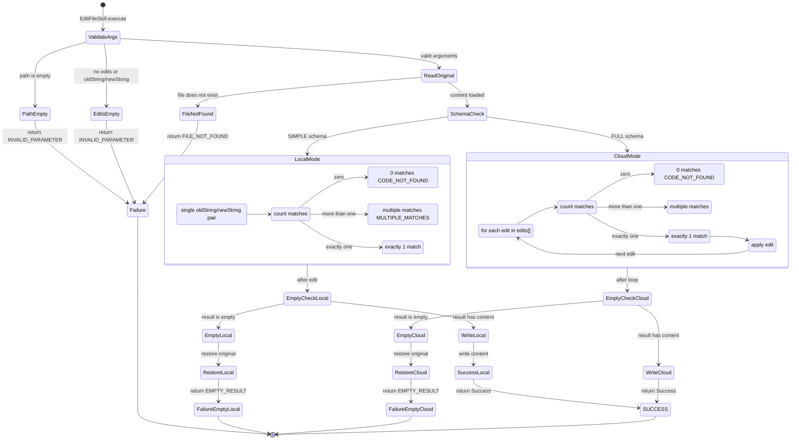
```mermaid
stateDiagram-v2
    [*] --> ValidateArgs: EditFileSkill.execute
    ValidateArgs --> PathEmpty: path is empty
    ValidateArgs --> EditsEmpty: no edits or oldString/newString
    ValidateArgs --> ReadOriginal: valid arguments
    PathEmpty --> Failure: return INVALID_PARAMETER
    EditsEmpty --> Failure: return INVALID_PARAMETER
    ReadOriginal --> FileNotFound: file does not exist
    FileNotFound --> Failure: return FILE_NOT_FOUND
    ReadOriginal --> SchemaCheck: content loaded
    state SchemaCheck <<choice>>
    SchemaCheck --> LocalMode: SIMPLE schema
    SchemaCheck --> CloudMode: FULL schema

    state LocalMode {
        direction LR
        L1: single oldString/newString pair
        L2: count matches
        L3: 0 matches CODE_NOT_FOUND
        L4: multiple matches MULTIPLE_MATCHES
        L5: exactly 1 match
        L1 --> L2
        L2 --> L3: zero
        L2 --> L4: more than one
        L2 --> L5: exactly one
    }

    state CloudMode {
        direction LR
        C1: for each edit in edits[]
        C2: count matches
        C3: 0 matches CODE_NOT_FOUND
        C4: multiple matches
        C5: exactly 1 match
        C6: apply edit
        C1 --> C2
        C2 --> C3: zero
        C2 --> C4: more than one
        C2 --> C5: exactly one
        C5 --> C6
        C6 --> C1: next edit
    }

    LocalMode --> EmptyCheckLocal: after edit
    CloudMode --> EmptyCheckCloud: after loop
    EmptyCheckLocal --> EmptyLocal: result is empty
    EmptyCheckLocal --> WriteLocal: result has content
    EmptyLocal --> RestoreLocal: restore original
    RestoreLocal --> FailureEmptyLocal: return EMPTY_RESULT
    WriteLocal --> SuccessLocal: write content
    SuccessLocal --> SUCCESS: return Success
    EmptyCheckCloud --> EmptyCloud: result is empty
    EmptyCheckCloud --> WriteCloud: result has content
    EmptyCloud --> RestoreCloud: restore original
    RestoreCloud --> FailureEmptyCloud: return EMPTY_RESULT
    WriteCloud --> SUCCESS: return Success
    Failure --> [*]
    FailureEmptyLocal --> [*]
    FailureEmptyCloud --> [*]
    SUCCESS --> [*]
```

**Key implementation details**:

- **Local mode** (SIMPLE schema): Single `oldString`/`newString` pair, one file per call. Designed for small local
  models (≤32B).
- **Cloud mode** (FULL schema): Batch `edits[]` array, multiple edits per call. Designed for cloud models.
- **2-step matching**: Step 1 exact match (ignore trailing whitespace and line endings), Step 2 stripped-whitespace
  match (`filterNot { it.isWhitespace() }`).
- **Sequential edits**: each `EditOperation` in a batch is applied sequentially; failure to match an edit aborts with
  `CODE_NOT_FOUND` / `MULTIPLE_MATCHES` before any partial write is committed.
- **Concurrency guard**: an in-process `Mutex` (keyed by resolved path) serializes edits to the same file; a detected
  concurrent modification returns `CONCURRENT_MODIFICATION`.
- **Syntax self-check**: after a successful edit, `SyntaxChecker` reparses the file through the active provider's
  compiler command; findings are returned in the `syntaxErrors` field rather than silently reverting.
- **XmlError**: All errors use `buildXmlError()` from `XmlError.kt` for consistent XML format with PascalCase tags.
- Error codes: `CODE_NOT_FOUND, MULTIPLE_MATCHES, EMPTY_RESULT, CONCURRENT_MODIFICATION, INVALID_PARAMETER, IO_ERROR`

### 3.2 CommandFilter: Command Safety Filter

Gradum's most critical security component.


```mermaid
flowchart TD
    START["classifyCommand(commandText, toolMode=AGENT)"] --> EMPTY{commandText empty?}
    EMPTY -->|Yes| SAFE["return CommandVerdict.Safe"]
    EMPTY -->|No| TOKENIZE["split by whitespace into tokens<br/>tokens[0] = executableName<br/>(strip path prefix)"]
    TOKENIZE --> BLOCKED{executableName in BLOCKED_EXECUTABLES?}
    BLOCKED -->|Yes| BL["return Blocked<br/>rule: executable:$executableName<br/>message: '$executableName is not allowed'"]
    BLOCKED -->|No| SWITCH[branch by executable]
    SWITCH -->|" dd "| DD["classifyDeviceWrite(tokens)<br/>scan for 'of=/dev/...' pattern<br/>if found → Blocked('dd:deviceOutput')"]
    SWITCH -->|" rm "| RM["classifyRemoveOperation(tokens)<br/>extract pathArgs (non-flag tokens)<br/>for each pathArg → ProtectedPaths.isProtected"]
    RM --> RM_CRIT{critical?}
    RM_CRIT -->|Yes| RM_BLK["Blocked('rm:criticalPath')"]
    RM_CRIT -->|No| SAFE_RM[Safe]
    SWITCH -->|" chmod "| CHMOD["classifyChmodOperation(tokens)<br/>check tokens in {'-R', '--recursive'}"]
    CHMOD --> CHMOD_R{recursive?}
    CHMOD_R -->|No| SAFE_CHMOD[Safe]
    CHMOD_R -->|Yes| CHMOD_PATH["for each pathArg → ProtectedPaths.isProtected"]
    CHMOD_PATH --> CHMOD_CRIT{critical?}
    CHMOD_CRIT -->|Yes| CHMOD_BLK["Blocked('chmod:criticalPathRecursive')"]
    CHMOD_CRIT -->|No| SAFE_CHMOD2[Safe]
    SWITCH -->|" other executables "| SAFE_OTHER[Safe]

    SAFE_RM --> RO{READ_ONLY mode?}
    SAFE_CHMOD --> RO
    SAFE_CHMOD2 --> RO
    SAFE_OTHER --> RO
    RO -->|No| DONE_SAFE["return Safe"]
    RO -->|Yes| WHITELIST["every subcommand head<br/>(split on |;&) ∈ readOnlyAllowedExecutables?"]
    WHITELIST -->|No| WL_BLK["Blocked('readonly:executable:...')"]
    WHITELIST -->|Yes| REDIR{"shell file redirect present?<br/>(&gt; file, &gt;&gt; file, &gt;&#124; file, &lt;&gt; file)"}
    REDIR -->|Yes| RED_BLK["Blocked('readonly:shell-redirect')"]
    REDIR -->|No| DONE_SAFE2["return Safe"]

    subgraph PROTECTED["ProtectedPaths.isProtected(path)"]
        RESOLVE["resolveAbsolutePath(path)<br/>normalize path"]
        RESOLVE --> TMP{prefix starts with /tmp}
        TMP -->|Yes| NOT_CRIT[NOT Critical]
        TMP -->|No| PRE{"prefix in systemPrefixes?<br/>(/etc, /usr, /var, /boot, /bin,<br/>/sbin, /lib, /lib64, /opt, /System,<br/>/Library, /Applications, /private)"}
        PRE -->|Yes| CRIT[Critical]
        PRE -->|No| HOME{"prefix in protectedHomeSubdirs<br/>under user.home? (.ssh, .gnupg,<br/>.aws, .kube, .netrc, .pypirc,<br/>.npmrc, .docker)"}
        HOME -->|Yes| CRIT
        HOME -->|No| EXACT{"path in exactProtectedPaths?<br/>(/, /dev, /proc, /sys)"}
        EXACT -->|Yes| CRIT
        EXACT -->|No| NOT_CRIT
    end

    style BLOCKED fill: #f4c1c1
    style CRIT fill: #f4c1c1
    style NOT_CRIT fill: #d4f1d4
    style PROTECTED fill: #fff4c1
    style WHITELIST fill: #c1daf4
```

**BLOCKED_EXECUTABLES set** (always-on, independent of `toolMode`):
`sudo, su, doas, pkexec, shutdown, reboot, halt, poweroff, init, mkfs, mkfs.ext2/3/4, mkfs.xfs, mkfs.btrfs, mkfs.vfat, mkfs.ntfs, mkswap, fdisk, sfdisk, parted, gdisk`

**systemPrefixes** (in `ProtectedPaths`):
`/etc, /usr, /var, /boot, /bin, /sbin, /lib, /lib64, /opt, /System, /Library, /Applications, /private`

**protectedHomeSubdirectories**:
`.ssh, .gnupg, .aws, .kube, .netrc, .pypirc, .npmrc, .docker`

**exactProtectedPaths**:
`/ , /dev, /proc, /sys`

`safePathPrefixes` (never critical): `/tmp`

**readOnlyAllowedExecutables** (head-token whitelist, only when `toolMode == READ_ONLY`):
`ls, tree, pwd, dir, cat, head, tail, less, more, bat, grep, rg, ag, ack, find, wc, sort, uniq, cut, tr, awk, diff, cmp, xargs, file, stat, du, df, readlink, realpath, uname, whoami, date, which, whereis, type, id, groups, ps, top, htop, hostname, uptime, arch, echo, printf, true, false, test, yes`

`git` is deliberately **absent** from the whitelist: its write subcommands (commit, push, checkout, reset, clean, stash)
are easy to reach and hard to enumerate, so a Read-only session skips git entirely instead of trying to filter
subcommands. In read-only mode every subcommand of the pipeline (split on `|;&`) is whitelisted independently and shell
file redirects (`echo hi > out.txt`) are blocked, so `cat in | tee out` or `ls && touch foo` can't smuggle a write past
the head-only check.

**Call locations** (two enforcement points, both delegate to `classifyCommand`):

```kotlin
// 1. RunCommandSkill.execute(): always-on safety classification
@OptIn(DangerousOperation::class)
override fun execute(arguments, context): SkillResult {
    val verdict: CommandVerdict = classifyCommand(commandText)          // default ToolMode.AGENT
    if (verdict is CommandVerdict.Blocked) {
        return makeFailure("COMMAND_BLOCKED", "Blocked by safety filter: ${verdict.description}", ...)
    }
    // ... subsequent ProcessBuilder.start()
}

// 2. Agent.executeSingleTool(): READ_ONLY re-classification (run_cmd only)
if (configuration.toolMode == ToolMode.READ_ONLY && functionName == "run_cmd") {
    val verdict: CommandVerdict = classifyCommand(commandText, configuration.toolMode)
    if (verdict is CommandVerdict.Blocked) {
        // emit tool_call + error(COMMAND_BLOCKED) via the shared emitToolResult path
    }
}
```

**Limitations**:

- Only checks the command's static structure, doesn't simulate execution. E.g., `rm $(cat foo)` can only
  intercept `rm` itself.
- Doesn't perform alias expansion (shell aliases are determined by the runtime shell and can't be statically
  predicted).
- Doesn't perform environment variable expansion.
- Relies on the user providing the correct shell invocation path.
- Does not intercept dangerous operations inside high-level languages like Python/Node (but these typically don't go
  through `run_cmd`).

### 3.3 RunCommandSkill: Blocking vs Detached Process Execution

`RunCommandSkill` has two execution modes:

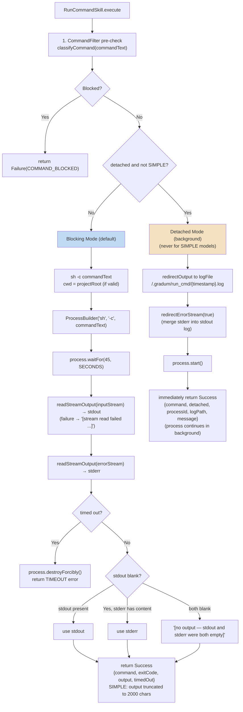
```mermaid
flowchart TD
    START["RunCommandSkill.execute"] --> PRECHECK["1. CommandFilter pre-check<br/>classifyCommand(commandText)"]
    PRECHECK --> BLOCKED{Blocked?}
    BLOCKED -->|Yes| RETURN_BLOCKED["return Failure(COMMAND_BLOCKED)"]
    BLOCKED -->|No| MODE{detached and not SIMPLE?}
    MODE -->|No| BLOCKING["Blocking Mode (default)"]
    BLOCKING --> CWD["sh -c commandText<br/>cwd = projectRoot (if valid)"]
    CWD --> PB1["ProcessBuilder('sh', '-c', commandText)"]
    PB1 --> WAIT["process.waitFor(45, SECONDS)"]
    WAIT --> STDOUT["readStreamOutput(inputStream) → stdout<br/>(failure → '[stream read failed ...]')"]
    STDOUT --> STDERR["readStreamOutput(errorStream) → stderr"]
    STDERR --> TIMEOUT{timed out?}
    TIMEOUT -->|Yes| KILL["process.destroyForcibly()<br/>return TIMEOUT error"]
    TIMEOUT -->|No| OUT{stdout blank?}
    OUT -->|Yes, stderr has content| USE_ERR["use stderr"]
    OUT -->|both blank| NOOUT["'[no output — stdout and stderr were both empty]'"]
    OUT -->|stdout present| USE_OUT["use stdout"]
    USE_OUT --> RETURN_BLOCK["return Success<br/>{command, exitCode, output, timedOut}<br/>SIMPLE: output truncated to 2000 chars"]
    USE_ERR --> RETURN_BLOCK
    NOOUT --> RETURN_BLOCK
    MODE -->|Yes| DETACHED["Detached Mode (background)<br/>(never for SIMPLE models)"]
    DETACHED --> LOG["redirectOutput to logFile<br/><projectRoot>/.gradum/run_cmd/{timestamp}.log"]
    LOG --> MERGE["redirectErrorStream(true)<br/>(merge stderr into stdout log)"]
    MERGE --> START2["process.start()"]
    START2 --> RETURN_DET["immediately return Success<br/>{command, detached, processId, logPath, message}<br/>(process continues in background)"]
    style BLOCKING fill: #c1daf4
    style DETACHED fill: #f4e1c1
```

**Scenarios for choosing Detached**:

- GUI applications (e.g. launching an IDE)
- Long-running servers (e.g. a dev server)
- Any operation that doesn't need to wait for stdout to finish

Output from detached processes is written to a log file, and the Agent won't read or analyze them further.

### 3.4 LLM Client Retry and Streaming Logic

Both clients share the same retry strategy and the **same top-level `HttpClient`** (`sharedHttpClient`, Ktor with a 600s
request timeout). The client is built once per JVM and reused across every turn and every session instead of being
constructed and closed per LLM call, which preserves HTTP connection reuse (keep-alive/pooling).

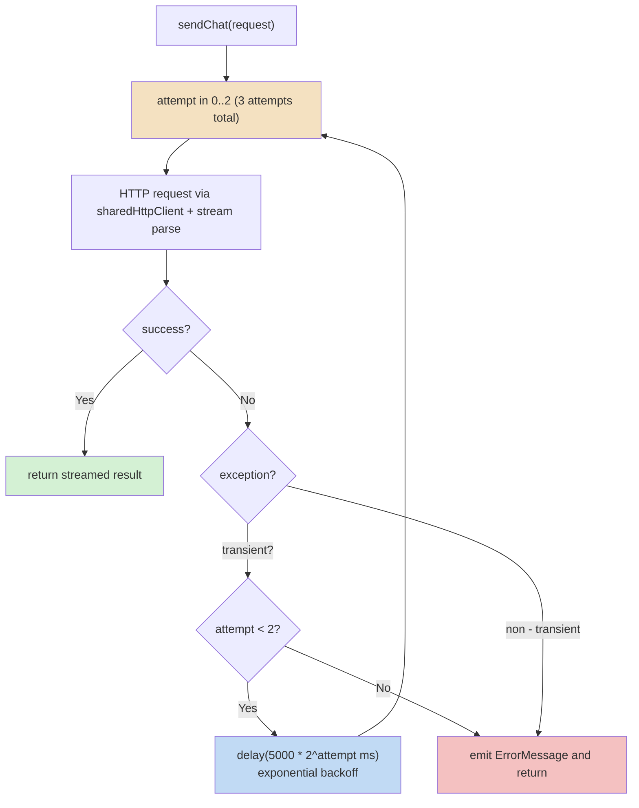
```mermaid
flowchart TD
    START["sendChat(request)"] --> LOOP["attempt in 0..2 (3 attempts total)"]
    LOOP --> TRY["HTTP request via sharedHttpClient + stream parse"]
    TRY --> SUCCESS{success?}
    SUCCESS -->|Yes| DONE["return streamed result"]
    SUCCESS -->|No| EXCEPTION{exception?}
    EXCEPTION -->|transient?| TRANSIENT{"attempt < 2?"}
    TRANSIENT -->|Yes| BACKOFF["delay(5000 * 2^attempt ms)<br/>exponential backoff"]
    BACKOFF --> LOOP
    TRANSIENT -->|No| EMIT_ERR["emit ErrorMessage and return"]
    EXCEPTION -->|non - transient| EMIT_ERR
    style LOOP fill: #f4e1c1
    style BACKOFF fill: #c1daf4
    style DONE fill: #d4f1d4
    style EMIT_ERR fill: #f4c1c1
```

#### Ollama Client Protocol

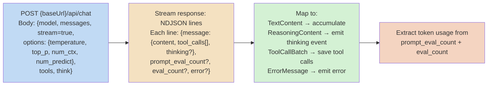
```mermaid
flowchart LR
    REQ["POST {baseUrl}/api/chat<br/>Body: {model, messages, stream=true,<br/>options: {temperature, top_p, num_ctx, num_predict},<br/>tools, think}"]
    REQ --> STREAM["Stream response: NDJSON lines<br/>Each line: {message: {content, tool_calls[], thinking?},<br/>prompt_eval_count?, eval_count?, error?}"]
    STREAM --> PARSE["Map to:<br/>TextContent → accumulate<br/>ReasoningContent → emit thinking event<br/>ToolCallBatch → save tool calls<br/>ErrorMessage → emit error"]
    PARSE --> TOKENS["Extract token usage from<br/>prompt_eval_count + eval_count"]
    style REQ fill: #c1daf4
    style STREAM fill: #f4e1c1
    style PARSE fill: #d4f1d4
    style TOKENS fill: #f4d4c1
```

#### OpenAI-Compatible Client Protocol

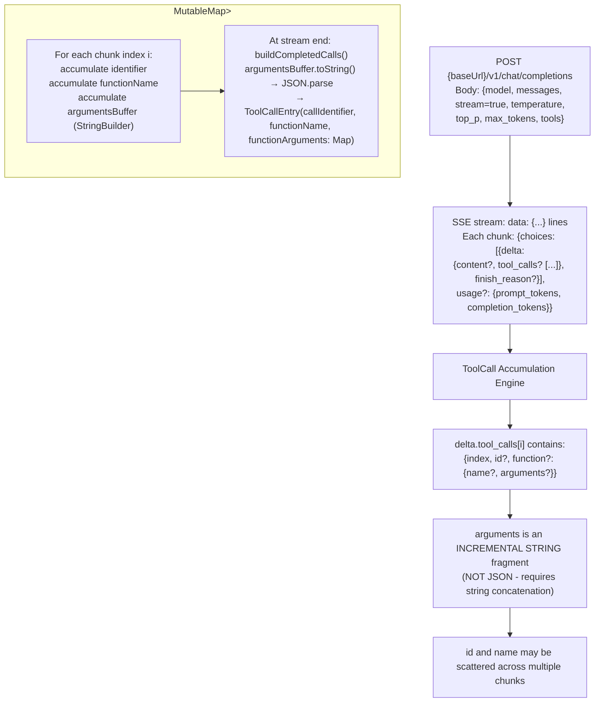
```mermaid
flowchart TD
    REQ["POST {baseUrl}/v1/chat/completions<br/>Body: {model, messages, stream=true, temperature,<br/>top_p, max_tokens, tools}"]
    REQ --> SSE["SSE stream: data: {...} lines<br/>Each chunk: {choices: [{delta:<br/>{content?, tool_calls? [...]}, finish_reason?}],<br/>usage?: {prompt_tokens, completion_tokens}}"]
    SSE --> ACCUM["ToolCall Accumulation Engine"]
    ACCUM --> SUB1["delta.tool_calls[i] contains:<br/>{index, id?, function?: {name?, arguments?}}"]
    SUB1 --> SUB2["arguments is an INCREMENTAL STRING fragment<br/>(NOT JSON - requires string concatenation)"]
    SUB2 --> SUB3["id and name may be scattered across multiple chunks"]

    subgraph ACC["MutableMap<Int, MutableMap<String, Any>>"]
        A["For each chunk index i:<br/>accumulate identifier<br/>accumulate functionName<br/>accumulate argumentsBuffer (StringBuilder)"]
        A --> B["At stream end: buildCompletedCalls()<br/>argumentsBuffer.toString() → JSON.parse<br/>→ ToolCallEntry(callIdentifier, functionName, functionArguments: Map)"]
    end
```

### 3.5 TodoManager and Task Focus

Defined in `TodoSkill.kt`:

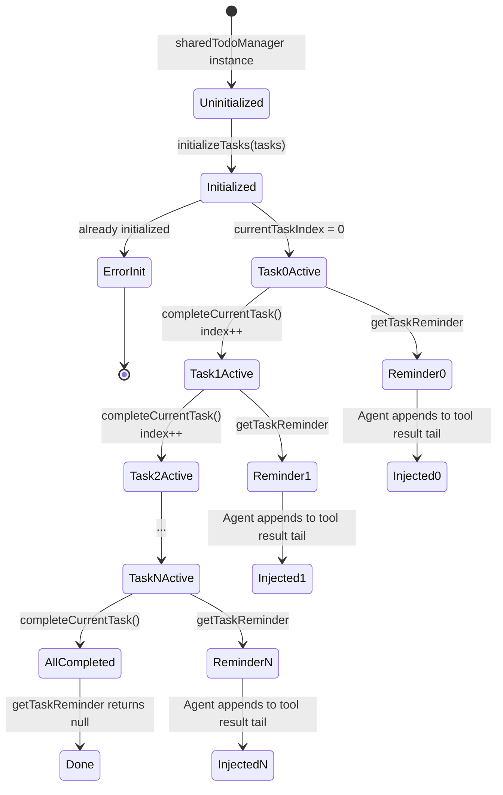
```mermaid
stateDiagram-v2
    [*] --> Uninitialized: sharedTodoManager instance
    Uninitialized --> Initialized: initializeTasks(tasks)
    Initialized --> ErrorInit: already initialized
    ErrorInit --> [*]
    Initialized --> Task0Active: currentTaskIndex = 0
    Task0Active --> Task1Active: completeCurrentTask()<br/>index++
    Task1Active --> Task2Active: completeCurrentTask()<br/>index++
    Task2Active --> TaskNActive: ...
    TaskNActive --> AllCompleted: completeCurrentTask()
    AllCompleted --> Done: getTaskReminder returns null
    Task0Active --> Reminder0: getTaskReminder
    Task1Active --> Reminder1: getTaskReminder
    TaskNActive --> ReminderN: getTaskReminder
    Reminder0 --> Injected0: Agent appends to tool result tail
    Reminder1 --> Injected1: Agent appends to tool result tail
    ReminderN --> InjectedN: Agent appends to tool result tail
```

**State operations** (on the shared `TodoManager` singleton, exposed via
`getTodoManagerInstance()` so the agent loop, the skills, and the reminders all share one state):

- `initializeTasks(taskDescriptions)` → Success `{totalTasks, currentTask, currentIndex}`. Fails with
  `ALREADY_INITIALIZED` if the list is already set, or `INVALID_PARAMETER` for an empty list.
- `completeCurrentTask()` → index++. If index >= size → `{completed: true, totalTasks, message}`, else →
  `{completed: false, totalTasks, currentTask, currentIndex}`
- `skipTask()` → same advance shape, but marks the item as skipped rather than completed.
- `getTaskReminder()` → `"Reminder: You still have N tasks unfinished...current task..."` or `null` when all done
- `resetTaskList()` → re-arm the manager for a fresh session.

**Two skills, one manager**: TodoSkill (`to_do`, alias `Planned`) initializes the list; CompletePlanSkill
(`finish_to_do_item`, alias `Completed`) maps its `action` argument — `complete` (default) → `completeCurrentTask()`,
`skip` → `skipTask()`. Both skills expose `allowedToolModes = {AGENT}` only, and both are deliberately hidden in EDIT
(no task planning) and READ_ONLY (no project mutation), enforced at runtime by the mode gate even against a hallucinated
call (returns `TOOL_NOT_PERMITTED`).

The Agent calls `getTodoManagerInstance().getTaskReminder()` after **every tool call** in `executeTask()`, and if not
null, appends it to the tail of the tool result message. That way the model doesn't "forget" the original task
plan during long task flows.

### 3.6 XmlError: Shared Error Format

All AI-facing errors use a consistent XML format via `buildXmlError()` from `XmlError.kt`:

```kotlin
fun buildXmlError(
    code: String,
    message: String,
    fixHint: String? = null,
    searchPreview: String? = null,
    partial: String? = null,
): String
```

**Output format** (PascalCase XML tags):

```xml

<Error>
    <Code>CODE_NOT_FOUND</Code>
    <Message>Could not find the specified text in the file.</Message>
    <FixHint>Re-read the file and include 2-3 lines of surrounding context.</FixHint>
</Error>
```

**Used by all skills** (ReadFileSkill, EditFileSkill, SaveFileSkill, RunCommandSkill, ExploreProjectSkill, TodoSkill).
It replaces per-skill XML string construction and gives every skill the same error format.

---

## 4. Skill Reference

### 4.1 Skill Type System

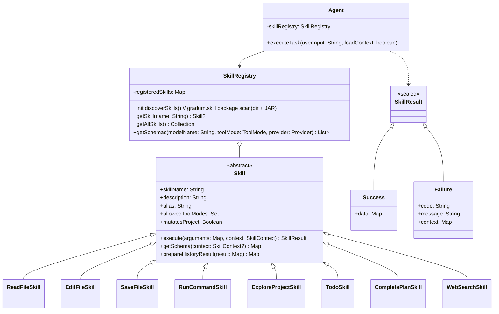
```mermaid
classDiagram
    class Skill {
        <<abstract>>
        +skillName: String
        +description: String
        +alias: String
        +allowedToolModes: Set<ToolMode>
        +mutatesProject: Boolean
        +execute(arguments: Map<String, Any>, context: SkillContext) SkillResult
        +getSchema(context: SkillContext?) Map<String, Any>
        +prepareHistoryResult(result: Map<String, Any>) Map<String, Any>
    }

    class SkillResult {
        <<sealed>>
    }

    class Success {
        +data: Map<String, Any>
    }

    class Failure {
        +code: String
        +message: String
        +context: Map<String, Any>
    }

    class SkillRegistry {
        -registeredSkills: Map<String, Skill>
        +init discoverSkills() // gradum.skill package scan (dir + JAR)
        +getSkill(name: String) Skill?
        +getAllSkills() Collection<Skill>
        +getSchemas(modelName: String, toolMode: ToolMode, provider: Provider) List<Map<String, Any>>
    }

    class ReadFileSkill
    class EditFileSkill
    class SaveFileSkill
    class RunCommandSkill
    class ExploreProjectSkill
    class TodoSkill
    class CompletePlanSkill
    class WebSearchSkill

    SkillResult <|-- Success
    SkillResult <|-- Failure
    Skill <|-- ReadFileSkill
    Skill <|-- EditFileSkill
    Skill <|-- SaveFileSkill
    Skill <|-- RunCommandSkill
    Skill <|-- ExploreProjectSkill
    Skill <|-- TodoSkill
    Skill <|-- CompletePlanSkill
    Skill <|-- WebSearchSkill
    SkillRegistry o-- Skill

    class Agent {
        -skillRegistry: SkillRegistry
        +executeTask(userInput: String, loadContext: boolean)
    }

    Agent --> SkillRegistry
    Agent ..> SkillResult
```

**Skill abstract class** (`skill/Skill.kt`):

```kotlin
abstract class Skill {
    abstract val skillName: String          // "read_file"
    abstract val description: String        // "Read file content..."
    abstract val alias: String              // "Read" (used for human-friendly logging)
    open val allowedToolModes: Set<ToolMode> = setOf(AGENT, EDIT, READ_ONLY)
    open val mutatesProject: Boolean = false
    abstract fun execute(arguments: Map<String, Any>, context: SkillContext): SkillResult
    abstract fun getSchema(context: SkillContext? = null): Map<String, Any>  // Used for LLM tools definition

    fun allows(toolMode: ToolMode): Boolean = toolMode in allowedToolModes

    // History context management — strip volatile keys from old results
    open val historyKeepCount: Int = Int.MAX_VALUE   // Keep this many recent results intact
    open val historyVolatileKeys: List<String> = emptyList()  // Keys to strip when exceeding count

    private var prepareHistoryCallCount: Int = 0

    open fun prepareHistoryResult(result: Map<String, Any>): Map<String, Any> {
        prepareHistoryCallCount++
        if (historyKeepCount == Int.MAX_VALUE || historyVolatileKeys.isEmpty()) return result
        return if (prepareHistoryCallCount <= historyKeepCount) result
        else result.filterKeys { it !in historyVolatileKeys }
    }
}
```

`prepareHistoryResult` is a hook that transforms a skill's execution result before it is saved into
`conversationHistory`. The default returns the result unchanged.

### 4.1a Adaptive Pruning

Adaptive pruning keeps **only the N most recent** executions of a skill fully intact in
conversation history, while stripping volatile payload keys from older entries. The technique is embodied by two
properties on `Skill`:

- `historyKeepCount: Int` — how many recent results retain full data (default `Int.MAX_VALUE`, meaning no pruning)
- `historyVolatileKeys: List<String>` — which keys to remove from results that exceed the keep count

When `execute()` is called, `prepareHistoryResult()` increments an internal call counter. Results whose call index ≤
`historyKeepCount` are returned as-is; older ones have every key in `historyVolatileKeys` filtered out:

```kotlin
override fun prepareHistoryResult(result: Map<String, Any>): Map<String, Any> {
    prepareHistoryCallCount++
    if (historyKeepCount == Int.MAX_VALUE || historyVolatileKeys.isEmpty()) return result
    return if (prepareHistoryCallCount <= historyKeepCount) result
    else result.filterKeys { it !in historyVolatileKeys }
}
```

**Design intent:** Large payloads (file contents, command output, search results) are needed for the model to reason
about the *current* step, but quickly become irrelevant as the session progresses. Stripping them from old history saves
LLM context window without losing the structural metadata (path, exit code, match count, etc.).

**Current application:**

| Skill             | historyKeepCount | Volatile keys stripped | Rationale                                                                     |
|-------------------|------------------|------------------------|-------------------------------------------------------------------------------|
| `ReadFileSkill`   | 2                | `content`              | File content is large (hundreds of lines); only the last 2 reads are relevant |
| `RunCommandSkill` | 2                | `output`               | Command output may be very large; old results are rarely referenced           |

The full volatile data is still emitted in the NDJSON `tool_call` event for the frontend; only conversation history is
trimmed. The UI and the skill implementations never notice — `prepareHistoryResult` is called
automatically in `Agent.kt` after `skill.execute()` returns.

**SkillResult sealed class** (`SkillResult.kt`):

```kotlin
sealed class SkillResult {
    data class Success(val data: Map<String, Any>) : SkillResult()
    data class Failure(
        val code: String,
        val message: String,
        val context: Map<String, Any> = emptyMap()
    ) : SkillResult()
}
```

Factory functions:

```
makeSuccess(data: Map<String, Any>): SkillResult
makeFailure(code: String, message: String, context: Map<String, Any> = emptyMap()): SkillResult
```

### 4.2 Skill Registration Flow

`SkillRegistry.kt` scans the `gradum.skill` package on the classpath at init time:

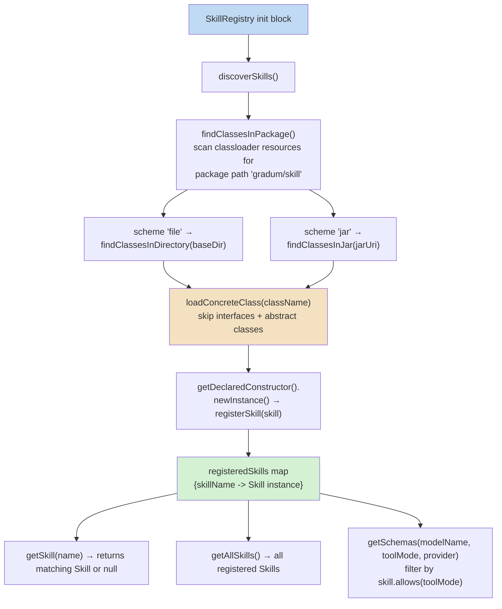
```mermaid
flowchart TB
    INIT["SkillRegistry init block"] --> DISCOVER["discoverSkills()"]
    DISCOVER --> LOADER["findClassesInPackage()<br/>scan classloader resources for<br/>package path 'gradum/skill'"]
    LOADER --> DIR["scheme 'file' →<br/>findClassesInDirectory(baseDir)"]
    LOADER --> JAR["scheme 'jar' →<br/>findClassesInJar(jarUri)"]
    DIR --> CONCRETE["loadConcreteClass(className)<br/>skip interfaces + abstract classes"]
    JAR --> CONCRETE
    CONCRETE --> INST["getDeclaredConstructor().<br/>newInstance() → registerSkill(skill)"]
    INST --> REG["registeredSkills map<br/>{skillName -> Skill instance}"]
    REG --> LOOKUP["getSkill(name) → returns matching Skill or null"]
    REG --> ALL["getAllSkills() → all registered Skills"]
    REG --> SCH["getSchemas(modelName, toolMode, provider)<br/>filter by skill.allows(toolMode)"]
    style INIT fill: #c1daf4
    style CONCRETE fill: #f4e1c1
    style REG fill: #d4f1d4
```

Skills are discovered by **reflection over the `gradum.skill` package**, not by a hardcoded list and not by the SPI
`ServiceLoader`: any concrete public class extending `Skill` with a no-argument constructor (e.g. `ReadFileSkill`,
`EditFileSkill`, `SaveFileSkill`, `RunCommandSkill`, `ExploreProjectSkill`, `TodoSkill`, `CompletePlanSkill`) is
instantiated and registered. External plugin JARs on the classpath that contain a `gradum/skill/*.class` tree are picked
up by the `jar`-scheme scanner automatically.

**Adding a skill** is therefore a three-step process:

1. Create a class extending `Skill` in the `gradum.skill` package with a no-argument constructor
2. Build it into the server classpath (own module or an external plugin JAR)
3. It is discovered automatically at init time; no registration file to maintain

### 4.3 Skill Overview

| Skill               | Input Parameters                                              | Output Fields                                                                                          | Error Codes                                                                                   | Limits                                                 |
|---------------------|---------------------------------------------------------------|--------------------------------------------------------------------------------------------------------|-----------------------------------------------------------------------------------------------|--------------------------------------------------------|
| ReadFileSkill       | `path`, `lineRange?` (cloud only)                             | `path, lineRange, totalLines, contentHash, content` (cloud); `path, content` (local)                   | `FILE_NOT_FOUND, FILE_TOO_LARGE, INVALID_PARAMETER, IO_ERROR`                                 | Size ≤ 1MB, lines ≤ 10000                              |
| EditFileSkill       | `path, edits[]` (cloud); `path, oldString, newString` (local) | `path, editsApplied, totalEdits`                                                                       | `CODE_NOT_FOUND, MULTIPLE_MATCHES, EMPTY_RESULT, FILE_NOT_FOUND, INVALID_PARAMETER, IO_ERROR` | Each edit must match uniquely; 1 edit per call (local) |
| SaveFileSkill       | `path, content`                                               | `path, bytesWritten, created`                                                                          | `INVALID_PARAMETER, IO_ERROR`                                                                 | Auto mkdirs parent directories                         |
| RunCommandSkill     | `command, reason?, detached?`                                 | blocking: `command, exitCode, output` <br/> detached: `command, detached, processId, logPath, message` | `COMMAND_BLOCKED, TIMEOUT, INVALID_PARAMETER, IO_ERROR`                                       | Timeout 45s; CommandFilter pre-check                   |
| GrepSkill           | `pattern, path?, include?, limit?`                            | `pattern, searchPath, totalMatches, matches, filesSearched, limitApplied`                              | `INVALID_PARAMETER, IO_ERROR`                                                                 | Concurrent scan; match + result limits                 |
| GlobSkill           | `pattern, path?, limit?`                                      | `pattern, searchPath, totalFiles, files, limitApplied`                                                 | `INVALID_PARAMETER, IO_ERROR`                                                                 | Concurrent scan; result limit                          |
| ExploreProjectSkill | `path?, depth?`                                               | `path, entries: [{name, type, children?}]`                                                             | `INVALID_PARAMETER, IO_ERROR`                                                                 | Depth 5–14; truncated build/dependency directories     |
| TodoSkill           | `tasks[]`                                                     | `totalTasks, currentTask, currentIndex`                                                                | `ALREADY_INITIALIZED, INVALID_PARAMETER`                                                      | Singleton; cannot be reset after initialization        |
| CompletePlanSkill   | none                                                          | `{completed, totalTasks, message?}` or `{completed, totalTasks, currentTask, currentIndex}`            | `NOT_INITIALIZED, ALL_COMPLETED`                                                              | Advance task pointer                                   |
| WebSearchSkill      | `query, max_results?, search_depth?`                          | `query, max_results, search_depth, results: [{title, snippet, url}]`                                   | `INVALID_PARAMETER, SEARCH_FAILED`                                                            | Requires `TAVILY_API_KEY` env var; max 10 results      |

---

## 5. Error Codes and Events

### 5.1 Tool Error Codes

```mermaid
flowchart LR
    ALL[SkillResult.Failure] --> G1[File operations]
    ALL --> G2[Edit operations]
    ALL --> G3[Command execution]
    ALL --> G4[Task management]
    ALL --> G5[Generic]
    ALL --> G6[Plugin-side]
    ALL --> G7[Web search]
    G1 --> F1["FILE_NOT_FOUND<br/>ReadFile, EditFile: path doesn't exist"]
    G1 --> F2["FILE_TOO_LARGE<br/>ReadFile: exceeds 1MB or 10000 lines"]
    G2 --> F3["CODE_NOT_FOUND<br/>EditFile: search string matches 0 times"]
    G2 --> F4["MULTIPLE_MATCHES<br/>EditFile: search string matches more than 1 times"]
    G2 --> F5["EMPTY_RESULT<br/>EditFile: file would be empty after edit"]
    G2 --> F14["CONCURRENT_MODIFICATION<br/>EditFile: file modified between match and write"]
    G3 --> F6["COMMAND_BLOCKED<br/>RunCommand: blocked by safety filter"]
    G3 --> F7["TIMEOUT<br/>RunCommand, Search: exceeded time limit"]
    G4 --> F8["ALREADY_INITIALIZED<br/>TodoSkill: attempt to reinitialize"]
    G4 --> F9["NOT_INITIALIZED<br/>CompletePlanSkill: called before init"]
    G4 --> F10["ALL_COMPLETED<br/>CompletePlanSkill: all tasks already done"]
    G5 --> F11["INVALID_PARAMETER<br/>All skills: missing or malformed args"]
    G5 --> F12["IO_ERROR<br/>All skills: filesystem or process exception"]
    G5 --> F15["INTERRUPTED<br/>Session aborted while tool was running"]
    G6 --> F13["CLIENT_ERROR<br/>Plugin: model validation failed"]
    G6 --> F16["TOOL_NOT_PERMITTED<br/>Mode gate: skill forbidden in current ToolMode"]
    G6 --> F17["PERMISSION_DENIED<br/>Plugin: user declined the pending action"]
    G6 --> F18["INVALID_SCENARIO_XML<br/>Plugin: scenario/context XML malformed"]
    G7 --> F19["SEARCH_FAILED<br/>WebSearch: network error, rate limit, missing API key"]
    style G1 fill: #c1daf4
    style G2 fill: #f4e1c1
    style G3 fill: #f4c1c1
    style G4 fill: #c1f4c1
    style G5 fill: #d4d4d4
    style G6 fill: #e8d4f4
    style G7 fill: #f4f4c1
```

### 5.2 LLM Client Error Handling

```mermaid
flowchart TD
    NET["Network connection failure<br/>(LLM server not responding)"]
    TIMEOUT["Request timeout"]
    NON2XX["HTTP non-2xx response"]
    PARSE["SSE parse failure (OpenAI)"]
    NET --> EMIT["emit ErrorMessage<br/>(with context hint)"]
    TIMEOUT --> EMIT
    NON2XX --> EMIT
    PARSE --> STREAM_END["treated as end of stream<br/>no separate error emission"]
    EMIT --> RETRY["retry up to 2 times<br/>exponential backoff"]
    RETRY --> GIVE_UP["after 2 failed retries → give up<br/>return accumulated content"]
    style NET fill: #f4c1c1
    style TIMEOUT fill: #f4c1c1
    style NON2XX fill: #f4c1c1
    style STREAM_END fill: #c1daf4
```

### 5.3 Guardrail System

The Guardrail System protects against anomalous model behavior by monitoring the LLM's text output across turns. It
consists of two independent detectors that share a common termination pathway via `mission_revoked`.

```mermaid
flowchart TB
    subgraph RED_LINE["Red Line Keyword Detector"]
        RL1["checkRedLineKeywords(text)<br/>case-insensitive substring match"]
        RL1 --> RL2{"Any keyword hit?"}
        RL2 -->|No| SKIP_RL
        RL2 -->|Yes| RL3["redLineHitCounter++<br/>emit guardrail(red_line_hit)"]
        RL3 --> RL4{"counter >= maxRedLineHits?"}
        RL4 -->|No| SKIP_RL
        RL4 -->|Yes| RL5["mission_revoked(red_line_violation)"]
    end

    subgraph REPEAT["Repetitive Response Detector"]
        RT1["Detect:<br/>1. Exact duplicate of previous turn<br/>2. Same sentence ≥3 times in one response"]
        RT1 --> RT2{"Anomalous?"}
        RT2 -->|No| RT3["repeatedResponseTracker.clear()"]
        RT2 -->|Yes| RT4["add to tracker<br/>emit guardrail(red_line_hit)"]
        RT4 --> RT5{"tracker >= maxRepeatedResponses?"}
        RT5 -->|No| SKIP_RP
        RT5 -->|Yes| RT6["mission_revoked(repetitive_loop)"]
    end

    RL5 --> ABORT["abortSession()<br/>emit session_end (aborted)<br/>NO context save"]
    RT6 --> ABORT
    SKIP_RL --> CONTINUE["Continue processing tool calls"]
    SKIP_RP --> CONTINUE
    style RED_LINE fill: #f4c1c1
    style REPEAT fill: #f4e1c1
    style ABORT fill: #f4c1c1
```

#### Red Line Keywords File

Red line keywords are **not** part of `AgentConfiguration`. Instead, they are loaded from
`src/main/resources/red_line_keywords.txt` at runtime:

```
# One keyword per line. Lines starting with # are ignored.
# Matching is case-insensitive substring.
forbidden-topic
some-sensitive-phrase
```

- File location: `src/main/resources/red_line_keywords.txt`
- Template: `src/main/resources/red_line_keywords.txt.example` (git-tracked)
- Actual file is **gitignored** (user-local sensitive config)
- If the file is missing or empty, red line detection is silently disabled

#### Configuration (`AgentConfiguration.kt`)

| Field                  | Type  | Default | Description                                      |
|------------------------|-------|---------|--------------------------------------------------|
| `maxRedLineHits`       | `Int` | `3`     | Number of red line hits before revocation        |
| `maxRepeatedResponses` | `Int` | `3`     | Number of repetitive responses before revocation |

#### Revocation Reasons

| Reason               | Trigger                                                      | Response                             |
|----------------------|--------------------------------------------------------------|--------------------------------------|
| `red_line_violation` | Model output contains configured red line keywords ≥ N times | Mission revoked, conversation erased |
| `repetitive_loop`    | Model repeats the same output ≥ N times                      | Mission revoked, conversation erased |
| `tool_runaway`       | Reserved for future use (tool call loop detection)           | Mission revoked, conversation erased |

#### `mission_revoked` Event Contract

When a session is revoked:

1. The last assistant message is appended to history (for audit consistency)
2. `emitEvent("mission_revoked", {reason, details})` is fired — the client MUST erase all trace of this conversation
3. `emitEvent("session_end", {..., aborted: true})` terminates the session
4. `contextManager.saveContext()` is **NOT called** — no persistence, no trace

---

## 6. Security Model

### 6.1 Threat Model

```mermaid
mindmap
  root((Gradum Security Threats))
    Prompt Injection
      LLM instructed to run dangerous commands
      Defense: CommandFilter structural analysis
      Defense: Blocked executables list
      Defense: Critical path protection
      Defense: Read-only whitelist + redirect scan (ToolMode)
    Context Tampering
      Offline modification of context.json
      Defense: HMAC-SHA256 authentication tag
      Defense: Version byte check
    Command Smuggling
      Read-only session wrapped as write in a head-safe command
      Defense: READ_ONLY whitelisted-executable set (head-token)
      Defense: pipeline subcommand checks (|;& splits)
      Defense: shell file-redirect detection
    File Destruction
      Accidental emptying of files via edit_file
      Defense: EMPTY_RESULT check
      Defense: Atomic mode rollback
      Defense: syntax self-check after edit
    Context Leakage
      Source code visible in context file
      Defense: HMAC-CTR encryption of content fields
      Defense: GRADUM_CONTEXT_KEY override support
    Model Distraction
      Model loses focus on original task
      Defense: TodoManager reminder injection
      Defense: Stateful task tracking
    Model Misbehavior
      Model outputs prohibited content
      Defense: Red line keyword detection
      Defense: Automated session revocation
    Model Stuck
      Model enters repetitive output loop
      Defense: Repetitive response detection
      Defense: Repetitive loop revocation
    Silent Failure
      LLM server unavailable goes unnoticed
      Defense: Exponential backoff with limits
      Defense: Friendly ErrorMessage events
```

### 6.2 Remaining Risks

```mermaid
flowchart TD
    subgraph STATIC["Dynamic Shell Analysis Limitations"]
        SUB1["$(...) command substitution cannot be traced statically"]
        SUB2["Shell aliases are runtime-defined, not statically predictable"]
        SUB3["Environment variable expansion cannot be resolved at analysis time"]
    end

    subgraph NON_SHELL["Non-shell Destructive Operations"]
        N1["Python/Node scripts running destructive commands"]
        N2["Editing ~/.bashrc or shell profile to inject commands"]
        N3["These bypass CommandFilter since they don't go through ProcessBuilder for shell exec"]
    end

    subgraph TRUST["Trust Model"]
        T1["Assumes LLM itself is honest"]
        T2["Defense is against prompt injection damage, not malicious model"]
        T3["Model-generated code must still be trusted by the developer"]
    end

    subgraph MULTI["Multi-tenant Gap"]
        M1["No isolation designed for multi-user scenarios"]
        M2["Sessions share filesystem access"]
        M3["External isolation needed for multi-user deployments"]
    end

    subgraph KEY["Encryption Key Exposure"]
        K1["builtinKeySource is visible in Gradum source code"]
        K2["For genuine tampering threat: set GRADUM_CONTEXT_KEY env var"]
        K3["Key is only as secure as the user's environment variable access"]
    end
```

---

## 7. Limitations and Future Work

### 7.1 Current Limitations

```mermaid
gantt
    title Gradum Capabilities
    dateFormat YYYY
    axisFormat %Y
    section Single User
        Single user mode: done, 2026-01-01, 1d
        Multi-tenant isolation: active, 2026-01-01, 1d
    section Execution
        No sandboxed execution: active, 2026-01-01, 1d
    section Input
        Text input: done, 2026-01-01, 1d
        Image attachments: done, 2026-01-01, 1d
        Audio / voice: active, 2026-01-01, 1d
    section Skill loading
        Package-scan registration: done, 2026-01-01, 1d
        IDE-hot plugin loading: active, 2026-01-01, 1d
    section Context
        Encrypted user/assistant only: done, 2026-01-01, 1d
        Cross-device sync: active, 2026-01-01, 1d
    section Search
        Basic string/regex search: done, 2026-01-01, 1d
        Semantic search: active, 2026-01-01, 1d
```

**Summary of current constraints**:

- Single-user, single-session, no multi-tenant
- No sandboxed execution environment
- Text + image attachments supported; no audio input
- Skill registry discovers the `gradum.skill` package reflectively (directory + JAR scanning); adding a skill only
  requires a concrete `Skill` subclass with a no-argument constructor on the classpath — there is no registration file
  to maintain, and hot plugin loading in the IDE sense isn't supported
- Session context persistence only encrypts user/assistant messages, tool messages aren't encrypted (for audit
  convenience)
- ContextManager doesn't support multi-device synchronization
- Search skills (`grep` / `glob`) only support basic regex/glob matching, no semantic search

### 7.2 Possible Future Work

```mermaid
flowchart TB
    subgraph PLUGIN["Plugin System"]
        P1["Plugin hot loading: dynamic Skill subclass discovery"]
        P2["Reflection + SPI mechanism"]
        P3["Third-party skill marketplace integration"]
    end

    subgraph PARALLEL["Concurrent Execution"]
        C1["Support LLM requesting multiple tools in parallel"]
        C2["Parallel file reads and code searches"]
        C3["Concurrent command execution with dependency graphs"]
    end

    subgraph SEARCH["Semantic Search"]
        SE1["Local embeddings model integration"]
        SE2["Vector-based code similarity search"]
        SE3["'Find code like...' queries"]
    end

    subgraph MM["Multimodal Input"]
        M1["Image analysis for diagrams, charts"]
        M2["Screenshot-to-code workflows"]
        M3["Vision-capable local model support"]
    end

    subgraph SYNC["Context Sync"]
        SY1["Encrypted remote storage backend"]
        SY2["Cross-device conversation history"]
        SY3["Conflict resolution for multi-device edits"]
    end

    subgraph FALLBACK["Robust Fallback"]
        F1["Automatic alternative paths when tools fail"]
        F2["Session-level retry with back-off"]
        F3["Context-aware error recovery"]
    end

    subgraph SEC["Enhanced Security"]
        S1["Regex-based path matching in CommandFilter"]
        S2["Symlink tracking to avoid path traversal"]
        S3["sudoers file awareness"]
        S4["Fine-grained per-directory access control"]
    end

    subgraph CLI["Native CLI Experience"]
        CLI1["gradum 'task' direct invocation without HTTP"]
        CLI2["Interactive terminal UI"]
        CLI3["Shell integration (bash/zsh plugins)"]
    end

    subgraph WS["WebSocket Upgrade"]
        W1["Replace HTTP chunked /events with WebSocket"]
        W2["Bidirectional real-time communication"]
        W3["Interactive tool confirmation over WS"]
    end

    PLUGIN --> PARALLEL
    PARALLEL --> SEARCH
    SEARCH --> MM
    MM --> SYNC
    SYNC --> FALLBACK
    FALLBACK --> SEC
    SEC --> CLI
    CLI --> WS
```

---

## 8. IntelliJ IDEA Plugin

### 8.1 Overview

The `plugin` module is a separate IntelliJ IDEA plugin that provides a Compose-based chat UI in a right-side tool window
and a self-contained Git-analysis tool window in a bottom tool window. The chat communicates with the standalone Gradum
server over HTTP at runtime — there is **no compile-time dependency** between the plugin and the server module. The
Git-analysis tool window (see [§8.6](#86-git-analysis-tool-window-subsystem)) is independent of the server.

### 8.2 Module Dependencies

```
plugin (IntelliJ Plugin)
    │
    ├─── IntelliJ Platform SDK (IU 2026.2)
    │       └── com.intellij.modules.platform (bundled)
    │
    ├─── Compose for Desktop (local JARs)
    │       ├── intellij.libraries.compose.foundation.desktop.jar
    │       ├── intellij.libraries.compose.runtime.desktop.jar
    │       └── intellij.libraries.skiko.jar
    │
    ├─── Jewel UI Framework (local JARs)
    │       ├── intellij.platform.jewel.foundation.jar
    │       ├── intellij.platform.jewel.ui.jar
    │       └── intellij.platform.jewel.ideLafBridge.jar
    │
    ├─── IntelliJ Compose Bridge
    │       └── intellij.platform.compose.jar
    │
    ├─── kotlinx-serialization-json 1.7.3
    │
    └─── Gradum Server (runtime, HTTP only)
            └── POST /events, POST /stop, GET /health, GET /models, GET /skills
```

### 8.3 Runtime Communication

```
┌─────────────────────┐         HTTP (localhost)        ┌─────────────────────┐
│  IntelliJ Plugin    │ ──────────────────────────────> │  Gradum Server      │
│                     │                                 │  (Ktor + Netty)     │
│  ChatInputSection   │   POST /events (NDJSON stream)  │                     │
│  ModelSelectorBar   │ <══════════════════════════════>│  Agent + Skills     │
│  AssistantChatBubble │   GET /models                   │  LLM Client         │
│  GradumApiClient    │ <───────────────────────────────│  CommandFilter      │
│  ProviderProbe      │   POST /provider/probe          │                     │
│                     │   POST /stop (stop stream)      │                     │
│                     │   GET /health, GET /skills      │                     │
└─────────────────────┘                                 └─────────────────────┘
```

- `GradumApiClient` sends user messages to the server's `/events` endpoint
- Server returns NDJSON event stream (thinking, tool_call, llm_response, session_end)
- `POST /stop?sessionId=...` (or `{sessionId}` in the body) aborts the active session server-side, which the client uses
  to cancel an in-flight stream — alongside the `AbortController`-style client-side cancellation
- `GET /models`, `GET /health`, and `GET /skills` support model polling, server liveness checks, and capability
  discovery
- `POST /provider/probe` is the settings-page connectivity check: the plugin forwards `{kind, baseUrl, apiKey}` to the
  server, which dials the provider and returns `{status, latencyMs}`. On `ok`, the plugin immediately refreshes the
  model list instead of waiting for the next poll tick.
- Plugin renders the streaming response in real-time via Compose UI

### 8.4 Plugin Internal Structure

```
gradum.idea/
├── GradumToolWindowFactory.kt          # Chat tool-window factory, "New Chat" action, top-level Compose tab
├── GradumGitAnalysisToolWindowFactory.kt # Git-analysis tool-window factory: home screen, scan states, banner (§8.6)
├── GradumGitAnalysisService.kt         # Process-wide audit engine: two-phase scan, JSONL parser, AuditFinding model (§8.6)
├── AuditFindingsTree.kt                # Jewel Tree of audit findings: branch wrapper, grouping, load-more, reviewed strike-through
├── AuditTreeItem.kt                    # Sealed audit-tree node model: Branch / Group / SeverityGroup / Finding / LoadMore
├── GitAuditActionBar.kt                # Vertical action rail: close / refresh / preview / expand-all / group-by / mark / copy
├── CommitInfoPanel.kt                  # Resizable commit-details side panel (subject, body, time bar, pin, GitHub)
├── GradumBanner.kt                     # Reusable Jewel-based banner (Success / Warning / Error) with dismiss link
├── ImageUpload.kt                      # Image-attachment upload helper (paste / drop → file on disk)
├── chat/
│   ├── api/
│   │   └── GradumApiClient.kt        # HTTP client for server communication
│   ├── input/
│   │   └── ChatInputState.kt         # ChatInputState + ChatInputActions data classes
│   ├── history/
│   │   ├── ChatSessionStore.kt       # Session CRUD: list, read, save, delete, rename, merge
│   │   └── ChatTranscript.kt         # Transcript model for session persistence (v1 format)
│   ├── model/
│   │   ├── ChatMessage.kt            # ChatEvent / RenderBlock / ChatMessage + formatTimestamp
│   │   ├── ErrorCode.kt              # Shared 18-code error enum
│   │   └── ModelInfo.kt              # Model data class (name, serverName)
│   ├── state/
│   │   └── GradumChatSession.kt      # Project-level service, holds chat state + model poller
│   └── ui/
│       ├── ChatScreen.kt             # Main chat layout
│       ├── JumpToBottomButton.kt     # Solid-background jump-to-bottom button with 0.5dp border
│       ├── markdown/                 # The layered Markdown rendering pipeline (§8.4 note + docs §6)
│       │   ├── BlockSplit.kt         #   splitMarkdownAtBlocks: tables / blocks / plain segments
│       │   ├── CodeBlockRenderer.kt  #   Fenced code renderer (Layer 1) — copy, soft-wrap, line numbers, collapse
│       │   ├── Table.kt              #   GFM table parser + ScrollableTable (Layer 2)
│       │   ├── InlineMarkdown.kt  #   Custom CommonMark inline parser + chip renderer (Layer 3; ~520 lines)
│       │   ├── Styling.kt            #   Markdown styling + rememberGradumParagraphTextStyle()
│       │   ├── StickySection.kt      #   StickySectionRegistry for sticky code toolbars / table headers
│       │   ├── FootnoteRegistry.kt   #   Footnote label → definition-position registry
│       │   ├── BlockRenderer.kt      #   Custom block renderer (headings, blockquotes, task-list items)
│       │   ├── LatexBlockExtension.kt #   CommonMark block parser for $$ LaTeX blocks
│       │   ├── LatexRenderer.kt      #   Latex(...) renderer wrappers for block + inline formulas
│       │   └── NodeChildren.kt       #   Shared children helpers for the block renderer
│       ├── chat/
│       │   ├── AssistantChatBubble.kt        # Renders the event timeline (thinking / tool_call / response / error); drives the four-layer Markdown pipeline in ResponseBlock
│       │   ├── UserChatBubble.kt             # User message bubble
│       │   ├── MessageAttachmentList.kt      # Collapsible attachment list inside the user bubble
│       │   ├── MessageAttachmentPreview.kt   # Inline thumbnail preview for image attachments
│       │   ├── MessageCopyButton.kt          # Copy button + tooltip semantics
│       │   ├── MessageTimestamp.kt           # Bubble timestamp footer
│       │   ├── ThinkingIndicator.kt          # Pulsing dots during thinking
│       │   ├── SweepLightText.kt             # Typewriter + shimmer animation
│       │   ├── ErrorMessages.kt              # Localised, code-driven error messages
│       │   ├── ChatMessageList.kt            # Scrollable list + day-change separators
│       │   └── skill/                        # Per-skill tool-call renderers (one file per server alias)
│       │       ├── spi/                      #   SPI: ToolCallRenderer, ToolCallRendererRegistry, ToolCallContent, ToolCallAction, ToolCallRenderContext, ResultParser
│       │       ├── internal/                 #   Shared internals: CommonCapsule (icon+label+body), CommonActionButtons (OpenInEditor / ViewDiff / CopyToClipboard), ErrorsPanel
│       │       ├── RanRenderer.kt            #   "Ran"      — server skill `run_cmd`
│       │       ├── EditedRenderer.kt         #   "Edited"   — server skill `edit_file`
│       │       ├── ReadRenderer.kt           #   "Read"     — server skill `read_file`
│       │       ├── SavedRenderer.kt          #   "Saved"    — server skill `save_file`
│       │       ├── ExploredRenderer.kt       #   "Explored" — server skill `explore_project`
│       │       ├── GrepRenderer.kt           #   "Grep"     — server skill `grep`
│       │       ├── GlobRenderer.kt           #   "Glob"     — server skill `glob`
│       │       ├── SearchedRenderer.kt       #   "Searched" — server skill `search_web` (Tavily)
│       │       ├── PlannedRenderer.kt        #   "Planned"  — server skill `to_do` (add)
│       │       ├── CompletedRenderer.kt      #   "Completed"— server skill `to_do` (done)
│       │       └── DefaultRenderer.kt        #   "*"         — wildcard catch-all (any unrecognised alias)
│       ├── home/
│       │   ├── QuickStartSection.kt   # Welcome quick-start tiles (4 × 5 variants)
│       │   ├── RecentChatsSection.kt  # Recent saved sessions on welcome screen
│       │   ├── ManageSessionsBoard.kt # Full-screen session management board
│       │   └── WelcomeScreen.kt       # Welcome screen composable
│       ├── input/
│       │   ├── AddContextPopup.kt     # File / directory add menu
│       │   ├── AttachmentBar.kt      # Pending attachments row
│       │   ├── ChatInputPanel.kt     # Composes toolbar + textarea + bar
│       │   ├── ChatInputSection.kt   # Top-level chat input section
│       │   ├── ChatToolbar.kt        # Add menu, permission selector, send/stop
│       │   ├── FileItem.kt            # Single attachment chip
│       │   ├── ModelNameFormatter.kt  # Raw-name → display-name lookup
│       │   ├── ModelSelectorBar.kt   # Model selector with Pinned/All
│       │   ├── PermissionSelector.kt # Three-tier permission dropdown
│       │   └── PreviewText.kt        # Text-field preview / hint composable
│       └── common/
│           ├── DiffViewer.kt          # Side-by-side / unified diff viewer used by ViewDiffButton
│           ├── IconTooltipButton.kt   # Canonical icon button with tooltip
│           └── SelectorButton.kt      # Canonical selector button (icon + label + chevron)
├── editor/
│   ├── EditorContext.kt               # Current editor selection / file snapshot
│   ├── Attachments.kt                 # AttachedContext model + file/dir freezing
│   └── PendingMessage.kt              # In-flight queued message
├── ui/
│   ├── GradumState.kt                 # Shared chat UI state holder
│   ├── GradumCallbacks.kt             # Callback facade wiring chat actions to the session
│   └── GradumUI.kt                    # Top-level shared UI composition
├── utils/
│   ├── GradumBundle.kt                # i18n bundle (startup probe + per-key fallback)
│   ├── GradumIcons.kt                 # Custom icon registry + provider / model lookups
│   └── Spacing.kt                     # GradumSpacing token object
└── resources/
    ├── META-INF/plugin.xml            # Plugin descriptor (tool windows, extensions, actions)
    ├── messages/                      # GradumBundle.properties + GradumBundle_zh_CN.properties
    ├── icons/                         # ~103 SVG icons + GoogleSans.ttf font
    └── scripts/                       # git_stats_log/git_stats.py + configs.jsonc (audit engine)
```

> **Tool-call rendering is an SPI.** Any third-party IDE plugin can
> implement `gradum.idea.chat.ui.chat.skill.spi.ToolCallRenderer` and
> register it under the `com.gradum.idea.toolCallRenderer` extension
> point. The chat panel will dispatch server `tool_call` events to the
> matching renderer by `alias()`. See
> [`docs/PLUGIN_DEVELOPMENT.md`](../docs/ARCHITECTURE.md) section 16
> for the full tutorial.

> **Markdown rendering is a four-layer pipeline.** The chat does not
> call `Markdown(...)` on the raw response text. It first splits the raw
> text into tables / blocks / plain segments via
> `BlockSplit.splitMarkdownAtBlocks`; for each `Plain` segment it then
> attempts the custom CommonMark inline parser in `InlineMarkdown` (using `commonmark-java` from Jewel's
> `intellij.platform.jewel.markdown.core` — zero new dependency);
> segments that contain lists / headings / blockquotes / fenced code,
> or that fail to parse, fall through to Jewel's native `Markdown(...)`.
> Fenced code blocks reach the `CodeBlockRenderer` either way.
> See [`docs/PLUGIN_FEATURES.md`](../docs/PLUGIN_FEATURES.md) section 6 for
> the full pipeline description, bail-out conditions, chip visual spec,
> and the 49 pinned unit tests in `GradumInlineMarkdownTest.kt`.

### 8.5 Key Dependencies Summary

| Dependency                 | Version | Purpose                        |
|----------------------------|---------|--------------------------------|
| IntelliJ Platform (IU)     | 2026.2  | IDE SDK                        |
| Compose for Desktop        | bundled | UI framework                   |
| Jewel                      | bundled | IntelliJ-themed UI components  |
| kotlinx-serialization-json | 1.7.3   | JSON parsing for API responses |
| Gradum Server (runtime)    | 0.9.2   | AI agent backend (HTTP only)   |

### 8.6 Git Analysis Tool Window Subsystem

Since July 2026 (service commits `65c5441`, `76de538`) the plugin ships a second tool window — **Gradum Git** (bottom) —
that audits the project's Git history and renders SXXXX findings plus a project quality band. It is entirely separate
from the chat: it does **not** talk to the Gradum server, has zero chat dependencies, and runs a bundled pure-stdlib
Python script against the local repository.

#### 8.6.1 Delegation: two-phase scan

`GradumGitAnalysisService` (a process-wide `object`) drives the scan as a child process:

1. **`ScanCommitsTask`** (determinate) launches
   `scripts/git_stats_log/git_stats.py --jsonl` with cwd = project root, reads stdout line by line, and drives the
   determinate progress bar from
   `scanning commit {n} / {total}` records. On the `scanned` marker it reads the branch, sets `isScanCompleted`, and
   **hands the still-live process** to phase two.
2. **`AnalyzeDataTask`** (indeterminate) keeps reading the same stdout to EOF, collecting `analyzed` / `quality` /
   `period` records and the SXXXX findings. A clean exit -> `SUCCESS` + `scanCompletedAt`; anything else routes through
   `handleFailure` (reads the redirect stderr temp file).

The outcome (findings, quality band, branch, overall level) is published as Compose `mutableStateOf` fields on the
service, so the tool window recomposes without an explicit refresh.

#### 8.6.2 Findings model and tree

Each finding is the `AuditFinding` data class (code, level, type, hash, index, date, days, subject, author, body,
params). The tree in `AuditFindingsTree.kt`
renders them grouped either by audit group (four buckets) or by severity, wrapped in an optional branch row;
`findingKey = "<code>|<hash>|<index>"` makes reviewed markings stable. `GitAuditActionBar.kt` provides close / rescan /
commit-preview / expand-all / group-by / mark-reviewed / copy-JSON actuators.
`CommitInfoPanel.kt` renders the selected commit (subject, body through the chat Markdown pipeline, authored + relative
date, `+N`/`-N` diff stats, Open on GitHub). `GradumBanner.kt` is the reusable success/warning/error banner.

#### 8.6.3 The audit script contract

The bundled Python script (`plugin/src/main/resources/scripts/git_stats_log/git_stats.py`, duplicated at repo-root
`scripts/`) emits JSONL: `INFO` /`start` /`scanning
commit` / `scanned` / `analyzed` / `quality` / `period` / per-finding
`<S-code>` records / `complete`. Findings carry the raw `params`; the Kotlin side localizes the visible text from
`gradum.audit.<code>` bundle keys with
`AUDIT_PARAM_ORDER`. The quality band (Excellent / Good / Fair / Needs Attention / Caution, or Archived for an empty
repo) is computed from per-commit factors (recency, AI-signals, deletion health, scale, hero) with a confidence
correction. Full protocol + S-code catalog: see
[`docs/PLUGIN_FEATURES.md`](../docs/PLUGIN_FEATURES.md) section 19.

### 8.7 Git audit internals

Here are the implementation details of the Git analysis subsystem: script resolution, the JSONL wire
protocol, the audit code catalog, and the quality band formula.

#### 8.7.1 Script resolution (`resolveScript`)

The plugin resolves the Python audit script in this priority order:

1. An executable `scripts/git_stats_log/git_stats.py` found by walking up from the project base path.
2. An executable found by walking up from the running plugin JAR's directory.
3. The bundled resource, extracted to `PathManager.getTempDir()/gradum/gitstats` (config `scripts/configs.jsonc` is
   extracted alongside and the script is marked executable).

#### 8.7.2 JSONL record protocol

The script is launched with `--jsonl` (cwd = project root). It walks every commit via `git log -c --numstat` and emits
records in order:

1. `INFO` header (`message`, `version`), `start` (`repo`, `branches`, `since`).
2. One `scanning commit` record per commit — `current`, `total`, `hash` (drives the determinate progress bar).
3. `scanned` — `commits`, `repo`, `elapsed_ms`, `branch` (drives the phase-two hand-off and the tree's branch row).
4. When `enableQualityAnalysis` is set: `Analyze Quality`, `Audit Deletions`, `analyzed` (`commits`, `problems`,
   `deletion_percent`, `overall_level`), `quality` (`band`, `score`, `factor_recency`, `factor_ai`, `factor_deletion`,
   `factor_scale`, `factor_hero`), one **S-finding record** per finding, and per-period `period` records.
5. `complete` (`elapsed_ms`).

**S-finding record schema**: `code` (`SXXXX`), `level` (`critical` / `alert` / `watch` / `normal` / `clean`), `type`,
`hash` (short hash or placeholder like `-`, `Cluster #N`, `Recent Spike`), `index` (-1 for aggregate findings), `date`,
`days`, `subject`, `author`, `body`, and a `params` object with the template values. The Kotlin parser routes any record
whose `code` starts with `S` into `AuditFinding`; everything else is matched by `message`.

#### 8.7.3 Audit code catalog

Severity ranking: critical > alert > watch > normal.

| Code    | Level       | Type / trigger                                                                 |
|---------|-------------|--------------------------------------------------------------------------------|
| `S1001` | critical    | Single heavy commit (`+additions ≥ 500 AND deletions ≥ 500` in core files).    |
| `S1002` | critical    | Net reduction: global deletions/additions ≥ 1.0.                               |
| `S1003` | critical    | Single-author project (≤ 1 non-bot author, ≥ 10 commits).                      |
| `S1004` | critical    | Mass rewrite: one commit ≥ 50% of total lines (> 1000 lines).                  |
| `S2001` | alert       | Deletion cluster: ≥ 3 consecutive heavy-deletion commits.                      |
| `S2002` | alert       | Mature-project churn: ≥ 3 heavy deletions in the last 90 days.                 |
| `S2003` | alert       | Core net deletion: heavy deletion of core source files.                        |
| `S2004` | alert       | Accumulation-only: deletions ratio < 0.05.                                     |
| `S2005` | alert       | AI volume spike: avg lines/commit above the LLM-generation threshold.          |
| `S2006` | alert       | AI bootstrap: early add/delete ratio signals LLM-generated code.               |
| `S2007` | alert       | AI uniformity: commit sizes too uniform (low CV of additions).                 |
| `S2008` | alert       | AI focus deviation: files-per-commit far from the 3.0 target.                  |
| `S2009` | alert       | Firework burst: too many commits per day over a short active window.           |
| `S2010` | alert       | Claude flood: co-author signatures (Claude/OpenCode) above threshold.          |
| `S2011` | alert       | Hero dependency / bus factor: top-5 contributors too concentrated.             |
| `S2012` | alert       | Abandoned: last commit older than the recency half-life (90 days).             |
| `S2013` | alert       | AI agent artifacts: marker files for Claude Code, Cursor, Copilot, … detected. |
| `S3001` | watch       | Non-core deletion: heavy deletion with zero core-source files.                 |
| `S3002` | watch       | Heavy churn: 0.50 ≤ deletion ratio < 1.0.                                      |
| `S3003` | watch       | Bot-like author matching `bot` / `agent` patterns.                             |
| `S3004` | watch       | Weekend warrior: > 50% of commits on non-working days (≥ 10 commits).          |
| `S3005` | watch       | Day burst: > 10 commits on a single day.                                       |
| `S3006` | watch       | No merges: fully linear history (≥ 20 commits).                                |
| `S3007` | watch       | Tiny commits: > 30% under the 10-line threshold.                               |
| `S3008` | watch       | Vague messages: > 30% match generic-message regex.                             |
| `S4001` | information | Low cleanup: churn ratio in 0.05–0.25.                                         |
| `S4002` | information | Small project: < 1000 total lines (≥ 5 commits).                               |

#### 8.7.4 Quality band formula

`composite` score in `[0, 1]` maps to the first band whose minimum is satisfied:

| Band            | Minimum | Localized as           |
|-----------------|---------|------------------------|
| Excellent       | ≥ 0.8   | `Excellent`            |
| Good            | ≥ 0.6   | `Good`                 |
| Fair            | ≥ 0.4   | `Fair`                 |
| Needs Attention | ≥ 0.2   | `Needs Attention`      |
| Caution         | < 0.2   | `Caution`              |
| Archived        | —       | No commits in 730 days |

**Factor weights**: recency 0.286, anti-AI 0.202, deletion-health 0.218, scale 0.134, hero 0.160. The composite blends
raw weighted factors with a confidence factor `1 − 1/(√n+1)` and a small personality term.

---

## 9. Three-Tier Permission Model and SkillContext

The permission model and session-scoped project context are the two pillars that hold the whole "tools can only act on
the project the IDE has open, and only under the tier the user picked" invariant. They are wired through one data
class — `SkillContext` — and one interface field — `Skill.allowedToolModes`. Here's the end-to-end
contract.

### 9.1 The Three Tiers (`ToolMode`)

The enum lives in `AgentConfiguration.kt`:

```kotlin
enum class ToolMode {
  AGENT,       // Full code generation capability. All skills.
  READ_ONLY,   // Inspect only — no file writes. Use for analysis.
  EDIT;        // All skills except to_do / finish_to_do_item (no task planning).
}
```

| Tier        | Wire format   | Tools exposed to the LLM                                                            | Use case                                                          |
|-------------|---------------|-------------------------------------------------------------------------------------|-------------------------------------------------------------------|
| `READ_ONLY` | `"read_only"` | `read_file`, `explore_project`, `run_cmd` (with `classifyCommand` read-only filter) | Code review, bug-hunting, reading the project without touching it |
| `EDIT`      | `"edit"`      | READ_ONLY tools + `edit_file`, `save_file`                                          | Local 7B-14B models that can edit but cannot reliably plan        |
| `AGENT`     | `"agent"`     | EDIT tools + `to_do`, `finish_to_do_item` (everything)                              | Code generation, planning, full autonomy                          |

`ToolMode.fromStringOrDefault` matches case-insensitively against the enum name first (so `"edit"`, `"agent"`,
`"read_only"` all parse) and then through a small legacy `ALIASES` map: `"write"` → `AGENT` and
`"single_step"` → `EDIT`, which older plugin builds that predate the rename continue to send unchanged.

The tier is a **client choice** — the IDE never infers it from the provider, because Ollama runs both 7B laptops and 70B
cloud models, and the same backend deserves different surfaces depending on what the user is doing. The plugin's
`PermissionSelector` writes the wire-format string into the `/events` request body (`selectedPermission`, held in
`GradumChatSession`); `Routes` parses it via `ToolMode.fromStringOrDefault(it)`. Two different defaults apply:

- **Plugin (client)**: `GradumChatSession.selectedPermission` starts at `READ_ONLY` — the user who has not actively
  opted into write access physically cannot mutate the project, even if the LLM hallucinates an `edit_file` call.
- **Server fallback**: when the client omits `toolMode` entirely, `Routes` falls back to `ToolMode.AGENT` (the
  reachability invariant — no tool silently disappears because of a missing field).

### 9.2 Per-Skill `allowedToolModes` (single source of truth)

Every `Skill` declares the tiers it is allowed to run in:

```kotlin
class EditFileSkill : Skill() {
    override val allowedToolModes: Set<ToolMode> = setOf(
        ToolMode.AGENT,
        ToolMode.EDIT,
    )
    override val mutatesProject: Boolean = true
    // ...
}
```

This set is the **only** place the tier → skill mapping lives. Two consumers read it:

- **`SkillRegistry.getSchemas(toolMode)`** filters the LLM's tool list to skills whose `allowedToolModes` includes the
  active tier. The LLM never sees a tool it cannot actually call.
- **`Agent.executeSingleTool`** performs the same membership check at runtime before invoking `skill.execute(...)`. If
  the LLM hallucinates a `edit_file`
  call under `READ_ONLY`, the agent returns `TOOL_NOT_PERMITTED` and the file on disk is byte-for-byte unchanged.

The two views were previously two separate sources of truth (a hardcoded set in `SkillRegistry` plus per-skill mode
metadata), and they drifted. Today the runtime gate and the schema filter are both `toolMode in skill.allowedToolModes`,
which makes a future regression impossible without breaking
`SkillRegistrySchemaTest` (5 cases pin the contract).

### 9.3 The Three Layers of Defense

1. **Schema filter** (LLM-side). The LLM only sees tools it is allowed to call. Removes the easy-path bypass — the model
   has to work to call a forbidden tool.
2. **Runtime mode gate** (Agent-side). `Agent.executeSingleTool` checks
   `configuration.toolMode in skillInstance.allowedToolModes` before dispatch. Defeats LLM hallucination — the model may
   have seen `edit_file` in training data, but the agent rejects the call with `TOOL_NOT_PERMITTED` regardless.
3. **Command re-classification** (Read-only `run_cmd` only). The `READ_ONLY`
   mode still exposes `run_cmd`, because `cat`/`ls`/`grep` are essential for inspection. The agent re-runs
   `classifyCommand(...)` against the active
   `ToolMode` before `ProcessBuilder.start()`, so `touch`, `rm`, and `git commit`
   are blocked with `COMMAND_BLOCKED` even if the schema filter let them through.
   (See [§3.2](#32-commandfilter-command-safety-filter) for the full filter and `CommandFilterTest` for the 6 pinned
   cases.)

### 9.4 `SkillContext` — per-session state handed to every Skill

`SkillContext` is the single per-session data class the agent constructs once and passes to every `Skill.execute` call:

```kotlin
data class SkillContext(
    val toolMode: ToolMode,
    val projectRoot: String,
    val provider: Provider = Provider.OLLAMA,
    val modelName: String = "",
)
```

Four properties, all of which used to be either process-globals or invisible:

- **`toolMode`** — the active tier. Skills can read it for mode-aware behavior (e.g. `RunCommandSkill` places detached
  logs under `<projectRoot>/.gradum/run_cmd` and `CommandFilter` blocks unsafe commands outright in `READ_ONLY`). The
  gate is still the agent's, not the skill's; this is informational.
- **`projectRoot`** — the absolute, validated path to the project the IDE has open. The plugin is the single source of
  truth: `Project.basePath` → HTTP request body → `AgentConfiguration.projectRoot` → `SkillContext.projectRoot`. The
  server has no other way to learn which project is open.
- **`provider`** — which LLM backend is driving this session (e.g. `OLLAMA`,
  `OPENAI`, `ANTHROPIC`). Used by provider-aware skills and by the agent to fill the `{{SCHEMA_VARIANT}}` template
  variable.
- **`modelName`** — the model name string (e.g. `"qwen2.5:14b"`, `"gpt-4o"`). Used by `SchemaVariant.resolve()` to infer
  model capability and choose appropriate tool schemas.

`SkillContext` replaces the legacy `ProjectPaths.setProjectRoot` process-global and gives Skills a way to read
`toolMode` at all. It also fixes a class of cross-session bugs: two concurrent `/events` requests used to share the same
`ProjectPaths` static, so one session could leak its project root into another. With `SkillContext` constructed per
`Agent`, sessions are fully isolated.

### 9.5 Lifecycle of `SkillContext`

```mermaid
sequenceDiagram
    participant Plugin
    participant Routes
    participant Agent
    participant Skill
    Plugin ->> Routes: POST /events {message, projectRoot, toolMode}
    Note over Routes: validate projectRoot is non-empty<br/>and points to an existing directory
    Routes ->> Agent: new Agent(AgentConfiguration(toolMode, projectRoot))
    Note over Agent: construct SkillContext(toolMode, projectRoot, provider, modelName)<br/>+ ContextManager(<root>/.gradum)
    Agent ->> Skill: skill.execute(arguments, skillContext)
    Note over Skill: read context.projectRoot for file ops<br/>read context.toolMode for mode-aware behaviour<br/>read context.modelName for schema adaptation
    Skill -->> Agent: SkillResult
    Agent -->> Plugin: NDJSON events
```

The `SkillContext` is frozen for the lifetime of the `Agent` (one `Agent` per
`/events` request). Every Skill in that session sees the same instance, so file paths, log directories, and context
files all resolve against the same project root without any process-globals.

### 9.6 `Skill` interface contract

```kotlin
abstract class Skill {
    abstract val skillName: String
    abstract val description: String
    abstract val alias: String
    open val allowedToolModes: Set<ToolMode> = setOf(AGENT, EDIT, READ_ONLY)
    open val mutatesProject: Boolean = false
    abstract fun execute(arguments: Map<String, Any>, context: SkillContext): SkillResult
    abstract fun getSchema(context: SkillContext? = null): Map<String, Any>
    // ... adaptive pruning hooks unchanged
}
```

A skill that mutates the project MUST exclude `READ_ONLY`. A skill that multistep plans MUST exclude `EDIT`. Anything
else (pure inspection like `read_file`/`explore_project`/`run_cmd`) leaves the default — every tier is allowed.

The `Skill.execute` signature requires `context: SkillContext`. Skills that need the project root read
`context.projectRoot`; the previous behavior of reading `arguments["projectRoot"]` is gone (the agent still injects it
for audit / NDJSON-event reasons, but no Skill should rely on it).

The `getSchema()` method now accepts an optional `context` parameter. Skills that offer different parameter structures
for local vs cloud models can check
`SchemaVariant.resolve(context.modelName)` and return the appropriate schema. Skills that don't need provider-aware
schemas may ignore this parameter.

### 9.7 SchemaVariant and ModelCapability

Gradum adapts tool schemas and prompt content based on model capability. The system is built around two components in
`SchemaVariant.kt`:

**`SchemaVariant` enum:**

```kotlin
enum class SchemaVariant {
    FULL,   // Complete parameter set, batch operations, advanced features
    SIMPLE; // Minimal parameter set, one action per call, simplified output

    companion object {
        fun resolve(modelName: String): SchemaVariant {
            if (modelName.isBlank()) return FULL
            return if (ModelCapability.isSmall(modelName)) SIMPLE else FULL
        }
    }
}
```

**`ModelCapability` object:**

```kotlin
object ModelCapability {
    private const val MAX_SMALL_MODEL_PARAMETERS_B: Double = 32.0
    private val PARAMETER_SIZE_PATTERN: Regex = Regex("""(\d+\.?\d*)b(?:\s|$|:|[-_])""")
    private val CLOUD_KEYWORDS: Set<String> = setOf(
        "cloud", "api", "gpt", "claude", "gemini",
        "sonnet", "haiku", "opus", "pro", "flash",
        "turbo", "mini", "large", "xxl",
    )

    fun isSmall(modelName: String): Boolean {
        if (modelName.isBlank()) return false
        val lower = modelName.lowercase()
        if (CLOUD_KEYWORDS.any { lower.contains(it) }) return false
        val match = PARAMETER_SIZE_PATTERN.find(lower) ?: return false
        val parameterCountBillions = match.groupValues[1].toDoubleOrNull() ?: return false
        return parameterCountBillions <= MAX_SMALL_MODEL_PARAMETERS_B
    }
}
```

**Detection logic:**

1. Cloud/API indicators (cloud, gpt, claude, gemini, etc.) → large
2. Parameter size tag (7b, 14b, 70b, etc.) → compare against 32B threshold
3. Unknown/unrecognized → default to large (assume capable)

**Flow through the system:**

```mermaid
flowchart LR
    A["SchemaVariant.resolve(modelName)"] --> B["Agent fills {{SCHEMA_VARIANT}} in prompt"]
    B --> C["filterConditionalSections() strips non-matching blocks"]
    C --> D["Skills check context.modelName in getSchema()"]
    D --> E["LLM sees adapted tool schemas"]
```

**Conditional prompt sections** in XML files:

```xml
<!-- if FULL -->
<Example>read_file(path="src/main.py", line_range="200-230")</Example>
        <!-- endif -->
        <!-- if SIMPLE -->
        <!-- Returns: {path, totalLines, contentHash, content (map: {lineNumber: lineContent})} -->
        <!-- endif -->
```

**Per-skill behavior:**

| Skill                 | FULL mode                                                 | SIMPLE mode                                                           |
|-----------------------|-----------------------------------------------------------|-----------------------------------------------------------------------|
| `ReadFileSkill`       | Returns `content` as joined string; supports `line_range` | Returns `content` as `{lineNumber: lineContent}` map; no `line_range` |
| `SaveFileSkill`       | Full params: `path`, `content`, `mode`, `encoding`        | Minimal params: `path`, `content` only                                |
| `RunCommandSkill`     | Supports `detached` param, full output                    | No `detached`, output truncated to 2000 chars                         |
| `ExploreProjectSkill` | Returns nested `entries` tree                             | Returns counts + flat `["path:lines", ...]` list                      |
| `EditFileSkill`       | Batch `edits[]` array, multiple edits per call            | Single `oldString`/`newString` pair, 1 edit per call                  |

### 9.8 Why this design

- **One source of truth, two enforcement points.** `allowedToolModes` is read by both `SkillRegistry.getSchemas`
  (LLM-side) and `Agent.executeSingleTool`
  (runtime-side). The previous design had two separate sets; the contract test
  `SkillRegistrySchemaTest.`allowedToolModes and getSchemas are the same source of truth`` pins the invariant so a
  regression breaks CI.
- **No process-globals for per-session state.** `SkillContext` is constructed per `Agent` and travels with the call, so
  concurrent sessions can target different projects without interfering with each other.
- **Plugin is the only source of projectRoot.** `Project.basePath` → HTTP body → `AgentConfiguration.projectRoot` →
  `SkillContext.projectRoot` → every Skill in the session. The server has no fallback; if the plugin forgets to send it,
  `Routes` returns 400 instead of guessing from CWD.

### 9.9 Test pinning

| Concern                                                              | Test file                 | Cases |
|----------------------------------------------------------------------|---------------------------|-------|
| `READ_ONLY` rejects `edit_file` / `save_file` / `to_do`              | `ToolModeGateTest`        | 6     |
| `EDIT` rejects `to_do` / `finish_to_do_item`                         | `ToolModeGateTest`        | 1     |
| `AGENT` allows `edit_file` and applies the edit to disk              | `ToolModeGateTest`        | 1     |
| `READ_ONLY` still allows `read_file` / `explore_project` / `run_cmd` | `ToolModeGateTest`        | 1     |
| `SkillRegistry.getSchemas` agrees with `allowedToolModes`            | `SkillRegistrySchemaTest` | 5     |
| `ToolMode.fromStringOrDefault` parses wire format correctly          | `AgentConfigurationTest`  | 7     |
| `READ_ONLY` `run_cmd` blocked by CommandFilter (whitelist)           | `CommandFilterTest`       | 6     |

---

## 10. Glossary

| Term                     | Definition                                                                                                                                                                                                  |
|--------------------------|-------------------------------------------------------------------------------------------------------------------------------------------------------------------------------------------------------------|
| **Agent**                | Core of Gradum, manages conversation history, LLM interaction, and tool scheduling                                                                                                                          |
| **Skill**                | Individual tool capability (read file, edit, run commands, etc.), inherits the `Skill` abstract class                                                                                                       |
| **SkillContext**         | Per-session data class passed to every `Skill.execute`: `(toolMode, projectRoot, provider, modelName)`. Single source of truth for session-level state                                                      |
| **SchemaVariant**        | Enum (`FULL`/`SIMPLE`) determining tool schema complexity based on model capability                                                                                                                         |
| **ModelCapability**      | Object that infers model size from name heuristics (parameter count, cloud keywords)                                                                                                                        |
| **ToolMode**             | Three-tier permission model: `READ_ONLY` (inspect only) / `EDIT` (no task planning) / `AGENT` (everything); wire values `read_only` / `edit` / `agent` (legacy aliases `write` / `single_step` still parse) |
| **Tool Call**            | A function call requested by the LLM, forwarded by the Agent to the corresponding Skill                                                                                                                     |
| **Function Calling**     | The LLM's ability to request tool calls in structured JSON beyond text responses                                                                                                                            |
| **NDJSON**               | Newline Delimited JSON, one independent JSON object per line. Gradum uses it as the output stream format                                                                                                    |
| **System Prompt**        | The first message sent to the LLM, defining behavior rules (note: it is only guidance, must not be trusted as a security boundary)                                                                          |
| **Conversation History** | `List<Map<String, Any>>`, a list of messages containing system/user/assistant/tool roles                                                                                                                    |
| **CommandFilter**        | Command safety classifier executed before `ProcessBuilder.start()`                                                                                                                                          |
| **Critical Path**        | Path prefixes considered non-deletable/non-recursive chmod by CommandFilter                                                                                                                                 |
| **Detached Mode**        | Background execution mode of `run_cmd`, immediately returns PID instead of waiting for process to end                                                                                                       |
| **TodoManager**          | Task list singleton, used to maintain planning intent across multiple rounds of tool calls                                                                                                                  |
| **TokenUsageSnapshot**   | `{promptTokens, completionTokens, totalTokens}`, accumulated in real-time by the LLM client                                                                                                                 |
| **HMAC-CTR**             | Custom authenticated encryption scheme Gradum uses for context file encryption (HMAC-SHA256 in CTR-like mode + HMAC-SHA256 tag)                                                                             |
| **Provider**             | LLM backend type, currently supports `"ollama"` and `"openai"` (compatible with any OpenAI-format server)                                                                                                   |
| **Red Line Keywords**    | Configurable list of forbidden substrings loaded from `red_line_keywords.txt`; when detected in model output, triggers session revocation                                                                   |
| **Guardrail**            | Output monitoring system that detects anomalous model behavior (red line keywords, repetitive loops) and can terminate the session                                                                          |
| **mission_revoked**      | NDJSON event signaling that a session has been revoked; the client MUST erase all traces of the conversation                                                                                                |
| **SSE**                  | Server-Sent Events, the streaming protocol adopted by OpenAI-compatible servers                                                                                                                             |
| **TOOL_NOT_PERMITTED**   | Error code returned by the agent when an LLM tool call hits a `Skill.allowedToolModes` gate                                                                                                                 |
| **projectRoot**          | Absolute path to the project the IDE has open; flows `Project.basePath` → HTTP body → `AgentConfiguration` → `SkillContext`                                                                                 |
