# Gradum

## Local-First AI Code Assistant (Kotlin Edition)

### Technical Architecture Whitepaper

| Field              | Value                                                            |
|--------------------|------------------------------------------------------------------|
| **Version**        | 0.9.0                                                            |
| **Status**         | Active Development                                               |
| **Language**       | Kotlin 2.0.21 (JVM 21)                                           |
| **HTTP Framework** | Ktor 3.0.3 + Netty                                               |
| **Serialization**  | kotlinx-serialization-json 1.7.3                                 |
| **Coroutines**     | kotlinx-coroutines 1.9.0                                         |
| **Logging**        | Logback Classic 1.5.25                                           |
| **LLM Backend**    | Ollama + Any OpenAI-compatible server (LM Studio, vLLM, LocalAI) |
| **Encryption**     | Java Security API (custom HMAC-CTR + HMAC-SHA256)                |
| **Last Updated**   | 2026-06-22                                                       |

---

## Abstract

Gradum is a local-first AI code assistant that exposes carefully designed filesystem tools and shell execution
interfaces to a local language model through LLM Function Calling. Its goal is to complete the full engineering task
loop—"Read → Plan → Edit → Test → Run"—within the local code repository.

Unlike cloud-hosted AI assistants, Gradum's design is centered on **deterministic tool behavior**, **observable
execution**, and **defensive prompt injection protection**. Because the agent runs on the developer's local machine with
full shell privileges, the system has a structured command safety filter (`CommandFilter`) built into the skill
implementation layer. This filter examines every shell command (parsing executable file names, parameters, and paths)
and rejects dangerous operations before they reach `ProcessBuilder`.

Gradum is implemented using Kotlin 2.0.21, provides an HTTP API based on Ktor 3.0.3, and manages streaming responses
through kotlinx-coroutines. Conversation context is encrypted and persisted to `output/context.json` using a custom
HMAC-CTR scheme on the local filesystem, ensuring cross-run continuity while preventing context injection.

---

## Table of Contents

1. [Design Principles and Goals](#1-design-principles-and-goals)
2. [System Architecture](#2-system-architecture)
3. [Core Subsystems](#3-core-subsystems)
4. [Skill Reference](#4-skill-reference)
5. [Error Codes and Events](#5-error-codes-and-events)
6. [Security Model](#6-security-model)
7. [Limitations and Future Work](#7-limitations-and-future-work)
8. [IntelliJ IDEA Plugin](#8-intellij-idea-plugin)
9. [Glossary](#9-glossary)

---

## 1. Design Principles and Goals

### 1.1 Principles

1. **Local-first**: No external network dependencies (except the LLM server). The file system and shell are the only
   external surfaces the agent directly touches.
2. **Observable by default**: Every state transition emits a structured NDJSON event, enabling log replay, debug
   tracing, and downstream UI rendering without internal state coupling.
3. **Tools as code**: Each skill is a Kotlin implementation of the `Skill` abstract class, centrally registered by
   `SkillRegistry`. No DSLs, no plugin manifests, no remote registries—the skill surface is simply the project source
   directory.
4. **Security at the skill layer**: The system prompt only provides guidance and must not be trusted as a security
   boundary. Security-critical enforcement behaviors are implemented inside skills (especially the `classifyCommand`
   pre-check in `RunCommandSkill`), not in the prompt.
5. **Symmetric result handling**: Each skill returns a uniformly shaped `SkillResult` — `Success(Map)` or
   `Failure(code, message, context?)`. The agent main loop does not need branch-by-skill type handling.
6. **No silent confirmation**: In environments without a UI confirmation, "requires confirmation" is equivalent to "
   directly block."

### 1.2 Goals

- [x] Execute a full code engineering task on the local code repository (Read → Plan → Edit → Test → Run)
- [x] Stream LLM responses to reduce perceived latency
- [x] Persist conversation context across runs (encrypted persistence)
- [x] Reject dangerous shell commands, even if the model is misled by prompt injection
- [x] Cross-platform support (macOS, Linux, Windows)

### 1.3 Non-Goals

- [ ] Multi-user / multi-tenant operations
- [ ] Sandboxed execution environment (depends on the developer's local security policy)
- [ ] Interactive UI confirmation dialogs
- [ ] Plugin marketplace (skills are built directly into the codebase)
- [ ] Multimodal input (text only)

---

## 2. System Architecture

### 2.1 Module Layer Architecture

Gradum is composed of the following six collaborating layers. The diagram shows the dependency direction (top layers
depend on bottom layers):

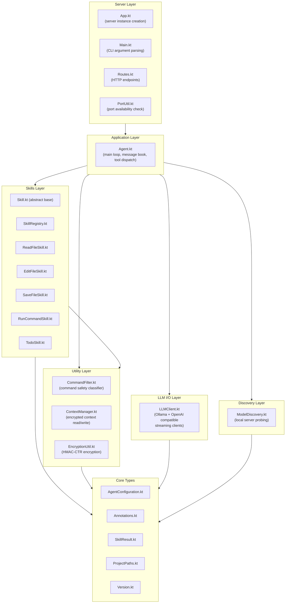
```mermaid
flowchart TB
    subgraph SERVER["Server Layer"]
        direction LR
        S1["App.kt<br/>(server instance creation)"]
        S2["Main.kt<br/>(CLI argument parsing)"]
        S3["Routes.kt<br/>(HTTP endpoints)"]
        S4["PortUtil.kt<br/>(port availability check)"]
    end

    subgraph APP["Application Layer"]
        A1["Agent.kt<br/>(main loop, message book, tool dispatch)"]
    end

    subgraph LLM["LLM I/O Layer"]
        L1["LLMClient.kt<br/>(Ollama + OpenAI compatible<br/>streaming clients)"]
    end

    subgraph DISCOVERY["Discovery Layer"]
        D1["ModelDiscovery.kt<br/>(local server probing)"]
    end

    subgraph SKILLS["Skills Layer"]
        SK1["Skill.kt (abstract base)"]
        SK2["SkillRegistry.kt"]
        SK3["ReadFileSkill.kt"]
        SK4["EditFileSkill.kt"]
        SK5["SaveFileSkill.kt"]
        SK6["RunCommandSkill.kt"]
        SK7["TodoSkill.kt"]
    end

    subgraph UTIL["Utility Layer"]
        U1["CommandFilter.kt<br/>(command safety classifier)"]
        U2["ContextManager.kt<br/>(encrypted context read/write)"]
        U3["EncryptionUtil.kt<br/>(HMAC-CTR encryption)"]
    end

    subgraph CORE["Core Types"]
        C1["AgentConfiguration.kt"]
        C2["Annotations.kt"]
        C3["SkillResult.kt"]
        C4["ProjectPaths.kt"]
        C5["Version.kt"]
    end

    SERVER --> APP
    APP --> LLM
    APP --> DISCOVERY
    APP --> SKILLS
    APP --> UTIL
    SKILLS --> UTIL
    SKILLS --> CORE
    UTIL --> CORE
    LLM --> CORE
    DISCOVERY --> CORE
```

### 2.2 Module Dependency Invariants

The following invariants are core architectural constraints:

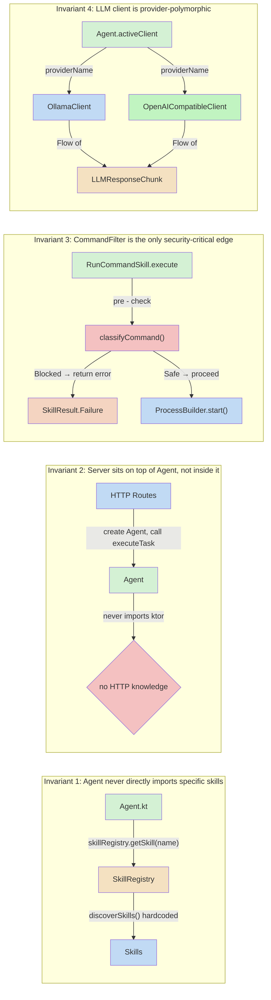
```mermaid
flowchart LR
    subgraph INV1["Invariant 1: Agent never directly imports specific skills"]
        direction TB
        A[Agent.kt] -->|" skillRegistry.getSkill(name) "| SR[SkillRegistry]
        SR -->|" discoverSkills() hardcoded "| SK[Skills]
        style A fill: #d4f1d4
        style SR fill: #f4e1c1
        style SK fill: #c1daf4
    end

    subgraph INV2["Invariant 2: Server sits on top of Agent, not inside it"]
        direction TB
        HTTP[HTTP Routes] -->|create Agent, call executeTask| AG[Agent]
        AG -->|never imports ktor| X{no HTTP knowledge}
        style HTTP fill: #c1daf4
        style AG fill: #d4f1d4
        style X fill: #f4c1c1
    end

    subgraph INV3["Invariant 3: CommandFilter is the only security-critical edge"]
        direction TB
        RC["RunCommandSkill.execute"] -->|pre - check| CF["classifyCommand()"]
        CF -->|Blocked → return error| E["SkillResult.Failure"]
        CF -->|Safe → proceed| PB["ProcessBuilder.start()"]
        style RC fill: #d4f1d4
        style CF fill: #f4c1c1
        style E fill: #f4d4c1
        style PB fill: #c1daf4
    end

    subgraph INV4["Invariant 4: LLM client is provider-polymorphic"]
        direction TB
        AG2[Agent.activeClient] -->|providerName| OL[OllamaClient]
        AG2 -->|providerName| OA[OpenAICompatibleClient]
        OL -->|Flow of| CH[LLMResponseChunk]
        OA -->|Flow of| CH
        style AG2 fill: #d4f1d4
        style OL fill: #c1daf4
        style OA fill: #c1f4c1
        style CH fill: #f4e1c1
    end
```

### 2.3 Project Layout

```
src/main/kotlin/gradum/
├── AgentConfiguration.kt          # Agent runtime configuration (model/provider/temperature, etc.)
├── Annotations.kt                 # @ExperimentalApi, @DangerousOperation compile-time annotations
├── ProjectPaths.kt                # OUTPUT_DIRECTORY path constant
├── SkillResult.kt                 # SkillResult sealed class + makeSuccess/makeFailure factories
├── Version.kt                     # GRADUM_VERSION constant
│
├── agent/
│   └── Agent.kt                   # Agent main class: main loop, message management, tool dispatch, guardrail checks, emitEvent
│
├── client/
│   └── LLMClient.kt               # OllamaClient + OpenAICompatibleClient + ToolCallEntry + TokenUsageSnapshot
│
├── discovery/
│   └── ModelDiscovery.kt          # discoverModels() + resolveModel() + server probing
│
├── server/
│   ├── App.kt                     # createServerInstance() + Application.module() assembly
│   ├── Main.kt                    # main() + CLI argument parsing + printUsage()
│   ├── Routes.kt                  # /events, /health, /models, /skills routes
│   ├── PortUtil.kt                # isPortAvailable() + findAvailablePort()
│   ├── ServerConfiguration.kt     # Server configuration data class
│
├── skill/
│   ├── Skill.kt                   # Skill abstract base class
│   ├── SkillRegistry.kt           # Registry (includes discoverSkills)
│   ├── ReadFileSkill.kt           # File reading (line range/MD5/size limits)
│   ├── EditFileSkill.kt           # File editing (sequential/atomic modes)
│   ├── SaveFileSkill.kt           # File writing (auto mkdir parent directories)
│   ├── RunCommandSkill.kt         # Shell command execution (blocking/detached + CommandFilter)
│   ├── ExploreProjectSkill.kt     # Project tree scan (depth 1..14, truncated build/dependency dirs)
│   ├── TodoSkill.kt               # TodoManager singleton + TodoSkill + CompletePlanSkill
│
└── util/
    ├── CommandFilter.kt           # classifyCommand() + path protection rules
    ├── ContextManager.kt          # Encrypted context read/write + history cleanup
    └── EncryptionUtil.kt          # encryptMessageContent() + decryptMessageContent() + HMAC-CTR

src/main/resources/
├── logback.xml                    # Logback logging configuration (Console + per-module levels)
├── red_line_keywords.txt          # Red line keywords (user-local, gitignored)
├── red_line_keywords.txt.example  # Red line keywords template (git-tracked)
└── META-INF/
    └── services/
        └── gradum.skill.Skill     # ServiceLoader skill descriptor (built-in skills)

prompts/                           # Read at runtime from local directory
└── system_prompt.md               # System prompt (loaded by the Agent at runtime)

output/                            # Generated at runtime on local storage
├── context.json                   # Encrypted conversation context (written by ContextManager)
└── run_cmd/
    └── {timestamp}.log            # Detached-mode command logs
```

### 2.4 Runtime Data Flow (End-to-End)

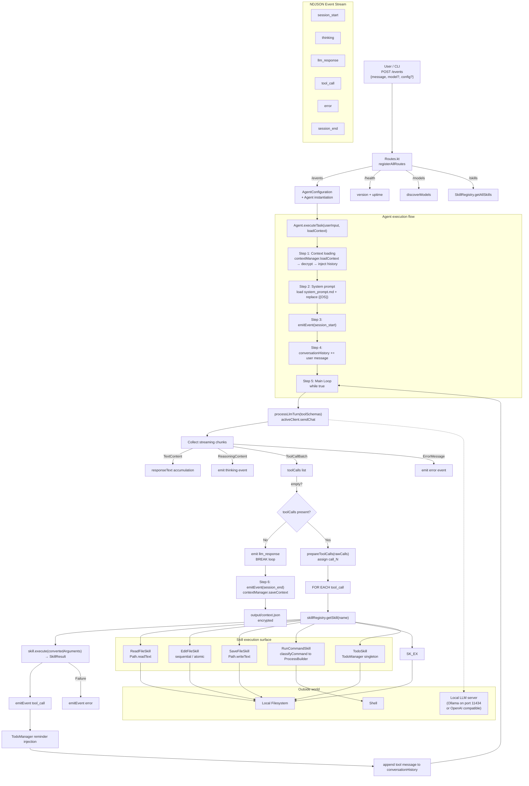
```mermaid
flowchart TD
    U["User / CLI<br/>POST /events<br/>{message, model?, config?}"] --> R[Routes.kt<br/>registerAllRoutes]
    R -->|/events| R1[AgentConfiguration<br/>+ Agent instantiation]
    R -->|/health| R2[version + uptime]
    R -->|/models| R3[discoverModels]
    R -->|/skills| R4[SkillRegistry.getAllSkills]
    R1 --> A["Agent.executeTask(userInput, loadContext)"]

    subgraph AGENT_FLOW["Agent execution flow"]
        A --> C1["Step 1: Context loading<br/>contextManager.loadContext → decrypt → inject history"]
        C1 --> C2["Step 2: System prompt<br/>load system_prompt.md + replace {{OS}}"]
        C2 --> C3["Step 3: emitEvent(session_start)"]
        C3 --> C4["Step 4: conversationHistory += user message"]
        C4 --> LOOP[Step 5: Main Loop<br/>while true]
    end

    LOOP --> LLM["processLlmTurn(toolSchemas)<br/>activeClient.sendChat"]
    LLM --> CHUNK[Collect streaming chunks]
    CHUNK -->|TextContent| RESP[responseText accumulation]
    CHUNK -->|ReasoningContent| THINK[emit thinking event]
    CHUNK -->|ToolCallBatch| TCBATCH[toolCalls list]
    CHUNK -->|ErrorMessage| ERREV[emit error event]
    TCBATCH -->|empty?| BRANCH{"toolCalls present?"}
    BRANCH -->|No| NO_TOOL[emit llm_response<br/>BREAK loop]
    BRANCH -->|Yes| PREP["prepareToolCalls(rawCalls)<br/>assign call_N"]
    PREP --> FOR[FOR EACH tool_call]
    FOR --> GS["skillRegistry.getSkill(name)"]
    GS --> EX["skill.execute(convertedArguments) → SkillResult"]
    EX --> EMIT[emitEvent tool_call]
    EX -->|Failure| EMITERR[emitEvent error]
    EMIT --> REM[TodoManager reminder injection]
    REM --> APPENDA[append tool message to conversationHistory]
    APPENDA --> LOOP
    NO_TOOL --> END["Step 6: emitEvent(session_end)<br/>contextManager.saveContext"]
    LLM -.-> LLM_SRV["Local LLM server<br/>(Ollama on port 11434<br/>or OpenAI compatible)"]

    subgraph EVENT_STREAM["NDJSON Event Stream"]
        direction LR
        EV1[session_start]
        EV2[thinking]
        EV3[llm_response]
        EV4[tool_call]
        EV5[error]
        EV6[session_end]
    end

    subgraph SKILL_EXEC["Skill execution surface"]
        SK_RD[ReadFileSkill<br/>Path.readText]
        SK_ED[EditFileSkill<br/>sequential / atomic]
        SK_SV[SaveFileSkill<br/>Path.writeText]
        SK_RC[RunCommandSkill<br/>classifyCommand to ProcessBuilder]
        SK_TD[TodoSkill<br/>TodoManager singleton]
    end

    GS --> SK_RD
    GS --> SK_ED
    GS --> SK_SV
    GS --> SK_RC
    GS --> SK_EX
    GS --> SK_TD

    subgraph OUTSIDE["Outside world"]
        FS[Local Filesystem]
        SH[Shell]
        LLM_SRV
    end

    SK_RD --> FS
    SK_ED --> FS
    SK_SV --> FS
    SK_RC --> SH
    SK_EX --> FS
    SK_TD --> FS
    END --> OUT[output/context.json<br/>encrypted]
```

### 2.5 Agent Main Loop Details

The precise flow of `Agent.executeTask(userInput, loadPreviousContext)`:


```mermaid
flowchart TD
    START([executeTask called]) --> INIT
    INIT[Initialize] --> CTX{loadPreviousContext?}
    CTX -- Yes --> LOAD_CTX["contextManager.loadContext()<br/>decrypt → inject conversationHistory"]
    CTX -- No --> PROMPT
    LOAD_CTX --> PROMPT["Load system_prompt.md<br/>replace {{OS}} placeholder"]
    PROMPT --> INJECT["Insert system prompt as role=system<br/>(if context was not loaded)"]
    INJECT --> EMIT_START["emitEvent(session_start)<br/>{version, model, think, contextLoaded, contextMessages}"]
    EMIT_START --> ADD_USER["conversationHistory += user message"]
    ADD_USER --> LLM_CALL["processLlmTurn(toolSchemas)"]
    LLM_CALL --> CHUNK_STREAM["Collect Flow of LLMResponseChunk:"]
    CHUNK_STREAM --> TEXT["TextContent → accumulate in responseText"]
    CHUNK_STREAM --> THINK["ReasoningContent → emit thinking event"]
    CHUNK_STREAM --> TOOL["ToolCallBatch → save as toolCalls List"]
    CHUNK_STREAM --> ERR_MSG["ErrorMessage → emit error event"]
    TOOL --> GUARDRAIL["Guardrail Checks<br/>redLineKeywords?<br/>repetitive_loop?"]
    GUARDRAIL --> REDLINE{Red line keyword hit?}
    REDLINE -- No --> REPLOOP{Repetitive response?}
    REDLINE -- Yes --> REDLINE_COUNT["increment redLineHitCounter<br/>emit guardrail event"]
    REDLINE_COUNT --> REDLINE_CHECK{"hits >= maxRedLineHits?"}
    REDLINE_CHECK -- No --> REPLOOP
    REDLINE_CHECK -- Yes --> REDLINE_REVOKE["append assistant message<br/>emitEvent mission_revoked<br/>reason: red_line_violation<br/>emitEvent session_end (aborted)<br/>BREAK loop"]
    REPLOOP -- No --> DECISION{"toolCalls present and non-empty?"}
    REPLOOP -- Yes --> REP_COUNT["add to repeatedResponseTracker<br/>emit guardrail event"]
    REP_COUNT --> REP_CHECK{"count >= maxRepeatedResponses?"}
    REP_CHECK -- No --> DECISION
    REP_CHECK -- Yes --> REP_REVOKE["append assistant message<br/>emitEvent mission_revoked<br/>reason: repetitive_loop<br/>emitEvent session_end (aborted)<br/>BREAK loop"]
    DECISION -- No --> HAS_RESPONSE{responseText non-empty?}
    HAS_RESPONSE -- Yes --> EMIT_RESP["emitEvent llm_response<br/>append assistant message<br/>BREAK loop"]
    HAS_RESPONSE -- No --> LLM_CALL
    DECISION -- Yes --> PREP["prepareToolCalls(rawCalls)<br/>assign call_N sequence IDs"]
    PREP --> APPEND_ASSISTANT["append assistant message<br/>(including tool_calls[])"]
    APPEND_ASSISTANT --> FOR_EACH["FOR EACH processedCall"]
    FOR_EACH --> GET_SKILL["skillRegistry.getSkill(name)"]
    GET_SKILL --> CONVERT_ARGS["functionArguments Map<JsonElement><br/>→ Map<String, Any>"]
    CONVERT_ARGS --> EXECUTE["skill.execute(convertedArguments)"]
    EXECUTE --> MAP_RESULT["SkillResult → Map<br/>{success, ...result/error}"]
    MAP_RESULT --> EMIT_TOOL["emitEvent tool_call<br/>{tool, arguments, toolCallId, success, result}"]
    EMIT_TOOL --> ERR_CHECK{success == false?}
    ERR_CHECK -- Yes --> EMIT_ERR["emitEvent error<br/>{code, message, tool, toolCallId}"]
    ERR_CHECK -- No --> TODO_REM
    EMIT_ERR --> TODO_REM["TodoManager.getTaskReminder()<br/>append to tool result tail"]
    TODO_REM --> PROV_FORMAT["provider format<br/>OpenAI: tool_call_id + role=tool<br/>Ollama: role=tool + content"]
    PROV_FORMAT --> APPEND_TOOL["append tool message to conversationHistory"]
    APPEND_TOOL --> FOR_EACH
    FOR_EACH --> MORE{More tool calls?}
    MORE -- Yes --> FOR_EACH
    MORE -- No --> LLM_CALL
    EMIT_RESP --> END_SESSION["emitEvent session_end<br/>{version, elapsedSeconds, model, tokenUsage}"]
    END_SESSION --> SAVE_CTX["contextManager.saveContext<br/>(history, model, emptySet())"]
    SAVE_CTX --> WRITE_FILE["filter system/tool messages<br/>encrypt user/assistant content<br/>write to output/context.json<br/>keep only most recent 60 messages"]
    WRITE_FILE --> DONE([Agent finished])
    style START fill: #d4f1d4
    style DONE fill: #f4c1c1
```

1. **Initialization**:
    - If `loadPreviousContext=true`, call `contextManager.loadContext()`, decrypt, and inject into `conversationHistory`
    - Read the system prompt from classpath resource `system_prompt.md`, replacing the `{{OS}}` placeholder with
      `System.getProperty("os.name") + " " + os.version`
    - Insert the system prompt as a `role="system"` message into the conversation history (if context was not loaded)
    - Emit a `session_start` event: `{version, model, think, contextLoaded, contextMessages}`

2. **Main Loop** (`while true`):
    - Call `processLlmTurn(toolSchemas)`, which returns `AgentTurnResult(responseText, toolCalls, errorMessage)`
    - Collect streaming chunks from activeClient (determined by `providerName` — Ollama or OpenAI):
        - `TextContent` → accumulate into responseText
        - `ReasoningContent` → accumulate as thinking, **immediately emit a `thinking` event** (if there is content)
        - `ToolCallBatch` → save as `toolCalls: List<ToolCallEntry>`
        - `ErrorMessage` → emit an `error` event
    - **Guardrail checks** are evaluated against `responseText` before processing tool calls:
        - **Red line keyword check**: If the response contains any configured `redLineKeywords`, increment
          `redLineHitCounter`. When the counter reaches `maxRedLineHits` (default 3), append the assistant message, emit
          `mission_revoked` (reason: `red_line_violation`), emit `session_end` with `aborted: true`, and **BREAK**.
        - **Repetitive response check**: If the response is an exact duplicate of the previous turn or contains
          repetitious sentences (same sentence ≥3 times), it is added to `repeatedResponseTracker`. When the tracker
          reaches `maxRepeatedResponses` (default 3), append the assistant message, emit `mission_revoked` (reason:
          `repetitive_loop`), emit `session_end` with `aborted: true`, and **BREAK**.
        - Non-anomalous responses clear the repetitive tracker.
    - If `toolCalls == null or empty` and has responseText:
        - Emit an `llm_response` event
        - Append the assistant message, **BREAK the loop**
    - Otherwise, there are tool calls:
    - `prepareToolCalls(rawCalls)`: allocate `call_N` sequences for items without call_id
    - Append the assistant message (including `tool_calls[]` or function list)
    - **FOR each processedCall**:
        - Get the skill via `skillRegistry.getSkill(name)`
        - Convert raw `functionArguments: Map<String, JsonElement>` to `MutableMap<String, Any>` (
          strings/booleans/numbers)
        - For `read_file` requests without `lineRange`, add the path to `fullyReadFiles` (for subsequent context
          optimization)
        - Call `skill.execute(convertedArguments)` → `SkillResult`
        - Map to `Map { success, ...result fields or error }`
        - Emit a `tool_call` event: `{tool, arguments, toolCallId, success, result}`
        - If `success=false`: emit an `error` event: `{code, message, tool, toolCallId}`
        - **Todo Reminder Injection**: Call `getTodoManagerInstance().getTaskReminder()`, and if not null, append the
          reminder text to the tool result tail before writing to history
        - Determine the tool message format based on provider (OpenAI: `tool_call_id` + `role="tool"`; Ollama: direct
          content)
        - Append the tool message to conversationHistory

3. **Session End**:
    - Emit `session_end`: `{version, elapsedSeconds, model, tokenUsage}` (with `aborted: true` when terminated by
      guardrail)
    - `contextManager.saveContext(history, model, fullyReadFiles)` — **skipped** when `aborted: true` (revoked sessions
      leave no trace)
        - Filter system/tool messages, simplify `user/assistant` messages
        - Encrypt the content field of each user/assistant message (set `_encrypted=true`)
        - Write to `output/context.json`

### 2.6 NDJSON Event Stream

Each event is one line of JSON. The following sequence diagram shows the complete event lifecycle:

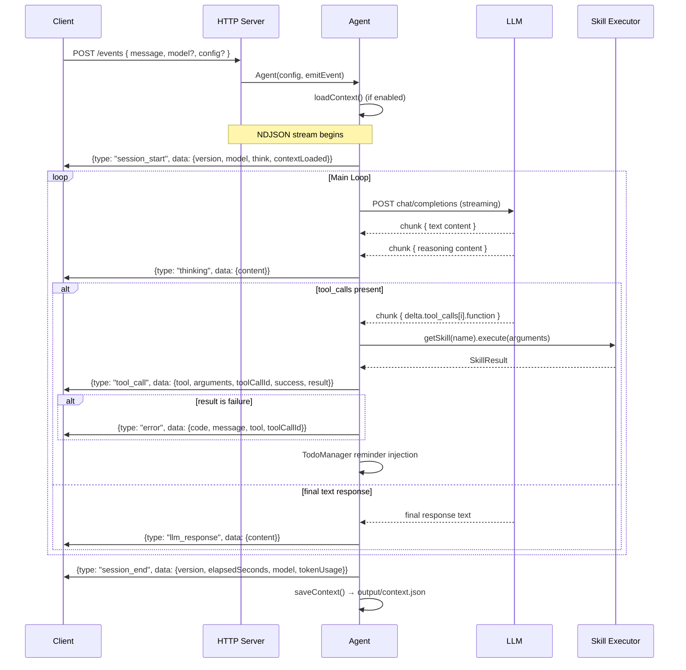
```mermaid
sequenceDiagram
    participant Client
    participant Server as HTTP Server
    participant Agent
    participant LLM
    participant Skill as Skill Executor
    Client ->> Server: POST /events { message, model?, config? }
    Server ->> Agent: Agent(config, emitEvent)
    Agent ->> Agent: loadContext() (if enabled)
    Note over Agent, Server: NDJSON stream begins
    Agent ->> Client: {type: "session_start", data: {version, model, think, contextLoaded}}

    loop Main Loop
        Agent ->> LLM: POST chat/completions (streaming)
        LLM -->> Agent: chunk { text content }
        LLM -->> Agent: chunk { reasoning content }
        Agent ->> Client: {type: "thinking", data: {content}}

        alt tool_calls present
            LLM -->> Agent: chunk { delta.tool_calls[i].function }
            Agent ->> Skill: getSkill(name).execute(arguments)
            Skill -->> Agent: SkillResult
            Agent ->> Client: {type: "tool_call", data: {tool, arguments, toolCallId, success, result}}
            alt result is failure
                Agent ->> Client: {type: "error", data: {code, message, tool, toolCallId}}
            end
            Agent ->> Agent: TodoManager reminder injection
        else final text response
            LLM -->> Agent: final response text
            Agent ->> Client: {type: "llm_response", data: {content}}
        end
    end

    Agent ->> Client: {type: "session_end", data: {version, elapsedSeconds, model, tokenUsage}}
    Agent ->> Agent: saveContext() → output/context.json
```

#### Event Type Summary

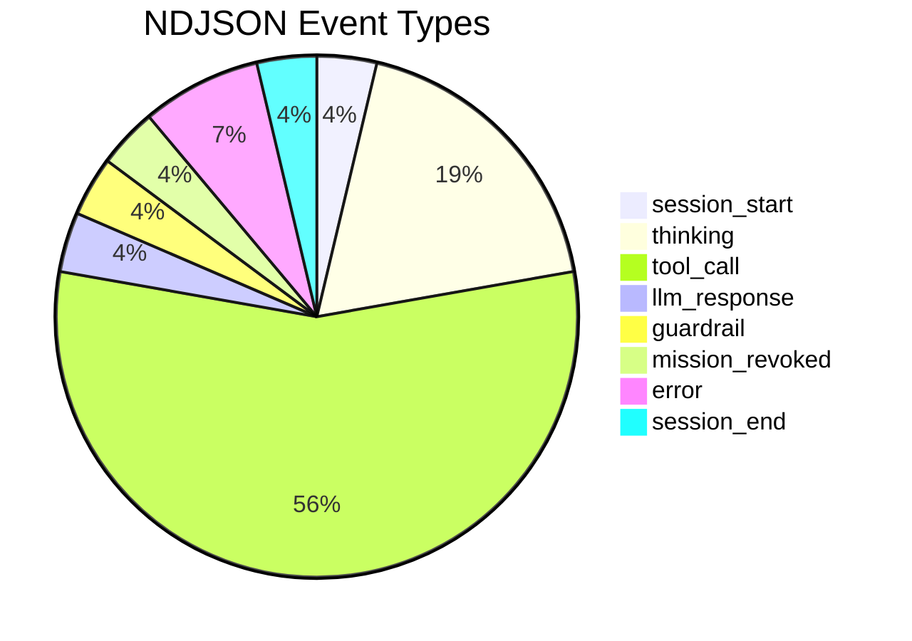
```mermaid
pie
    title NDJSON Event Types
    "session_start": 1
    "thinking": 5
    "tool_call": 15
    "llm_response": 1
    "guardrail": 1
    "mission_revoked": 1
    "error": 2
    "session_end": 1
```

| `type`            | Description                                   | Typical `data` fields                                                                           |
|-------------------|-----------------------------------------------|-------------------------------------------------------------------------------------------------|
| `session_start`   | Session started                               | `version`, `model`, `think`, `contextLoaded`, `contextMessages`                                 |
| `thinking`        | LLM thinking content (if thinking is enabled) | `content`                                                                                       |
| `llm_response`    | LLM final text response                       | `content`                                                                                       |
| `guardrail`       | Guardrail warning (non-fatal anomaly)         | `type` (repeated_response / red_line_hit), `detail`, `repeatedCount` / `hitCount`, `maxAllowed` |
| `mission_revoked` | Session revoked (conversation must be erased) | `reason` (red_line_violation / repetitive_loop / tool_runaway), `details`                       |
| `tool_call`       | A single tool call and its result             | `tool`, `arguments`, `toolCallId`, `success`, `result`                                          |
| `error`           | Error (LLM or tool)                           | `code`, `message`, `source` (LLM) or `tool`+`toolCallId` (tool)                                 |
| `session_end`     | Session ended                                 | `version`, `elapsedSeconds`, `model`, `tokenUsage: {promptTokens, completionTokens, ...}`       |

#### Event Order Invariants

- `session_start` is always the first event after `conversationHistory`
- `tool_call` events are emitted in the order of the `tool_calls[]` returned by the LLM
- `session_end` is always the final event (with `aborted: true` when terminated by guardrail)
- `mission_revoked` is always immediately followed by `session_end` (aborted), then stream end
- `guardrail` events are emitted **per violation** before the final `mission_revoked` (if multiple violations)
- `emitEvent` is fire-and-forget: an HTTP client disconnect does not affect Agent execution

#### `tool_call.result` Fields by Skill

| Skill                  | Result Fields                                                                                                                                                                                                                                                |
|------------------------|--------------------------------------------------------------------------------------------------------------------------------------------------------------------------------------------------------------------------------------------------------------|
| **read_file**          | `{path, lineRange, totalLines, contentHash, content}` (last 2 keep full content; older ones strip `content` from conversation history via `historyKeepCount=2`)                                                                                              |
| **edit_file**          | `{path, editsApplied, totalEdits}` (or error fields)                                                                                                                                                                                                         |
| **save_file**          | `{path, bytesWritten, created}`                                                                                                                                                                                                                              |
| **run_cmd** (blocking) | `{command, exitCode, output, timedOut}` (output keeps full content; older ones strip `output` via `historyKeepCount=2`)                                                                                                                                     |
| **run_cmd** (detached) | `{command, detached, processId, logPath, message}`                                                                                                                                                                                                           |
| **to_do**              | `{totalTasks, currentTask, currentIndex}`                                                                                                                                                                                                                    |
| **finish_to_do_item**  | `{completed, totalTasks, currentTask?}`                                                                                                                                                                                                                      |

### 2.7 LLM Client Protocol Comparison

The Agent handles provider branching at two key points:

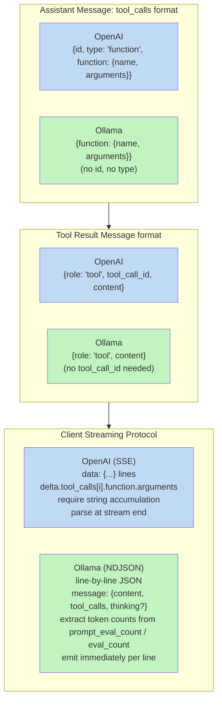
```mermaid
flowchart TB
    subgraph ASSISTANT["Assistant Message: tool_calls format"]
        OAI1["OpenAI<br/>{id, type: 'function', function: {name, arguments}}"]
        OLL1["Ollama<br/>{function: {name, arguments}}<br/>(no id, no type)"]
    end

    subgraph TOOL_MSG["Tool Result Message format"]
        OAI2["OpenAI<br/>{role: 'tool', tool_call_id, content}"]
        OLL2["Ollama<br/>{role: 'tool', content}<br/>(no tool_call_id needed)"]
    end

    subgraph STREAM["Client Streaming Protocol"]
        OAI3["OpenAI (SSE)<br/>data: {...} lines<br/>delta.tool_calls[i].function.arguments<br/>require string accumulation<br/>parse at stream end"]
        OLL3["Ollama (NDJSON)<br/>line-by-line JSON<br/>message: {content, tool_calls, thinking?}<br/>extract token counts from prompt_eval_count / eval_count<br/>emit immediately per line"]
    end

    ASSISTANT --> TOOL_MSG
    TOOL_MSG --> STREAM
    style OAI1 fill: #c1daf4
    style OAI2 fill: #c1daf4
    style OAI3 fill: #c1daf4
    style OLL1 fill: #c1f4c1
    style OLL2 fill: #c1f4c1
    style OLL3 fill: #c1f4c1
```

### 2.8 Context Persistence and Encryption

`ContextManager(outputDirectory)` maintains an encrypted conversation history file in `output/context.json`.

#### Context Save and Load Flow

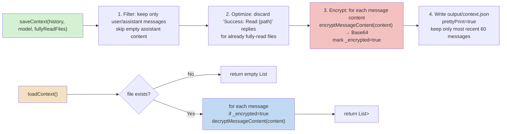
```mermaid
flowchart LR
    SAVE["saveContext(history, model, fullyReadFiles)"] --> FILTER["1. Filter: keep only user/assistant messages<br/>skip empty assistant content"]
    FILTER --> OPTIMIZE["2. Optimize: discard 'Success: Read {path}' replies<br/>for already fully-read files"]
    OPTIMIZE --> ENCRYPT["3. Encrypt: for each message content<br/>encryptMessageContent(content) → Base64<br/>mark _encrypted=true"]
    ENCRYPT --> WRITE["4. Write output/context.json<br/>prettyPrint=true<br/>keep only most recent 60 messages"]
    LOAD["loadContext()"] --> FILE_EXISTS{file exists?}
    FILE_EXISTS -- No --> EMPTY[return empty List]
    FILE_EXISTS -- Yes --> DECRYPT["for each message<br/>if _encrypted=true<br/>decryptMessageContent(content)"]
    DECRYPT --> RETURN["return List<Map<String, Any>>"]
    style SAVE fill: #d4f1d4
    style LOAD fill: #f4e1c1
    style ENCRYPT fill: #f4c1c1
    style DECRYPT fill: #c1daf4
```

#### Encryption Scheme Details

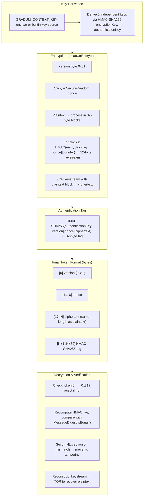
```mermaid
flowchart TD
    subgraph KEY["Key Derivation"]
        K1["GRADUM_CONTEXT_KEY env var or builtin key source"]
        K2["Derive 2 independent keys via HMAC-SHA256:<br/>encryptionKey, authenticationKey"]
        K1 --> K2
    end

    subgraph ENCRYPT["Encryption (hmacCtrEncrypt)"]
        V["version byte 0x81"]
        N["16-byte SecureRandom nonce"]
        P["Plaintext → process in 32-byte blocks"]
        H["For block i: HMAC(encryptionKey, nonce||counter) → 32-byte keystream"]
        X["XOR keystream with plaintext block → ciphertext"]
    end

    subgraph TAG["Authentication Tag"]
        T["HMAC-SHA256(authenticationKey, version||nonce||ciphertext) → 32-byte tag"]
    end

    subgraph FORMAT["Final Token Format (bytes)"]
        B0["[0] version (0x81)"]
        B1["[1..16] nonce"]
        B2["[17..N] ciphertext (same length as plaintext)"]
        B3["[N+1..N+32] HMAC-SHA256 tag"]
    end

    subgraph DECRYPT["Decryption & Verification"]
        D1["Check token[0] == 0x81? reject if not"]
        D2["Recompute HMAC tag, compare with MessageDigest.isEqual()"]
        D3["SecurityException on mismatch → prevents tampering"]
        D4["Reconstruct keystream → XOR to recover plaintext"]
    end

    KEY --> ENCRYPT
    ENCRYPT --> TAG
    TAG --> FORMAT
    FORMAT --> DECRYPT
```

- **Algorithm**: Custom **HMAC-CTR** stream encryption + **HMAC-SHA256** authentication tag
- **Key derivation**: Based on the `GRADUM_CONTEXT_KEY` environment variable or built-in key source; derive two
  independent keys for the two different purposes "encrypt" and "authenticate" using HMAC-SHA256
- **Encrypted token format** (by byte):
    - `[0]` — version byte (0x81, for future algorithm upgrade detection)
    - `[1..16]` — random nonce (generated by `SecureRandom`)
    - `[17..N]` — ciphertext (same length as plaintext)
    - `[N+1..N+32]` — HMAC-SHA256 authentication tag (covers version+nonce+ciphertext)
- **CTR mode implementation** (`hmacCtrEncrypt`):
    - Process plaintext in 32-byte blocks
    - For each block i, compute `HMAC(encryptionKey, nonce || counter_bytes)` → 32-byte keystream block
    - XOR byte-by-byte to mix with plaintext
- **Integrity check during decryption**: Recompute the tag first, compare against stored tag with
  `MessageDigest.isEqual()`, throw `SecurityException` on mismatch
- **Version byte check**: If `token[0] != 0x81`, reject decryption

This ensures:

1. Context files cannot be tampered with offline (HMAC tag verification)
2. Context content cannot be read offline (XOR encryption stream)
3. Algorithm can be upgraded (version byte)
4. Zero external encryption library dependencies — entirely based on the Java standard library `javax.crypto.Mac`

### 2.9 Model Auto-Discovery

`discoverModels(timeoutSeconds = 1.5)` probes 4 known local server ports in parallel:

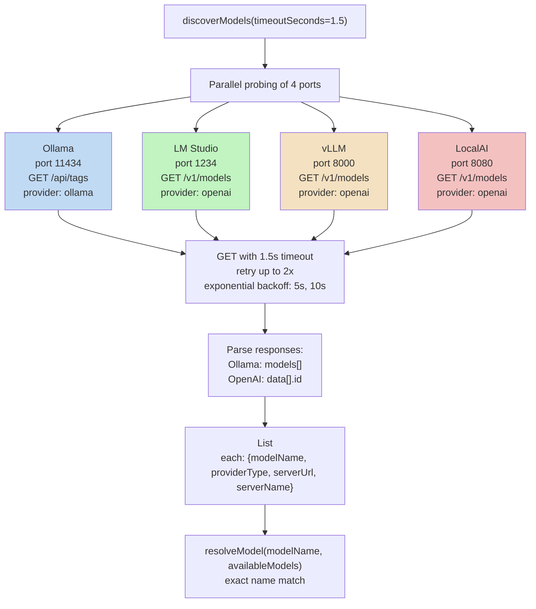
```mermaid
flowchart TB
    START["discoverModels(timeoutSeconds=1.5)"] --> PARALLEL[Parallel probing of 4 ports]
    PARALLEL --> P1[Ollama<br/>port 11434<br/>GET /api/tags<br/>provider: ollama]
    PARALLEL --> P2[LM Studio<br/>port 1234<br/>GET /v1/models<br/>provider: openai]
    PARALLEL --> P3[vLLM<br/>port 8000<br/>GET /v1/models<br/>provider: openai]
    PARALLEL --> P4[LocalAI<br/>port 8080<br/>GET /v1/models<br/>provider: openai]
    P1 --> R1["GET with 1.5s timeout<br/>retry up to 2x<br/>exponential backoff: 5s, 10s"]
    P2 --> R1
    P3 --> R1
    P4 --> R1
    R1 --> PARSE["Parse responses:<br/>Ollama: models[]<br/>OpenAI: data[].id"]
    PARSE --> RESULT["List<ModelEntry><br/>each: {modelName, providerType, serverUrl, serverName}"]
    RESULT --> RESOLVE["resolveModel(modelName, availableModels)<br/>exact name match"]
    style P1 fill: #c1daf4
    style P2 fill: #c1f4c1
    style P3 fill: #f4e1c1
    style P4 fill: #f4c1c1
```

### 2.10 HTTP Server Layer

#### App.kt + Main.kt

- `createServerInstance(config)`: Call `embeddedServer(Netty, host, port) { module(config) }` to create a Ktor
  application
- `Application.module(config)`: Call `registerAllRoutes()`
- `main(args)`: Parse CLI arguments, optionally call `findAvailablePort()` to probe available ports when `--auto-port`
  is specified
- Add JVM shutdown hook to call `server.stop(grace = 3000)`

#### Routes.kt

`registerAllRoutes()` registers four routes:

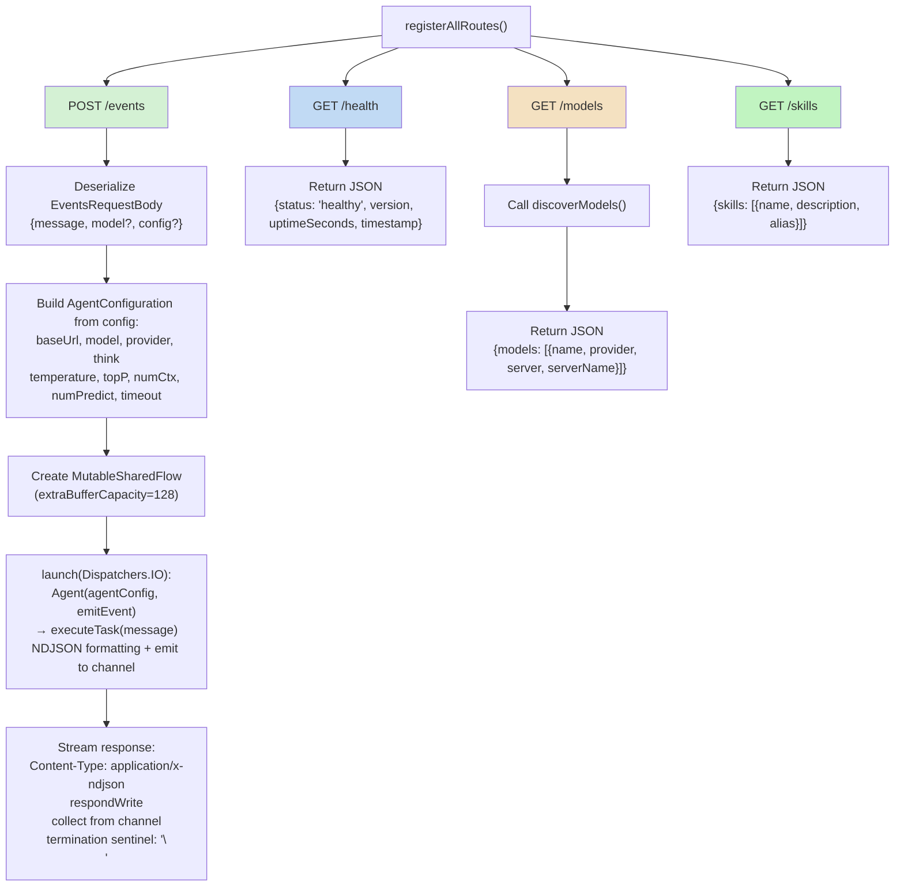
```mermaid
flowchart TD
    R["registerAllRoutes()"] --> POST[POST /events]
    R --> GH[GET /health]
    R --> GM[GET /models]
    R --> GS[GET /skills]
    POST --> P1["Deserialize EventsRequestBody<br/>{message, model?, config?}"]
    P1 --> P2["Build AgentConfiguration from config:<br/>baseUrl, model, provider, think<br/>temperature, topP, numCtx, numPredict, timeout"]
    P2 --> P3["Create MutableSharedFlow<String><br/>(extraBufferCapacity=128)"]
    P3 --> P4["launch(Dispatchers.IO):<br/>Agent(agentConfig, emitEvent)<br/>→ executeTask(message)<br/>NDJSON formatting + emit to channel"]
    P4 --> P5["Stream response:<br/>Content-Type: application/x-ndjson<br/>respondWrite<br/>collect from channel<br/>termination sentinel: '\\n'"]
    GH --> H1["Return JSON<br/>{status: 'healthy', version, uptimeSeconds, timestamp}"]
    GM --> M1["Call discoverModels()"]
    M1 --> M2["Return JSON<br/>{models: [{name, provider, server, serverName}]}"]
    GS --> S1["Return JSON<br/>{skills: [{name, description, alias}]}"]
    style POST fill: #d4f1d4
    style GH fill: #c1daf4
    style GM fill: #f4e1c1
    style GS fill: #c1f4c1
```

---

## 3. Core Subsystems

### 3.1 EditFileSkill State Machine

When editing a file, two different execution paths are taken based on the `mode` parameter:

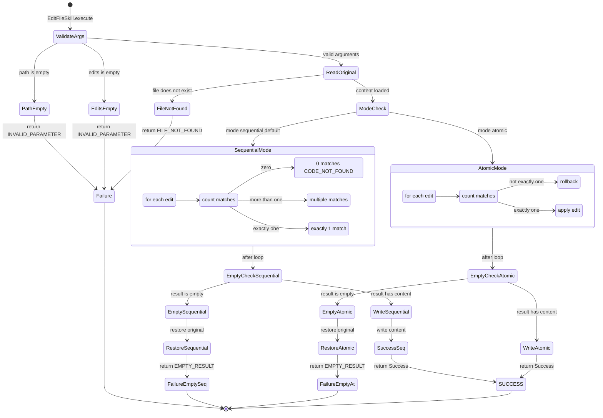
```mermaid
stateDiagram-v2
    [*] --> ValidateArgs: EditFileSkill.execute
    ValidateArgs --> PathEmpty: path is empty
    ValidateArgs --> EditsEmpty: edits is empty
    ValidateArgs --> ReadOriginal: valid arguments
    PathEmpty --> Failure: return INVALID_PARAMETER
    EditsEmpty --> Failure: return INVALID_PARAMETER
    ReadOriginal --> FileNotFound: file does not exist
    FileNotFound --> Failure: return FILE_NOT_FOUND
    ReadOriginal --> ModeCheck: content loaded
    ModeCheck --> SequentialMode: mode sequential default
    ModeCheck --> AtomicMode: mode atomic

    state SequentialMode {
        direction LR
        S1: for each edit
        S2: count matches
        S3: 0 matches CODE_NOT_FOUND
        S4: multiple matches
        S5: exactly 1 match
        S1 --> S2
        S2 --> S3: zero
        S2 --> S4: more than one
        S2 --> S5: exactly one
    }

    state AtomicMode {
        direction LR
        A1: for each edit
        A2: count matches
        A3: rollback
        A4: apply edit
        A1 --> A2
        A2 --> A3: not exactly one
        A2 --> A4: exactly one
    }

    SequentialMode --> EmptyCheckSequential: after loop
    AtomicMode --> EmptyCheckAtomic: after loop
    EmptyCheckSequential --> EmptySequential: result is empty
    EmptyCheckSequential --> WriteSequential: result has content
    EmptySequential --> RestoreSequential: restore original
    RestoreSequential --> FailureEmptySeq: return EMPTY_RESULT
    WriteSequential --> SuccessSeq: write content
    SuccessSeq --> SUCCESS: return Success
    EmptyCheckAtomic --> EmptyAtomic: result is empty
    EmptyCheckAtomic --> WriteAtomic: result has content
    EmptyAtomic --> RestoreAtomic: restore original
    RestoreAtomic --> FailureEmptyAt: return EMPTY_RESULT
    WriteAtomic --> SUCCESS: return Success
    Failure --> [*]
    FailureEmptySeq --> [*]
    FailureEmptyAt --> [*]
    SUCCESS --> [*]
```

**Key implementation details**:

- `countOccurrences(substring)`: Kotlin top-level function, exact substring count match (no regex usage, avoids special
  character interpretation)
- `buildPartialFailureMessage`: In sequential mode, reports the number of successfully applied edits on failure
- Result fields: `{path, editsApplied, totalEdits}`
- Error codes: `CODE_NOT_FOUND, MULTIPLE_MATCHES, EMPTY_RESULT, INVALID_PARAMETER, IO_ERROR`

### 3.2 CommandFilter: Command Safety Filter

This is Gradum's most critical security component.

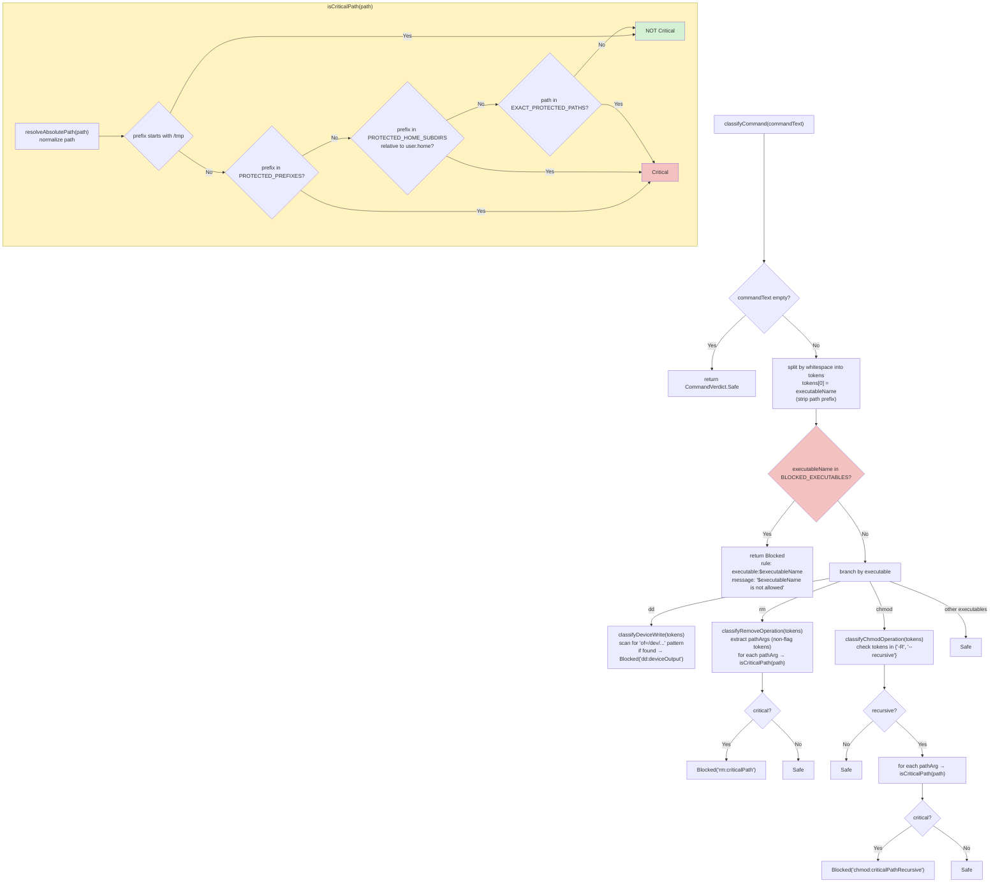
```mermaid
flowchart TD
    START["classifyCommand(commandText)"] --> EMPTY{commandText empty?}
    EMPTY -->|Yes| SAFE["return CommandVerdict.Safe"]
    EMPTY -->|No| TOKENIZE["split by whitespace into tokens<br/>tokens[0] = executableName<br/>(strip path prefix)"]
    TOKENIZE --> BLOCKED{executableName in BLOCKED_EXECUTABLES?}
    BLOCKED -->|Yes| BL["return Blocked<br/>rule: executable:$executableName<br/>message: '$executableName is not allowed'"]
    BLOCKED -->|No| SWITCH[branch by executable]
    SWITCH -->|" dd "| DD["classifyDeviceWrite(tokens)<br/>scan for 'of=/dev/...' pattern<br/>if found → Blocked('dd:deviceOutput')"]
    SWITCH -->|" rm "| RM["classifyRemoveOperation(tokens)<br/>extract pathArgs (non-flag tokens)<br/>for each pathArg → isCriticalPath(path)"]
    RM --> RM_CRIT{critical?}
    RM_CRIT -->|Yes| RM_BLK["Blocked('rm:criticalPath')"]
    RM_CRIT -->|No| SAFE_RM[Safe]
    SWITCH -->|" chmod "| CHMOD["classifyChmodOperation(tokens)<br/>check tokens in {'-R', '--recursive'}"]
    CHMOD --> CHMOD_R{recursive?}
    CHMOD_R -->|No| SAFE_CHMOD[Safe]
    CHMOD_R -->|Yes| CHMOD_PATH["for each pathArg → isCriticalPath(path)"]
    CHMOD_PATH --> CHMOD_CRIT{critical?}
    CHMOD_CRIT -->|Yes| CHMOD_BLK["Blocked('chmod:criticalPathRecursive')"]
    CHMOD_CRIT -->|No| SAFE_CHMOD2[Safe]
    SWITCH -->|" other executables "| SAFE_OTHER[Safe]

    subgraph CRITICAL["isCriticalPath(path)"]
        RESOLVE["resolveAbsolutePath(path)<br/>normalize path"]
        RESOLVE --> TMP{prefix starts with /tmp}
        TMP -->|Yes| NOT_CRIT[NOT Critical]
        TMP -->|No| PRE{prefix in PROTECTED_PREFIXES?}
        PRE -->|Yes| CRIT[Critical]
        PRE -->|No| HOME{prefix in PROTECTED_HOME_SUBDIRS<br/>relative to user.home?}
        HOME -->|Yes| CRIT
        HOME -->|No| EXACT{path in EXACT_PROTECTED_PATHS?}
        EXACT -->|Yes| CRIT
        EXACT -->|No| NOT_CRIT
    end

    style BLOCKED fill: #f4c1c1
    style CRIT fill: #f4c1c1
    style NOT_CRIT fill: #d4f1d4
    style CRITICAL fill: #fff4c1
```

**BLOCKED_EXECUTABLES set**:
`sudo, su, doas, pkexec, shutdown, reboot, halt, poweroff, init, mkfs, mkfs.ext2/3/4, mkfs.xfs, mkfs.btrfs, mkfs.vfat, mkfs.ntfs, mkswap, fdisk, sfdisk, parted, gdisk`

**PROTECTED_PREFIXES**:
`/etc, /usr, /var, /boot, /bin, /sbin, /lib, /lib64, /opt, /System, /Library, /Applications, /private`

**PROTECTED_HOME_SUBDIRS**:
`.ssh, .gnupg, .aws, .kube, .netrc, .pypirc, .npmrc, .docker`

**EXACT_PROTECTED_PATHS**:
`/ , /dev, /proc, /sys`

**Call location** (strict single-point control):

```kotlin
// RunCommandSkill.execute():
@OptIn(DangerousOperation::class)
override fun execute(arguments: Map<String, Any>): SkillResult {
    val commandText = arguments["command"] as? String ?: ""
    val classification: CommandVerdict = classifyCommand(commandText)
    if (classification is CommandVerdict.Blocked) {
        return makeFailure(
            "COMMAND_BLOCKED",
            "Blocked by safety filter: ${classification.description}",
            mapOf("command" to commandText, "rule" to classification.ruleName)
        )
    }
    // ... subsequent ProcessBuilder.start()
}
```

**Limitations**:

- Only checks the command's static structure, does not simulate execution. For example `rm $(cat foo)` can only
  intercept `rm` itself.
- Does not perform alias expansion (shell aliases are determined by the runtime shell and cannot be statically
  predicted).
- Does not perform environment variable expansion.
- Relies on the user providing the correct shell invocation path.
- Does not intercept dangerous operations inside high-level languages like Python/Node (but these typically don't go
  through `run_cmd`).

### 3.3 RunCommandSkill: Blocking vs Detached Process Execution

`RunCommandSkill` has two execution modes:

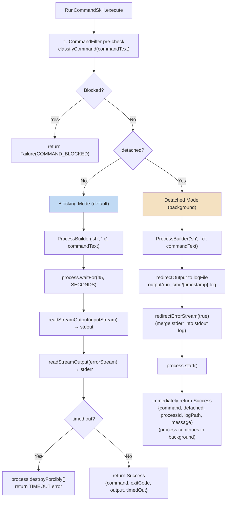
```mermaid
flowchart TD
    START["RunCommandSkill.execute"] --> PRECHECK["1. CommandFilter pre-check<br/>classifyCommand(commandText)"]
    PRECHECK --> BLOCKED{Blocked?}
    BLOCKED -->|Yes| RETURN_BLOCKED["return Failure(COMMAND_BLOCKED)"]
    BLOCKED -->|No| MODE{detached?}
    MODE -->|No| BLOCKING["Blocking Mode (default)"]
    BLOCKING --> PB1["ProcessBuilder('sh', '-c', commandText)"]
    PB1 --> WAIT["process.waitFor(45, SECONDS)"]
    WAIT --> STDOUT["readStreamOutput(inputStream) → stdout"]
    STDOUT --> STDERR["readStreamOutput(errorStream) → stderr"]
    STDERR --> TIMEOUT{timed out?}
    TIMEOUT -->|Yes| KILL["process.destroyForcibly()<br/>return TIMEOUT error"]
    TIMEOUT -->|No| RETURN_BLOCK["return Success<br/>{command, exitCode, output, timedOut}"]
    MODE -->|Yes| DETACHED["Detached Mode (background)"]
    DETACHED --> PB2["ProcessBuilder('sh', '-c', commandText)"]
    PB2 --> LOG["redirectOutput to logFile<br/>output/run_cmd/{timestamp}.log"]
    LOG --> MERGE["redirectErrorStream(true)<br/>(merge stderr into stdout log)"]
    MERGE --> START2["process.start()"]
    START2 --> RETURN_DETACH["immediately return Success<br/>{command, detached, processId, logPath, message}<br/>(process continues in background)"]
    style BLOCKING fill: #c1daf4
    style DETACHED fill: #f4e1c1
```

**Scenarios for choosing Detached**:

- GUI applications (e.g. launching an IDE)
- Long-running servers (e.g. a dev server)
- Any operation that doesn't need to wait for stdout to finish

**Note**: Output from detached processes is written to a log file, and the Agent will not read or analyze them further.

### 3.4 LLM Client Retry and Streaming Logic

Both clients share the same retry strategy:

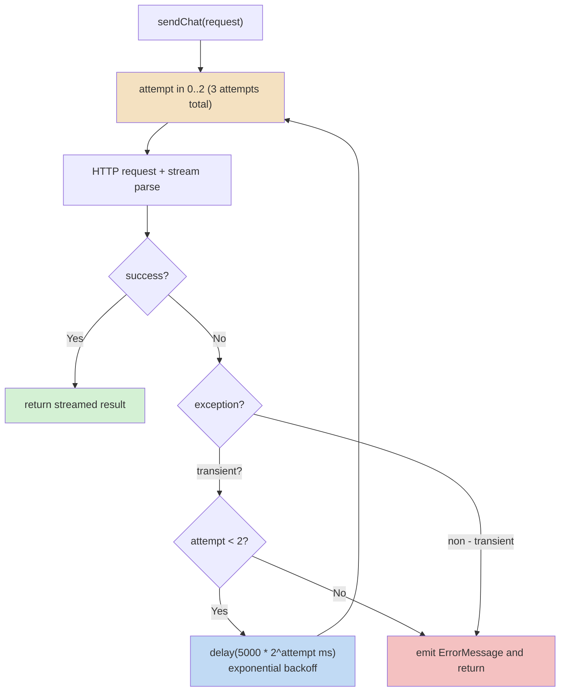
```mermaid
flowchart TD
    START["sendChat(request)"] --> LOOP["attempt in 0..2 (3 attempts total)"]
    LOOP --> TRY["HTTP request + stream parse"]
    TRY --> SUCCESS{success?}
    SUCCESS -->|Yes| DONE["return streamed result"]
    SUCCESS -->|No| EXCEPTION{exception?}
    EXCEPTION -->|transient?| TRANSIENT{attempt < 2?}
    TRANSIENT -->|Yes| BACKOFF["delay(5000 * 2^attempt ms)<br/>exponential backoff"]
    BACKOFF --> LOOP
    TRANSIENT -->|No| EMIT_ERR["emit ErrorMessage and return"]
    EXCEPTION -->|non - transient| EMIT_ERR
    style LOOP fill: #f4e1c1
    style BACKOFF fill: #c1daf4
    style DONE fill: #d4f1d4
    style EMIT_ERR fill: #f4c1c1
```

#### Ollama Client Protocol

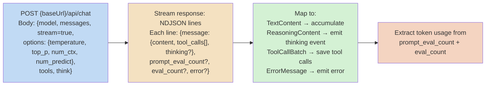
```mermaid
flowchart LR
    REQ["POST {baseUrl}/api/chat<br/>Body: {model, messages, stream=true,<br/>options: {temperature, top_p, num_ctx, num_predict},<br/>tools, think}"]
    REQ --> STREAM["Stream response: NDJSON lines<br/>Each line: {message: {content, tool_calls[], thinking?},<br/>prompt_eval_count?, eval_count?, error?}"]
    STREAM --> PARSE["Map to:<br/>TextContent → accumulate<br/>ReasoningContent → emit thinking event<br/>ToolCallBatch → save tool calls<br/>ErrorMessage → emit error"]
    PARSE --> TOKENS["Extract token usage from<br/>prompt_eval_count + eval_count"]
    style REQ fill: #c1daf4
    style STREAM fill: #f4e1c1
    style PARSE fill: #d4f1d4
    style TOKENS fill: #f4d4c1
```

#### OpenAI-Compatible Client Protocol

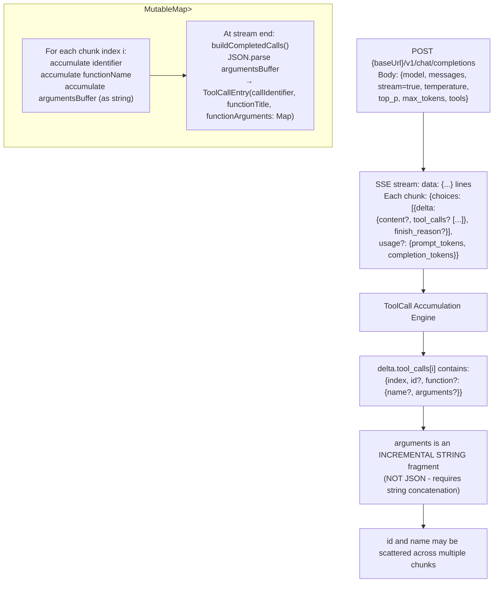
```mermaid
flowchart TD
    REQ["POST {baseUrl}/v1/chat/completions<br/>Body: {model, messages, stream=true, temperature,<br/>top_p, max_tokens, tools}"]
    REQ --> SSE["SSE stream: data: {...} lines<br/>Each chunk: {choices: [{delta:<br/>{content?, tool_calls? [...]}, finish_reason?}],<br/>usage?: {prompt_tokens, completion_tokens}}"]
    SSE --> ACCUM["ToolCall Accumulation Engine"]
    ACCUM --> SUB1["delta.tool_calls[i] contains:<br/>{index, id?, function?: {name?, arguments?}}"]
    SUB1 --> SUB2["arguments is an INCREMENTAL STRING fragment<br/>(NOT JSON - requires string concatenation)"]
    SUB2 --> SUB3["id and name may be scattered across multiple chunks"]

    subgraph ACC["MutableMap<Int, MutableMap<String, Any>>"]
        A["For each chunk index i:<br/>accumulate identifier<br/>accumulate functionName<br/>accumulate argumentsBuffer (as string)"]
        A --> B["At stream end: buildCompletedCalls()<br/>JSON.parse argumentsBuffer<br/>→ ToolCallEntry(callIdentifier, functionTitle, functionArguments: Map)"]
    end
```

### 3.5 TodoManager and Task Focus

Defined in `TodoSkill.kt`:

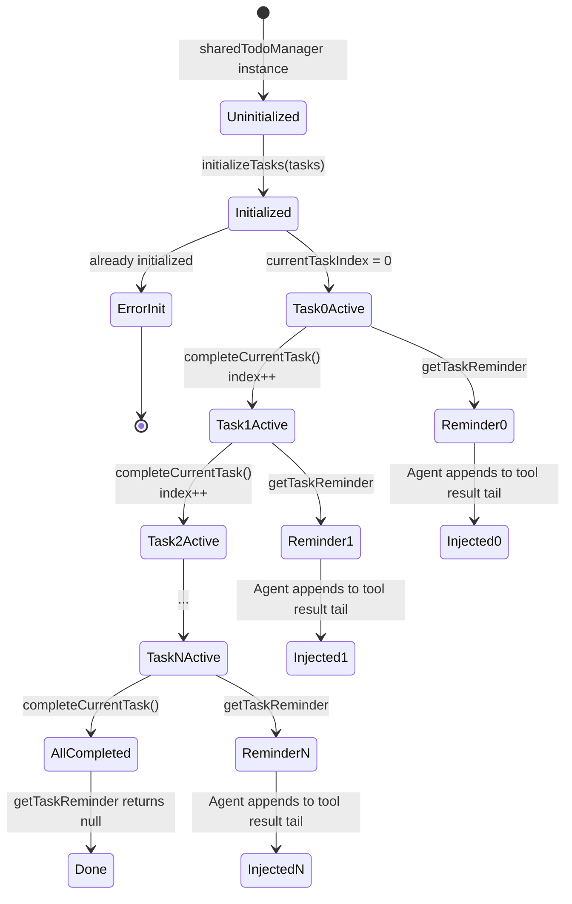
```mermaid
stateDiagram-v2
    [*] --> Uninitialized: sharedTodoManager instance
    Uninitialized --> Initialized: initializeTasks(tasks)
    Initialized --> ErrorInit: already initialized
    ErrorInit --> [*]
    Initialized --> Task0Active: currentTaskIndex = 0
    Task0Active --> Task1Active: completeCurrentTask()<br/>index++
    Task1Active --> Task2Active: completeCurrentTask()<br/>index++
    Task2Active --> TaskNActive: ...
    TaskNActive --> AllCompleted: completeCurrentTask()
    AllCompleted --> Done: getTaskReminder returns null
    Task0Active --> Reminder0: getTaskReminder
    Task1Active --> Reminder1: getTaskReminder
    TaskNActive --> ReminderN: getTaskReminder
    Reminder0 --> Injected0: Agent appends to tool result tail
    Reminder1 --> Injected1: Agent appends to tool result tail
    ReminderN --> InjectedN: Agent appends to tool result tail
```

**State operations**:

- `initializeTasks(tasks)` → Success `{totalTasks, currentTask, currentIndex}`
- `completeCurrentTask()` → index++. If index >= size → `{completed: true, totalTasks, message}`, else →
  `{completed: false, totalTasks, currentTask, currentIndex}`
- `getTaskReminder()` → `"Reminder: You still have N tasks unfinished...current task..."` or `null` when all done

The Agent calls `getTodoManagerInstance().getTaskReminder()` after **every tool call** in `executeTask()`, and if not
null, appends it to the tail of the tool result message. This ensures that the model does not "forget" the original task
plan during long task flows.

---

## 4. Skill Reference

### 4.1 Skill Type System

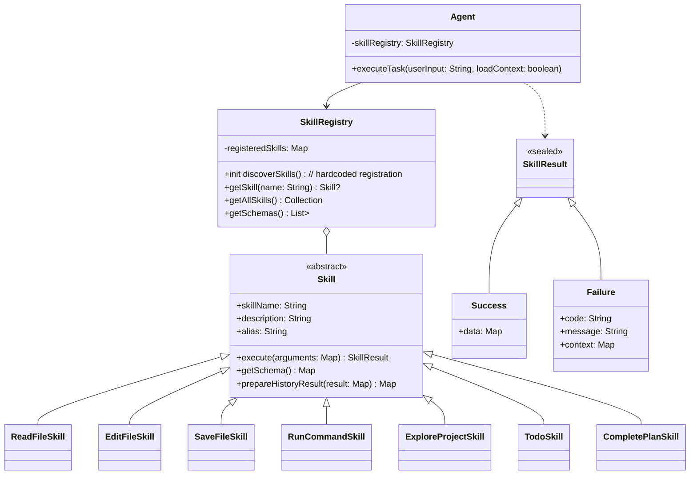
```mermaid
classDiagram
    class Skill {
        <<abstract>>
        +skillName: String
        +description: String
        +alias: String
        +execute(arguments: Map<String, Any>) SkillResult
        +getSchema() Map<String, Any>
        +prepareHistoryResult(result: Map<String, Any>) Map<String, Any>
    }

    class SkillResult {
        <<sealed>>
    }

    class Success {
        +data: Map<String, Any>
    }

    class Failure {
        +code: String
        +message: String
        +context: Map<String, Any>
    }

    class SkillRegistry {
        -registeredSkills: Map<String, Skill>
        +init discoverSkills() // hardcoded registration
        +getSkill(name: String) Skill?
        +getAllSkills() Collection<Skill>
        +getSchemas() List<Map<String, Any>>
    }

    class ReadFileSkill
    class EditFileSkill
    class SaveFileSkill
    class RunCommandSkill
    class ExploreProjectSkill
    class TodoSkill
    class CompletePlanSkill

    SkillResult <|-- Success
    SkillResult <|-- Failure
    Skill <|-- ReadFileSkill
    Skill <|-- EditFileSkill
    Skill <|-- SaveFileSkill
    Skill <|-- RunCommandSkill
    Skill <|-- ExploreProjectSkill
    Skill <|-- TodoSkill
    Skill <|-- CompletePlanSkill
    SkillRegistry o-- Skill

    class Agent {
        -skillRegistry: SkillRegistry
        +executeTask(userInput: String, loadContext: boolean)
    }

    Agent --> SkillRegistry
    Agent ..> SkillResult
```

**Skill abstract class** (`skill/Skill.kt`):

```kotlin
abstract class Skill {
    abstract val skillName: String          // "read_file"
    abstract val description: String        // "Read file content..."
    abstract val alias: String              // "Read" (used for human-friendly logging)
    abstract fun execute(arguments: Map<String, Any>): SkillResult
    abstract fun getSchema(): Map<String, Any>  // Used for LLM tools definition

    // History context management — strip volatile keys from old results
    open val historyKeepCount: Int = Int.MAX_VALUE   // Keep this many recent results intact
    open val historyVolatileKeys: List<String> = emptyList()  // Keys to strip when exceeding count

    private var prepareHistoryCallCount: Int = 0

    open fun prepareHistoryResult(result: Map<String, Any>): Map<String, Any> {
        prepareHistoryCallCount++
        if (historyKeepCount == Int.MAX_VALUE || historyVolatileKeys.isEmpty()) return result
        return if (prepareHistoryCallCount <= historyKeepCount) result
        else result.filterKeys { it !in historyVolatileKeys }
    }
}
```

`prepareHistoryResult` is a hook that transforms a skill's execution result before it is saved into
`conversationHistory`. The default returns the result unchanged.

### 4.1a Adaptive Pruning

This is a context-preservation strategy that keeps **only the N most recent** executions of a skill fully intact in
conversation history, while stripping volatile payload keys from older entries. The technique is embodied by two
properties on `Skill`:

- `historyKeepCount: Int` — how many recent results retain full data (default `Int.MAX_VALUE`, meaning no pruning)
- `historyVolatileKeys: List<String>` — which keys to remove from results that exceed the keep count

When `execute()` is called, `prepareHistoryResult()` increments an internal call counter. Results whose call index ≤
`historyKeepCount` are returned as-is; older ones have every key in `historyVolatileKeys` filtered out:

```kotlin
override fun prepareHistoryResult(result: Map<String, Any>): Map<String, Any> {
    prepareHistoryCallCount++
    if (historyKeepCount == Int.MAX_VALUE || historyVolatileKeys.isEmpty()) return result
    return if (prepareHistoryCallCount <= historyKeepCount) result
    else result.filterKeys { it !in historyVolatileKeys }
}
```

**Design intent:** Large payloads (file contents, command output, search results) are needed for the model to reason
about the *current* step, but quickly become irrelevant as the session progresses. Stripping them from old history saves
LLM context window without losing the structural metadata (path, exit code, match count, etc.).

**Current application:**

| Skill             | historyKeepCount | Volatile keys stripped            | Rationale                                                                      |
|-------------------|------------------|-----------------------------------|--------------------------------------------------------------------------------|
| `ReadFileSkill`   | 2                | `content`                         | File content is large (hundreds of lines); only the last 2 reads are relevant  |
| `RunCommandSkill` | 2                | `output`                          | Command output may be very large; old results are rarely referenced            |

The full volatile data is still emitted in the NDJSON `tool_call` event for the frontend; only conversation history is
trimmed. This is transparent to both the UI and the skill implementations — `prepareHistoryResult` is called
automatically in `Agent.kt` after `skill.execute()` returns.

**SkillResult sealed class** (`SkillResult.kt`):

```kotlin
sealed class SkillResult {
    data class Success(val data: Map<String, Any>) : SkillResult()
    data class Failure(
        val code: String,
        val message: String,
        val context: Map<String, Any> = emptyMap()
    ) : SkillResult()
}
```

Factory functions:

```
makeSuccess(data: Map<String, Any>): SkillResult
makeFailure(code: String, message: String, context: Map<String, Any> = emptyMap()): SkillResult
```

### 4.2 Skill Registration Flow

`SkillRegistry.kt` uses Java ServiceLoader for plugin discovery:

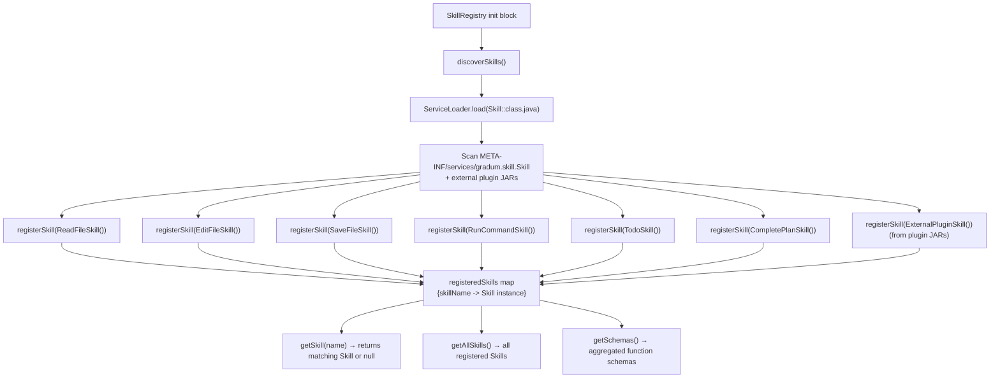
```mermaid
flowchart TB
    INIT["SkillRegistry init block"] --> DISCOVER["discoverSkills()"]
    DISCOVER --> LOADER["ServiceLoader.load(Skill::class.java)"]
    LOADER --> SCAN["Scan META-INF/services/gradum.skill.Skill<br/>+ external plugin JARs"]
    SCAN --> R1["registerSkill(ReadFileSkill())"]
    SCAN --> R2["registerSkill(EditFileSkill())"]
    SCAN --> R3["registerSkill(SaveFileSkill())"]
    SCAN --> R4["registerSkill(RunCommandSkill())"]
    SCAN --> R5["registerSkill(TodoSkill())"]
    SCAN --> R6["registerSkill(CompletePlanSkill())"]
    SCAN --> R7["registerSkill(ExternalPluginSkill())<br/>(from plugin JARs)"]
    R1 --> REG["registeredSkills map<br/>{skillName -> Skill instance}"]
    R2 --> REG
    R3 --> REG
    R4 --> REG
    R5 --> REG
    R6 --> REG
    R7 --> REG
    REG --> LOOKUP["getSkill(name) → returns matching Skill or null"]
    REG --> ALL["getAllSkills() → all registered Skills"]
    REG --> SCH["getSchemas() → aggregated function schemas"]
```

**Service Descriptor File**: `META-INF/services/gradum.skill.Skill`

```
gradum.skill.ReadFileSkill
gradum.skill.EditFileSkill
gradum.skill.SaveFileSkill
gradum.skill.RunCommandSkill
gradum.skill.ExploreProjectSkill
gradum.skill.TodoSkill
gradum.skill.CompletePlanSkill
```

**Adding External Plugins**:

1. Create a class implementing `Skill` with a no-argument constructor
2. Add the fully qualified class name to `META-INF/services/gradum.skill.Skill` in your JAR
3. Place the JAR on the classpath
4. Skills are automatically discovered at runtime

### 4.3 Skill Overview

| Skill             | Input Parameters                                                     | Output Fields                                                                                                                                                                                            | Error Codes                                                                                   | Limits                                                                                                                       |
|-------------------|----------------------------------------------------------------------|----------------------------------------------------------------------------------------------------------------------------------------------------------------------------------------------------------|-----------------------------------------------------------------------------------------------|------------------------------------------------------------------------------------------------------------------------------|
| ReadFileSkill     | `path`, `lineRange?`                                                 | `path, lineRange, totalLines, contentHash, content`                                                                                                                                                      | `FILE_NOT_FOUND, FILE_TOO_LARGE, INVALID_PARAMETER, IO_ERROR`                                 | Size ≤ 1MB, lines ≤ 10000                                                                                                    |
| EditFileSkill     | `path, edits[], mode?`                                               | `path, editsApplied, totalEdits`                                                                                                                                                                         | `CODE_NOT_FOUND, MULTIPLE_MATCHES, EMPTY_RESULT, FILE_NOT_FOUND, INVALID_PARAMETER, IO_ERROR` | Each edit must match uniquely                                                                                                |
| SaveFileSkill     | `path, content`                                                      | `path, bytesWritten, created`                                                                                                                                                                            | `INVALID_PARAMETER, IO_ERROR`                                                                 | Auto mkdirs parent directories                                                                                               |
| RunCommandSkill   | `command, reason?, detached?`                                        | blocking: `command, exitCode, output` <br/> detached: `command, detached, processId, logPath, message`                                                                                                   | `COMMAND_BLOCKED, TIMEOUT, INVALID_PARAMETER, IO_ERROR`                                       | Timeout 45s; CommandFilter pre-check                                                                                         |
| ExploreProjectSkill | `path?, depth?`                                                    | `path, entries: [{name, type, children?}]`                                                                                                                                                               | `INVALID_PARAMETER, IO_ERROR`                                                                 | Depth 1–14; truncated build/dependency directories                                                                           |
| TodoSkill         | `tasks[]`                                                            | `totalTasks, currentTask, currentIndex`                                                                                                                                                                  | `ALREADY_INITIALIZED, INVALID_PARAMETER`                                                      | Singleton; cannot be reset after initialization                                                                              |
| CompletePlanSkill | none                                                                 | `{completed, totalTasks, message?}` or `{completed, totalTasks, currentTask, currentIndex}`                                                                                                              | `NOT_INITIALIZED, ALL_COMPLETED`                                                              | Advance task pointer                                                                                                         |

---

## 5. Error Codes and Events

### 5.1 Tool Error Codes

```mermaid
flowchart LR
    ALL[SkillResult.Failure] --> G1[File operations]
    ALL --> G2[Edit operations]
    ALL --> G3[Command execution]
    ALL --> G4[Task management]
    ALL --> G5[Generic]
    ALL --> G6[Plugin-side]
    G1 --> F1["FILE_NOT_FOUND<br/>ReadFile, EditFile: path doesn't exist"]
    G1 --> F2["FILE_TOO_LARGE<br/>ReadFile: exceeds 1MB or 10000 lines"]
    G2 --> F3["CODE_NOT_FOUND<br/>EditFile: search string matches 0 times"]
    G2 --> F4["MULTIPLE_MATCHES<br/>EditFile: search string matches more than 1 times"]
    G2 --> F5["EMPTY_RESULT<br/>EditFile: file would be empty after edit"]
    G3 --> F6["COMMAND_BLOCKED<br/>RunCommand: blocked by safety filter"]
    G3 --> F7["TIMEOUT<br/>RunCommand, Search: exceeded time limit"]
    G4 --> F8["ALREADY_INITIALIZED<br/>TodoSkill: attempt to reinitialize"]
    G4 --> F9["NOT_INITIALIZED<br/>CompletePlanSkill: called before init"]
    G4 --> F10["ALL_COMPLETED<br/>CompletePlanSkill: all tasks already done"]
    G5 --> F11["INVALID_PARAMETER<br/>All skills: missing or malformed args"]
    G5 --> F12["IO_ERROR<br/>All skills: filesystem or process exception"]
    G6 --> F13["CLIENT_ERROR<br/>Plugin: model validation failed"]
    style G1 fill: #c1daf4
    style G2 fill: #f4e1c1
    style G3 fill: #f4c1c1
    style G4 fill: #c1f4c1
    style G5 fill: #d4d4d4
    style G6 fill: #e8d4f4
```

### 5.2 LLM Client Error Handling

```mermaid
flowchart TD
    NET["Network connection failure<br/>(LLM server not responding)"]
    TIMEOUT["Request timeout"]
    NON2XX["HTTP non-2xx response"]
    PARSE["SSE parse failure (OpenAI)"]
    NET --> EMIT["emit ErrorMessage<br/>(with context hint)"]
    TIMEOUT --> EMIT
    NON2XX --> EMIT
    PARSE --> STREAM_END["treated as end of stream<br/>no separate error emission"]
    EMIT --> RETRY["retry up to 2 times<br/>exponential backoff"]
    RETRY --> GIVE_UP["after 2 failed retries → give up<br/>return accumulated content"]
    style NET fill: #f4c1c1
    style TIMEOUT fill: #f4c1c1
    style NON2XX fill: #f4c1c1
    style STREAM_END fill: #c1daf4
```

### 5.3 Guardrail System

The Guardrail System protects against anomalous model behavior by monitoring the LLM's text output across turns. It
consists of two independent detectors that share a common termination pathway via `mission_revoked`.

```mermaid
flowchart TB
    subgraph RED_LINE["Red Line Keyword Detector"]
        RL1["checkRedLineKeywords(text)<br/>case-insensitive substring match"]
        RL1 --> RL2{"Any keyword hit?"}
        RL2 -->|No| SKIP_RL
        RL2 -->|Yes| RL3["redLineHitCounter++<br/>emit guardrail(red_line_hit)"]
        RL3 --> RL4{"counter >= maxRedLineHits?"}
        RL4 -->|No| SKIP_RL
        RL4 -->|Yes| RL5["mission_revoked(red_line_violation)"]
    end

    subgraph REPEAT["Repetitive Response Detector"]
        RT1["Detect:<br/>1. Exact duplicate of previous turn<br/>2. Same sentence ≥3 times in one response"]
        RT1 --> RT2{"Anomalous?"}
        RT2 -->|No| RT3["repeatedResponseTracker.clear()"]
        RT2 -->|Yes| RT4["add to tracker<br/>emit guardrail(red_line_hit)"]
        RT4 --> RT5{"tracker >= maxRepeatedResponses?"}
        RT5 -->|No| SKIP_RP
        RT5 -->|Yes| RT6["mission_revoked(repetitive_loop)"]
    end

    RL5 --> ABORT["abortSession()<br/>emit session_end (aborted)<br/>NO context save"]
    RT6 --> ABORT
    SKIP_RL --> CONTINUE["Continue processing tool calls"]
    SKIP_RP --> CONTINUE
    style RED_LINE fill: #f4c1c1
    style REPEAT fill: #f4e1c1
    style ABORT fill: #f4c1c1
```

#### Red Line Keywords File

Red line keywords are **not** part of `AgentConfiguration`. Instead, they are loaded from
`src/main/resources/red_line_keywords.txt` at runtime:

```
# One keyword per line. Lines starting with # are ignored.
# Matching is case-insensitive substring.
forbidden-topic
some-sensitive-phrase
```

- File location: `src/main/resources/red_line_keywords.txt`
- Template: `src/main/resources/red_line_keywords.txt.example` (git-tracked)
- Actual file is **gitignored** (user-local sensitive config)
- If the file is missing or empty, red line detection is silently disabled

#### Configuration (`AgentConfiguration.kt`)

| Field                  | Type  | Default | Description                                      |
|------------------------|-------|---------|--------------------------------------------------|
| `maxRedLineHits`       | `Int` | `3`     | Number of red line hits before revocation        |
| `maxRepeatedResponses` | `Int` | `3`     | Number of repetitive responses before revocation |

#### Revocation Reasons

| Reason               | Trigger                                                      | Response                             |
|----------------------|--------------------------------------------------------------|--------------------------------------|
| `red_line_violation` | Model output contains configured red line keywords ≥ N times | Mission revoked, conversation erased |
| `repetitive_loop`    | Model repeats the same output ≥ N times                      | Mission revoked, conversation erased |
| `tool_runaway`       | Reserved for future use (tool call loop detection)           | Mission revoked, conversation erased |

#### `mission_revoked` Event Contract

When a session is revoked:

1. The last assistant message is appended to history (for audit consistency)
2. `emitEvent("mission_revoked", {reason, details})` is fired — the client MUST erase all trace of this conversation
3. `emitEvent("session_end", {..., aborted: true})` terminates the session
4. `contextManager.saveContext()` is **NOT called** — no persistence, no trace

---

## 6. Security Model

### 6.1 Threat Model

```mermaid
mindmap
  root((Gradum Security Threats))
    Prompt Injection
      LLM instructed to run dangerous commands
      Defense: CommandFilter structural analysis
      Defense: Blocked executables list
      Defense: Critical path protection
    Context Tampering
      Offline modification of context.json
      Defense: HMAC-SHA256 authentication tag
      Defense: Version byte check
    Context Leakage
      Source code visible in context file
      Defense: HMAC-CTR encryption of content fields
      Defense: GRADUM_CONTEXT_KEY override support
    Model Distraction
      Model loses focus on original task
      Defense: TodoManager reminder injection
      Defense: Stateful task tracking
    Model Misbehavior
      Model outputs prohibited content
      Defense: Red line keyword detection
      Defense: Automated session revocation
    Model Stuck
      Model enters repetitive output loop
      Defense: Repetitive response detection
      Defense: Repetitive loop revocation
    File Destruction
      Accidental emptying of files via edit_file
      Defense: EMPTY_RESULT check
      Defense: Atomic mode rollback
    Silent Failure
      LLM server unavailable goes unnoticed
      Defense: Exponential backoff with limits
      Defense: Friendly ErrorMessage events
```

### 6.2 Remaining Risks

```mermaid
flowchart TD
    subgraph STATIC["Dynamic Shell Analysis Limitations"]
        SUB1["$(...) command substitution cannot be traced statically"]
        SUB2["Shell aliases are runtime-defined, not statically predictable"]
        SUB3["Environment variable expansion cannot be resolved at analysis time"]
    end

    subgraph NON_SHELL["Non-shell Destructive Operations"]
        N1["Python/Node scripts running destructive commands"]
        N2["Editing ~/.bashrc or shell profile to inject commands"]
        N3["These bypass CommandFilter since they don't go through ProcessBuilder for shell exec"]
    end

    subgraph TRUST["Trust Model"]
        T1["Assumes LLM itself is honest"]
        T2["Defense is against prompt injection damage, not malicious model"]
        T3["Model-generated code must still be trusted by the developer"]
    end

    subgraph MULTI["Multi-tenant Gap"]
        M1["No isolation designed for multi-user scenarios"]
        M2["Sessions share filesystem access"]
        M3["External isolation needed for multi-user deployments"]
    end

    subgraph KEY["Encryption Key Exposure"]
        K1["builtinKeySource is visible in Gradum source code"]
        K2["For genuine tampering threat: set GRADUM_CONTEXT_KEY env var"]
        K3["Key is only as secure as the user's environment variable access"]
    end
```

---

## 7. Limitations and Future Work

### 7.1 Current Limitations

```mermaid
gantt
    title Gradum Capabilities
    dateFormat YYYY
    axisFormat %Y
    section Single User
        Single user mode: done, 2026-01-01, 1d
        Multi-tenant isolation: active, 2026-01-01, 1d
    section Execution
        No sandboxed execution: active, 2026-01-01, 1d
    section Input
        Text-only input: active, 2026-01-01, 1d
        Image/voice/multimodal: active, 2026-01-01, 1d
    section Skill loading
        Hardcoded registration: done, 2026-01-01, 1d
        Dynamic plugin loading: active, 2026-01-01, 1d
    section Context
        Encrypted user/assistant only: done, 2026-01-01, 1d
        Cross-device sync: active, 2026-01-01, 1d
    section Search
        Basic string/regex search: done, 2026-01-01, 1d
        Semantic search: active, 2026-01-01, 1d
```

**Summary of current constraints**:

- Single-user, single-session, no multi-tenant
- No sandboxed execution environment
- Text-only input (no images, audio)
- Skill registry uses hardcoded registration, no dynamic plugin loading supported (but adding a skill only requires
  adding a new `FooSkill.kt` + one-line registration in `discoverSkills()`)
- Session context persistence only encrypts user/assistant messages, tool messages are not encrypted (for audit
  convenience)
- ContextManager does not support multi-device synchronization
- Search skill only supports basic string/regex matching, no semantic search

### 7.2 Possible Future Work

```mermaid
flowchart TB
    subgraph PLUGIN["Plugin System"]
        P1["Plugin hot loading: dynamic Skill subclass discovery"]
        P2["Reflection + SPI mechanism"]
        P3["Third-party skill marketplace integration"]
    end

    subgraph PARALLEL["Concurrent Execution"]
        C1["Support LLM requesting multiple tools in parallel"]
        C2["Parallel file reads and code searches"]
        C3["Concurrent command execution with dependency graphs"]
    end

    subgraph SEARCH["Semantic Search"]
        SE1["Local embeddings model integration"]
        SE2["Vector-based code similarity search"]
        SE3["'Find code like...' queries"]
    end

    subgraph MM["Multimodal Input"]
        M1["Image analysis for diagrams, charts"]
        M2["Screenshot-to-code workflows"]
        M3["Vision-capable local model support"]
    end

    subgraph SYNC["Context Sync"]
        SY1["Encrypted remote storage backend"]
        SY2["Cross-device conversation history"]
        SY3["Conflict resolution for multi-device edits"]
    end

    subgraph FALLBACK["Robust Fallback"]
        F1["Automatic alternative paths when tools fail"]
        F2["Session-level retry with back-off"]
        F3["Context-aware error recovery"]
    end

    subgraph SEC["Enhanced Security"]
        S1["Regex-based path matching in CommandFilter"]
        S2["Symlink tracking to avoid path traversal"]
        S3["sudoers file awareness"]
        S4["Fine-grained per-directory access control"]
    end

    subgraph CLI["Native CLI Experience"]
        CLI1["gradum 'task' direct invocation without HTTP"]
        CLI2["Interactive terminal UI"]
        CLI3["Shell integration (bash/zsh plugins)"]
    end

    subgraph WS["WebSocket Upgrade"]
        W1["Replace HTTP chunked /events with WebSocket"]
        W2["Bidirectional real-time communication"]
        W3["Interactive tool confirmation over WS"]
    end

    PLUGIN --> PARALLEL
    PARALLEL --> SEARCH
    SEARCH --> MM
    MM --> SYNC
    SYNC --> FALLBACK
    FALLBACK --> SEC
    SEC --> CLI
    CLI --> WS
```

---

## 8. IntelliJ IDEA Plugin

### 8.1 Overview

The `plugin` module is a separate IntelliJ IDEA plugin that provides a Compose-based chat UI in a right-side tool window.
It communicates with the standalone Gradum server over HTTP at runtime — there is **no compile-time dependency** between
the plugin and the server module.

### 8.2 Module Dependencies

```
plugin (IntelliJ Plugin)
    │
    ├─── IntelliJ Platform SDK (IU 2026.1.3)
    │       └── com.intellij.modules.platform (bundled)
    │
    ├─── Compose for Desktop (local JARs)
    │       ├── intellij.libraries.compose.foundation.desktop.jar
    │       ├── intellij.libraries.compose.runtime.desktop.jar
    │       └── intellij.libraries.skiko.jar
    │
    ├─── Jewel UI Framework (local JARs)
    │       ├── intellij.platform.jewel.foundation.jar
    │       ├── intellij.platform.jewel.ui.jar
    │       └── intellij.platform.jewel.ideLafBridge.jar
    │
    ├─── IntelliJ Compose Bridge
    │       └── intellij.platform.compose.jar
    │
    ├─── kotlinx-serialization-json 1.7.3
    │
    └─── Gradum Server (runtime, HTTP only)
            └── POST /events, GET /models, GET /health
```

### 8.3 Runtime Communication

```
┌─────────────────────┐         HTTP (localhost)        ┌─────────────────────┐
│  IntelliJ Plugin    │ ──────────────────────────────> │  Gradum Server      │
│                     │                                 │  (Ktor + Netty)     │
│  ChatInputSection   │   POST /events (NDJSON stream)  │                     │
│  ModelSelectorBar   │ <══════════════════════════════>│  Agent + Skills     │
│  MessageComponents  │   GET /models                   │  LLM Client         │
│  GradumApiClient    │ <───────────────────────────────│  CommandFilter      │
│                     │                                 │                     │
└─────────────────────┘                                 └─────────────────────┘
```

- `GradumApiClient` sends user messages to the server's `/events` endpoint
- Server returns NDJSON event stream (thinking, tool_call, llm_response, session_end)
- Plugin renders the streaming response in real-time via Compose UI

### 8.4 Plugin Internal Structure

```
gradum.idea/
├── GradumToolWindowFactory.kt        # Entry point, registers tool window
├── chat/
│   ├── api/
│   │   └── GradumApiClient.kt        # HTTP client for server communication
│   ├── input/
│   │   ├── ChatInputPanel.kt         # Text input + send/stop buttons
│   │   ├── ChatInputSection.kt       # Input panel + model selector
│   │   └── ModelSelectorBar.kt       # Model dropdown with pin/auto
│   ├── model/
│   │   └── ModelInfo.kt              # Model data class (name, serverName)
│   ├── state/
│   │   └── GradumChatSession.kt      # Project-level service, holds chat state
│   └── ui/
│       ├── ChatScreen.kt             # Main chat layout
│       ├── MessageComponents.kt      # Message bubbles, code blocks
│       └── input/
│           ├── ModelNameFormatter.kt # Model name display formatting
│           └── ...
├── editor/
│   ├── EditorContext.kt              # Editor state (attachments, pending)
│   ├── AttachedFile.kt               # File attachment model
│   └── PendingMessage.kt             # Queued message model
├── bundle/
│   └── GradumBundle.properties       # i18n (en, zh_CN)
└── icons/
    └── GradumIcons.kt                # Custom SVG icon registry
```

### 8.5 Key Dependencies Summary

| Dependency                 | Version  | Purpose                        |
|----------------------------|----------|--------------------------------|
| IntelliJ Platform (IU)     | 2026.1.3 | IDE SDK                        |
| Compose for Desktop        | bundled  | UI framework                   |
| Jewel                      | bundled  | IntelliJ-themed UI components  |
| kotlinx-serialization-json | 1.7.3    | JSON parsing for API responses |
| Gradum Server (runtime)    | 0.9.0    | AI agent backend (HTTP only)   |

---

## 9. Glossary

| Term                     | Definition                                                                                                                                |
|--------------------------|-------------------------------------------------------------------------------------------------------------------------------------------|
| **Agent**                | Core of Gradum, manages conversation history, LLM interaction, and tool scheduling                                                        |
| **Skill**                | Individual tool capability (read file, edit, run commands, etc.), inherits the `Skill` abstract class                                     |
| **Tool Call**            | A function call requested by the LLM, forwarded by the Agent to the corresponding Skill                                                   |
| **Function Calling**     | The LLM's ability to request tool calls in structured JSON beyond text responses                                                          |
| **NDJSON**               | Newline Delimited JSON, one independent JSON object per line. Gradum uses it as the output stream format                                  |
| **System Prompt**        | The first message sent to the LLM, defining behavior rules (note: it is only guidance, must not be trusted as a security boundary)        |
| **Conversation History** | `List<Map<String, Any>>`, a list of messages containing system/user/assistant/tool roles                                                  |
| **CommandFilter**        | Command safety classifier executed before `ProcessBuilder.start()`                                                                        |
| **Critical Path**        | Path prefixes considered non-deletable/non-recursive chmod by CommandFilter                                                               |
| **Detached Mode**        | Background execution mode of `run_cmd`, immediately returns PID instead of waiting for process to end                                     |
| **TodoManager**          | Task list singleton, used to maintain planning intent across multiple rounds of tool calls                                                |
| **TokenUsageSnapshot**   | `{promptTokens, completionTokens, totalTokens}`, accumulated in real-time by the LLM client                                               |
| **HMAC-CTR**             | Custom authenticated encryption scheme Gradum uses for context file encryption (HMAC-SHA256 in CTR-like mode + HMAC-SHA256 tag)           |
| **Provider**             | LLM backend type, currently supports `"ollama"` and `"openai"` (compatible with any OpenAI-format server)                                 |
| **Red Line Keywords**    | Configurable list of forbidden substrings loaded from `red_line_keywords.txt`; when detected in model output, triggers session revocation |
| **Guardrail**            | Output monitoring system that detects anomalous model behavior (red line keywords, repetitive loops) and can terminate the session        |
| **mission_revoked**      | NDJSON event signaling that a session has been revoked; the client MUST erase all traces of the conversation                              |
| **SSE**                  | Server-Sent Events, the streaming protocol adopted by OpenAI-compatible servers                                                           |
