# Gradum Kotlin Coding Standards

This document defines the coding standards for the Gradum Kotlin implementation.
All Kotlin code must follow the conventions below.

```mermaid
flowchart TD
    A["Start: Write or review Kotlin code"] --> B{New skill class?}
    B -->|Yes| C["Extend `Skill` abstract class<br/>Override: skillName, description, alias<br/>execute, getSchema"]
    B -->|No| D

    C --> D["Type annotations: explicit for all declarations<br/>`String`, `Path`, `Map<String, Any>`, etc.<br/>No inference of abbreviations"]
    D --> E["Imports: 3 groups (stdlib, third-party, project)<br/>Alphabetical within each group<br/>Blank line between groups"]
    E --> F["Null safety: `as?`, `?.let`, `?: default`"]
    F --> G["Result types: `SkillResult.Success(data)`<br/>or `SkillResult.Failure(code, msg, ctx)`"]
    G --> H["Error handling: structured return values<br/>Never throw across skill boundaries<br/>Catch specific exceptions first"]
    H --> I["Strings: use templates `'Value: $x'`<br/>Not `'Value: ' + x`"]
    I --> J["Paths: use `java.nio.file.Path`<br/>Always `.toAbsolutePath().normalize()`"]
    J --> K["File I/O: `Charsets.UTF_8` explicitly<br/>Use `readText()`, `writeText()`"]
    K --> L["Shell commands: `ProcessBuilder.start()`<br/>*Always* `classifyCommand()` pre-check<br/>`@OptIn(DangerousOperation::class)`"]
    L --> M["KDoc on public classes/methods — explain **why**"]
    M --> N["Line width: max 100 characters"]
    N --> O["Build: `./gradlew build`"]

    style A fill:#2563eb
    style B fill:#f59e0b
    style C fill:#8b5cf6
    style D fill:#3b82f6
    style E fill:#06b6d4
    style F fill:#0ea5e9
    style G fill:#34d399
    style H fill:#f87171
    style I fill:#a78bfa
    style J fill:#ec4899
    style K fill:#14b8a6
    style L fill:#dc2626
    style M fill:#84cc16
    style N fill:#facc15
    style O fill:#16a34a
```



---

## 1. Source File Header

Source files begin with the `package` declaration, followed by import groups.
**Do not** include copyright headers or boilerplate file-level comments.

```kotlin
package gradum.skill

// imports here
```

---

## 2. Naming Conventions

| Type                | Style         | Example                                            |
|---------------------|---------------|----------------------------------------------------|
| Functions / Methods | `camelCase`   | `getSchema()`, `executeTool()`                     |
| Classes             | `PascalCase`  | `RunCommandSkill`, `AgentConfiguration`            |
| Constants           | `UPPER_SNAKE` | `DEFAULT_MODEL`, `TOO_LARGE_THRESHOLD`             |
| Private members     | No prefix     | `skills`, `todoManager`, `logger`                  |
| Top-level private   | No prefix     | `blockedExecutables`, `jsonParser`                 |
| Enum members        | `PascalCase`  | `Mode.Sequential`, `Mode.Atomic`                   |
| Sealed subclasses   | `PascalCase`  | `CommandVerdict.Allowed`, `CommandVerdict.Blocked` |

### 2.1 No Abbreviations

**Correct:**
```kotlin
val message: String = "File not found"
val configuration: AgentConfiguration = buildConfiguration()
val command: String = "ls -la"
```

**Incorrect:**
```kotlin
val msg: String = "File not found"
val cfg: AgentConfiguration = buildConfiguration()
val cmd: String = "ls -la"
```

### 2.2 Self-Documenting Names

Variable names should describe *what* something is, not *what type* it is.

**Correct:**
```kotlin
val targetFile: File = Path.of(path).toFile()
val pendingChanges: List<String> = collectEdits()
val skillName: String = arguments["name"] as? String ?: ""
```

**Incorrect:**
```kotlin
val file: File = Path.of(path).toFile()
val list: List<String> = collectEdits()
val str: String = arguments["name"] as? String ?: ""
```

---

## 3. Imports

Group imports in the following order, with one blank line between groups:

1. Kotlin standard library
2. Third-party libraries (ktor, kotlinx, org.slf4j, etc.)
3. Other modules within the same project

Within each group, sort alphabetically.

```kotlin
import kotlinx.coroutines.flow.Flow
import kotlinx.coroutines.flow.flow
import kotlinx.serialization.json.Json
import kotlinx.serialization.json.JsonObject

import io.ktor.client.HttpClient
import io.ktor.http.HttpStatusCode
import org.slf4j.LoggerFactory

import gradum.SkillResult
import gradum.skill.Skill
```

All imports must appear at the top of the file. Inline imports are not allowed.

---

## 4. Null Safety

Use `?.let` for null-safe chained calls:

```kotlin
resolvedModel?.let { model ->
    agentConfig = agentConfig.copy(model = model)
}
```

Use `?:` to provide default values:

```kotlin
val port: Int = args.port ?: 8765
val lineRange: String = arguments["lineRange"] as? String ?: ""
```

Use the safe cast `as?` when reading parameters from a Map:

```kotlin
val filePath: String = arguments["path"] as? String ?: ""
```

---

## 5. Error Handling

Use the sealed class `SkillResult` to represent operation results. **Never**
use exceptions for control flow.

```kotlin
sealed class SkillResult {
    data class Success(val data: Map<String, Any>) : SkillResult()
    data class Failure(
        val code: String,
        val message: String,
        val context: Map<String, Any> = emptyMap()
    ) : SkillResult()
}
```

Use factory functions to construct results:

```kotlin
return makeSuccess(mapOf("path" to resolvedPath.toString(), "size" to content.length))

return makeFailure("FILE_NOT_FOUND", "File not found: $filePath", mapOf("path" to resolvedPath.toString()))
```

Callers use exhaustive `when` matching:

```kotlin
when (val result: SkillResult = skill.execute(arguments)) {
    is SkillResult.Success -> handleSuccess(result.data)
    is SkillResult.Failure -> handleFailure(result.code, result.message, result.context)
}
```

**Rule:** Only `throw` on "programmer errors" (e.g. impossible states). Business
failures must return `SkillResult.Failure`.

---

## 6. Serialization

Use `kotlinx.serialization` for JSON parsing in the LLM client and for
request/response models in HTTP routes:

```kotlin
@Serializable
data class EventsRequest(
    val message: String,
    val model: String? = null,
    val config: Map<String, String>? = null
)

private val jsonParser: Json = Json { ignoreUnknownKeys = true }
```

For function schemas and tool call arguments passed to the LLM, use Kotlin
`Map<String, Any>` literals. **Do not** manually concatenate JSON strings.

---

## 7. Comments

- Multi-line documentation: KDoc (`/** ... */`) for public classes and methods.
- Single-line: `//` followed by one space. Explain *why*, not *what*.
- Avoid trailing inline comments.

```kotlin
/**
 * Skill for reading file content.
 *
 * Accepts an optional line range. Files exceeding the size threshold
 * return FILE_TOO_LARGE to prevent token bloat in the conversation.
 *
 * @param arguments map containing 'path' and optional 'lineRange'.
 */
override fun execute(arguments: Map<String, Any>): SkillResult {
    // Use project root as the reference point for relative paths
    val basePath: Path = getProjectRoot()
    //...
}
```

---

## 8. String Formatting

Use string templates. **Do not** use `+` concatenation:

```kotlin
val message: String = "Skill '${toolName}' not found"      // correct
val message: String = "Skill '" + toolName + "' not found"  // incorrect
```

Use multi-line strings for long text or SQL/JSON templates:

```kotlin
val systemPrompt: String = """
    You are an expert software engineer...
    ...multiple lines of instructions...
""".trimIndent()
```

---

## 9. Braces

For `if`, choose braces based on the length of the body:

```kotlin
// Single short line (<= 25 chars) -> one line without braces
if (command.isBlank()) return SkillResult.Success(emptyMap())

// Longer body or multiple lines -> braces on new lines
if (blockedExecutables.contains(executable)) {
    return makeFailure("COMMAND_BLOCKED", "Blocked by safety filter")
}
```

`else` on its own line:

```kotlin
// correct
if (condition) {
    doSomething()
} else {
    doOtherwise()
}

// incorrect
if (condition) { doSomething() } else { doOtherwise() }
```

`when` branches must each be on their own line:

```kotlin
// correct
when (executable) {
    "ls" -> CommandVerdict.Allowed
    "rm" -> classifyRmCommand(tokens)
}

// incorrect
when (executable) { "ls" -> CommandVerdict.Allowed; "rm" -> classifyRmCommand(tokens) }
```

---

## 10. Function Parameter Signatures

Four parameters or fewer on one line. Five or more parameters, one per line:

```kotlin
// 4 or fewer: one line
fun readLinesInRange(lines: List<String>, startLine: Int, endLine: Int): String
fun chat(messageHistory: List<Map<String, Any>>, toolDefinitions: List<Map<String, Any>>? = null): Flow<LLMResponseChunk>

// 5+ parameters: one per line
fun execute(
    command: String,
    workingDirectory: String? = null,
    environmentVariables: Map<String, String>? = null,
    timeoutSeconds: Int? = null,
    runDetached: Boolean = false,
): CommandResult

// incorrect: 2 parameters but wrapped
fun chat(
    messageHistory: List<Map<String, Any>>,
    toolDefinitions: List<Map<String, Any>>? = null,
): Flow<LLMResponseChunk>
```

---

## 11. Path Handling

Use `java.nio.file.Path`. **Do not** build paths directly with
`java.io.File`:

```kotlin
val projectRoot: Path = Path.of("").toAbsolutePath().normalize()
val logDirectory: Path = Path.of("output", "run_cmd")
val outputFile: File = Path.of(fileName).toFile()  // convert to File only at the final I/O boundary
```

Always normalize paths:

```kotlin
val resolvedPath: Path = Path.of(filePath).toAbsolutePath().normalize()
```

---

## 12. File I/O

Always specify `Charsets.UTF_8`:

```kotlin
val content: String = targetFile.readText(Charsets.UTF_8)
targetFile.writeText(content, Charsets.UTF_8)
```

For large files or when more control is needed, use `bufferedReader` / `use`
blocks:

```kotlin
targetFile.bufferedReader(Charsets.UTF_8).use { reader ->
    val content: String = reader.readText()
}
```

---

## 13. Blank Lines

- Between top-level declarations (classes, functions): **2** blank lines.
- Between methods inside a class: **1** blank line.
- No blank line after KDoc; the code starts immediately.
- Between import groups: **1** blank line.

---

## 14. Line Width

Maximum 100 characters. Break at logical points when exceeding the limit.

---

## 15. Explicit Type Annotations

All declarations require full type annotations. **Do not** rely on type
inference to save keystrokes.

```kotlin
// correct
private fun readLinesInRange(lines: List<String>, startLine: Int, endLine: Int): String
val tokens: List<String> = command.trim().split("\\s+".toRegex())
val filePath: Path = Path.of(path).toAbsolutePath().normalize()

// incorrect
private fun readLinesInRange(lines, startLine, endLine) // = 
val tokens = command.trim().split("\\s+".toRegex())
val filePath = Path.of(path).toAbsolutePath().normalize()
```

Properties in `@Serializable` data classes may rely on compile-time inference
(this is the only exception).

---

## 16. File Organization

Organize files from highest to lowest level of abstraction — the reader sees
the high-level flow first, then the details:

```kotlin
// 1. Main entry point (public API)
class ReadFileSkill : Skill() {
    override val skillName: String = "read_file"
    override fun execute(arguments: Map<String, Any>): SkillResult { /*...*/ }
    override fun getSchema(): Map<String, Any> { /*...*/ }
}

// 2. Private helpers called by the public API
private fun readLinesInRange(lines: List<String>, startLine: Int, endLine: Int): String {
    return lines.subList(startLine - 1, endLine).joinToString("\n")
}
```

Private helper functions used only within a single class belong at the
bottom of the same file, after all public class definitions.

---

## 17. Shell Command Execution

When `Runtime.getRuntime().exec()` or `ProcessBuilder` is involved:

1. **Must** perform a safety check via `classifyCommand()` first.
2. Return the `COMMAND_BLOCKED` error code when blocked.
3. Mark the call site with `@OptIn(DangerousOperation::class)`.

```kotlin
@OptIn(DangerousOperation::class)
override fun execute(arguments: Map<String, Any>): SkillResult {
    val commandText: String = arguments["command"] as? String ?: ""
    val classification: CommandVerdict = classifyCommand(commandText)

    if (classification is CommandVerdict.Blocked) {
        return makeFailure(
            "COMMAND_BLOCKED",
            "Blocked by safety filter: ${classification.description}",
            mapOf("command" to commandText)
        )
    }
    // ... execute
}
```

---

## 18. Adding New Skills

Skills are discovered at runtime via Java ServiceLoader. To add a new skill:

### 1. Create the Skill Class

```kotlin
package gradum.skill

import gradum.SkillResult
import gradum.makeSuccess
import gradum.makeFailure

/**
 * Skill for [brief description].
 *
 * [Explain what this skill does and when to use it]
 */
class MyNewSkill : Skill() {
    override val skillName: String = "my_new_skill"
    override val description: String = "Description for LLM"
    override val alias: String = "MySkill"

    override fun execute(arguments: Map<String, Any>): SkillResult {
        // Implementation
        return makeSuccess(mapOf("result" to "value"))
    }

    override fun getSchema(): Map<String, Any> {
        return mapOf(
            "type" to "function",
            "function" to mapOf(
                "name" to skillName,
                "description" to description,
                "parameters" to mapOf(
                    "type" to "object",
                    "properties" to mapOf(
                        // Define parameters here
                    ),
                    "required" to listOf("param1"),
                ),
            ),
        )
    }
}
```

### 2. Register in Service Descriptor

Add the fully qualified class name to `src/main/resources/META-INF/services/gradum.skill.Skill`:

```
gradum.skill.ReadFileSkill
gradum.skill.EditFileSkill
gradum.skill.SaveFileSkill
gradum.skill.RunCommandSkill
gradum.skill.SearchSkill
gradum.skill.TodoSkill
gradum.skill.CompletePlanSkill
gradum.skill.MyNewSkill          # <-- Add this line
```

### 3. Requirements

- Class must have a **no-argument constructor**
- Class must extend `Skill` abstract class
- `skillName` must be unique across all registered skills
- Follow all coding standards in this document

### 4. External Plugin JARs

For external plugins, create a JAR with:
- Your Skill implementation class
- `META-INF/services/gradum.skill.Skill` file listing your class

Place the JAR on the classpath and skills are discovered automatically.

---

## 19. Build and Compile

Use Gradle:

```bash
./gradlew build     # compile
./gradlew run       # start locally
./gradlew clean     # clean build artifacts
```
