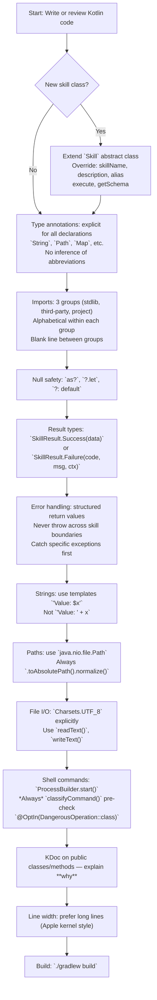

# Gradum Kotlin Coding Standards

This document defines the coding standards for the Gradum Kotlin implementation.
All Kotlin code must follow the conventions below.



---

## 1. Source File Header

Source files begin with the `package` declaration, followed by import groups.
**Do not** include copyright headers or boilerplate file-level comments.

```kotlin
package gradum.skill

// imports here
```

---

## 2. Naming Conventions

| Type                | Style         | Example                                            |
|---------------------|---------------|----------------------------------------------------|
| Functions / Methods | `camelCase`   | `getSchema()`, `executeTool()`                     |
| Classes             | `PascalCase`  | `RunCommandSkill`, `AgentConfiguration`            |
| Constants           | `UPPER_SNAKE` | `DEFAULT_MODEL`, `TOO_LARGE_THRESHOLD`             |
| Private members     | No prefix     | `skills`, `todoManager`, `logger`                  |
| Top-level private   | No prefix     | `blockedExecutables`, `jsonParser`                 |
| Enum members        | `PascalCase`  | `Mode.Sequential`, `Mode.Atomic`                   |
| Sealed subclasses   | `PascalCase`  | `CommandVerdict.Allowed`, `CommandVerdict.Blocked` |

### 2.1 No Abbreviations

**Correct:**

```
val message: String = "File not found"
val configuration: AgentConfiguration = buildConfiguration()
val command: String = "ls -la"
```

**Incorrect:**

```
val msg: String = "File not found"
val cfg: AgentConfiguration = buildConfiguration()
val cmd: String = "ls -la"
```

### 2.2 Self-Documenting Names

Variable names should describe *what* something is, not *what type* it is.

**Correct:**

```kotlin
val targetFile: File = Path.of(path).toFile()
val pendingChanges: List<String> = collectEdits()
val skillName: String = arguments["name"] as? String ?: ""
```

**Incorrect:**

```kotlin
val file: File = Path.of(path).toFile()
val list: List<String> = collectEdits()
val str: String = arguments["name"] as? String ?: ""
```

### 2.3 Two-Word Minimum for Variable Names

Every local variable, property, parameter, and function name must contain
**at least two English words** (camelCase). Single-word or single-letter
names are forbidden — they are not self-documenting and cost the next
reader a context switch.

**Correct:**

```kotlin
val retryCount: Int = 3
val messageId: String = "msg-42"
val filePath: String = "/tmp/output.log"
fun loadConfig(): AgentConfiguration = ...
catch (ioException: IOException) {
    logger.error("Failed to load file", ioException)
}
```

**Incorrect:**

```kotlin
val retry: Int = 3           // too short — "retry" of what?
val id: String = "msg-42"     // id of what?
val path: String = "..."      // path of what?
fun load(): AgentConfiguration = ...   // load what?
catch (e: IOException) { ... }         // 'e' / 'ex' are forbidden
```

**Allowed exceptions** (linted via `NamingRules.allowShortNames`):

- Loop indices in tight `for (i in 0..n)` numeric iteration: `i`, `j`, `k`
- Lambda receiver parameters in Jetpack Compose Modifier chains: `it`
- `it` in `?.let { ... }` / `.map { ... }` when the type is obvious from context

### 2.4 Boolean Variables Require a Predicate Prefix

Boolean properties, locals, parameters, and function names must begin
with a predicate: `is`, `has`, `can`, `should`, `will`, `must`, or `need`.
Bare adjectives or verbs (`enabled`, `valid`, `ok`, `active`) are
forbidden — they don't read as questions.

**Correct:**

```kotlin
var isLoading: Boolean = false
val hasError: Boolean = errorMessage.isNotBlank()
fun canRetry(): Boolean = retryCount < MAX_RETRY
val shouldAutoScroll: Boolean = isNearBottom
```

**Incorrect:**

```kotlin
var loading: Boolean = false
val error: Boolean = errorMessage.isNotBlank()
fun retry(): Boolean = retryCount < MAX_RETRY
val autoScroll: Boolean = isNearBottom
```

Linted by detekt's `BooleanPropertyNaming` /
`TopLevelPropertyNaming` rules (`allowedPattern = "^(is|has|can|should|will|must|need)"`).

---

## 3. Imports

Group imports in the following order, with one blank line between groups:

1. Kotlin standard library
2. Third-party libraries (ktor, kotlinx, org.slf4j, etc.)
3. Other modules within the same project

Within each group, sort alphabetically.

```kotlin
import kotlinx.coroutines.flow.Flow
import kotlinx.coroutines.flow.flow
import kotlinx.serialization.json.Json
import kotlinx.serialization.json.JsonObject

import io.ktor.client.HttpClient
import io.ktor.http.HttpStatusCode
import org.slf4j.LoggerFactory

import gradum.SkillResult
import gradum.skill.Skill
```

All imports must appear at the top of the file. Inline imports are not allowed.

---

## 4. Null Safety

Use `?.let` for null-safe chained calls:

```kotlin
resolvedModel?.let { model ->
    agentConfig = agentConfig.copy(model = model)
}
```

Use `?:` to provide default values:

```kotlin
val port: Int = args.port ?: 8765
val lineRange: String = arguments["lineRange"] as? String ?: ""
```

Use the safe cast `as?` when reading parameters from a Map:

```kotlin
val filePath: String = arguments["path"] as? String ?: ""
```

---

## 5. Error Handling

Use the sealed class `SkillResult` to represent operation results. **Never**
use exceptions for control flow.

```kotlin
sealed class SkillResult {
    data class Success(val data: Map<String, Any>) : SkillResult()
    data class Failure(
        val code: String,
        val message: String,
        val context: Map<String, Any> = emptyMap()
    ) : SkillResult()
}
```

Use factory functions to construct results:

```kotlin
return makeSuccess(mapOf("path" to resolvedPath.toString(), "size" to content.length))

return makeFailure("FILE_NOT_FOUND", "File not found: $filePath", mapOf("path" to resolvedPath.toString()))
```

Callers use exhaustive `when` matching:

```kotlin
when (val result: SkillResult = skill.execute(arguments)) {
    is SkillResult.Success -> handleSuccess(result.data)
    is SkillResult.Failure -> handleFailure(result.code, result.message, result.context)
}
```

**Rule:** Only `throw` on "programmer errors" (e.g. impossible states). Business
failures must return `SkillResult.Failure`.

### 5.1 LLM-Visible vs User-Visible Errors

Tool failure payloads are routed to **two distinct audiences**, and they
must be kept separate. Conflating them leaks stack traces into the chat
or strips the technical detail the LLM needs to self-correct.

- **LLM-visible (`errorMessage` / `errorDetail`)** — the technical cause
  the model reads to decide its next action. Includes exception class,
  the failing line / argument, the raw reason string. Goes into the
  tool result body the LLM will see on the next turn.
- **User-visible** — the *short* localized message shown in the IDE
  toast / popup / status bar. Always goes through `GradumBundle.message`
  (see `plugin/src/main/resources/messages/`). Never contains stack
  traces, raw class names, or file paths the user did not open.

```kotlin
// correct — split between the two audiences
val errorMessage: String = "ReadFile failed: ${ioException.message}"  // → LLM
val userMessage: String = message("gradum.error.read.failed")          // → user

// incorrect — user sees the stack trace
val userMessage: String = "ReadFile failed: ${ioException.message}"
```

The boundary layer (e.g. `AssistantChatBubble.ToolCallBlock`,
`formatToolDetails`) is the **only** place where these two are joined
into the rendered chat bubble. Domain code never composes a "user-facing
error string" — it always returns both halves, and the renderer picks.

---

## 6. Serialization

Use `kotlinx.serialization` for JSON parsing in the LLM client and for
request/response models in HTTP routes:

```
@Serializable
data class EventsRequest(
    val message: String,
    val model: String? = null,
    val config: Map<String, String>? = null
)

private val jsonParser: Json = Json { ignoreUnknownKeys = true }
```

For function schemas and tool call arguments passed to the LLM, use Kotlin
`Map<String, Any>` literals. **Do not** manually concatenate JSON strings.

---

## 7. Comments

- Multi-line documentation: KDoc (`/** ... */`) for public classes and methods.
- Single-line: `//` followed by one space. Explain *why*, not *what*.
- Avoid trailing inline comments.

```kotlin
/**
 * Skill for reading file content.
 *
 * Accepts an optional line range. Files exceeding the size threshold
 * return FILE_TOO_LARGE to prevent token bloat in the conversation.
 *
 * @param arguments map containing 'path' and optional 'lineRange'.
 */
override fun execute(arguments: Map<String, Any>): SkillResult {
    // Use project root as the reference point for relative paths
    val basePath: Path = getProjectRoot()
    //...
}
```

---

## 8. String Formatting

Use string templates. **Do not** use `+` concatenation:

```
val message: String = "Skill '${toolName}' not found"      // correct
val message: String = "Skill '" + toolName + "' not found"  // incorrect
```

Use multi-line strings for long text or SQL/JSON templates:

```kotlin
val systemPrompt: String = """
    You are an expert software engineer...
    ...multiple lines of instructions...
""".trimIndent()
```

---

## 9. Braces

For `if` / `for` statements, **do not** add braces when the body is a single statement:

```kotlin
// correct - single statement, no braces
if (command.isBlank()) return SkillResult.Success(emptyMap())
for (item in items) processItem(item)

// incorrect - unnecessary braces for single statement
if (command.isBlank()) {
    return SkillResult.Success(emptyMap())
}
```

For multi-line bodies, use braces:

```kotlin
// correct - multi-line body requires braces
if (blockedExecutables.contains(executable)) {
    return makeFailure("COMMAND_BLOCKED", "Blocked by safety filter")
}
```

`else` placement — both branches must use the same form:

```kotlin
// correct - both single-line
if (condition) doSomething() else doOtherwise()

// correct - both multi-line
if (condition) {
    doSomething()
} else {
    doOtherwise()
}

// incorrect - mixed (one branch single-line, the other multi-line)
if (condition) doSomething() else {
    doOtherwise()
}
```

`when` branches each on their own line when more than 2 cases; a 2-branch `when`
with very short bodies may be one-lined:

```
// correct - many cases, one per line
when (executable) {
    "ls" -> CommandVerdict.Allowed
    "rm" -> classifyRmCommand(tokens)
}

// correct - 2 short branches on one line
when (editMode) { "atomic" -> applyAtomic(...); else -> applySequential(...) }

// incorrect - many cases crammed onto one line
when (executable) { "ls" -> Allowed; "rm" -> classifyRm(tokens); "cp" -> ... }
```

---

## 10. Function Parameter Signatures

Four parameters or fewer on one line. Five or more parameters, one per line:

```kotlin
// 4 or fewer: one line
fun readLinesInRange(lines: List<String>, startLine: Int, endLine: Int): String
fun chat(
    messageHistory: List<Map<String, Any>>,
    toolDefinitions: List<Map<String, Any>>? = null
): Flow<LLMResponseChunk>

// 5+ parameters: one per line
fun execute(
    command: String,
    workingDirectory: String? = null,
    environmentVariables: Map<String, String>? = null,
    timeoutSeconds: Int? = null,
    runDetached: Boolean = false,
): CommandResult

// incorrect: 2 parameters but wrapped
fun chat(
    messageHistory: List<Map<String, Any>>,
    toolDefinitions: List<Map<String, Any>>? = null,
): Flow<LLMResponseChunk>
```

---

## 11. Path Handling

Use `java.nio.file.Path`. **Do not** build paths directly with
`java.io.File`:

```kotlin
val projectRoot: Path = Path.of("").toAbsolutePath().normalize()
val logDirectory: Path = Path.of("output", "run_cmd")
val outputFile: File = Path.of(fileName).toFile()  // convert to File only at the final I/O boundary
```

Always normalize paths:

```kotlin
val resolvedPath: Path = Path.of(filePath).toAbsolutePath().normalize()
```

---

## 12. File I/O

Always specify `Charsets.UTF_8`:

```kotlin
val content: String = targetFile.readText(Charsets.UTF_8)
targetFile.writeText(content, Charsets.UTF_8)
```

For large files or when more control is needed, use `bufferedReader` / `use`
blocks:

```kotlin
targetFile.bufferedReader(Charsets.UTF_8).use { reader ->
    val content: String = reader.readText()
}
```

---

## 13. Blank Lines

- Between top-level declarations (classes, functions): **2** blank lines.
- Between methods inside a class: **1** blank line.
- No blank line after KDoc; the code starts immediately.
- Between import groups: **1** blank line.
- Within a function body, add a blank line between distinct logical steps so
  the function does not read as a single dense block. Common split points:
    - After input parsing / parameter extraction
    - After the main computation, before building the return value
    - Before the final `return` statement

```kotlin
// correct - logical steps separated by blank lines
private fun runDiagnostics(conn: LspConnection, path: Path, languageId: String): SkillResult {
    val content: String = path.toFile().readText(Charsets.UTF_8)
    conn.didOpen(path, content, version = 1)

    val params: JsonObject =
        buildJsonObject { put("textDocument", buildJsonObject { put("uri", path.toUri().toString()) }) }
    val raw: JsonElement = conn.sendRequest("textDocument/diagnostic", params)
    val items: JsonArray = (raw as? JsonObject)?.get("items") as? JsonArray ?: JsonArray(emptyList())
    val parsed: List<Map<String, Any?>> = items.map { element: JsonElement -> parseDiagnostic(element) }

    val errors: Int = parsed.count { it["severity"] == "error" }
    val warnings: Int = parsed.count { it["severity"] == "warning" }
    val summary: Map<String, Int> = mapOf("total" to parsed.size, "errors" to errors, "warnings" to warnings)

    return makeSuccess(
        mapOf(
            "language" to languageId,
            "path" to path.toString(),
            "summary" to summary,
            "diagnostics" to parsed
        )
    )
}

// incorrect - everything packed into one block, hard to scan
private fun runDiagnostics(conn: LspConnection, path: Path, languageId: String): SkillResult {
    val content: String = path.toFile().readText(Charsets.UTF_8)
    conn.didOpen(path, content, version = 1)
    val params: JsonObject =
        buildJsonObject { put("textDocument", buildJsonObject { put("uri", path.toUri().toString()) }) }
    val raw: JsonElement = conn.sendRequest("textDocument/diagnostic", params)
    val items: JsonArray = (raw as? JsonObject)?.get("items") as? JsonArray ?: JsonArray(emptyList())
    val parsed: List<Map<String, Any?>> = items.map { element: JsonElement -> parseDiagnostic(element) }
    val errors: Int = parsed.count { it["severity"] == "error" }
    val warnings: Int = parsed.count { it["severity"] == "warning" }
    val summary: Map<String, Int> = mapOf("total" to parsed.size, "errors" to errors, "warnings" to warnings)
    return makeSuccess(
        mapOf(
            "language" to languageId,
            "path" to path.toString(),
            "summary" to summary,
            "diagnostics" to parsed
        )
    )
}
```

---

## 14. Line Width

Prefer long lines (Apple kernel style). Do not break chains or natural
sequences unnecessarily. Break only when one of the following applies:

- A function signature has more than 4 parameters (see section 10)
- The line exceeds ~200 characters
- Breaking improves readability, e.g. for deeply nested `mapOf` structures
  with 5+ keys

```kotlin
// correct - long line for a chain
val friendlyDiagnostics: List<Map<String, Any?>> = items.map { element: JsonElement -> parseDiagnostic(element) }

// correct - one-line retry branch
if (isTransientError(exception) && attemptIndex < 2) delay(retryDelay) else break

// correct - broken because of 5+ params
fun execute(
    command: String,
    workingDirectory: String? = null,
    environmentVariables: Map<String, String>? = null,
    timeoutSeconds: Int? = null,
    runDetached: Boolean = false,
): CommandResult

// incorrect - breaking a chain that fits comfortably on one line
val friendlyDiagnostics: List<Map<String, Any?>> = items
    .map { element: JsonElement ->
        parseDiagnostic(element)
    }
```

---

## 15. Explicit Type Annotations

All declarations require full type annotations. **Do not** rely on type
inference to save keystrokes.

```kotlin
// correct
private fun readLinesInRange(lines: List<String>, startLine: Int, endLine: Int): String
val tokens: List<String> = command.trim().split("\\s+".toRegex())
val filePath: Path = Path.of(path).toAbsolutePath().normalize()

// incorrect
private fun readLinesInRange(lines, startLine, endLine) // = 
val tokens = command.trim().split("\\s+".toRegex())
val filePath = Path.of(path).toAbsolutePath().normalize()
```

Properties in `@Serializable` data classes may rely on compile-time inference
(this is the only exception).

---

## 16. File Organization

Organize files from highest to lowest level of abstraction — the reader sees
the high-level flow first, then the details:

```kotlin
// 1. Main entry point (public API)
class ReadFileSkill : Skill() {
    override val skillName: String = "read_file"
    override fun execute(arguments: Map<String, Any>): SkillResult { /*...*/
    }
    override fun getSchema(): Map<String, Any> { /*...*/
    }
}

// 2. Private helpers called by the public API
private fun readLinesInRange(lines: List<String>, startLine: Int, endLine: Int): String {
    return lines.subList(startLine - 1, endLine).joinToString("\n")
}
```

Private helper functions used only within a single class belong at the
bottom of the same file, after all public class definitions.

---

## 17. Shell Command Execution

When `Runtime.getRuntime().exec()` or `ProcessBuilder` is involved:

1. **Must** perform a safety check via `classifyCommand()` first.
2. Return the `COMMAND_BLOCKED` error code when blocked.
3. Mark the call site with `@OptIn(DangerousOperation::class)`.

```kotlin
@OptIn(DangerousOperation::class)
override fun execute(arguments: Map<String, Any>): SkillResult {
    val commandText: String = arguments["command"] as? String ?: ""
    val classification: CommandVerdict = classifyCommand(commandText)

    if (classification is CommandVerdict.Blocked) {
        return makeFailure(
            "COMMAND_BLOCKED",
            "Blocked by safety filter: ${classification.description}",
            mapOf("command" to commandText)
        )
    }
    // ... execute
}
```

---

## 18. Adding New Skills

Skills are discovered at runtime via Java ServiceLoader. To add a new skill:

### 1. Create the Skill Class

```kotlin
package gradum.skill

import gradum.SkillResult
import gradum.makeSuccess
import gradum.makeFailure

/**
 * Skill for [brief description].
 *
 * [Explain what this skill does and when to use it]
 */
class MyNewSkill : Skill() {
    override val skillName: String = "my_new_skill"
    override val description: String = "Description for LLM"
    override val alias: String = "Created"

    override fun execute(arguments: Map<String, Any>): SkillResult {
        // Implementation
        return makeSuccess(mapOf("result" to "value"))
    }

    override fun getSchema(): Map<String, Any> {
        return mapOf(
            "type" to "function",
            "function" to mapOf(
                "name" to skillName,
                "description" to description,
                "parameters" to mapOf(
                    "type" to "object",
                    "properties" to mapOf(
                        // Define parameters here
                    ),
                    "required" to listOf("param1"),
                ),
            ),
        )
    }
}
```

### 2. Register in Service Descriptor

Add the fully qualified class name to `src/main/resources/META-INF/services/gradum.skill.Skill`:

```
gradum.skill.ReadFileSkill
gradum.skill.EditFileSkill
gradum.skill.SaveFileSkill
gradum.skill.RunCommandSkill
gradum.skill.TodoSkill
gradum.skill.CompletePlanSkill
gradum.skill.MyNewSkill          # <-- Add this line
```

### 3. Requirements

- Class must have a **no-argument constructor**
- Class must extend `Skill` abstract class
- `skillName` must be unique across all registered skills
- Follow all coding standards in this document

### 4. External Plugin JARs

For external plugins, create a JAR with:

- Your Skill implementation class
- `META-INF/services/gradum.skill.Skill` file listing your class

Place the JAR on the classpath and skills are discovered automatically.

---

## 19. Build and Compile

Use Gradle:

```bash
./gradlew build     # compile
./gradlew run       # start locally
./gradlew clean     # clean build artifacts
```

---

## 20. Try-Catch

In important error handling locations, **always** add logging in `catch` blocks.
The exception variable **must** be named after the exception type — never the
generic `e` / `ex` / `exception` / `throwable`. The name itself documents the
failure mode at the call site.

```kotlin
// correct — name derived from the exception type
try {
    val configBytes: ByteArray = configPath.readBytes()
} catch (ioException: IOException) {
    logger.error("Failed to read config from $configPath", ioException)
    return makeFailure("CONFIG_READ_FAILED", ioException.message ?: "Unknown I/O error")
}

try {
    val state: LoadState = parseState(rawText)
} catch (stateException: IllegalStateException) {
    logger.error("Invalid state in $statePath", stateException)
    return makeFailure("INVALID_STATE", stateException.message ?: "Invalid state")
}

try {
    val response: HttpResponse = client.get(url)
} catch (connectException: ConnectException) {
    logger.warn("Server unreachable at $url, retrying", connectException)
    return retryWithBackoff(url)
}

// incorrect — generic 'e' / 'ex' names tell the reader nothing
try {
    val result: String = riskyOperation()
} catch (e: Exception) {
    logger.error("Operation failed", e)
    return makeFailure("OPERATION_FAILED", e.message ?: "Unknown error")
}

// incorrect — missing logger in important catch block
try {
    val result: String = riskyOperation()
} catch (ioException: IOException) {
    return makeFailure("OPERATION_FAILED", ioException.message ?: "Unknown error")
}
```

**Rule:** Every `catch` block in domain code MUST log via `logger.warn` /
`logger.error` / `logger.info`. Bare `return makeFailure(...)` without
logging silently swallows the cause and is a lint violation.

---

## 21. Single-Line Function Bodies

When a function body consists of a single statement, place the body on the
same line as the function declaration:

```kotlin
// correct - single statement on same line
fun add(a: Int, b: Int): Int = a + b
fun getVersion(): String = Version.GRADUM_VERSION
fun isEmpty(text: String): Boolean = text.isBlank()

// incorrect - unnecessary multi-line for single statement
fun add(a: Int, b: Int): Int {
    return a + b
}
```

For functions with multiple statements, use the standard multi-line format:

```kotlin
// correct - multiple statements require multi-line format
fun processItem(item: Item): Result {
    val validated: Item = validate(item)
    val transformed: Item = transform(validated)
    return Result.Success(transformed)
}
```

---

## 22. Class Public-Method Count

A single class exposes **at most 20 public methods / properties** (detekt
`TooManyFunctions.thresholdInClasses = 20`, restrict to public visibility
via `@Suppress("MemberVisibilityCanBePrivate")` carve-outs only).

When a class grows beyond 20 public surface members, the cause is almost
always one of:

- **Mixed responsibilities** — extract a `FooFormatter` / `FooValidator`
  collaborator.
- **Wide parameter lists** — group related parameters into a
  `FooRequest` data class.
- **`object` used as a namespace** — promote to a top-level file with
  private internal helpers.

Lint-enforced by detekt `TooManyFunctions`. A class that legitimately
needs more (e.g. a sealed-class hierarchy of 30 narrow `when` cases)
should annotate the class with `@Suppress("TooManyFunctions")` and a
KDoc explaining why.

---

## 23. Lint Enforcement

The rules in this document are enforced automatically by **detekt**
(via the `detekt-formatting` plugin), running in `gradlew detekt` and
`gradlew check`. Configured by `config/detekt/detekt.yml`.

- **detekt (core)** — naming (`BooleanPropertyNaming` /
  `FunctionNaming` / `VariableMinLength` / `TopLevelPropertyNaming`),
  complexity (cyclomatic / nested depth / function count via
  `TooManyFunctions`), error-handling antipatterns
  (`SwallowedException` / `TooGenericExceptionCaught` /
  `PrintStackTrace`), style (`MagicNumber` / `WildcardImport` /
  `UnusedImports`), comments (`UndocumentedPublicClass` /
  `UndocumentedPublicFunction`).
- **detekt-formatting** — formatting subset equivalent to ktlint
  standard rules: indent, import order, line length, brace placement
  on single-line `if` / `for` / `while` (we disable the
  `BracesOnIfStatements` rule, see §9), trailing comma, etc.

**Why not ktlint as a separate tool?** ktlint's bundled parser does
not understand Kotlin 2.1+ syntax (guarded `when` patterns), so
running it produces hard parse errors against our existing code
(`utils/ContextManager.kt`). detekt-formatting covers the same
ground with a much wider rule set and our chosen detekt baseline
format, so the second tool is redundant.

CI must run `gradlew detekt`. New code must produce **zero** new
violations; legacy violations are recorded in
`config/detekt/baseline.xml` and tracked down by `// detekt:ignore` /
`@Suppress` only when there is a real reason.

Adding a new lint rule is a **two-step change**:

1. Add the rule + a recommended-fix section to this document.
2. Update `config/detekt/detekt.yml` with the rule, regenerate the
   baseline (`gradlew detektBaseline`) if the codebase has many
   pre-existing violations, and add a unit test under
   `src/test/kotlin/.../lint/` that exercises the new rule on a
   positive and negative example.
