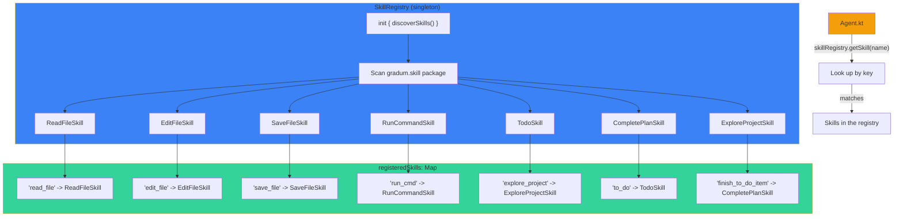
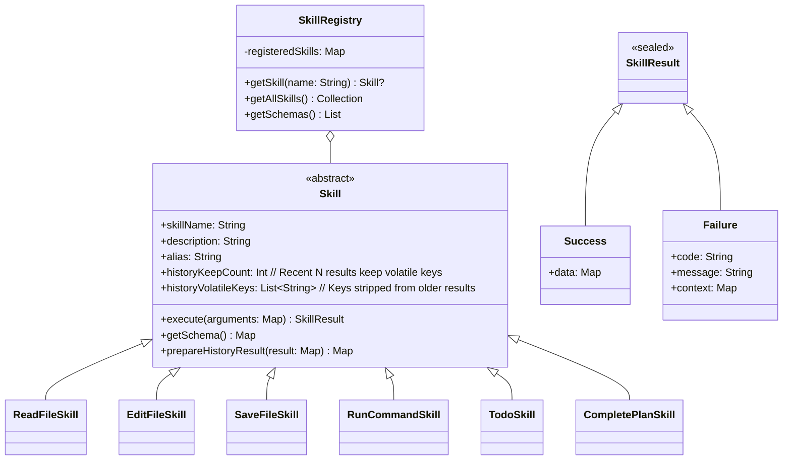
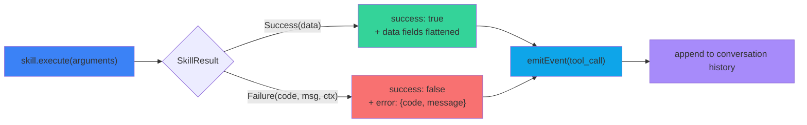
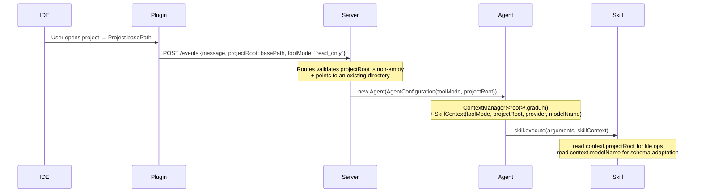

# Gradum Skill Development Guide

This document explains how to develop new skills (Skill) for Gradum.

---

## Table of Contents

1. [Architecture Overview](#1-architecture-overview)
2. [Skill Type System](#2-skill-type-system)
3. [Skill Abstract Base Class](#3-skill-abstract-base-class)
4. [SkillResult Output Format](#4-skillresult-output-format)
5. [getSchema() Format](#5-getschema-format)
6. [Developing a New Skill: Step-by-Step Guide](#6-developing-a-new-skill-step-by-step-guide)
7. [Complete Example: File Counter Skill](#7-complete-example-file-counter-skill)
8. [Best Practices](#8-best-practices)
9. [Existing Skills Reference](#9-existing-skills-reference)
10. [Declaring
    `allowedToolModes` — The Three-Tier Permission Model](#10-declaring-allowedtoolmodes--the-three-tier-permission-model)
11. [Using `SkillContext` for Project Root and Mode](#11-using-skillcontext-for-project-root-and-mode)
12. [Conversation History Management](#12-conversation-history-management)
13. [Troubleshooting](#13-troubleshooting)
14. [Coding Style](#14-coding-style)

## 1. Architecture Overview

Gradum uses **classpath scanning** for automatic skill discovery — skills are NOT hardcoded and require NO manual
registration. A skill is a Kotlin class that extends the `Skill` abstract base class and lives under
`src/main/kotlin/gradum/skill/`.

**Key characteristics:**

- Skills are fully decoupled from each other
- All skills share a unified `SkillResult` output shape
- Skills are discovered automatically by scanning the `gradum.skill` package
- Just create a class extending `Skill` — no configuration needed

**Registration flow (classpath scanning):**



### Adding a New Skill (Fully Automatic)

No code changes, no configuration files — just create the class:

1. Create your skill class extending `Skill` in `src/main/kotlin/gradum/skill/`
2. That's it! The skill is automatically discovered at startup

```kotlin
package gradum.skill

class YourCustomSkill : Skill() {
    override val skillName: String = "your_tool"
    override val alias: String = "Done"
    override val description: String = "What your skill does"

    override fun getSchema(): Map<String, Any> = /* ... */
        override
    fun execute(arguments: Map<String, Any>, context: SkillContext): SkillResult = /* ... */
}
```

## 2. Skill Type System



---

## 3. Skill Abstract Base Class

All skills extend `skill/Skill.kt`:

```kotlin
abstract class Skill {
    abstract val skillName: String
    abstract val description: String
    abstract val alias: String

    /**
     * The set of ToolMode tiers under which this skill is allowed to
     * execute. The agent enforces this both at schema-filter time
     * (hides the tool from the LLM in modes where it is not allowed)
     * and at runtime (rejects the call with TOOL_NOT_PERMITTED if the
     * model hallucinates a forbidden call). The default is "all three".
     */
    open val allowedToolModes: Set<ToolMode> = setOf(
        ToolMode.WRITE, ToolMode.SINGLE_STEP, ToolMode.READ_ONLY,
    )

    /**
     * Hint for documentation. Whether this skill mutates the project
     * (filesystem, git, process environment). The actual gate is
     * `allowedToolModes`; this is just a self-declared label.
     */
    open val mutatesProject: Boolean = false

    /**
     * Execute the skill with the LLM-supplied arguments and the
     * per-session SkillContext (tool mode + project root).
     *
     * @param arguments LLM-supplied tool-call arguments.
     * @param context per-session state owned by the agent — see §11.
     */
    abstract fun execute(arguments: Map<String, Any>, context: SkillContext): SkillResult

    /**
     * Returns the OpenAI-compatible function schema for this skill.
     *
     * @param context optional session context. When provided, skills
     *   that offer different parameter structures for local vs cloud
     *   models can check SchemaVariant.resolve(context.modelName)
     *   and return the appropriate schema. Skills that don't need
     *   provider-aware schemas may ignore this parameter.
     */
    abstract fun getSchema(context: SkillContext? = null): Map<String, Any>

    /**
     * How many recent results keep their [historyVolatileKeys] in conversation history.
     * Older results beyond this count will have those keys stripped to save context.
     * Default [Int.MAX_VALUE] keeps all results intact (no stripping).
     */
    open val historyKeepCount: Int = Int.MAX_VALUE

    /**
     * Keys to strip from history result when exceeding [historyKeepCount].
     * Only relevant when [historyKeepCount] is not [Int.MAX_VALUE].
     */
    open val historyVolatileKeys: List<String> = emptyList()

    private var prepareHistoryCallCount: Int = 0

    /**
     * Resets the internal history call counter.
     * Should be called at the start of each session to ensure
     * [historyKeepCount] behaves correctly across sessions.
     */
    fun resetHistoryCount() {
        prepareHistoryCallCount = 0
    }

    open fun prepareHistoryResult(result: Map<String, Any>): Map<String, Any> {
        prepareHistoryCallCount++
        if (historyKeepCount == Int.MAX_VALUE || historyVolatileKeys.isEmpty()) {
            return result
        }
        return if (prepareHistoryCallCount <= historyKeepCount) {
            result
        } else {
            result.filterKeys { it !in historyVolatileKeys }
        }
    }
}
```

> **Heads up — signature change.** `execute` now takes a second argument
> `context: SkillContext`. The previous single-argument signature
> `execute(arguments: Map<String, Any>)` is gone. See [§11](#11-using-skillcontext-for-project-root-and-mode).

### Required Class Properties

| Property      | Type     | Purpose                                 | Example                               |
|---------------|----------|-----------------------------------------|---------------------------------------|
| `skillName`   | `String` | Unique name used for LLM function calls | `"edit_file"`                         |
| `description` | `String` | Description shown to the LLM            | `"Atomic find-and-replace in a file"` |
| `alias`       | `String` | Verb (past-tense) used in NDJSON events | `"Ran"`, `"Planned"`                  |

### Required Methods

| Method                                                        | Return                                       | Purpose                                               |
|---------------------------------------------------------------|----------------------------------------------|-------------------------------------------------------|
| `execute(arguments: Map<String, Any>, context: SkillContext)` | Main entry point for skill logic             | Dispatched by the Agent when the LLM invokes the tool |
| `getSchema(context: SkillContext? = null): Map<String, Any>`  | Returns an OpenAI-compatible function schema | Determines what parameters the LLM sees               |

### Optional Properties

| Property              | Type            | Default                           | Purpose                                                                                                              |
|-----------------------|-----------------|-----------------------------------|----------------------------------------------------------------------------------------------------------------------|
| `allowedToolModes`    | `Set<ToolMode>` | `{WRITE, SINGLE_STEP, READ_ONLY}` | The tiers under which this skill is allowed to run. See [§10](#10-declaring-allowedtoolmodes--the-three-tier-model). |
| `mutatesProject`      | `Boolean`       | `false`                           | Self-declared "this skill writes to the project" hint. The actual gate is `allowedToolModes`.                        |
| `historyKeepCount`    | `Int`           | `Int.MAX_VALUE`                   | Keep this many recent results intact; strip volatile keys beyond                                                     |
| `historyVolatileKeys` | `List<String>`  | `emptyList()`                     | Keys to remove from history result when exceeding `historyKeepCount`                                                 |

### Optional Hooks

| Method                                                             | Return                                                     | Purpose                                                     |
|--------------------------------------------------------------------|------------------------------------------------------------|-------------------------------------------------------------|
| `prepareHistoryResult(result: Map<String, Any>): Map<String, Any>` | Post-process result before saving to `conversationHistory` | By default handles `historyKeepCount`/`historyVolatileKeys` |

---

## 4. SkillResult Output Format

The result of every skill is unified as the `SkillResult` sealed class, defined in `SkillResult.kt`:

```kotlin
sealed class SkillResult {
    data class Success(val data: Map<String, Any>) : SkillResult()
    data class Failure(
        val code: String,
        val message: String,
        val context: Map<String, Any> = emptyMap()
    ) : SkillResult()
}
```

The project ships two factory functions — always use them:

```kotlin
makeSuccess(mapOf("path" to resolvedPath.toString(), "bytesWritten" to bytesWritten))

makeFailure(
    "FILE_NOT_FOUND",
    "File not found: $path",
    mapOf("path" to resolvedPath.toString())
)
```

The Agent flattens `SkillResult` into the following shape before writing to the conversation history and NDJSON:



```
// Success ->
{"success": true, ...data fields flattened}

// Failure ->
{"success": false, "error": {"code": "FILE_NOT_FOUND", "message": "..."}}
```

### Standard Error Codes

| Error Code            | Applicable Scenario                                              |
|-----------------------|------------------------------------------------------------------|
| `INVALID_PARAMETER`   | Missing or malformed parameter                                   |
| `FILE_NOT_FOUND`      | Target file does not exist                                       |
| `FILE_TOO_LARGE`      | File size or line count exceeds limits                           |
| `IO_ERROR`            | Filesystem or process exception                                  |
| `CODE_NOT_FOUND`      | Edit search text does not appear in the file                     |
| `MULTIPLE_MATCHES`    | Edit search text appears multiple times in the file              |
| `EMPTY_RESULT`        | The file becomes empty after editing, prevents accidental wiping |
| `COMMAND_BLOCKED`     | Command rejected by the safety filter                            |
| `TIMEOUT`             | Operation timed out                                              |
| `ALREADY_INITIALIZED` | Duplicate initialization (e.g. to_do)                            |
| `NOT_INITIALIZED`     | Operation requires initialization that has not happened          |
| `ALL_COMPLETED`       | All tasks are already completed                                  |
| `CLIENT_ERROR`        | Plugin-side error (e.g. model validation failed)                 |

---

## 5. getSchema() Format

Return a Kotlin `Map<String, Any>` whose structure is fully compatible with the OpenAI function calling schema. Use
Kotlin Map literals — do not embed a JSON string:

```kotlin
override fun getSchema(): Map<String, Any> {
    return mapOf(
        "type" to "function",
        "function" to mapOf(
            "name" to skillName,
            "description" to "What the skill does. Include when to use and constraints.",
            "parameters" to mapOf(
                "type" to "object",
                "properties" to mapOf(
                    "path" to mapOf(
                        "type" to "string",
                        "description" to "File path to read. Use relative path."
                    ),
                    "lineRange" to mapOf(
                        "type" to "string",
                        "description" to "Optional. Line range to read. Format: '10-50'."
                    )
                ),
                "required" to listOf("path")
            )
        )
    )
}
```

The `description` field is the primary mechanism for guiding the LLM to use the tool correctly. It should include:

- When to use the skill
- Limitations and constraints
- Usage examples
- Hints about related skills

---

## 6. Developing a New Skill: Step-by-Step Guide

### 6.1 Create the File

Create `src/main/kotlin/gradum/skill/YourSkill.kt`:

```kotlin
package gradum.skill

import gradum.SkillResult
import gradum.makeFailure
import gradum.makeSuccess
import java.io.File
import java.nio.file.Path

/**
 * Brief description of what the skill does.
 *
 * What this skill does: when it is called, what it outputs.
 */
class YourSkill : Skill() {

    override val skillName: String = "your_skill"
    override val alias: String = "Done"
    override val description: String =
        "What this skill does. Include when to use it, constraints, and output format."

    override fun getSchema(): Map<String, Any> {
        return mapOf(
            "type" to "function",
            "function" to mapOf(
                "name" to skillName,
                "description" to description,
                "parameters" to mapOf(
                    "type" to "object",
                    "properties" to mapOf(
                        "input" to mapOf(
                            "type" to "string",
                            "description" to "What this parameter means."
                        )
                    ),
                    "required" to listOf("input")
                )
            )
        )
    }

    /**
     * @param arguments LLM-supplied tool-call arguments. The
     *   `projectRoot` is provided by the agent; do NOT read it from
     *   here — use [context].projectRoot instead.
     * @param context per-session state (tool mode + project root).
     */
    override fun execute(arguments: Map<String, Any>, context: SkillContext): SkillResult {
        val inputValue: String = arguments["input"] as? String ?: ""

        if (inputValue.isBlank()) {
            return makeFailure("INVALID_PARAMETER", "Missing 'input' parameter")
        }

        // Read the project root from the SkillContext, not from arguments
        // or from a process-global. See §11 for the full rationale.
        val projectRoot: String = context.projectRoot
        val resolvedPath: Path = Path.of(projectRoot, inputValue).toAbsolutePath().normalize()
        val targetFile: File = resolvedPath.toFile()

        return try {
            val fileContent: String = targetFile.readText(Charsets.UTF_8)
            // your logic here
            makeSuccess(
                mapOf(
                    "path" to resolvedPath.toString(),
                    "size" to fileContent.length
                )
            )
        } catch (exception: Exception) {
            makeFailure("IO_ERROR", exception.message ?: "Unknown error", mapOf("path" to resolvedPath.toString()))
        }
    }
}
```

### 6.2 Register the Skill

**No registration required!** The `SkillRegistry` automatically discovers all classes
in the `gradum.skill` package that extend `Skill`. Just place your class file in
`src/main/kotlin/gradum/skill/` and it will be found at startup.

### 6.3 Build and Test

```bash
./gradlew build          # compile, verify no compile errors
./gradlew run            # or launch the server to test

# after launch, call the skills endpoint to verify registration
curl http://localhost:8765/skills | jq
```

---

## 7. Complete Example: File Counter Skill

```kotlin
package gradum.skill

import gradum.SkillResult
import gradum.makeFailure
import gradum.makeSuccess
import java.io.File
import java.nio.file.Path

class FileCounterSkill : Skill() {

    override val skillName: String = "file_counter"
    override val alias: String = "Counted"
    override val description: String =
        "Count lines, words, and characters in a file. Use when you need to know file size or complexity."

    override fun getSchema(): Map<String, Any> {
        return mapOf(
            "type" to "function",
            "function" to mapOf(
                "name" to skillName,
                "description" to description,
                "parameters" to mapOf(
                    "type" to "object",
                    "properties" to mapOf(
                        "path" to mapOf(
                            "type" to "string",
                            "description" to "File path to analyze"
                        )
                    ),
                    "required" to listOf("path")
                )
            )
        )
    }

    override fun execute(arguments: Map<String, Any>, context: SkillContext): SkillResult {
        val filePath: String = arguments["path"] as? String ?: ""

        if (filePath.isBlank()) {
            return makeFailure("INVALID_PARAMETER", "Missing 'path' parameter")
        }

        // Resolve relative to the session's projectRoot (NOT the server CWD).
        val projectRoot: String = context.projectRoot
        val resolvedPath: Path = Path.of(projectRoot, filePath).toAbsolutePath().normalize()
        val targetFile: File = resolvedPath.toFile()

        val fileContent: String = try {
            targetFile.readText(Charsets.UTF_8)
        } catch (_: java.io.FileNotFoundException) {
            return makeFailure("FILE_NOT_FOUND", "File not found: $filePath", mapOf("path" to resolvedPath.toString()))
        } catch (exception: Exception) {
            return makeFailure(
                "IO_ERROR",
                exception.message ?: "Failed to read file",
                mapOf("path" to resolvedPath.toString())
            )
        }

        val lines: Int = fileContent.lines().size
        val words: Int = fileContent.split("\\s+".toRegex()).filter { it.isNotBlank() }.size
        val chars: Int = fileContent.length

        return makeSuccess(
            mapOf(
                "path" to resolvedPath.toString(),
                "lines" to lines,
                "words" to words,
                "characters" to chars
            )
        )
    }
}
```

---

### 6.4 Optimize Token Usage (Optional)

If your skill returns large data (like file content), use `historyKeepCount` and `historyVolatileKeys` to keep recent
results intact while stripping older ones from conversation history. The stripped data still appears in the NDJSON event
stream for the frontend, but the LLM won't re-read older large payloads every turn:

```kotlin
class YourSkill : Skill() {
    override val historyKeepCount: Int = 2          // Keep last 2 results with full data
    override val historyVolatileKeys: List<String> = listOf("largeField")  // Strip this key from older results
}
```

For more granular control, you can override `prepareHistoryResult` directly instead.

Refer to `ReadFileSkill` for a real-world example.

---

### 6.5 Real-World Skill Examples

#### ReadFileSkill (Read-only inspection)

| Property              | Value                              |
|-----------------------|------------------------------------|
| `skillName`           | `"read_file"`                      |
| `alias`               | `"Read"`                           |
| `allowedToolModes`    | Default (all three modes)          |
| `historyKeepCount`    | 5 (keeps content for last 5 calls) |
| `historyVolatileKeys` | `listOf("content")`                |

**Key behavior**: Resolves relative paths against `context.projectRoot`, computes MD5 hash of content, returns path +
lineRange + totalLines + contentHash + content. Max file size 1MB, max 10,000 lines.

#### EditFileSkill (Mutating, search-and-replace)

| Property              | Value                                                                        |
|-----------------------|------------------------------------------------------------------------------|
| `skillName`           | `"edit_file"`                                                                |
| `alias`               | `"Edited"`                                                                   |
| `allowedToolModes`    | `setOf(WRITE, SINGLE_STEP)` — **excludes READ_ONLY**                         |
| `historyKeepCount`    | 2                                                                            |
| `historyVolatileKeys` | `listOf("syntaxErrors", "linesAdded", "linesRemoved", "totalEdits", "path")` |

**Key behavior**: Two edit modes — **Sequential** (apply one-by-one, stop on failure) and **Atomic** (all-or-nothing
rollback). Custom `prepareHistoryResult` strips `originalContent` and `modifiedContent` from ALL history entries.

#### RunCommandSkill (Shell execution)

| Property              | Value                     |
|-----------------------|---------------------------|
| `skillName`           | `"run_cmd"`               |
| `alias`               | `"Ran"`                   |
| `allowedToolModes`    | Default (all three modes) |
| `historyKeepCount`    | 2                         |
| `historyVolatileKeys` | `listOf("output")`        |

**Key behavior**: Pre-classifies every command via `classifyCommand()`. 45-second hard timeout. Two execution modes: *
*Blocking** (waits for completion) and **Detached** (background, returns PID + log path).

#### ExploreProjectSkill (Directory tree scan)

| Property              | Value                                                           |
|-----------------------|-----------------------------------------------------------------|
| `skillName`           | `"explore_project"`                                             |
| `alias`               | `"Explored"`                                                    |
| `allowedToolModes`    | Default (all three modes)                                       |
| `historyKeepCount`    | 1 (only keeps full tree for first call)                         |
| `historyVolatileKeys` | Custom `prepareHistoryResult` collapses tree to top-level names |

**Key behavior**: Recognizes and truncates build/dependency dirs (`.git`, `build`, `node_modules`, `__pycache__`,
`.venv`, `target`, etc.). All dotfile dirs are truncated.

#### TodoSkill and CompletePlanSkill (Task planning)

| Property           | Value                                                   |
|--------------------|---------------------------------------------------------|
| `skillName`        | `"to_do"` / `"finish_to_do_item"`                       |
| `allowedToolModes` | `setOf(WRITE)` — **excludes READ_ONLY and SINGLE_STEP** |

**Key behavior**: Both share a singleton `TodoManager` that maintains the in-memory task list. Reminder text is injected
automatically after each tool call to keep the model on track.

---

## 8. Best Practices

### 8.1 Parameter Handling

- Always validate required parameters
- Read from `Map<String, Any>` with `as? String ?: ""`
- Trim string inputs consistently

```kotlin
val filePath: String = arguments["path"] as? String ?: ""
if (filePath.isBlank()) {
    return makeFailure("INVALID_PARAMETER", "Missing 'path' parameter")
}
```

### 8.2 Error Handling

- Catch specific exceptions first (FileNotFoundException before the generic Exception)
- Always return a structured `SkillResult.Failure`, **never** throw exceptions
- Provide diagnostic information inside `context`

```kotlin
return try {
    targetFile.readText(Charsets.UTF_8)
    makeSuccess(/*...*/)
} catch (exception: FileNotFoundException) {
    makeFailure("FILE_NOT_FOUND", "File not found: $filePath", mapOf("path" to resolvedPath.toString()))
} catch (exception: Exception) {
    makeFailure("IO_ERROR", exception.message ?: "Failed to read", mapOf("path" to resolvedPath.toString()))
}
```

### 8.3 File I/O

- Always use `Charsets.UTF_8`
- Resolve paths with `Path.toAbsolutePath().normalize()`
- `File.readText()` is the recommended way to read small files
- For large files, consider streaming or bounded reads (see the FILE_TOO_LARGE handling in ReadFileSkill)

### 8.4 LLM Guidance

The `description` field in `getSchema()` is the key mechanism for guiding the LLM to use the tool correctly. Include:

- When to use the skill
- Scenarios where it should not be used
- Example parameter formats
- Hints about related skills

### 8.5 Shell Command Safety

If your skill involves `ProcessBuilder` or `Runtime.exec()`:

- **Must** perform a pre-check via `classifyCommand(commandText: String): CommandVerdict`
- When blocked, return the `COMMAND_BLOCKED` error code
- Mark the call site with `@OptIn(DangerousOperation::class)`

```kotlin
@OptIn(DangerousOperation::class)
override fun execute(arguments: Map<String, Any>): SkillResult {
    val commandText: String = arguments["command"] as? String ?: ""
    val classification: CommandVerdict = classifyCommand(commandText)
    if (classification is CommandVerdict.Blocked) {
        return makeFailure(
            "COMMAND_BLOCKED",
            "Blocked by safety filter: ${classification.description}",
            mapOf("command" to commandText, "rule" to classification.ruleName)
        )
    }
    // ... execute the command
}
```

### 8.6 Path Handling

- Use `java.nio.file.Path` instead of `java.io.File` for path construction
- Always normalize: `Path.of(path).toAbsolutePath().normalize()`

### 8.7 State Management with TodoManager

Need to maintain state across multiple tool calls (e.g. the task list in TodoSkill)? Use a package-level private
singleton:

```
private val sharedTodoManager: TodoManager = TodoManager()

fun getTodoManagerInstance(): TodoManager = sharedTodoManager
```

- Do not use mutable state inside a `companion object` — the pattern above is clearer.

---

## 9. Existing Skills Reference

| Skill Class         | skillName           | Purpose                                          |
|---------------------|---------------------|--------------------------------------------------|
| `ReadFileSkill`     | `read_file`         | Read a file (full content or a line range)       |
| `EditFileSkill`     | `edit_file`         | Search-and-replace editing (sequential / atomic) |
| `SaveFileSkill`     | `save_file`         | Write to or create a file                        |
| `RunCommandSkill`   | `run_cmd`           | Execute a shell command (blocking / detached)    |
| `TodoSkill`         | `to_do`             | Initialize a task list                           |
| `CompletePlanSkill` | `finish_to_do_item` | Mark a task as completed                         |

---

## 10. Declaring `allowedToolModes` — The Three-Tier Permission Model

Gradum exposes **three permission tiers** through a single field on every
`Skill` — `allowedToolModes`. The agent enforces it twice (schema filter at
LLM time, runtime gate at execution time) so the two views can never drift.
The `SkillRegistrySchemaTest` pins this invariant.

### 10.1 The three tiers

| Tier          | Wire format     | UI Label   | When to use                                                                     |
|---------------|-----------------|------------|---------------------------------------------------------------------------------|
| `READ_ONLY`   | `"read_only"`   | Read-only  | Pure inspection (read file, scan tree, run `cat`/`ls`/`grep`)                   |
| `SINGLE_STEP` | `"single_step"` | Edit mode  | Single-shot edits (`edit_file`, `save_file`) — no multi-step planning           |
| `WRITE`       | `"write"`       | Agent mode | Full autonomy including multi-step task planning (`to_do`, `finish_to_do_item`) |

A skill should declare the **narrowest** set of tiers that covers what it does.
Anything else weakens the safety net for the user.

### 10.2 Decision table

| Does the skill ...                                                | Declare `allowedToolModes`                                  | Example skills                                                            |
|-------------------------------------------------------------------|-------------------------------------------------------------|---------------------------------------------------------------------------|
| Never writes the filesystem, never starts a mutating process      | `{READ_ONLY, SINGLE_STEP, WRITE}` (the default — all three) | `read_file`, `explore_project`, `run_cmd` (with `classifyCommand` filter) |
| Writes the filesystem but doesn't multi-step plan                 | `{SINGLE_STEP, WRITE}`                                      | `edit_file`, `save_file`                                                  |
| Drives the agent loop (initializes a task list, marks completion) | `{WRITE}`                                                   | `to_do`, `finish_to_do_item`                                              |

### 10.3 Worked example

```kotlin
class EditFileSkill : Skill() {
    override val skillName: String = "edit_file"
    override val alias: String = "Edited"
    override val description: String = "Atomic find-and-replace in a file."

    // EditFileSkill mutates the project. It is allowed in SINGLE_STEP
    // (single-shot edit) and WRITE (full agent loop), but NEVER in
    // READ_ONLY. A user in READ_ONLY mode physically cannot trigger it,
    // even if the LLM hallucinates a call.
    override val allowedToolModes: Set<ToolMode> = setOf(
        ToolMode.SINGLE_STEP,
        ToolMode.WRITE,
    )

    override val mutatesProject: Boolean = true

    override fun execute(arguments: Map<String, Any>, context: SkillContext): SkillResult {
        // ...
    }
}
```

### 10.4 How the gate is enforced

The agent runs the same `toolMode in skill.allowedToolModes` check at two
points, so the LLM cannot bypass it:

1. **Schema filter** (LLM side). `SkillRegistry.getSchemas(toolMode)` returns
   only the tools whose `allowedToolModes` includes the active tier. The LLM
   is never told the tool exists in modes where it is forbidden.
2. **Runtime gate** (Agent side). `Agent.executeSingleTool` does the same
   check before dispatch. If the LLM hallucinates an `edit_file` call in
   `READ_ONLY`, the agent returns `TOOL_NOT_PERMITTED` and the file on disk
   is byte-for-byte unchanged.

For a `READ_ONLY` `run_cmd`, the agent also runs `classifyCommand(...)`
with the active `ToolMode` so `touch`, `rm`, `git commit` etc. are blocked
with `COMMAND_BLOCKED` even when the schema filter let them through.

### 10.5 Testing your tier declaration

`SkillRegistrySchemaTest` (5 cases) and `ToolModeGateTest` (6 cases) pin
the contract. A new skill that declares a tier set must satisfy both:

```kotlin
// SkillRegistrySchemaTest style:
val allSkills = SkillRegistry.discoverSkills()
val writeTier = SkillRegistry.getSchemas(ToolMode.WRITE)
assert(writeTier.any { it.matches(yourSkill) })  // WRITE always sees everything

val readOnlyTier = SkillRegistry.getSchemas(ToolMode.READ_ONLY)
if (yourSkill.allowedToolModes == setOf(ToolMode.READ_ONLY, ToolMode.SINGLE_STEP, ToolMode.WRITE)) {
    assert(readOnlyTier.any { it.matches(yourSkill) })
} else {
    assert(readOnlyTier.none { it.matches(yourSkill) })
}
```

---

## 11. Using `SkillContext` for Project Root, Mode, and Model Info

`SkillContext` is a small data class the agent constructs **once per
session** and hands to every `Skill.execute` call:

```kotlin
data class SkillContext(
    val toolMode: ToolMode,
    val projectRoot: String,
    val provider: Provider = Provider.OLLAMA,
    val modelName: String = "",
)
```

It replaces the legacy process-global `ProjectPaths.setProjectRoot` (and
removes the previous blind spot: Skills had no way to read `toolMode` at
all). The four properties are immutable for the lifetime of the session, and
the agent guarantees every Skill in that session sees the same instance.

### 11.1 Why a parameter, not a global

Three reasons — the third one is the one that bit us before this refactor:

1. **Sessions can run concurrently.** Two `/events` requests in flight at
   once would have shared `ProjectPaths` and overwritten each other's
   project root. With `SkillContext` constructed per `Agent`, sessions are
   fully isolated.
2. **Auditability.** Reading `context.projectRoot` in a Skill makes the
   dependency visible in the function signature. There is no way to
   "forget" to pass it, and unit tests can construct a deterministic
   `SkillContext` without touching process-globals.
3. **The bug this fixes.** Before this refactor, `ContextManager` was
   constructed from `ProjectPaths.outputDirectory()` — which defaulted to
   the server's CWD, not the IDE's project. So if the developer started
   the server from a workspace different from the project they had open
   in IntelliJ, `context.json` would silently be written to the wrong
   project. With `SkillContext.projectRoot` flowing from `Project.basePath`
   all the way down, every file path in the agent loop resolves against
   the project the user is actually working on.

### 11.2 Where the values come from



The plugin is the **only** source of truth for `projectRoot`. The server
has no fallback — if the plugin forgets to send it, `Routes` returns
`400 INVALID_PARAMETER` instead of guessing from CWD.

### 11.3 How to use it in your Skill

```kotlin
override fun execute(arguments: Map<String, Any>, context: SkillContext): SkillResult {
    // Read these from context — never from arguments, never from a global.
    val projectRoot: String = context.projectRoot
    val toolMode: ToolMode = context.toolMode

    // Resolve a relative path the LLM gave you against the session's root.
    val inputPath: String = arguments["path"] as? String ?: ""
    val resolved: Path = Path.of(projectRoot, inputPath).toAbsolutePath().normalize()

    // For mode-aware behavior, branch on context.toolMode. The agent
    // owns the actual gate; this is informational.
    val logDirectory: Path = when (toolMode) {
        ToolMode.READ_ONLY -> Path.of(projectRoot, ".gradum", "logs", "readonly")
        else -> Path.of(projectRoot, ".gradum", "logs", "write")
    }

    // ...
}
```

### 11.4 What NOT to do

```kotlin
// WRONG — reads from arguments. The agent injects projectRoot for
// audit/NDJSON reasons, but Skills should treat the arguments as
// "what the LLM sent us" and read session state from context.
val projectRoot: String = arguments["projectRoot"] as? String ?: ""

// WRONG — process-global. Two concurrent sessions will overwrite
// each other.
val projectRoot: String = ProjectPaths.outputDirectory().toString()

// WRONG — derives from CWD. This is the bug SkillContext replaces.
val projectRoot: String = System.getProperty("user.dir")

// RIGHT — single source of truth, per-session, immutable.
val projectRoot: String = context.projectRoot
```

### 11.5 Using `provider` and `modelName` for Schema Adaptation

The `provider` and `modelName` fields allow Skills to adapt their behavior
based on the model's capabilities:

```kotlin
override fun getSchema(context: SkillContext?): Map<String, Any> {
    val isSmallModel = context != null &&
            SchemaVariant.resolve(context.modelName) == SchemaVariant.SIMPLE

    return if (isSmallModel) {
        // Simplified schema: fewer parameters, simpler output
        mapOf(
            "type" to "function",
            "function" to mapOf(
                "name" to skillName,
                "description" to description,
                "parameters" to mapOf(
                    "type" to "object",
                    "properties" to mapOf(
                        "path" to mapOf("type" to "string"),
                        "content" to mapOf("type" to "string")
                    ),
                    "required" to listOf("path", "content")
                )
            )
        )
    } else {
        // Full schema: all parameters, advanced features
        mapOf(
            "type" to "function",
            "function" to mapOf(
                "name" to skillName,
                "description" to description,
                "parameters" to mapOf(
                    "type" to "object",
                    "properties" to mapOf(
                        "path" to mapOf("type" to "string"),
                        "content" to mapOf("type" to "string"),
                        "mode" to mapOf(
                            "type" to "string",
                            "enum" to listOf("overwrite", "append")
                        ),
                        "encoding" to mapOf("type" to "string")
                    ),
                    "required" to listOf("path", "content")
                )
            )
        )
    }
}
```

You can also branch on `modelName` in `execute()`:

```kotlin
override fun execute(arguments: Map<String, Any>, context: SkillContext): SkillResult {
    val useSimpleOutput = SchemaVariant.resolve(context.modelName) == SchemaVariant.SIMPLE

    val result = if (useSimpleOutput) {
        // Simplified output: counts + flat list
        mapOf("totalLines" to lines, "files" to flatList)
    } else {
        // Full output: nested tree structure
        mapOf("totalLines" to lines, "entries" to nestedTree)
    }

    return makeSuccess(result)
}
```

---

## 12. Conversation History Management

### 12.1 Retention Policy

History is retained **indefinitely** — there is no time-based expiry. The only constraint is message count:

| Layer                            | Constant               | Limit | File & Line            |
|----------------------------------|------------------------|-------|------------------------|
| **Persistence** (ContextManager) | `MAX_CONTEXT_MESSAGES` | 30    | `ContextManager.kt:19` |
| **Runtime** (Agent)              | `maxHistoryMessages`   | 20    | `Agent.kt:113`         |

### 12.2 How History is Cleaned

Before saving, `ContextManager.cleanMessageHistory()` removes:

- System messages
- Tool call results
- Empty assistant messages
- Messages matching "fully read" file content

The remaining messages are capped at 30 via `takeLast(30)`.

### 12.3 Encryption

History is encrypted using custom **HMAC-CTR + HMAC-SHA256**:

- Key source: `GRADUM_CONTEXT_KEY` env var, or hardcoded fallback
- Only `user` and `assistant` messages with content are encrypted
- Storage: `<projectRoot>/.gradum/context.json`
- Write strategy: full overwrite (not append)

### 12.4 Agent-Side Truncation

Before each LLM turn, `Agent.truncateHistory()` trims to 20 messages + system prompt, preserving the most recent
messages. This prevents local LLMs from being overwhelmed.

---

## 13. Troubleshooting

### The skill is never called by the LLM

- Verify the `description` in `getSchema()` clearly explains the purpose and when to use the tool
- Confirm the skill is registered in `SkillRegistry.discoverSkills()`
- Check that parameter names are clear and reasonable
- Inspect server logs (INFO level should show `Registered skill: ...`)

### Skill execution fails

- Check parameter conversion: could `arguments["foo"] as? String` produce null?
- Verify no uncaught exceptions escape (there should always be a `catch (exception: Exception)` fallback)
- Verify file paths resolve correctly to absolute paths (use `context.projectRoot` as the base, not CWD)

### "Tool not permitted" / "Command blocked" in read-only mode

- The skill's `allowedToolModes` excludes `READ_ONLY`, or `classifyCommand`
  rejected the command. Either switch the IDE to `SINGLE_STEP`/`WRITE` mode
  (user action) or declare a broader `allowedToolModes` (skill author action).
  The agent's gate is the same on both sides — the LLM is told the tool
  doesn't exist AND the runtime rejects the call if it tries anyway.

### Context file is written to the wrong project

- Check that the plugin sends `projectRoot` in the `/events` body — without
  it, `Routes` returns 400 and the agent is never constructed. If it does
  send it, but the file still lands in the wrong directory, the Skill is
  reading from `arguments["projectRoot"]` (deprecated) or from a process
  global — both are the legacy paths this refactor replaces. Update the
  Skill to read `context.projectRoot`.

### NDJSON event fields are wrong

- Confirm the `makeSuccess()` / `makeFailure()` factory functions are used
- The Agent is responsible for converting `SkillResult` into tool messages and events — manual handling is not required

---

## 14. Coding Style

Follow `docs/CODING_STANDARDS_KOTLIN.md`:

- All public methods require full type annotations, explicit type declarations required
- Use `Map<String, Any>` rather than a bare `map`; be explicit about generic parameters
- Prefer string templates over `+` concatenation
- Use `sealed class` for result types (SkillResult)
- Use `@OptIn` for dangerous operations and experimental APIs
- KDoc on public classes and methods should explain **why**, not **what**
- 100-character line width
- Error codes: uppercase underscore format (`SCREAMING_SNAKE_CASE`)

---

## 15. SchemaVariant API Reference

Gradum adapts tool schemas and prompt content based on model capability. This
section documents the API for plugin developers.

### 15.1 `SchemaVariant` Enum

```kotlin
enum class SchemaVariant {
    FULL,   // Complete parameter set, batch operations, advanced features
    SIMPLE; // Minimal parameter set, one action per call, simplified output

    companion object {
        fun resolve(modelName: String): SchemaVariant
    }
}
```

**Usage:**

```kotlin
val variant = SchemaVariant.resolve("qwen2.5:14b") // SIMPLE
val variant = SchemaVariant.resolve("gpt-4o")        // FULL
val variant = SchemaVariant.resolve("")               // FULL (default)
```

### 15.2 `ModelCapability` Object

```kotlin
object ModelCapability {
    fun isSmall(modelName: String): Boolean
}
```

**Detection rules:**

1. Cloud/API indicators (cloud, gpt, claude, gemini, sonnet, haiku, opus, pro, flash, turbo, mini, large, xxl) → large
2. Parameter size tag (7b, 14b, 70b, etc.) → compare against 32B threshold
3. Unknown/unrecognized → default to large (assume capable)

**Examples:**

| Model Name          | isSmall | Reason                          |
|---------------------|---------|---------------------------------|
| `"qwen2.5:7b"`      | true    | 7B ≤ 32B threshold              |
| `"qwen2.5:14b"`     | true    | 14B ≤ 32B threshold             |
| `"qwen2.5:72b"`     | false   | 72B > 32B threshold             |
| `"gpt-4o"`          | false   | Contains "gpt" cloud keyword    |
| `"claude-3-sonnet"` | false   | Contains "claude" cloud keyword |
| `"local-model"`     | false   | No size tag, default to large   |
| `""`                | false   | Blank, default to large         |

### 15.3 Conditional Prompt Sections

Prompt XML files support conditional sections based on `SchemaVariant`:

```xml
<!-- if FULL -->
<Example>read_file(path="src/main.py", line_range="200-230")</Example>
        <!-- endif -->
        <!-- if SIMPLE -->
        Returns: {path, totalLines, contentHash, content (map: {lineNumber: lineContent})}
        <!-- endif -->
```

The agent filters these sections at prompt load time using
`filterConditionalSections()`. Sections wrapped in `<!-- if SIMPLE -->` are
kept only when `SchemaVariant` is `SIMPLE`. Sections wrapped in `<!-- if FULL -->`
are kept only when `SchemaVariant` is `FULL`.

### 15.4 Per-Skill Behavior

| Skill                 | FULL mode                                          | SIMPLE mode                                          |
|-----------------------|----------------------------------------------------|------------------------------------------------------|
| `ReadFileSkill`       | Returns `content` as joined string                 | Returns `content` as `{lineNumber: lineContent}` map |
| `SaveFileSkill`       | Full params: `path`, `content`, `mode`, `encoding` | Minimal params: `path`, `content` only               |
| `RunCommandSkill`     | Supports `detached` param, full output             | No `detached`, output truncated to 2000 chars        |
| `ExploreProjectSkill` | Returns nested `entries` tree                      | Returns counts + flat `["path:lines", ...]` list     |
| `EditFileSkill`       | Unified search/replace for all models              | Same as FULL (no SIMPLE variant)                     |

### 15.5 Complete Plugin Example

```kotlin
package gradum.skill

import gradum.SchemaVariant
import gradum.SkillResult
import gradum.makeFailure
import gradum.makeSuccess
import java.nio.file.Path

class AdaptiveFileWriterSkill : Skill() {

    override val skillName: String = "adaptive_file_writer"
    override val alias: String = "Wrote"
    override val description: String =
        "Write content to a file. Adapts schema for small/large models."

    override fun getSchema(context: SkillContext?): Map<String, Any> {
        val isSmallModel = context != null &&
                SchemaVariant.resolve(context.modelName) == SchemaVariant.SIMPLE

        return if (isSmallModel) {
            // SIMPLE: minimal parameters
            mapOf(
                "type" to "function",
                "function" to mapOf(
                    "name" to skillName,
                    "description" to description,
                    "parameters" to mapOf(
                        "type" to "object",
                        "properties" to mapOf(
                            "path" to mapOf("type" to "string"),
                            "content" to mapOf("type" to "string")
                        ),
                        "required" to listOf("path", "content")
                    )
                )
            )
        } else {
            // FULL: all parameters
            mapOf(
                "type" to "function",
                "function" to mapOf(
                    "name" to skillName,
                    "description" to description,
                    "parameters" to mapOf(
                        "type" to "object",
                        "properties" to mapOf(
                            "path" to mapOf("type" to "string"),
                            "content" to mapOf("type" to "string"),
                            "mode" to mapOf(
                                "type" to "string",
                                "enum" to listOf("overwrite", "append")
                            ),
                            "encoding" to mapOf("type" to "string")
                        ),
                        "required" to listOf("path", "content")
                    )
                )
            )
        }
    }

    override fun execute(arguments: Map<String, Any>, context: SkillContext): SkillResult {
        val path = arguments["path"] as? String ?: ""
        val content = arguments["content"] as? String ?: ""
        val mode = arguments["mode"] as? String ?: "overwrite"

        if (path.isBlank() || content.isBlank()) {
            return makeFailure("INVALID_PARAMETER", "Missing 'path' or 'content'")
        }

        val resolved = Path.of(context.projectRoot, path).toAbsolutePath().normalize()

        return try {
            val file = resolved.toFile()
            if (mode == "append") {
                file.appendText(content, Charsets.UTF_8)
            } else {
                file.writeText(content, Charsets.UTF_8)
            }

            // Adapt output based on model capability
            val useSimpleOutput = SchemaVariant.resolve(context.modelName) == SchemaVariant.SIMPLE
            val result = if (useSimpleOutput) {
                mapOf("path" to resolved.toString(), "bytesWritten" to content.toByteArray().size)
            } else {
                mapOf(
                    "path" to resolved.toString(),
                    "bytesWritten" to content.toByteArray().size,
                    "created" to !file.exists(),
                    "mode" to mode
                )
            }

            makeSuccess(result)
        } catch (e: Exception) {
            makeFailure("IO_ERROR", e.message ?: "Unknown error", mapOf("path" to resolved.toString()))
        }
    }
}
```

---

## 16. Extending the plugin's tool call UI

> **Audience:** anyone who wants to add a new tool call row type to
> the Gradum chat panel — both Gradum contributors and third-party
> IDE-plugin authors.

The Gradum IntelliJ plugin exposes one interface for the chat UI:
[`ToolCallRenderer`](../../plugin/src/main/kotlin/gradum/idea/chat/ui/chat/skill/spi/ToolCallRenderer.kt).
A renderer is responsible for turning a server-side `tool_call` event
into the row the user sees in the chat timeline — its icon, its
localised label, its body, and the action buttons (`Open in editor`,
`View diff`, `Copy`, etc.) it offers.

This is the same mechanism the built-in `RanRenderer`, `EditedRenderer`,
`ReadRenderer`, `SavedRenderer`, `ExploredRenderer`, `PlannedRenderer`,
`CompletedRenderer`, and the wildcard `DefaultRenderer` use. Each
renderer lives in its own folder under
`chat/ui/chat/skill/<alias>/` and is registered in
[`ToolCallRendererRegistry`](../../plugin/src/main/kotlin/gradum/idea/chat/ui/chat/skill/spi/ToolCallRendererRegistry.kt)
by appending one line to the `RENDERERS` list.

### 16.1 Why a plain Kotlin list, not an IntelliJ `ExtensionPoint`?

Earlier revisions of the chat panel used an IntelliJ Platform
`ExtensionPoint` (`<extensionPoint name="toolCallRenderer" …/>` in
`META-INF/plugin.xml`) to register renderers. We migrated away from
that approach because the Platform's `ExtensionPointName` lookup
path has several practical drawbacks:

- **Strict placement.** The `<extensionPoint>` element must be a
  direct child of `<idea-plugin>` — putting it inside an
  `<extensions>` block (or a comment that wraps one) triggers a
  Platform parse error. The dependency-resolution error
  "Unable to resolve extension point … in plugin dependencies"
  is the most common form of this and is hard to debug.
- **Hard runtime crash on misconfiguration.** EP resolution goes
  through the IDE's `Extensions` area, which throws
  `IllegalArgumentException: Missing extension point` at the first
  chat render if anything is misconfigured. The exception is
  caught by the IDE's `CoroutineExceptionHandler` and surfaced
  as an `UnhandledException` dialog — the chat panel is dead
  until the user restarts the IDE.
- **Classloader isolation between Gradum and third-party plugins.**
  A third-party plugin that depends on `com.gradum.idea` cannot
  reliably resolve an EP declared in Gradum's `plugin.xml` because
  Platform EP lookups go through a classloader-aware `Extensions`
  area that may not see both ends of the dependency at runtime.
- **Discoverability.** A developer has to read the EP interface
  and the Gradum source to learn the convention. There is no
  "render this alias" stub to find.

A plain `val RENDERERS: List<ToolCallRenderer>` solves all four
problems at the cost of one line of code per new alias:

```kotlin
// ToolCallRendererRegistry.kt
private val RENDERERS: List<ToolCallRenderer> = listOf(
    RanRenderer(),
    EditedRenderer(),
    // ... your renderer goes here ...
    MyNewRenderer(),

    // Catch-all. Must remain last.
    DefaultRenderer(),
)
```

There is no `plugin.xml` change. There is no Platform EP. There
is no IDE-side parse-time validation. The list is read on the
first chat render and cached in-memory.

### 16.2 The `ToolCallRenderer` interface

```kotlin
package gradum.idea.chat.ui.chat.skill.spi

import androidx.compose.runtime.Composable
import org.jetbrains.jewel.ui.icon.IconKey

interface ToolCallRenderer {
    fun alias(): String
    fun iconKey(): IconKey? = null
    fun labelKey(): String? = null
    fun parseContent(
        arguments: Map<String, Any?>,
        result: Map<String, Any?>,
    ): ToolCallContent

    @Composable
    fun render(content: ToolCallContent, ctx: ToolCallRenderContext)
}
```

| Method         | Required | Returns                                                                                          |
|----------------|----------|--------------------------------------------------------------------------------------------------|
| `alias()`      | yes      | The server-side `Skill.alias` this renderer handles (e.g. `"Ran"`). First-listed wins.            |
| `iconKey()`    | no       | The row's status icon. Defaults to `null`, in which case the chat panel uses a generic icon.     |
| `labelKey()`   | no       | A `GradumBundle` resource-bundle key (e.g. `"gradum.tool.ran"`) for the localised label.        |
| `parseContent` | yes      | Converts the server's `arguments: Map<String, Any?>` + `result: Map<String, Any?>` JSON into a `ToolCallContent` view-model. |
| `render`       | yes      | The actual `@Composable` row. Receives the parsed `content` and a `ctx` with access to the project and the chat-level "open in editor" / "view diff" / "copy" callbacks. |

### 16.3 The `ToolCallContent` view-model

```kotlin
data class ToolCallContent(
    val alias: String,
    val fields: Map<String, Any?> = emptyMap(),
    val actions: List<ToolCallAction> = emptyList(),
)
```

`fields` is an arbitrary `Map<String, Any?>` you read from inside
`render`. The convention is to put the same string keys here that
the server-side skill puts in its `SkillResult` payload — e.g.
`"command"`, `"path"`, `"linesAdded"`, `"reason"`.

`actions` is a list of `ToolCallAction`s the row exposes:

```kotlin
sealed class ToolCallAction {
    data class OpenInEditor(
        val path: String,
        val startLine: Int = 0,
        val endLine: Int = 0,
        val displayLabel: String? = null,
    ) : ToolCallAction()

    data class ViewDiff(
        val path: String,
        val diffType: String = "default",
    ) : ToolCallAction()

    data class CopyToClipboard(
        val payload: String,
        val displayLabel: String? = null,
    ) : ToolCallAction()

    data class Custom(
        val id: String,
        val displayLabel: String,
        val data: Map<String, Any?> = emptyMap(),
    ) : ToolCallAction()
}
```

`Custom` is reserved for renderers that want to surface a
renderer-specific button (e.g. "Run test in current file"). The
chat panel does not auto-dispatch `Custom` actions for you — your
renderer's `render` composable is responsible for matching the
`id` and dispatching the click (typically by reading the active
`Project` from `ctx.project` or by registering a callback during
plugin initialisation).

### 16.4 The render context

```kotlin
data class ToolCallRenderContext(
    val project: Project?,
    val isError: Boolean,
    val errorDetail: String?,
    val onOpenInEditor: ((path: String, startLine: Int, endLine: Int) -> Unit)?,
    val onViewDiff: ((path: String, originalContent: String?, modifiedContent: String?) -> Unit)?,
    val onCopy: ((payload: String) -> Unit)?,
)
```

`onOpenInEditor` and `onViewDiff` are the chat-level handlers —
invoke them with the right `path` / line range and the chat panel
will pop an editor tab (or diff viewer) at the right place.
`onCopy` is wired to the chat-level "copied" snackbar (no-op in
the current build, but stable).

`project` is the active IntelliJ `Project`, or `null` if the chat
panel is detached (e.g. rendering in a preview); renderers that
need an IDE service should null-check it. `isError` /
`errorDetail` mirror the `success: false` and `errorDetail`
fields of the wire `tool_call` event — pass them to
`ToolCallCapsule` (or your custom row) so the row renders in its
error state.

### 16.5 Worked example: a "tests passed" renderer

Imagine a server-side `run_tests` skill that emits alias
`"TestsPassed"` and a `SkillResult` of
`{"passed": 12, "failed": 0, "durationMs": 4321}`.

**Step 1 — add a resource-bundle key.** In your plugin's
`messages/MyPluginBundle.properties`:

```properties
myplugin.tool.testsPassed=Tests Passed
```

**Step 2 — implement the renderer.** One folder per alias:

```
my-plugin/src/main/kotlin/com/example/myplugin/tests/TestsPassedRenderer.kt
my-plugin/src/main/resources/messages/MyPluginBundle.properties
```

```kotlin
// TestsPassedRenderer.kt
package com.example.myplugin.tests

import androidx.compose.runtime.Composable
import gradum.idea.chat.ui.chat.skill.internal.ToolCallCapsule
import gradum.idea.chat.ui.chat.skill.spi.ToolCallContent
import gradum.idea.chat.ui.chat.skill.spi.ToolCallRenderContext
import gradum.idea.chat.ui.chat.skill.spi.ToolCallRenderer
import com.example.myplugin.icons.MyPluginIcons

class TestsPassedRenderer : ToolCallRenderer {
    override fun alias(): String = ALIAS

    override fun iconKey() = MyPluginIcons.TestsPassed

    override fun labelKey(): String = LABEL_KEY

    override fun parseContent(
        arguments: Map<String, Any?>,
        result: Map<String, Any?>,
    ): ToolCallContent = ToolCallContent(
        alias = ALIAS,
        fields = mapOf(
            "passed" to (result["passed"] as? Number)?.toInt(),
            "failed" to (result["failed"] as? Number)?.toInt(),
            "durationMs" to (result["durationMs"] as? Number)?.toLong(),
        ),
    )

    @Composable
    override fun render(content: ToolCallContent, ctx: ToolCallRenderContext) {
        val passed = content.fields["passed"] as? Int ?: 0
        val failed = content.fields["failed"] as? Int ?: 0
        val durationMs = content.fields["durationMs"] as? Long ?: 0L
        ToolCallCapsule(
            success = !ctx.isError,
            errorDetail = ctx.errorDetail.orEmpty(),
            errorMessage = ctx.errorDetail.orEmpty(),
            iconKey = MyPluginIcons.TestsPassed,
            label = message(LABEL_KEY),
            trailingText = "$passed passed / $failed failed in ${durationMs}ms",
        )
    }

    companion object {
        const val ALIAS: String = "TestsPassed"
        const val LABEL_KEY: String = "myplugin.tool.testsPassed"
    }
}
```

`ToolCallCapsule` is the shared composable in
`gradum.idea.chat.ui.chat.skill.internal.ToolCallCapsule` that all
built-in renderers use. It handles the row layout (icon + label +
body + error state + trailing text) for you. Import it directly
— it is `internal` to the Gradum plugin module, but a plugin that
depends on `com.gradum.idea` (via `<depends>com.gradum.idea</depends>`
in its `plugin.xml`) can still call it.

**Step 3 — register it in the Gradum source.** Open
`ToolCallRendererRegistry.kt` and append one line to the
`RENDERERS` list, **above** the wildcard `DefaultRenderer()`:

```kotlin
// ToolCallRendererRegistry.kt
private val RENDERERS: List<ToolCallRenderer> = listOf(
    RanRenderer(),
    EditedRenderer(),
    // ... existing renderers ...
    TestsPassedRenderer(),  // <- new

    // Catch-all. Must remain last.
    DefaultRenderer(),
)
```

That is the entire registration surface. There is no `plugin.xml`
edit, no Platform EP, no classloader dance.

> **Third-party plugins:** because the registry is a plain Kotlin
> list inside the Gradum plugin module, a third-party plugin
> cannot append to it directly from its own module. The supported
> way to add a new alias from outside the Gradum source is to
> upstream the change to `ToolCallRendererRegistry.RENDERERS` (one
> line). The Gradum maintainers are happy to accept such PRs as
> long as the renderer follows the conventions in section 16.6.


### 16.6 Conventions

- **One folder per alias** — `chat/ui/chat/skill/ran/`,
  `chat/ui/chat/skill/edited/`, etc. The folder contains the
  renderer class (`RanRenderer.kt`).
- **Aliases are first-listed-wins.** The first renderer in
  `RENDERERS` whose `alias()` matches is used; the rest are
  ignored for that alias. Put more specific entries above
  more general ones. The wildcard catch-all (`*`) must be the
  last entry.
- **Don't swallow exceptions in `parseContent`.** If a field is
  missing or has the wrong type, surface it via `errorDetail` on
  the context so the model can react. The same rule applies to
  the server-side `SkillResult` payloads — see
  `RunCommandSkill.readStreamOutput` for the canonical example.
- **Reuse `ToolCallCapsule` and the action button helpers in
  `chat/ui/chat/skill/internal/`.** They are `internal` to the
  plugin module, so a third-party plugin depending on
  `com.gradum.idea` can still call them. Re-implementing the row
  layout from scratch will drift from the rest of the chat
  panel.
- **Localisation goes through the `labelKey()` resource bundle.**
  A renderer that hard-codes an English string will not
  localise. Use a Gradum bundle key (or your own plugin's
  bundle) and look it up via `message("myplugin.tool.testsPassed")`
  inside `render`.
