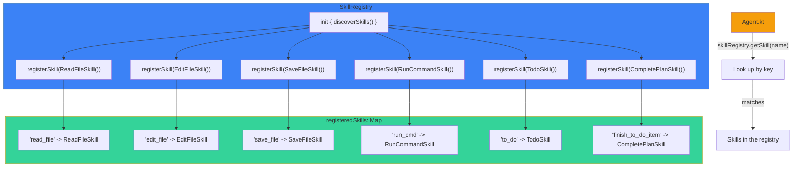
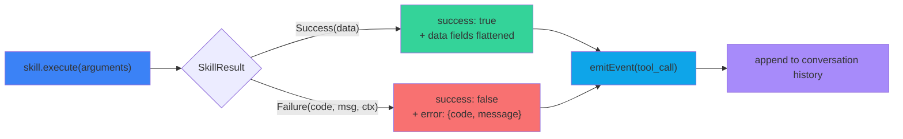

# Gradum Skill Development Guide

This document explains how to develop new skills (Skill) for Gradum.

---

## 1. Architecture Overview

Gradum uses a hard-coded skill registration system. A skill is a Kotlin class that extends the `Skill` abstract base
class and lives under `src/main/kotlin/gradum/skill/`.

**Key characteristics:**

- Skills are fully decoupled from each other
- All skills share a unified `SkillResult` output shape
- Adding a skill = one new `.kt` file + one registration line in `SkillRegistry.discoverSkills()`
- Removing a skill = delete the file + delete the registration line

**Registration flow:**



## 2. Skill Type System


---

## 3. Skill Abstract Base Class

All skills extend `skill/Skill.kt`:

```kotlin
abstract class Skill {
    abstract val skillName: String
    abstract val description: String
    abstract val alias: String

    abstract fun execute(arguments: Map<String, Any>): SkillResult
    abstract fun getSchema(): Map<String, Any>

    /**
     * How many recent results keep their [historyVolatileKeys] in conversation history.
     * Older results beyond this count will have those keys stripped to save context.
     * Default [Int.MAX_VALUE] keeps all results intact (no stripping).
     */
    open val historyKeepCount: Int = Int.MAX_VALUE

    /**
     * Keys to strip from history result when exceeding [historyKeepCount].
     * Only relevant when [historyKeepCount] is not [Int.MAX_VALUE].
     */
    open val historyVolatileKeys: List<String> = emptyList()

    private var prepareHistoryCallCount: Int = 0

    open fun prepareHistoryResult(result: Map<String, Any>): Map<String, Any> {
        prepareHistoryCallCount++
        if (historyKeepCount == Int.MAX_VALUE || historyVolatileKeys.isEmpty()) return result
        return if (prepareHistoryCallCount <= historyKeepCount) result
        else result.filterKeys { it !in historyVolatileKeys }
    }
}
```

### Required Class Properties

| Property      | Type     | Purpose                                 | Example                                            |
|---------------|----------|-----------------------------------------|----------------------------------------------------|
| `skillName`   | `String` | Unique name used for LLM function calls | `"edit_file"`                                       |
| `description` | `String` | Description shown to the LLM            | `"Atomic find-and-replace in a file"`              |
| `alias`       | `String` | Verb (past-tense) used in NDJSON events | `"Ran"`, `"Planned"`                                  |

### Required Methods

| Method                                              | Return                                       | Purpose                                               |
|-----------------------------------------------------|----------------------------------------------|-------------------------------------------------------|
| `execute(arguments: Map<String, Any>): SkillResult` | Main entry point for skill logic             | Dispatched by the Agent when the LLM invokes the tool |
| `getSchema(): Map<String, Any>`                     | Returns an OpenAI-compatible function schema | Determines what parameters the LLM sees               |

### Optional Properties

| Property              | Type           | Default         | Purpose                                                              |
|-----------------------|----------------|-----------------|----------------------------------------------------------------------|
| `historyKeepCount`    | `Int`          | `Int.MAX_VALUE` | Keep this many recent results intact; strip volatile keys beyond     |
| `historyVolatileKeys` | `List<String>` | `emptyList()`   | Keys to remove from history result when exceeding `historyKeepCount` |

### Optional Hooks

| Method                                                             | Return                                                     | Purpose                                                     |
|--------------------------------------------------------------------|------------------------------------------------------------|-------------------------------------------------------------|
| `prepareHistoryResult(result: Map<String, Any>): Map<String, Any>` | Post-process result before saving to `conversationHistory` | By default handles `historyKeepCount`/`historyVolatileKeys` |

---

## 4. SkillResult Output Format

The result of every skill is unified as the `SkillResult` sealed class, defined in `SkillResult.kt`:

```kotlin
sealed class SkillResult {
    data class Success(val data: Map<String, Any>) : SkillResult()
    data class Failure(
        val code: String,
        val message: String,
        val context: Map<String, Any> = emptyMap()
    ) : SkillResult()
}
```

The project ships two factory functions — always use them:

```kotlin
makeSuccess(mapOf("path" to resolvedPath.toString(), "bytesWritten" to bytesWritten))

makeFailure(
    "FILE_NOT_FOUND",
    "File not found: $path",
    mapOf("path" to resolvedPath.toString())
)
```

The Agent flattens `SkillResult` into the following shape before writing to the conversation history and NDJSON:



```
// Success ->
{"success": true, ...data fields flattened}

// Failure ->
{"success": false, "error": {"code": "FILE_NOT_FOUND", "message": "..."}}
```

### Standard Error Codes

| Error Code            | Applicable Scenario                                              |
|-----------------------|------------------------------------------------------------------|
| `INVALID_PARAMETER`   | Missing or malformed parameter                                   |
| `FILE_NOT_FOUND`      | Target file does not exist                                       |
| `FILE_TOO_LARGE`      | File size or line count exceeds limits                           |
| `IO_ERROR`            | Filesystem or process exception                                  |
| `CODE_NOT_FOUND`      | Edit search text does not appear in the file                     |
| `MULTIPLE_MATCHES`    | Edit search text appears multiple times in the file              |
| `EMPTY_RESULT`        | The file becomes empty after editing, prevents accidental wiping |
| `COMMAND_BLOCKED`     | Command rejected by the safety filter                            |
| `TIMEOUT`             | Operation timed out                                              |
| `ALREADY_INITIALIZED` | Duplicate initialization (e.g. to_do)                            |
| `NOT_INITIALIZED`     | Operation requires initialization that has not happened          |
| `ALL_COMPLETED`       | All tasks are already completed                                  |
| `CLIENT_ERROR`        | Plugin-side error (e.g. model validation failed)                 |

---

## 5. getSchema() Format

Return a Kotlin `Map<String, Any>` whose structure is fully compatible with the OpenAI function calling schema. Use
Kotlin Map literals — do not embed a JSON string:

```kotlin
override fun getSchema(): Map<String, Any> {
    return mapOf(
        "type" to "function",
        "function" to mapOf(
            "name" to skillName,
            "description" to "What the skill does. Include when to use and constraints.",
            "parameters" to mapOf(
                "type" to "object",
                "properties" to mapOf(
                    "path" to mapOf(
                        "type" to "string",
                        "description" to "File path to read. Use relative path."
                    ),
                    "lineRange" to mapOf(
                        "type" to "string",
                        "description" to "Optional. Line range to read. Format: '10-50'."
                    )
                ),
                "required" to listOf("path")
            )
        )
    )
}
```

The `description` field is the primary mechanism for guiding the LLM to use the tool correctly. It should include:

- When to use the skill
- Limitations and constraints
- Usage examples
- Hints about related skills

---

## 6. Developing a New Skill: Step-by-Step Guide

### 6.1 Create the File

Create `src/main/kotlin/gradum/skill/YourSkill.kt`:

```kotlin
package gradum.skill

import gradum.SkillResult
import gradum.makeFailure
import gradum.makeSuccess
import java.io.File
import java.nio.file.Path

/**
 * Brief description of what the skill does.
 *
 * What this skill does: when it is called, what it outputs.
 */
class YourSkill : Skill() {

    override val skillName: String = "your_skill"
    override val alias: String = "Done"
    override val description: String =
        "What this skill does. Include when to use it, constraints, and output format."

    override fun getSchema(): Map<String, Any> {
        return mapOf(
            "type" to "function",
            "function" to mapOf(
                "name" to skillName,
                "description" to description,
                "parameters" to mapOf(
                    "type" to "object",
                    "properties" to mapOf(
                        "input" to mapOf(
                            "type" to "string",
                            "description" to "What this parameter means."
                        )
                    ),
                    "required" to listOf("input")
                )
            )
        )
    }

    override fun execute(arguments: Map<String, Any>): SkillResult {
        val inputValue: String = arguments["input"] as? String ?: ""

        if (inputValue.isBlank()) {
            return makeFailure("INVALID_PARAMETER", "Missing 'input' parameter")
        }

        val resolvedPath: Path = Path.of(inputValue).toAbsolutePath().normalize()
        val targetFile: File = resolvedPath.toFile()

        return try {
            val fileContent: String = targetFile.readText(Charsets.UTF_8)
            // your logic here
            makeSuccess(
                mapOf(
                    "path" to resolvedPath.toString(),
                    "size" to fileContent.length
                )
            )
        } catch (exception: Exception) {
            makeFailure("IO_ERROR", exception.message ?: "Unknown error", mapOf("path" to resolvedPath.toString()))
        }
    }
}
```

### 6.2 Register the Skill

Add a single line inside `discoverSkills()` in `SkillRegistry.kt`:

```kotlin
private fun discoverSkills() {
    // ... existing registrations
    registerSkill(YourSkill())  // <-- add this line
}
```

### 6.3 Build and Test

```bash
./gradlew build          # compile, verify no compile errors
./gradlew run            # or launch the server to test

# after launch, call the skills endpoint to verify registration
curl http://localhost:8765/skills | jq
```

---

## 7. Complete Example: File Counter Skill

```kotlin
package gradum.skill

import gradum.SkillResult
import gradum.makeFailure
import gradum.makeSuccess
import java.io.File
import java.nio.file.Path

class FileCounterSkill : Skill() {

    override val skillName: String = "file_counter"
    override val alias: String = "Counted"
    override val description: String =
        "Count lines, words, and characters in a file. Use when you need to know file size or complexity."

    override fun getSchema(): Map<String, Any> {
        return mapOf(
            "type" to "function",
            "function" to mapOf(
                "name" to skillName,
                "description" to description,
                "parameters" to mapOf(
                    "type" to "object",
                    "properties" to mapOf(
                        "path" to mapOf(
                            "type" to "string",
                            "description" to "File path to analyze"
                        )
                    ),
                    "required" to listOf("path")
                )
            )
        )
    }

    override fun execute(arguments: Map<String, Any>): SkillResult {
        val filePath: String = arguments["path"] as? String ?: ""

        if (filePath.isBlank()) {
            return makeFailure("INVALID_PARAMETER", "Missing 'path' parameter")
        }

        val resolvedPath: Path = Path.of(filePath).toAbsolutePath().normalize()
        val targetFile: File = resolvedPath.toFile()

        val fileContent: String = try {
            targetFile.readText(Charsets.UTF_8)
        } catch (exception: java.io.FileNotFoundException) {
            return makeFailure("FILE_NOT_FOUND", "File not found: $filePath", mapOf("path" to resolvedPath.toString()))
        } catch (exception: Exception) {
            return makeFailure("IO_ERROR", exception.message ?: "Failed to read file", mapOf("path" to resolvedPath.toString()))
        }

        val lines: Int = fileContent.lines().size
        val words: Int = fileContent.split("\\s+".toRegex()).filter { it.isNotBlank() }.size
        val chars: Int = fileContent.length

        return makeSuccess(
            mapOf(
                "path" to resolvedPath.toString(),
                "lines" to lines,
                "words" to words,
                "characters" to chars
            )
        )
    }
}
```

---

### 6.4 Optimize Token Usage (Optional)

If your skill returns large data (like file content), use `historyKeepCount` and `historyVolatileKeys` to keep recent
results intact while stripping older ones from conversation history. The stripped data still appears in the NDJSON event
stream for the frontend, but the LLM won't re-read older large payloads every turn:

```kotlin
class YourSkill : Skill() {
    override val historyKeepCount: Int = 2          // Keep last 2 results with full data
    override val historyVolatileKeys: List<String> = listOf("largeField")  // Strip this key from older results
}
```

For more granular control, you can override `prepareHistoryResult` directly instead.

Refer to `ReadFileSkill` for a real-world example.

---

## 8. Best Practices

### 8.1 Parameter Handling

- Always validate required parameters
- Read from `Map<String, Any>` with `as? String ?: ""`
- Trim string inputs consistently

```kotlin
val filePath: String = arguments["path"] as? String ?: ""
if (filePath.isBlank()) {
    return makeFailure("INVALID_PARAMETER", "Missing 'path' parameter")
}
```

### 8.2 Error Handling

- Catch specific exceptions first (FileNotFoundException before the generic Exception)
- Always return a structured `SkillResult.Failure`, **never** throw exceptions
- Provide diagnostic information inside `context`

```kotlin
return try {
    targetFile.readText(Charsets.UTF_8)
    makeSuccess(/*...*/)
} catch (exception: FileNotFoundException) {
    makeFailure("FILE_NOT_FOUND", "File not found: $filePath", mapOf("path" to resolvedPath.toString()))
} catch (exception: Exception) {
    makeFailure("IO_ERROR", exception.message ?: "Failed to read", mapOf("path" to resolvedPath.toString()))
}
```

### 8.3 File I/O

- Always use `Charsets.UTF_8`
- Resolve paths with `Path.toAbsolutePath().normalize()`
- `File.readText()` is the recommended way to read small files
- For large files, consider streaming or bounded reads (see the FILE_TOO_LARGE handling in ReadFileSkill)

### 8.4 LLM Guidance

The `description` field in `getSchema()` is the key mechanism for guiding the LLM to use the tool correctly. Include:

- When to use the skill
- Scenarios where it should not be used
- Example parameter formats
- Hints about related skills

### 8.5 Shell Command Safety

If your skill involves `ProcessBuilder` or `Runtime.exec()`:

- **Must** perform a pre-check via `classifyCommand(commandText: String): CommandVerdict`
- When blocked, return the `COMMAND_BLOCKED` error code
- Mark the call site with `@OptIn(DangerousOperation::class)`

```kotlin
@OptIn(DangerousOperation::class)
override fun execute(arguments: Map<String, Any>): SkillResult {
    val commandText: String = arguments["command"] as? String ?: ""
    val classification: CommandVerdict = classifyCommand(commandText)
    if (classification is CommandVerdict.Blocked) {
        return makeFailure(
            "COMMAND_BLOCKED",
            "Blocked by safety filter: ${classification.description}",
            mapOf("command" to commandText, "rule" to classification.ruleName)
        )
    }
    // ... execute the command
}
```

### 8.6 Path Handling

- Use `java.nio.file.Path` instead of `java.io.File` for path construction
- Always normalize: `Path.of(path).toAbsolutePath().normalize()`

### 8.7 State Management with TodoManager

Need to maintain state across multiple tool calls (e.g. the task list in TodoSkill)? Use a package-level private
singleton:

```
private val sharedTodoManager: TodoManager = TodoManager()

fun getTodoManagerInstance(): TodoManager = sharedTodoManager
```

- Do not use mutable state inside a `companion object` — the pattern above is clearer.

---

## 9. Existing Skills Reference

| Skill Class         | skillName           | Purpose                                          |
|---------------------|---------------------|--------------------------------------------------|
| `ReadFileSkill`     | `read_file`         | Read a file (full content or a line range)       |
| `EditFileSkill`     | `edit_file`         | Search-and-replace editing (sequential / atomic) |
| `SaveFileSkill`     | `save_file`         | Write to or create a file                        |
| `RunCommandSkill`   | `run_cmd`           | Execute a shell command (blocking / detached)    |
| `TodoSkill`         | `to_do`             | Initialize a task list                           |
| `CompletePlanSkill` | `finish_to_do_item` | Mark a task as completed                         |

---

## 10. Troubleshooting

### The skill is never called by the LLM

- Verify the `description` in `getSchema()` clearly explains the purpose and when to use the tool
- Confirm the skill is registered in `SkillRegistry.discoverSkills()`
- Check that parameter names are clear and reasonable
- Inspect server logs (INFO level should show `Registered skill: ...`)

### Skill execution fails

- Check parameter conversion: could `arguments["foo"] as? String` produce null?
- Verify no uncaught exceptions escape (there should always be a `catch (exception: Exception)` fallback)
- Verify file paths resolve correctly to absolute paths

### NDJSON event fields are wrong

- Confirm the `makeSuccess()` / `makeFailure()` factory functions are used
- The Agent is responsible for converting `SkillResult` into tool messages and events — manual handling is not required

---

## 11. Coding Style

Follow `docs/CODING_STANDARDS_KOTLIN.md`:

- All public methods require full type annotations, explicit type declarations required
- Use `Map<String, Any>` rather than a bare `map`; be explicit about generic parameters
- Prefer string templates over `+` concatenation
- Use `sealed class` for result types (SkillResult)
- Use `@OptIn` for dangerous operations and experimental APIs
- KDoc on public classes and methods should explain **why**, not **what**
- 100-character line width
- Error codes: uppercase underscore format (`SCREAMING_SNAKE_CASE`)
